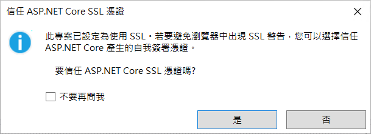

# 安裝與設定 .NET 6 Blazor 開發環境教學 (2022年5月)

對於尚未接觸過 Blazor 這個超級火紅與強大的 Web UI 開發工具，請按照這篇教學文章，進行安裝 Blazor 的開發環境。

這篇文章將會在 Windows 11 作業系統底下來進行操作，當然，也可以將 Visual Studio 2022 到 Windows 10 作業系統下。

## 下載 Visual Studio 2022

為了要能夠開發 Blazor 的Web應用程式，可以有多種方式來選擇，而在這裏將會使用比較簡單的做法，那就是安裝與使用 Visual Studio 2022 IDE 開發工具，做到可以開發出 Blazor 的 Web 應用程式專案。

更多關於 Visual Studio 2022 的資訊，可以參考 [https://docs.microsoft.com/zh-tw/visualstudio/productinfo/vs-roadmap](https://docs.microsoft.com/zh-tw/visualstudio/productinfo/vs-roadmap?WT.mc_id=DT-MVP-5002220) 這個連結內容。

首先，請使用瀏覽器打開這個網址 [認識 Visual Studio 系列](https://visualstudio.microsoft.com/zh-hant/) ，找到如下圖的 [認識 Visual Studio 系列] 文字，在其文字下方的最左方將會看到 [Visual Studio] 工具圖示，請點選 [下載 Visual Studio] 這個按鈕，將會看到有三個選項，分別為 [Community 2022]、[Professional 2022]、[Enterprise 2022] 這三個選項。

對於這三種 Visual Studio 2022 開發工具，[Community 2022] 版本是免費使用的，而對於 [Professional 2022]、[Enterprise 2022] 這兩個版本，則是需要付費購買，才能夠使用的。對於要開發 Blazor 專案，這三個類型的 Visual Studio 2022 都可以做到，因此，在這篇文章中，將會使用 Visual Studio 2022 Community 這個版本來做說明。

在點選 [下載 Visual Studio] 按鈕後所彈出的子視窗內，點選 [Community 2022] 這個選項。

稍待一段時間，當檔案 [VisualStudioSetup.exe] 下載完成之後，可以從瀏覽器上直接點選並且開啟這個檔案，底下螢幕截圖將會使用 Microsoft Edge 瀏覽器所出現的畫面內容。

## 開始進行安裝 Visual Studio 2022

首先，將會看到 [使用者帳戶控制] 對話窗出現在螢幕上，這裡需要授權且允許這個 Visual Studio Installer 程式可以執行，因此，請點選 [是] 按鈕。

接著，將會看到如下面螢幕截圖的畫面，請在此對話窗內點選 [繼續] 按鈕，以便同意繼續進行安裝 Visual Studio 2022

在此之前，將會從網路取得要安裝 Visual Studio 2022 的最新資訊，一旦 [Visual Studio Installer] 安裝程式準備就緒，就會出現 [正在安裝 Visual Studio Community 2022 - 17.2.0] 對話窗。 

請勾選 [工作負載] > [Web 與雲端] > [ASP.NET 與網頁程式開發] 這個工作負載選項

請點選 [個別元件] 標籤頁次，請勾選 [程式碼工具] > [Git for Windows] 這個選項

想要知道這次安裝過程會安裝那些工具到電腦上，可以查看該對話窗最右邊的 [安裝詳細資料] 區域，就會看到相關詳細資料。

最後，點選右下方 [安裝] 按鈕，開始進行 Visual Studio 2022 應用程式

接下來會看到下面截圖畫面，將會一邊下載安裝程式，一邊進行安裝

## 啟動 Visual Studio 2022

一旦安裝完成之後，將會看到如下圖的 [登入 Visual Studio] 視窗出現，在這裡建議使用任何 Microsoft 帳號來登入 Visual Studio，以便可以享受到更多好處。

不過，在這裡，將會先不使用 微軟 帳號登入到 Visual Studio 內，因此，點選最下方的 [不是現在，以後再說] 這個文字連結。

接下來要來設定 Visual Studio 的作業環境操作模式與主題布景

作者個人對於開發設定比較喜歡使用 [Visual C#] 操作模式，因此，請在 [開始設定] 這個文字右方的下拉選單，選擇 [Visual C#] 這個選項

另外對於主題布景部分，作者個人比較偏好 [淺色]，因此，在 [選擇您的色彩佈景主題] 下方，選擇了 [淺色] 這個主題佈景，當然，可以依照個人喜好，選擇自己喜歡的主題佈景，而且日後也可以在 Visual Studio 開發工具內進行切換變更。

現在，可以點選 [啟動 Visual Stuio] 按鈕，進行啟動作業

## 建立一個 Blazor Server 專案

當 Visual Studio 2022 啟動之後，便會看到下面的對話窗畫面。

現在要來確認安裝好的 Visual Studio 2022 開發工具，是否可以順利開發 Blazor 專案

點選右下方的 [建立新的專案] 按鈕

現在將會看到 [建立新專案] 對話窗出現在螢幕上

從中間的清單中，將會看到 [Blazor Server 應用程式] 項目，請點選這個項目

接著，點選右下方的 [下一步] 按鈕

此時會看到 [設定新的專案] 對話窗出現在螢幕上

在這裡僅是要做測試之用，因此，點選右下方的 [下一步] 按鈕

在這個 [其他資訊] 對話窗內，直接點選右下方的 [建立] 按鈕

## 執行與測試 Blazor Server 專案

一旦 Visual Studio 成功建立 Blazor 專案，並且打開該專案，將會出現如下圖畫面

現在要來啟動這個 Blazor 專案，請在 Visual Studio 2022 最上方找到深綠色三角形，在該三角形右方有顯示 BlazorApp 文字，也就是上面螢幕截圖的紅色圓圈數字1所標示的地方。

點選這個按鈕，以便啟動這個 Blazor 專案，並且進入除錯模式

若這台電腦第一次安裝與使用 Visual Studio 來執行 Blazor 專案，或者SSL開發者使用憑證已經失效，將會看到底下畫面，請點選右下方的 [是] 按鈕，將這個 ASP.NET Core 需要用到的 SSL 自我簽署憑證安裝到這台電腦上。

對於現在出現的 [安全性警告] 對話窗，請點選右下方的 [是] 按鈕，以便可以安裝此憑證。

若沒有發生意外，將會看到瀏覽器自動開啟，顯示出如下圖畫面，這個瀏覽器顯示的內容將會是 Blazor 專案所設計的網頁內容

