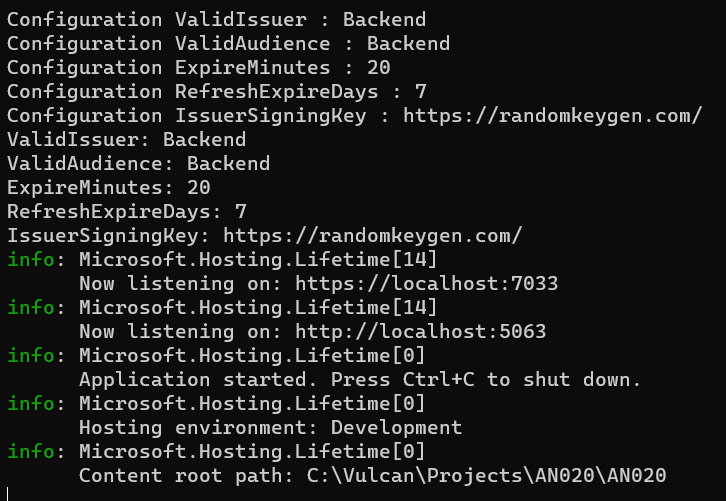

# 動手練習 ASP.NET Core7 用強行別來讀取設定練習


最近在進行 ASP.NET Core 7 專案開發的時候，突然遇到一個需要，那就是在 [Program.cs] 這個檔案內，進行使用 [build.Services] 這個屬性要進行 DI / IoC 容器注入的時候，卻想要讀取 [ASP.NET Core 的設定 Configuration](https://learn.microsoft.com/zh-tw/aspnet/core/fundamentals/configuration?WT.mc_id=DT-MVP-5002220) 內提供的相關設定值的時候，卻又想要使用強型別的方式，將一個區段內的設定值，直接全部讀取出來，並且儲存到一個物件內，這樣就會免除了需要逐一透過 [Configuration] 物件來取得這些物件值的麻煩程式碼，也會造成神奇字串輸入錯誤所造成的額外副作用影響問題。

會有這樣的需求，是因為要進行 JWT 的需求設計，而在 [Program.cs] 內，需要使用 [builder.Services.AddAuthentication().AddJwtBearer] 來進行 JWT 服務的宣告，然而，在這個 [AddJwtBearer] 方法內，將會需要建立一個 [TokenValidationParameters] 物件，宣告這個 JWT 要進行那些驗證行為與這個 JWT 的設定值。

由於在進行設計使用者登入身分驗證的時候，若通過身分驗證後，需要產生一個適合的 JWT 物件出來，此時，也需要用剛剛提到的 JWT 相關設定值。因此，就會想要把這些設定值設定到 [appsettings.json] 檔案內，方便可以集中管理與變更，也不用把這些設定值使用 Hard Code 的方式，寫死在程式碼內，造成使用 Ctrl + C / Ctrl + V 操作模式下所造成的副作用影想。

在這裡將會要使用 [ASP.NET Core 中的選項模式](https://learn.microsoft.com/zh-tw/aspnet/core/fundamentals/configuration/options?WT.mc_id=DT-MVP-5002220) 所提供的能力來做到可以使用強型別的方式，來讀取 Configuration 設定的內容值，另外，在這裡也會使用較不方便的 Configuration 物件，說明如何使用弱型別的方式來讀取設定值的做法。

## 建立 ASP.NET Core 7 專案

首先先來建立一個 ASP.NET Core 空白專案，請依照底下說明來建立這個專案

* 打開 Visual Studio 2022 IDE 應用程式
* 從 [Visual Studio 2022] 對話窗中，點選右下方的 [建立新的專案] 按鈕
* 在 [建立新專案] 對話窗右半部
  * 切換 [所有語言 (L)] 下拉選單控制項為 [C#]
  * 切換 [所有專案類型 (T)] 下拉選單控制項為 [Web]
* 在中間的專案範本清單中，找到並且點選 [空的 ASP.NET Core] 專案範本選項
* 點選右下角的 [下一步] 按鈕
* 在 [設定新的專案] 對話窗
* 找到 [專案名稱] 欄位，輸入 `AN020` 作為專案名稱
* 點選右下角的 [下一步] 按鈕
* 現在將會看到 [其他資訊] 對話窗
* 請點選右下角的 [建立] 按鈕

## 修正設定檔案的來源內容

* 在專案根節點內，找到並且打開 [appsettings.json] 檔案
* 找到 `"AllowedHosts": "*"` 屬性宣告項目
* 在該節點之後，加入底下宣告內容

```json
"JWT": {
"ValidIssuer": "Backend",
"ValidAudience": "Backend",
"ExpireMinutes": 20,
"RefreshExpireDays": 7,
"IssuerSigningKey": "https://randomkeygen.com/"
}
```

* 在這裡建立一個設定設定節點，該設定節點物件內將會包含五個屬性值，分別是 ValidIssuer 、 ValidAudience 、 ExpireMinutes 、 RefreshExpireDays 、 IssuerSigningKey 
* 這五個屬性值將會用於設定這個專案內的 JWT 元件運作行為與表現
* 底下將會是完成後的 [appsettings.json] 檔案內所有內容

```json
{
  "Logging": {
    "LogLevel": {
      "Default": "Information",
      "Microsoft.AspNetCore": "Warning"
    }
  },
  "AllowedHosts": "*",
  "JWT": {
    "ValidIssuer": "Backend",
    "ValidAudience": "Backend",
    "ExpireMinutes": 20,
    "RefreshExpireDays": 7,
    "IssuerSigningKey": "https://randomkeygen.com/"
  }
}
```
## 使用弱型別方式，讀取 設定 中的 JWT 區段內容

* 在專案根目錄內，找到並且打開 [Program.cs] 檔案
* 找到 `var builder = WebApplication.CreateBuilder(args);` 敘述
* 在此敘述下方加入底下程式碼

```csharp
#region 使用 Configuration 物件來讀取設定內容
string ValidIssuer = builder.Configuration["JWT:ValidIssuer"];
IConfigurationSection configurationSection = builder
    .Configuration.GetSection("JWT");
string ValidAudience = configurationSection["ValidAudience"];
string IssuerSigningKey = builder.Configuration["JWT:IssuerSigningKey"];
string ExpireMinutesContent = builder.Configuration["JWT:ExpireMinutes"];
int ExpireMinutes = int.Parse(ExpireMinutesContent);
string RefreshExpireDaysContent = configurationSection["RefreshExpireDays"];
int RefreshExpireDays = int.Parse(RefreshExpireDaysContent);

Console.WriteLine($"Configuration ValidIssuer : {ValidIssuer}");
Console.WriteLine($"Configuration ValidAudience : {ValidAudience}");
Console.WriteLine($"Configuration ExpireMinutes : {ExpireMinutes}");
Console.WriteLine($"Configuration RefreshExpireDays : {RefreshExpireDays}");
Console.WriteLine($"Configuration IssuerSigningKey : {IssuerSigningKey}");
```

* 首先，想要取得型別為 [ConfigurationManager] 的物件，可以透過 [builder.Configuration] 物件來得到
* ConfigurationManager 提供 key 為字串，而 value 為字串的資料字典運算子，因此，可以使用設定路徑字串作為鍵值，取得當時設定屬性值是甚麼。
* 不同屬性間，可以使用 冒號 : 來分隔不同屬性階層關係
* 例如，這裡使用 `string ValidIssuer = builder.Configuration["JWT:ValidIssuer"];` 敘述，宣告鍵值 Key 為 `JWT:ValidIssuer` 這個絕對路徑，取得 [ConfigurationManager] 物件內的相對應 Value 值到 [ValidIssuer] 區域變數內
* 另外，可以透過 [Configuration.GetSection] 方法，設定內容內的某個子階層設定內容，得到的物件型別將會是 ConfigurationSection
* [ConfigurationSection] 型別的物件，提供 key 為字串，而 value 為字串的資料字典運算子
* 透過 [ConfigurationSection] 物件，可以使用相對路徑的描述方式，取得某個子階層內的設定屬性值是甚麼。
* 例如，這個敘述 `string ValidAudience = configurationSection["ValidAudience"];` ，將會取得指定子階層內的 [ValidAudience] 屬性值到 ValidAudience 區域變數內
* 在這個 JWT 設定區段內，有兩個屬性的屬性值將會是整數，其他的都是字串
* 因此，需要使用上述的方式，取得相關屬性在設定環境內的實際文字內容，接著使用 [int.Parse] 方法，強制轉型成為整數數值。
* 最後，就可以將這五個 .NET 物件，顯示在 Console 螢幕上
* 從這裡程式碼與使用方式可以觀察到，由於 Configuration 屬性本身是透過 資料字典 資料結構來取的指定鍵值所對應的數值，不過，所取得的 Value 都是一樣的型別，都是字串；因此，若在設定環境中，指定某個屬性的型別要為 bool, 整數, 浮點數, 列舉，此時，程式設計師需要自己進行這些型別的轉換。
* 另外一個看到的問題，那就是這裡要取得五個設定屬性內容，就需要在 .NET 系統內宣告五個區域物件來分別儲存這些設定數值，這顯得相當的不方便與不好維護。

## 建立要讀取設定內容的類別

* 使用滑鼠右擊專案根節點
* 從彈出功能表中，點選 [加入] > [類別] 功能項目
* 此時出現 [新增項目] 對話窗視窗
* 在 [新增項目] 對話窗下方的名稱欄位內，輸入 `JwtConfiguration`
* 點選右下方 [新增] 按鈕，完成新增這個類別檔案
* 使用底下程式碼，替換掉剛剛產生出來的檔案內容

```csharp
namespace AN020
{
    public class JwtConfiguration
    {
        public string ValidIssuer { get; set; }
        public string ValidAudience { get; set; }
        public int ExpireMinutes { get; set; }
        public int RefreshExpireDays { get; set; }
        public string IssuerSigningKey { get; set; }
    }
}
```

* 在這裡建立一個新的類別，其名稱為 [JwtConfiguration] 
* 在這個類別內，建立了五個屬性，其屬性名稱將會與剛剛在 [appsettings.json] 檔案內新增內容的屬性名稱需要相同。

## 使用強型別方式來取得設定環境內的數值

* 有了 [JwtConfiguration] 類別，就可以開始進行用強型別方式來取得設定內的綁定數值
* 在專案根目錄內，找到並且打開 [Program.cs] 檔案
* 找到 `var app = builder.Build();` 敘述
* 在此敘述上方加入底下程式碼

```csharp
#region 加入 設定 強型別 注入宣告
builder.Services.Configure<JwtConfiguration>(builder.Configuration
    .GetSection("JWT"));
#endregion

#region 使用 ServiceProvider 進行強型別讀取 JWT 設定值
using ServiceProvider serviceProvider = builder.Services.BuildServiceProvider();
JwtConfiguration jwtConfiguration = serviceProvider
    .GetRequiredService<IOptions<JwtConfiguration>>().Value;
#endregion

#region 顯示 JWT 設定值
Console.WriteLine($"ValidIssuer: {jwtConfiguration.ValidIssuer}");
Console.WriteLine($"ValidAudience: {jwtConfiguration.ValidAudience}");
Console.WriteLine($"ExpireMinutes: {jwtConfiguration.ExpireMinutes}");
Console.WriteLine($"RefreshExpireDays: {jwtConfiguration.RefreshExpireDays}");
Console.WriteLine($"IssuerSigningKey: {jwtConfiguration.IssuerSigningKey}");
#endregion
```

* 首先，需要宣告準備要使用強型別的方式來取得設定環境內的數值
* 透過 [builer.Services] 來對 DI / IoC 容器進行需要用到的型別註冊
* 在此將會透過 `builder.Services.Configure<JwtConfiguration>(builder.Configuration.GetSection("JWT"));` 敘述來做到，在這裡將會透過 `builder.Configuration.GetSection("JWT")` 方法取得子階層節點的設定內容，接著，註冊這個設定子節點內容將會對應到 [JwtConfiguration] 類別
* 想要取得這個設定內容子階層的所有數值到 [JwtConfiguration] 的物件內，這個時候就需要透過 DI 相依性注入機制，使用 [IOptions<JwtConfiguration>] 這樣的型別來取得一個物件，接著使用這個物件的 Value 屬性，便可以取得一個型別為 [JwtConfiguration] 物件
* 不過，因為在這裡的程式碼，還在進行 DI 容器的註冊與設定工作，所以，幾乎沒有辦法透過建構式等方式來注入相依物件
* 因此，在此將會使用 服務定位器 Service Locator 機制來取的一個 DI 容器物件，使用該 DI Container 物件提供的方法，取得指定型別的相依型別物件
* 這可以從 `ServiceProvider serviceProvider = builder.Services.BuildServiceProvider()` 敘述可以看出，透過 Services (型別為 [IServiceCollection] 的物件)提供的 [BuildServiceProvider] 方法，便可以取得這裡個 IoC 容器物件
* 使用 `JwtConfiguration jwtConfiguration = serviceProvider.GetRequiredService<IOptions<JwtConfiguration>>().Value` 敘述，便可以取得位於設定環境中的 [JWT] 子階層的所有設定內容到 JwtConfiguration 物件內
* 最後，將 [JwtConfiguration] 物件內的屬性值輸出到螢幕上

## 執行專案與查看輸出結果

* 請執行此專案，並且查看 Console 輸出結果是否如下所示

```
Configuration ValidIssuer : Backend
Configuration ValidAudience : Backend
Configuration ExpireMinutes : 20
Configuration RefreshExpireDays : 7
Configuration IssuerSigningKey : https://randomkeygen.com/
ValidIssuer: Backend
ValidAudience: Backend
ExpireMinutes: 20
RefreshExpireDays: 7
IssuerSigningKey: https://randomkeygen.com/
info: Microsoft.Hosting.Lifetime[14]
      Now listening on: https://localhost:7033
info: Microsoft.Hosting.Lifetime[14]
      Now listening on: http://localhost:5063
info: Microsoft.Hosting.Lifetime[0]
      Application started. Press Ctrl+C to shut down.
info: Microsoft.Hosting.Lifetime[0]
      Hosting environment: Development
info: Microsoft.Hosting.Lifetime[0]
      Content root path: C:\Vulcan\Projects\AN020\AN020
```


