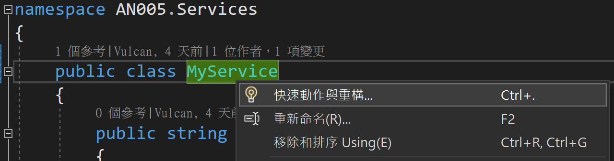
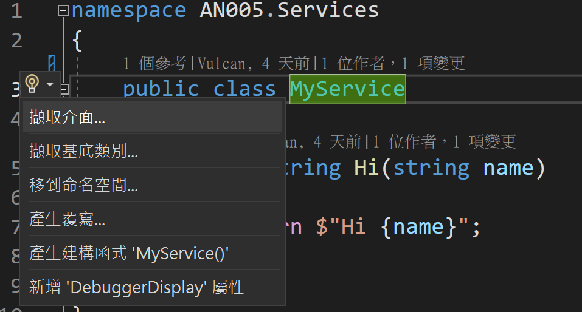
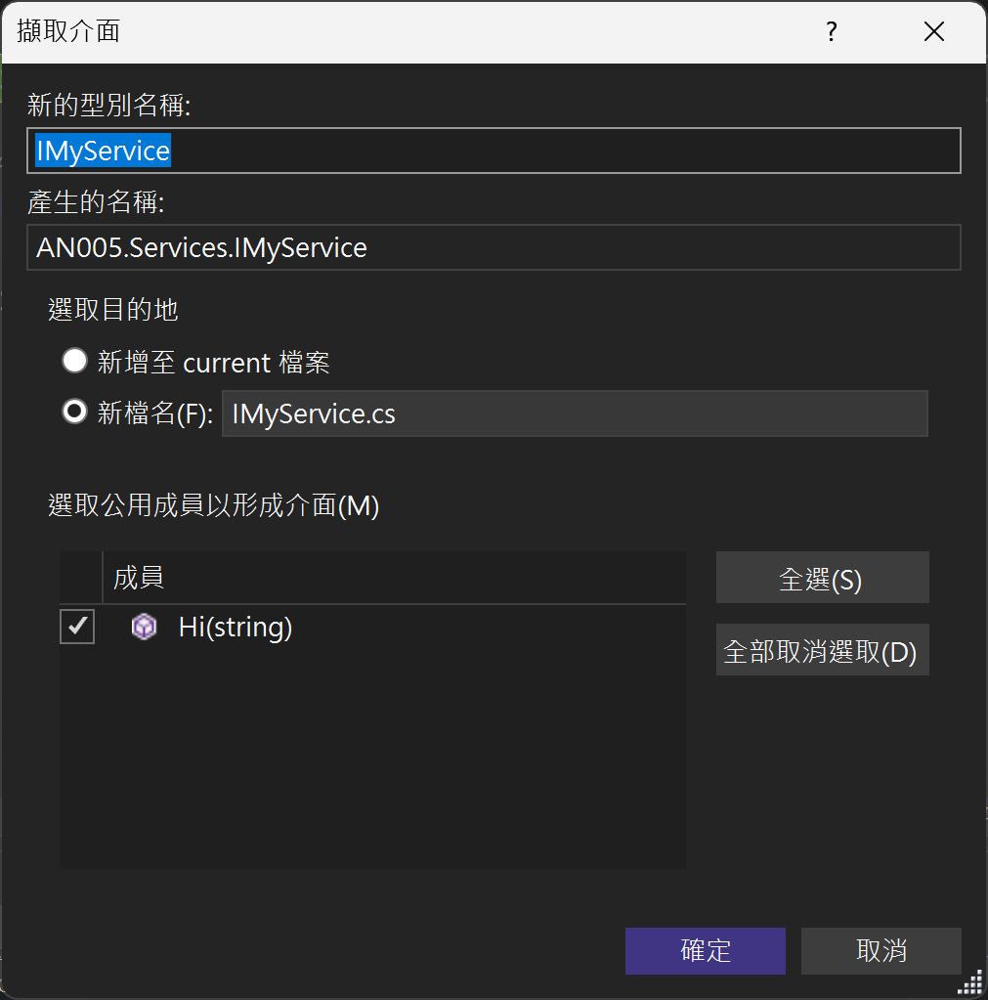
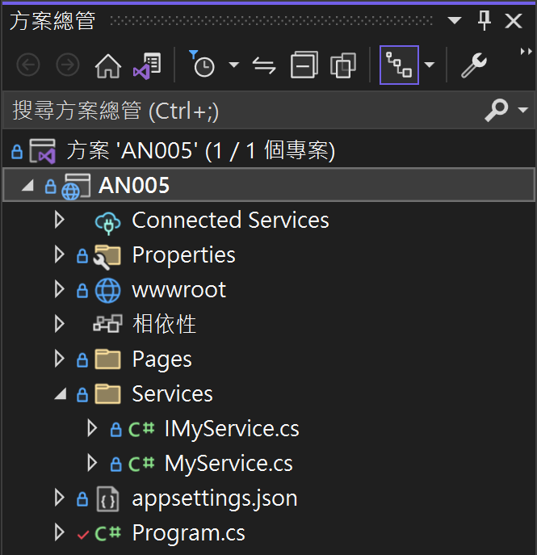

# 動手練習 ASP.NET Core7 相依性注入 Dependency Injection 的使用方式

在現今專案開發過程中，相依性注入 Dependency Injection 這個設計模式 Design Pattern 扮演著相當重要的角色，因為，一旦在專案中使用了相依性注入這個設計模式，將會透過 DI / IoC Container 容器來進行所需要使用到的服務的 註冊 Registration，而在各個相關類別內，可以透過經常使用的 建構式注入 Constructor Injection 的方式，宣告這個類別需要使用到其他的服務，這個過程稱之為 解析 Resolve；當在這個類別取得相依物件之後，便可以進行此相依物件的操作與使用，一旦此物件使用完畢之後，當初所注入的服務物件，便會根據當初所注入時期宣告的生命週期來進行管理，由 DI / IoC 容器決定何時要 釋放 Release 當初所注入的服務物件。

因此，整個相依性注入這個設計模式，將會圍繞著 RRR (Registration , Resolve , Release)這三種操作來進行，透過這個設計模式將會獲得到整個專案具有鬆散耦合的特性，這也代表了這個專案具有好維護的特性，因為，一旦當初所規劃與設計的實作服務物件需要進行變更或者更換的時候，此時，便可以設計另外一個新服務類別，無需使用原有的服務類別來進行修改，緊接著透過對相依性服務容器的註冊階段，宣告此專案將會注入此一新設計的服務物件，不再使用原有的服務物件。

對於第一次接觸這個相依性注入設計模式的程式設計師，絕大多數很難接受這樣的開發做法，猛一看，整個開發過程似乎變得相當複雜，而且產生出更多的程式碼，不過，這一切的辛苦與努力，只是為了要能夠達成一件事情，讓整體專案變得好維護、好擴充與延伸，因此，一旦學會與使用這個設計模式之後，所得到的效益與成果，是沒有使用這個設計模式之前很難想像到的。

那麼，相依性注入 Dependency Injection 這個設計模式 Design Pattern 究竟好不好學習與實做呢？接下來就來看看

在這個練習中，將會設計一個服務類別 [MyService] ，此類別內僅會有一個 [Hi] 方法，並且該方法會回傳一個字串。

首先先來建立一個 ASP.NET Core Web 應用程式 (Model-View-Controller) 專案，請依照底下說明來建立這個專案

* 打開 Visual Studio 2022 IDE 應用程式
* 從 [Visual Studio 2022] 對話窗中，點選右下方的 [建立新的專案] 按鈕
* 在 [建立新專案] 對話窗右半部
  * 切換 [所有語言 (L)] 下拉選單控制項為 [C#]
  * 切換 [所有專案類型 (T)] 下拉選單控制項為 [Web]
* 在中間的專案範本清單中，找到並且點選 [ASP.NET Core Web 應用程式 (Model-View-Controller)] 專案範本選項
* 點選右下角的 [下一步] 按鈕
* 在 [設定新的專案] 對話窗
* 找到 [專案名稱] 欄位，輸入 `AN005` 作為專案名稱
* 點選右下角的 [下一步] 按鈕
* 現在將會看到 [其他資訊] 對話窗
* 請點選右下角的 [建立] 按鈕

## 建立需要使用到的服務類別

在這裡將會按照一般常用的設計方式來進行操作

* 使用滑鼠右擊該專案節點
* 在彈出功能表上，選取 [加入] > [新增資料夾] 選項
* 在新產生的資料節點上，輸入 [Services] 這個名稱作為資料夾的名稱

  >日後，若有其他相關服務要進行新增，請在此資料夾下來進行新增新的類別來進行設計，如此的好處將會是可以把所有的服務都存在同一個地方，方便區隔與管理，當然，一旦該資料夾的服務隨著時間延續，需求不斷的增加，也會造成該資料夾下的類別檔案數量越來越多，此時有一種選擇方式，那就是在此 [Services] 資料夾下，建立出更多不同分類的資料夾，江河是的服務類別檔案，拖拉到合適的資料夾內，如此將會達到更加清爽的檢視與管理目的。

* 使用滑鼠右擊 [Services] 資料夾節點
* 在彈出功能表上，選取 [加入] > [類別] 選項
* 此時，將會出現 [新增項目] 對話窗
* 在此對話窗最下方的 [名稱] 欄位內，輸入 `MyService` 這個文字，作為此新建立類別的名稱與檔案名稱
* 底下將會是剛剛建立的 [MyService] 類別的程式碼

```csharp
namespace AN005
{
    public class MyService
    {
    }
}
```
* 請依據底下程式碼重新設計此新的類別程式碼

```csharp
public class MyService
{
    public string Hi(string name)
    {
        return $"Hi {name}";
    }
}
```

在此設計一個 [Hi] 方法，將會接收一個字串型別的參數，也就是要傳入一個名字，接著將會對這個名字文字說 Hi，因此透過 `$"Hi {name}"` 表示式將其組合起需要的新文字內容，最後此文字回傳回去。

## 為新建立的服務類別，建立新的介面

原則上來說，當要設計一個新的服務類別，應該會要設計該類別的 介面 Interface ，也就是該類別對外溝通的合約，接著，才會依據這個新建立的 介面 來實作出新的服務類別出來；不過，在這裡將會簡化這個過程，而是先設計一個服務類別，然後，透過 Visual Studio 2022 所提供的 重構 Refactor 工具，為這個類別自動產生對外溝通會用到的合約介面出來。

* 將滑鼠移動到 [MyService] 這個文字任何地方
* 使用滑鼠右擊此文字，將會出現如下圖的彈跳功能表清單出來

  
* 請選取 [快速動作與重構] 這個選項
* 接下來將會看到另外一個彈跳功能表清單

  
* 在這個彈跳功能表清單中，看到需要使用到的重構功能，請選取 [擷取介面] 這個項目
  
  >這個功能選項將可讓您使用類別、結構或介面的現有成員來建立一個新介面，如此，便會自動產生出一個對外會用到溝通合約介面了，想要使用這個類別的任何功能或者屬性，僅能夠透過此介面來存取，對於參考與使用這個類別所建立的物件而言，使用者並不需要知道是哪個類別來提供這些服務，使用者僅需要參考所用到的介面，而真正的服務類別也僅需要實作所指定的介面即可。

* 緊接著將會看到新的對話窗出現，在這個 [擷取介面] 對話窗內，將可以調整需要產生介面的內容

  >在此為了簡化練習過程，將會使用預設值來操作，更多關於這方面的資訊，可以參考 [擷取介面重構](https://learn.microsoft.com/zh-tw/visualstudio/ide/reference/extract-interface?view=vs-2022&WT.mc_id=DT-MVP-5002220)

  
* 在 [擷取介面] 對話窗內，點選右下角的 [確定] 按鈕，以便產生出這個新的介面
* 底下將會是新產生出的來的介面檔案內容

  > 這是一個 [C# Interface](https://learn.microsoft.com/zh-tw/dotnet/csharp/language-reference/keywords/interface?WT.mc_id=DT-MVP-5002220) 介面宣告，這可以從 `public interface ...` 看的出來。
  >
  >這個介面內僅宣告一個成員，那就是一個名稱為 Hi 的方法，從該 [方法簽章 Method Signatures](https://learn.microsoft.com/en-us/dotnet/csharp/methods#method-signatures?WT.mc_id=DT-MVP-5002220) 可以看出，這個介面需要一個方法，其需要傳入一個型別為字串的參數，而該方法將會回傳一個型別為字串的物件
  >
  >對於任何要實作 Implementation 這個介面的類別，在該類別內都需要也剛剛提到的函式簽章存在

```csharp
namespace AN005.Services
{
    public interface IMyService
    {
        string Hi(string name);
    }
}
```

* 原有的 [MyService] 類別，將會被重構為如下程式碼

  > 在這個類別名稱之後，自動加入了 ` : IMyService` 這個介面宣告，表示這個類別有實作這個 [IMyService] 介面合約內容。

```csharp
namespace AN005.Services
{
    public class MyService : IMyService
    {
        public string Hi(string name)
        {
            return $"Hi {name}";
        }
    }
}
```

## 開始用使用相依性注入容器來進行新服務註冊

一般來說，當要進行與使用相依性服務容器來進行註冊的時候，通常會在 Composition Root 組合根 地方來進行，也就是通常的程式進入點位置，在這裡 ASP.NET Core7 相關專案，程式進入點的位置就是在 [Program.cs] 這個檔案內來宣告，所以，接下來的工作就要進行這個服務的註冊程式設計。

* 在專案根目錄下，找到並且打開 [Program.cs] 檔案
* 找到 `builder.Services.AddRazorPages();` 敘述
* 在其下方加入底下程式碼

  >型別為 WebApplicationBuilder 的 [builder] 物件，裡面有個 [Services] 屬性，他的型別為 [IServiceCollection](https://learn.microsoft.com/zh-tw/dotnet/api/microsoft.extensions.dependencyinjection.iservicecollection?view=dotnet-plat-ext-7.0&WT.mc_id=DT-MVP-5002220) ，其目的將會是指定服務描述項集合的合約，講白話點，那就是要在這裡進行對相依性服務容器來進行 註冊 宣告
  >
  >對於 [AddTransient] 這個方法，將會是指定此注入行為所產生的物件，其物件生命週期為何，也就是該物件何時會產生、何時會消滅掉，這個 [AddTransient] 方法將會宣告當要注入此物件的時候，將會新建立與產生新的物件，而當參考使用的物件歸還記憶體之後，這個注入的物件，也會消滅並把所占有的記憶體歸還給作業系統。
  >
  >這個 [AddTransient] 方法提供泛型方法覆載，在這裡的範例中，先傳入一個介面型別，緊接著傳入一個有實作該介面的類別，一旦想要透過相依性注入容器來注入或者取得(正式的名稱為 解析 Resolve)，僅會告知需要一個 [IMyServer] 型別的物件，而究竟是哪個有實作該介面的物件會產生出來，就會依據這裡的宣告來建立新的物件。
  >
  >之前有提到，若因為有新的需求需要變更這個 [MyServer] 類別，程式設計師可以依據新的需求，重新設計一個新的 [MyService2] 類別，接著在此修改宣告，任何未來想要使用 [IMyService] 這個介面的時候，都會注入 [MyService2] 物件，也就是說，相依性服務容器的註冊程式碼將會改成 `builder.Services.AddTransient<IMyService, MyService2>();` ，最後，不用再修改任何程式碼，重新啟動這個專案，此時，該專案便可以滿足新變更的需求。

```csharp
builder.Services.AddTransient<IMyService, MyService>();
```

## 注入與使用 MyService 物件

* 在 [Program.cs] 檔案內找到 `var app = builder.Build();` 敘述
* 在該敘述之後加入底下程式碼
> 在型別為 [WebApplication] 的 [app] 物件內，將會有個型別為 [IServiceProvider](https://learn.microsoft.com/zh-tw/dotnet/api/system.iserviceprovider?view=net-7.0&WT.mc_id=DT-MVP-5002220) 的 [Services] 屬性，其目的為定義機制來擷取服務物件，也就是為其他物件提供自訂支援的物件，講白話來說，就是可以透過這個屬性來進行手動注入需求
>
>因此，使用 [GetService] 這個泛型方法，提供一個 [IMyService] 型別，代表說要透過相依性注入容器，取得一個有實作 [IMyService] 介面的物件。
>
>根據剛剛的程式碼，在相依性注入容器內對於 [IMyService] 介面的註冊內容，將會對應到 [MyService] 這個型別類別，因此，當呼叫了 `app.Services.GetService<IMyService>()` 這個方法呼叫，相依性注入容器將會產生一個新的 [MyService] 物件，並且回傳到 [myService] 區域變數內。

```csharp
var myService = app.Services.GetService<IMyService>();
var logger = app.Services.GetService<ILogger<Program>>();
var hi = myService.Hi("Lee");
logger.LogInformation($"In WebApplication, Call Hi Method : {hi}");
```

最後整個專案將會如下結構




