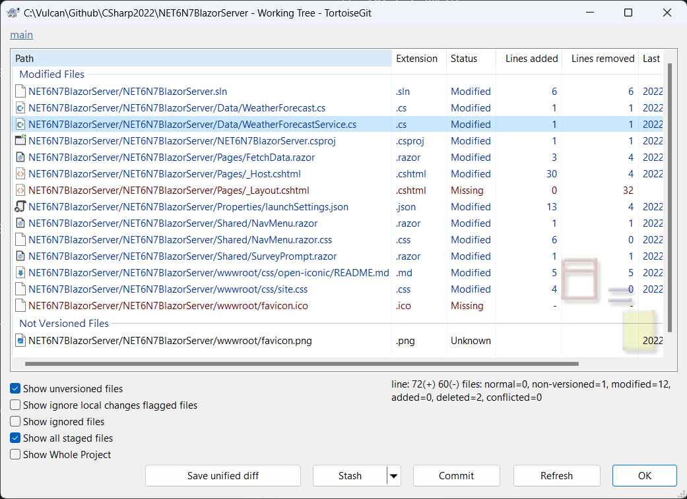

# 觀察使用 .NET 6 建立的 Blazor Server 專案與採用 .NET 7 的有何不同?

.NET7 已經發表快要兩個月了，這段期間因為忙於進行一個專案的效能問題分析，所以，一直想要來比較這兩種版本專案範本，所建立起來的專案原始碼，有何不同？

在這裡，將會先使用 .NET 6 平台，建立一個 Blazor 伺服器類型的專案，在建立專案的過程中，將都僅使用預設值來操作；另外，採用 .NET 7 平台，使用相同的方案與專案名稱進行相同的操作，如此，將會得兩採用 .NET 6 / .NET 7 兩種版本框架所建立起來的 Blazor 伺服器專案原始碼。

現在，使用 Git 工具，觀察這兩著專案有甚麼差異？



## BlazorApp.csproj 專案檔案

### 在 .NET 6 版本

將會使用 net6.0 在 TargetFramework 中來標示

```xml
<TargetFramework>net6.0</TargetFramework>
```

### 在 .NET 7 版本

將會使用 net7.0 在 TargetFramework 中來標示

```xml
<TargetFramework>net7.0</TargetFramework>
```

## _Layout.cshtml 與 _Host.cshtml

這個檔案 **_Layout.cshtml** 再度從 .NET 7 專案範本中移除，這個檔案最早出現的時間是在 .NET 6 推出時間，在 .NET 5 版本是沒有這個檔案的

對於 _Host.cshtml 檔案，原先在 .NET 6 中，將會以底下內容呈現。

```html
@page "/"
@namespace NET6N7BlazorServer.Pages
@addTagHelper *, Microsoft.AspNetCore.Mvc.TagHelpers
@{
    Layout = "_Layout";
}

<component type="typeof(App)" render-mode="ServerPrerendered" />
```

在 .NET 7 時代，將會恢復到原先 .NET 5 的作法，也就是把 .NET 6 產生的 _Layout.cshtml 合併到 _Host.cshtml 內，最終內容如下：

```html
@page "/"
@using Microsoft.AspNetCore.Components.Web
@namespace NET6N7BlazorServer.Pages
@addTagHelper *, Microsoft.AspNetCore.Mvc.TagHelpers

<!DOCTYPE html>
<html lang="en">
<head>
    <meta charset="utf-8" />
    <meta name="viewport" content="width=device-width, initial-scale=1.0" />
    <base href="~/" />
    <link rel="stylesheet" href="css/bootstrap/bootstrap.min.css" />
    <link href="css/site.css" rel="stylesheet" />
    <link href="NET6N7BlazorServer.styles.css" rel="stylesheet" />
    <link rel="icon" type="image/png" href="favicon.png"/>
    <component type="typeof(HeadOutlet)" render-mode="ServerPrerendered" />
</head>
<body>
    <component type="typeof(App)" render-mode="ServerPrerendered" />

    <div id="blazor-error-ui">
        <environment include="Staging,Production">
            An error has occurred. This application may no longer respond until reloaded.
        </environment>
        <environment include="Development">
            An unhandled exception has occurred. See browser dev tools for details.
        </environment>
        <a href="" class="reload">Reload</a>
        <a class="dismiss">🗙</a>
    </div>

    <script src="_framework/blazor.server.js"></script>
</body>
</html>
```

## Program.cs 程式進入點

這個檔案不論在 .NET 6 或者 .NET 7 都沒有任何變化，完全相同

## launchSettings.json 啟動設定檔案

### 在 .NET 6 版本

在 .NET 6 之前時代，僅會提供 IIS Express 與 Kestrol 的啟動設定宣告

```json
{
  "iisSettings": {
    "windowsAuthentication": false,
    "anonymousAuthentication": true,
    "iisExpress": {
      "applicationUrl": "http://localhost:38029",
      "sslPort": 44332
    }
  },
  "profiles": {
    "NET6N7BlazorServer": {
      "commandName": "Project",
      "dotnetRunMessages": true,
      "launchBrowser": true,
      "applicationUrl": "https://localhost:7150;http://localhost:5134",
      "environmentVariables": {
        "ASPNETCORE_ENVIRONMENT": "Development"
      }
    },
    "IIS Express": {
      "commandName": "IISExpress",
      "launchBrowser": true,
      "environmentVariables": {
        "ASPNETCORE_ENVIRONMENT": "Development"
      }
    }
  }
}
```

### 在 .NET 7 版本

在 .NET 7 版本，將會增加 http & https 兩種設定檔案，分別指定要採用哪種方式來連線到 Blazor 伺服器上。

底下是 .NET 7 提供的內容

```json
{
  "iisSettings": {
    "windowsAuthentication": false,
    "anonymousAuthentication": true,
    "iisExpress": {
      "applicationUrl": "http://localhost:11338",
      "sslPort": 44358
    }
  },
  "profiles": {
    "http": {
      "commandName": "Project",
      "dotnetRunMessages": true,
      "launchBrowser": true,
      "applicationUrl": "http://localhost:5295",
      "environmentVariables": {
        "ASPNETCORE_ENVIRONMENT": "Development"
      }
    },
    "https": {
      "commandName": "Project",
      "dotnetRunMessages": true,
      "launchBrowser": true,
      "applicationUrl": "https://localhost:7285;http://localhost:5295",
      "environmentVariables": {
        "ASPNETCORE_ENVIRONMENT": "Development"
      }
    },
    "IIS Express": {
      "commandName": "IISExpress",
      "launchBrowser": true,
      "environmentVariables": {
        "ASPNETCORE_ENVIRONMENT": "Development"
      }
    }
  }
}
```

## NavMenu.razor 導航功能表元件

### 在 .NET 6 版本

使用這個 HTML 標記來宣告 

```html
<div class="@NavMenuCssClass" @onclick="ToggleNavMenu">
```

### 在 .NET 7 版本

增加了一個類別宣告，那就是 `nav-scrollable`

```html
<div class="@NavMenuCssClass nav-scrollable" @onclick="ToggleNavMenu">
```

## NavMenu.razor.css 隔離 CSS 宣告檔案

### 在 .NET 7 版本

上面提到的 nav-scrollable 類別，將會在這裡進行宣告

```css
.nav-scrollable {
    /* Allow sidebar to scroll for tall menus */
    height: calc(100vh - 3.5rem);
    overflow-y: auto;
}
```

## 結論

對於 Blazor Server 專案範本，這次 .NET 7 版本上並沒有過多與大幅度的修正


### 在 .NET 6 版本


### 在 .NET 7 版本


