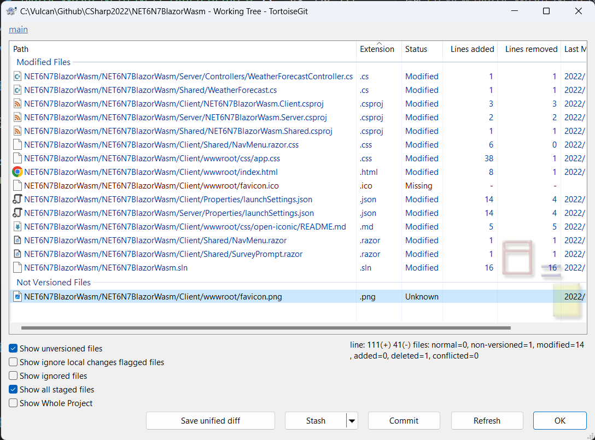

# 觀察使用 .NET 6 建立的 Blazor WebAssembly 專案與採用 .NET 7 的有何不同?

.NET7 已經發表快要兩個月了，這段期間因為忙於進行一個專案的效能問題分析，所以，一直想要來比較這兩種版本專案範本，所建立起來的專案原始碼，有何不同？

在這裡，將會先使用 .NET 6 平台，建立一個 Blazor WebAssembly 類型的專案，在建立專案的過程中，將都僅使用預設值來操作；另外，採用 .NET 7 平台，使用相同的方案與專案名稱進行相同的操作，如此，將會得兩採用 .NET 6 / .NET 7 兩種版本框架所建立起來的 Blazor WebAssembly專案原始碼。

現在，使用 Git 工具，觀察這兩著專案有甚麼差異？



## NET6N7BlazorWasm.Client.csproj 專案檔案

### 在 .NET 6 版本

將會使用 net6.0 在 TargetFramework 中來標示

```xml
<TargetFramework>net6.0</TargetFramework>
```

底下兩個 NuGet 套件也是使用 .NET 6 的版本

```xml
  <ItemGroup>
    <PackageReference Include="Microsoft.AspNetCore.Components.WebAssembly" Version="6.0.10" />
    <PackageReference Include="Microsoft.AspNetCore.Components.WebAssembly.DevServer" Version="6.0.10" PrivateAssets="all" />
  </ItemGroup>
```

### 在 .NET 7 版本

將會使用 net7.0 在 TargetFramework 中來標示

```xml
<TargetFramework>net7.0</TargetFramework>
```

底下兩個 NuGet 套件將會更換使用 .NET 7 的版本

```xml
  <ItemGroup>
    <PackageReference Include="Microsoft.AspNetCore.Components.WebAssembly" Version="7.0.0" />
    <PackageReference Include="Microsoft.AspNetCore.Components.WebAssembly.DevServer" Version="7.0.0" PrivateAssets="all" />
  </ItemGroup>
```

## NET6N7BlazorWasm.Server.csproj 專案檔案


### 在 .NET 6 版本

將會使用 net6.0 在 TargetFramework 中來標示

```xml
<TargetFramework>net6.0</TargetFramework>
```

底下兩個 NuGet 套件也是使用 .NET 6 的版本

```xml
  <ItemGroup>
    <PackageReference Include="Microsoft.AspNetCore.Components.WebAssembly.Server" Version="6.0.10" />
  </ItemGroup>
```

### 在 .NET 7 版本

將會使用 net7.0 在 TargetFramework 中來標示

```xml
<TargetFramework>net7.0</TargetFramework>
```

底下兩個 NuGet 套件將會更換使用 .NET 7 的版本

```xml
  <ItemGroup>
    <PackageReference Include="Microsoft.AspNetCore.Components.WebAssembly.Server" Version="7.0.0" />
  </ItemGroup>
```

## NET6N7BlazorWasm.Shared.csproj 專案檔案

### 在 .NET 6 版本

將會使用 net6.0 在 TargetFramework 中來標示

```xml
<TargetFramework>net6.0</TargetFramework>
```

### 在 .NET 7 版本

將會使用 net7.0 在 TargetFramework 中來標示

```xml
<TargetFramework>net7.0</TargetFramework>
```

## index.html

### 在 .NET 6 版本

原先使用底下的 id 標記，用來宣告這裡將會展開、渲染 Blazor 根元件的地方
```html
    <div id="app">Loading...</div>
```

### 在 .NET 7 版本

當 Blazor Wasm 第一次啟動，並且沒有任何 .dll 組件快取在本機的時候，此時將會透過網路下載這個專案需要用到的相關組件檔案，此時，將會有完成進度百分比出現在畫面中，如下圖。


查看與清除這些組件快取內容，可以透過瀏覽器提供開發人員工具，來做到


故，在 .NET 7 內，會將 id="app" 這個標籤，改成如下的標記內容。

```html
    <div id="app">
        <svg class="loading-progress">
            <circle r="40%" cx="50%" cy="50%" />
            <circle r="40%" cx="50%" cy="50%" />
        </svg>
        <div class="loading-progress-text"></div>
    </div>
```

另外，這裡需要加入底下標記


```html
    <link rel="icon" type="image/png" href="favicon.png" />
```

## app.css

### 在 .NET 7 版本

需要加入底下 CSS 宣告

```css
.btn:focus, .btn:active:focus, .btn-link.nav-link:focus, .form-control:focus, .form-check-input:focus {
  box-shadow: 0 0 0 0.1rem white, 0 0 0 0.25rem #258cfb;
}


.loading-progress {
    position: relative;
    display: block;
    width: 8rem;
    height: 8rem;
    margin: 20vh auto 1rem auto;
}

    .loading-progress circle {
        fill: none;
        stroke: #e0e0e0;
        stroke-width: 0.6rem;
        transform-origin: 50% 50%;
        transform: rotate(-90deg);
    }

        .loading-progress circle:last-child {
            stroke: #1b6ec2;
            stroke-dasharray: calc(3.141 * var(--blazor-load-percentage, 0%) * 0.8), 500%;
            transition: stroke-dasharray 0.05s ease-in-out;
        }

.loading-progress-text {
    position: absolute;
    text-align: center;
    font-weight: bold;
    inset: calc(20vh + 3.25rem) 0 auto 0.2rem;
}

    .loading-progress-text:after {
        content: var(--blazor-load-percentage-text, "Loading");
    }
```

## NavMenu.razor 導航功能表元件

### 在 .NET 6 版本

使用這個 HTML 標記來宣告 

```html
<div class="@NavMenuCssClass" @onclick="ToggleNavMenu">
```

### 在 .NET 7 版本

增加了一個類別宣告，那就是 `nav-scrollable`

```html
<div class="@NavMenuCssClass nav-scrollable" @onclick="ToggleNavMenu">
```

## NavMenu.razor.css 隔離 CSS 宣告檔案

### 在 .NET 7 版本

加入底下 CSS 宣告

```css
    .nav-scrollable {
        /* Allow sidebar to scroll for tall menus */
        height: calc(100vh - 3.5rem);
        overflow-y: auto;
    }
```

## 結論

對於 Blazor Wasm 專案範本，這次 .NET 7 版本上並沒有過多與大幅度的修正

