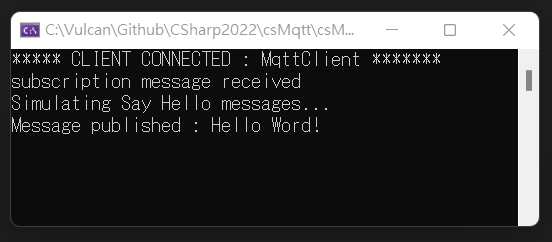
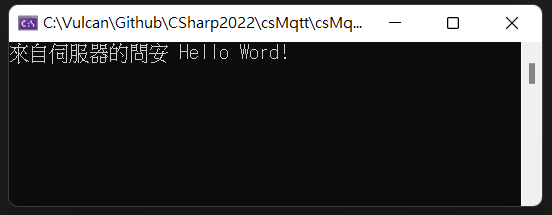

# 在 .NET C# 下使用 MQTT 來訂閱與發佈訊息

對於 [MQTT](https://zh.wikipedia.org/zh-tw/MQTT) 的定義，在維基百科上是這麼說的：訊息佇列遙測傳輸（英語： Message Queuing Telemetry Transport，MQTT ）是ISO 標準（ISO/IEC PRF 20922）下基於發布 (Publish)/訂閱 (Subscribe)範式的訊息協定，可視為「資料傳遞的橋梁」它工作在 TCP/IP協定族上，是為硬體效能低下的遠端裝置以及網路狀況糟糕的情況下而設計的發布/訂閱型訊息協定，為此，它需要一個訊息中介軟體，以解決當前繁重的資料傳輸協定，如：HTTP。

首先， MQTT 是 Message Queuing Telemetry Transport 的縮寫，從字面意義來看，就是把要傳遞的訊息放在一個佇列內，接著可以傳送 Publish 到別的地方，而需要接收到這個訊息的用戶，則是需要訂閱這主題類型的訊息，便可以收到來自遠端傳送過來的訊息，所以，上面解釋文章有提到：可視為「資料傳遞的橋梁」，也就是這樣的意思。

在這裡將會使用 [MQTTNet](https://github.com/dotnet/MQTTnet) 這個套件來進行操作，看看如何在分散式的環境中，進行資料傳遞操作。

## 建立測試用 MQTT 伺服器端 的主控台應用程式專案

* 打開 Visual Studio 2022
* 點選右下方的 [建立新的專案] 按鈕
* 選擇一個 [主控台應用程式] 的專案範本
* 點選右下方的 [下一步] 按鈕
* 在 [設定新的專案] 對話窗內，在 [專案名稱] 欄位中，輸入 `csMqttServer`
* 點選右下方的 [下一步] 按鈕
* 在 [其他資訊] 對話窗中
* 取消 [Do not use top-level statements] 這個 checkbox 檢查盒的勾選
* 點選右下方的 [建立] 按鈕
* 透過 NuGet 工具，搜尋到 MQTTnet 這個套件，將其安裝到這個專案
* 打開 Program.cs 檔案，將底下內容替換掉這個檔案內容

```csharp
using MQTTnet.Server;
using MQTTnet;
using System.Text;

namespace csMqttServer;

internal class Program
{
    private static IMqttServer _mqttServer;

    static void Main(string[] args)
    {

        // 設定 MQTT server 的運作環境參數
        var optionsBuilder = new MqttServerOptionsBuilder()
            .WithConnectionBacklog(100)
            .WithDefaultEndpointPort(1884)
            .WithMaxPendingMessagesPerClient(1000);

        // 透過 MqttFactory 這個工廠方法類別，建立一個 MQTT 伺服器物件
        _mqttServer = new MqttFactory().CreateMqttServer();

        // 綁定當訊息送到此伺服器之後的事件，定義該做甚麼事情
        _mqttServer.UseApplicationMessageReceivedHandler(async e =>
        {
            // 對於此訊息的 Payload 部分，將會是經過編碼的，因此需要先解碼
            var payload = Encoding.UTF8.GetString(e.ApplicationMessage.Payload);
            var topic = e.ApplicationMessage.Topic;
            if (topic == "Hi")
            {
                Console.WriteLine("subscription message received");
                Console.WriteLine("Simulating Say Hello messages...");
                await SimulateSayHelloAsync();
            }
        });

        // 一旦有用戶端連線上來之後，將會觸發這個事件
        _mqttServer.UseClientConnectedHandler(e =>
        {
            Console.WriteLine("***** CLIENT CONNECTED : " + e.ClientId + " *******");
        });

        // 啟動這個 MQTT 伺服器
        _mqttServer.StartAsync(optionsBuilder.Build());

        Console.ReadLine();
    }

    private static async Task SimulateSayHelloAsync()
    {
        await PublishMessage("HiEcho", "Hello Word!");
    }

    private static async Task PublishMessage(string topic, string message)
    {
        // 產生一個 MQTT 訊息
        var mqttMessage = new MqttApplicationMessageBuilder()
                            .WithTopic(topic)
                            .WithPayload(message)
                            .WithAtLeastOnceQoS()
                            .WithRetainFlag(false)
                            .WithDupFlag(false)
                            .Build();

        // 發佈此剛剛建立的訊息
        var result = await _mqttServer.PublishAsync(mqttMessage, CancellationToken.None);

        if (result.ReasonCode == MQTTnet.Client.Publishing.MqttClientPublishReasonCode.Success)
            Console.WriteLine("Message published : " + message);
    }
}
```

這是一個 MQTT 伺服器端的應用程式，這個程式最後將會 Console.ReadLine(); 敘述，除非使用者在命令提示字元視窗內按下 Enter 按鍵，否則這個 MQTT 伺服器會一直持續執行中。

首先建立一個 MqttServerOptionsBuilder 物件，這是要用來設定 MQTT server 的運作環境參數，接著使用 new MqttFactory().CreateMqttServer() 來建立一個 MQTT 伺服器的物件。

一旦取得這個伺服器物件之後，緊接著便可以進行一些事件綁定的程式碼設計，首先先使用 UseApplicationMessageReceivedHandler 這個事件綁定到一個委派方法內，用來定義當訊息送到此伺服器之後的事件，定義該做甚麼事情。

在這個練習中，將會判斷當伺服器收到的訊息之主題為 Hi 這個名稱，便會在這個方法內呼叫 await SimulateSayHelloAsync(); 敘述，對送出此訊息的用戶端，送出回應訊息。

綁定 MQTT 伺服器上的第二個事件為 UseClientConnectedHandler ，當有用戶端成功連線到這台伺服器上之後，便會出發這個事件，在此將會僅僅顯示一個訊息到螢幕上，當然，在實際用途上，可以做出其他層面的不同應用設計。

最後要來看看 PublishMessage 這個方法，如何在伺服器上，對於用戶端發送訊息，這個方法將會被 SimulateSayHelloAsync 所呼叫，而此方法將會傳送 Topic 主題與 Message 訊息內容物件過來，首先會先透過建立 MqttApplicationMessageBuilder 物件，指定要傳送訊息的主題、內容、與其他相關傳遞參數，接著呼叫 MQTT 伺服器物件上的 PublishAsync 方法，將剛剛建立好的 MqttApplicationMessage 物件，送出到有訂閱該主題的用戶端上。

## 啟動與執行該 MQTT 伺服器專案

若沒有問題，可以執行上面寫的專案，讓這個 MQTT 伺服器可以運作起來。

## 建立測試用 MQTT 用戶端 的主控台應用程式專案

* 打開 Visual Studio 2022
* 點選右下方的 [建立新的專案] 按鈕
* 選擇一個 [主控台應用程式] 的專案範本
* 點選右下方的 [下一步] 按鈕
* 在 [設定新的專案] 對話窗內，在 [專案名稱] 欄位中，輸入 `csMqttClient`
* 點選右下方的 [下一步] 按鈕
* 在 [其他資訊] 對話窗中
* 取消 [Do not use top-level statements] 這個 checkbox 檢查盒的勾選
* 點選右下方的 [建立] 按鈕
* 透過 NuGet 工具，搜尋到 MQTTnet 這個套件，將其安裝到這個專案
* 打開 Program.cs 檔案，將底下內容替換掉這個檔案內容

```csharp
using MQTTnet.Client.Options;
using MQTTnet.Client;
using MQTTnet;
using System.Text;
using MQTTnet.Client.Subscribing;

namespace csMqttClient;

internal class Program
{
    private static IMqttClient _mqttClient;

    static void Main(string[] args)
    {
        // 使用 MqttFactory 工廠類別，建立一個 MQTT 用戶端的物件
        _mqttClient = new MqttFactory().CreateMqttClient();

        // 每個用戶端都要有唯一的 Id，並且要再宣告 MQTT 伺服器的連線位址與方式
        var options = new MqttClientOptionsBuilder().WithClientId("MqttClient")
                                                    .WithTcpServer("localhost", 1884)
                                                    .Build();

        // 綁定當此用戶端已經連線到遠端伺服器之後，所要處理的工作
        _mqttClient.UseConnectedHandler(async e =>
        {
            // 在此訂閱有興趣的主題訊息
            MqttClientSubscribeResult subResult =
            await _mqttClient.SubscribeAsync(new MqttClientSubscribeOptionsBuilder()
            .WithTopicFilter("HiEcho")
            .Build());

            // 對伺服器送出問好訊息
            PublishMessage("Hi", "Test Message");
        });

        // 綁定當訊息傳送到此用戶端之後，將會觸發的事件
        _mqttClient.UseApplicationMessageReceivedHandler(e =>
        {
            Console.WriteLine($"來自伺服器的問安 {Encoding.UTF8.GetString(e.ApplicationMessage.Payload)}");
        });

        // 連線到遠端伺服器上
        _mqttClient.ConnectAsync(options, CancellationToken.None);

        Console.Read();
    }

    private static async void PublishMessage(string topic, string message)
    {
        // Create mqttMessage
        var mqttMessage = new MqttApplicationMessageBuilder()
                            .WithTopic(topic)
                            .WithPayload(message)
                            .WithExactlyOnceQoS()
                            .Build();

        // Publish the message asynchronously
        await _mqttClient.PublishAsync(mqttMessage, CancellationToken.None);
    }
}
```

現在要來設計 MQTT 用戶端的應用程式，這裡使用 new MqttFactory().CreateMqttClient(); 敘述建立一個 _mqttClient 物件，接著透過  new MqttClientOptionsBuilder().WithClientId("MqttClient").WithTcpServer("localhost", 1884).Build(); 敘述指定該 MQTT 用戶端的 ID 與要連線到後端 MQTT 伺服器上的連線資訊，如此，將會得到一個 IMqttClientOptions  型別的物件。

現在要透過呼叫 PublishMessage 自訂方法來將這個 MQTT 訊息傳送出去。

建立一個 MqttApplicationMessageBuilder 物件，指定要送出訊息內容與該訊息搭配的 Topic，便可以使用 await _mqttClient.PublishAsync(mqttMessage, CancellationToken.None); 敘述將這個訊息送到遠端伺服器上

## 啟動與執行該 MQTT 用戶端專案

若沒有問題，可以執行上面寫的專案，讓這個 MQTT 伺服器可以運作起來。

## 執行結果

從底下兩個主控台螢幕視窗輸入內容，可以看到這兩個專案的執行結果



這是 MQTT 伺服器執行的輸出內容



這是 MQTT 用戶端執行的輸出內容
