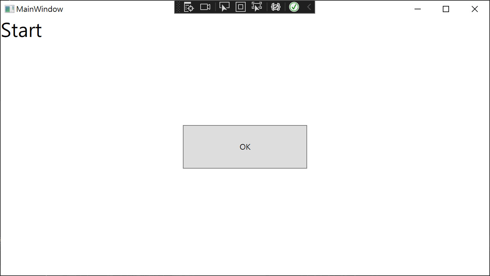
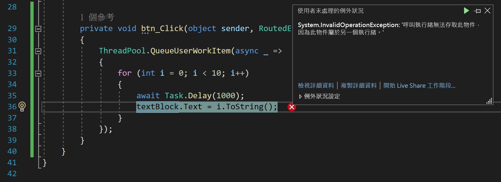
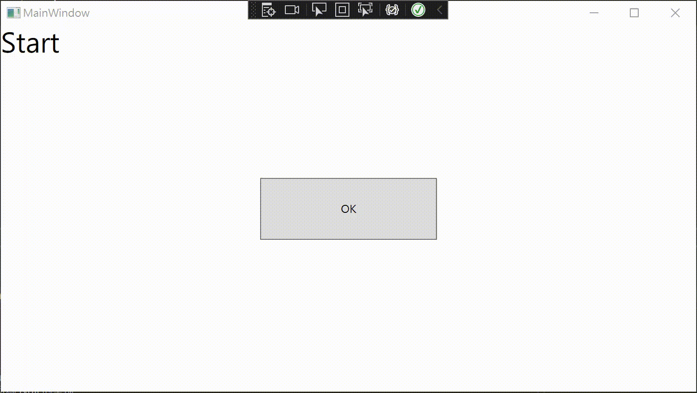

# C# 非同步 : 在進行 WPF / Windows Forms / Xamarin.Forms 專案開發，可以回到 UI 執行緒來更新 UI 控制項的相同作法

在以往，若再不同 GUI 開發框架下，想要在非同步的多執行緒程式碼下，更新 UI 控制項的屬性，若當前的執行緒不是所謂的 主執行緒 或者 稱之為 UI 執行緒，將會得到 `System.InvalidOperationException: '呼叫執行緒無法存取此物件，因為此物件屬於另一個執行緒。'` 這樣的例外異常訊息，所以，大家第一時間想到的就是每個開發框架都會有提供這樣相對應的程式碼，可以指定一段委派方法，讓這些程式碼在 UI 執行緒下來執行，而不是在多執行緒下的某個執行緒來執行，例如：

* Windows Forms

  這裡將會再多執行緒程式碼內，使用 [Control.Invoke 方法](https://docs.microsoft.com/zh-tw/dotnet/api/system.windows.forms.control.invoke?WT.mc_id=DT-MVP-5002220) 來做到，這個方法可以傳入一個委派方法，而該委派方法的程式碼將會在 主執行緒 或者 UI 執行緒 下來執行

* WPF Windows Presentation Foundation

  在這個開發框架下，將會使用 [Dispatcher.Invoke 方法](https://docs.microsoft.com/zh-tw/dotnet/api/system.windows.threading.dispatcher.invoke?WT.mc_id=DT-MVP-5002220) 來做到，同樣的，這個方法可以傳入一個委派方法，而該委派方法的程式碼將會在 主執行緒 或者 UI 執行緒 下來執行

而是否有個簡單與通用的設計做法，不論在哪個開發框架下，都可以使用相同的程式設計代碼，指定一個委派方法，讓這個委派方法可以在 UI 執行緒下來執行。

## 建立一個 WPF 的專案

為了要說明上面描述的內容，首先，建立一個 WPF 專案

在這個 WPF 專案內找到 [MainWindow.xaml] 檔案，打開這個檔案，使用底下的 XAML 來替換

```xml
<Window x:Class="WpfApp2.MainWindow"
        xmlns="http://schemas.microsoft.com/winfx/2006/xaml/presentation"
        xmlns:x="http://schemas.microsoft.com/winfx/2006/xaml"
        xmlns:d="http://schemas.microsoft.com/expression/blend/2008"
        xmlns:mc="http://schemas.openxmlformats.org/markup-compatibility/2006"
        xmlns:local="clr-namespace:WpfApp2"
        mc:Ignorable="d"
        Title="MainWindow" Height="450" Width="800">
    <Grid>
        <TextBlock x:Name="textBlock" Text="Start"
                   FontSize="30" />
        <Button x:Name="btn" Content="OK" Width="200" Height="70"
                Click="btn_Click"
                />
    </Grid>
</Window>
```

在這個 XAML 檔案內，將會宣告兩個 UI 控制項，一個是 [TextBlock] ，一個是 [Button] 。

在這裡的設計情境將會是，當使用者按下這個 OK 按鈕之後，便會開始執行一個非同步的作業，在這個非同步的多執行緒程式碼中，將會建立一個迴圈，反覆執行 10 次，每次的迴圈，將會把當前的迴圈索引值，指定到 [textBlock] 這個 UI 控制項內，如此，便可以從螢幕上看到當前的迴圈索引值是多少。

在這裡將會分別採用 ThreadPool 執行緒集區 與 Task 工作來實作這個非同步之多執行緒作業，並且比較兩者的差異。

## 使用工作物件 Task.Run 來建立一個非同步作業

切換到 [MainWindow.xaml] 的 Code Behind 程式碼編輯視窗內，將會看到下面的程式碼

```csharp
using System;
using System.Collections.Generic;
using System.Linq;
using System.Text;
using System.Threading;
using System.Threading.Tasks;
using System.Windows;
using System.Windows.Controls;
using System.Windows.Data;
using System.Windows.Documents;
using System.Windows.Input;
using System.Windows.Media;
using System.Windows.Media.Imaging;
using System.Windows.Navigation;
using System.Windows.Shapes;

namespace WpfApp2
{
    /// <summary>
    /// Interaction logic for MainWindow.xaml
    /// </summary>
    public partial class MainWindow : Window
    {
        public MainWindow()
        {
            InitializeComponent();
        }

        private void btn_Click(object sender, RoutedEventArgs e)
        {
        }
    }
}
```

現在，在 btn_Click 按鈕事件常式內，使用 Task.Run 來建立一個非同步工作物件，做到上面所提到的一個迴圈與更新迴圈索引值到畫面上的需求

將底下的程式碼加入到 btn_Click 事件內，雖然這裡使用了 `await Task.Delay(1000);` 這樣的敘述，但不影響整個實驗結果，當然，可以改寫成為封鎖 Block 等待 `Task.Delay(1000).Wait();` 敘述。

```csharp
private void btn_Click(object sender, RoutedEventArgs e)
{
    var task = Task.Run(async () =>
    {
        for (int i = 0; i < 10; i++)
        {
            await Task.Delay(1000);
            textBlock.Text = i.ToString();
        }
    });
}
```

現在，可以執行這個 WPF 專案，一旦應用程式啟動成功後，點選視窗中的 OK 按鈕



沒意外的話，應用程式沒有當掉，並且螢幕也沒有任何變化，為什麼會是這樣的情況呢？

若讀者對於 [非同步工作 Task](https://docs.microsoft.com/zh-tw/dotnet/api/system.threading.tasks.task?WT.mc_id=DT-MVP-5002220) 這個類別夠孰悉的話，將會知道，這個工作物件在非同執行所傳入的委派方法的時候，若該委派方法產生了例外異常，這個工作執行個體將會蒐集當時的例外異常資訊，並且不會讓整個應用程式造成崩潰，這也就是為什麼會有這樣的執行結果了。

>  若你對於 非同步工作 Task 不太孰悉，建議可以來參加我開設的 [精準解析 .NET Task 工作](https://skilltree.my/Events/2022/7/10/analyzing-dot-net-task) 課程

現在，將 btn_Click 這個事件委派方法內，使用 執行緒 集區來建立一個非同步多執行緒作業，看看剛剛用於 Task 物件內的相同委派方法程式碼，在執行緒下會有甚麼結果呢？

請將底下程式碼替換掉 btn_Click 事件內的程式碼

```csharp
private void btn_Click(object sender, RoutedEventArgs e)
{
    ThreadPool.QueueUserWorkItem(async _ =>
    {
        for (int i = 0; i < 10; i++)
        {
            await Task.Delay(1000);
            textBlock.Text = i.ToString();
        }
    });
}
```

讓我們來執行這個專案，並且按下 OK 按鈕，看看會有甚麼情況發生。

很不幸的，當按下 OK 按鈕的之後，這個應用程式崩潰了，Visual Studio 2022 出現底下的畫面



例外異常的訊息文字為 

System.InvalidOperationException: '呼叫執行緒無法存取此物件，因為此物件屬於另一個執行緒。'

從這裡的錯誤訊息可以得知，在 GUI 應用程式下，例如 Windows Forms , WPF , Xamarin.Forms 開發框架下， 想要修改 UI 控制項的屬性，該段程式碼必須要在 UI 執行緒下來執行，否則，就會造成上面的錯誤與得到上面的錯誤訊息。

為了要解決這個問題，在這裡將會採用一種做法，這種作法將會適用於不同 UI 開發框架下，皆可使用。

這個方法就是採用 同步內容 SynchronizationContext ，請將底下程式碼替換掉 btn_Click 方法內的程式碼

```csharp
private void btn_Click(object sender, RoutedEventArgs e)
{
    #region 記錄下當前的 SynchronizationContext
    SynchronizationContext context = SynchronizationContext.Current;
    #endregion
    ThreadPool.QueueUserWorkItem(async _ =>
    {
        for (int i = 0; i < 10; i++)
        {
            await Task.Delay(1000);
            #region 透過同步內容來更新 UI 屬性
            context.Post(_ =>
            {
               textBlock.Text = i.ToString();
            }, null);
            #endregion
        }
    });
}
```

上面的程式碼會在使用者點選 OK 按鈕之後開始執行，首先，使用 `SynchronizationContext.Current` 取得當前的 [SynchronizationContext](https://docs.microsoft.com/zh-tw/dotnet/api/system.threading.synchronizationcontext?WT.mc_id=DT-MVP-5002220) 物件，從微軟文件上得知，這個類別提供在各種同步處理模式中散佈同步處理內容的基本功能，而這個物件內有個 [SynchronizationContext.Post(SendOrPostCallback, Object) 方法](https://docs.microsoft.com/zh-tw/dotnet/api/system.threading.synchronizationcontext.post?WT.mc_id=DT-MVP-5002220) ，其會將非同步訊息分派至同步處理內容。

了解完成 SynchronizationContext 這個物件用法，可以來執行這個專案，將會看到底下的正確無誤的執行過程。

因此，若想要使用單一做法，在不同 UI 開發框架下做到非同步多執行緒程式碼，可以順利更新 UI 控制項內容，可以使用 [SynchronizationContext](https://docs.microsoft.com/zh-tw/dotnet/api/system.threading.synchronizationcontext?WT.mc_id=DT-MVP-5002220) 來嘗試看看。



