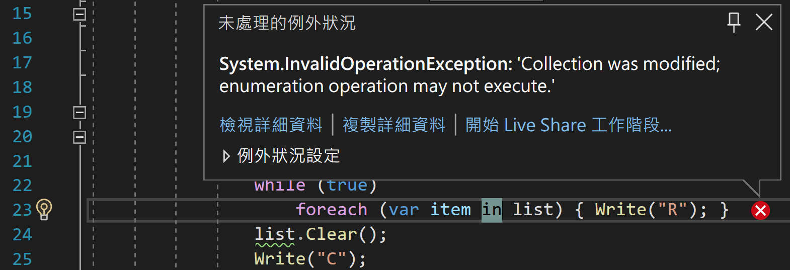
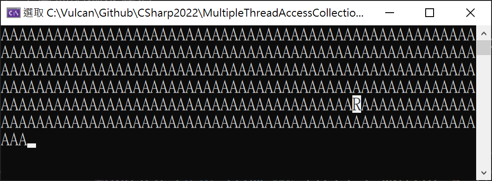
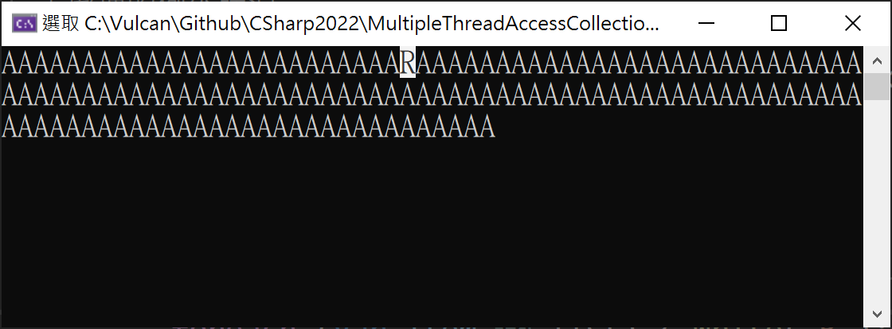
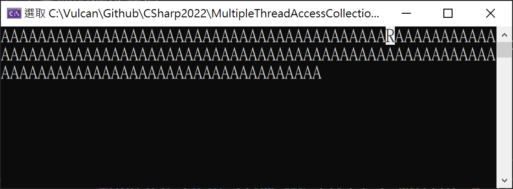

# 在多執行緒下分別對於的集合型別物件存取 - 使用 foreach 與 for

最近收到一份範例程式碼，如下所示

在這份程式碼中，將會看到在 Main 方法內，分別建立了兩個執行緒，第一個執行緒將會執行 Run1 方法，在此方法內將會執行 `while (true) { list.Add("A"); }` 敘述，應該是要表示這裡會不斷地加入新的物件到 List 這個集合物件內，而該 `List<string>` 集合物件將會是一個靜態資源，同時可以被這兩個執行緒來存取。

在第二個執行緒所指定的委派方法內，將會呼叫 Run2 這個方法，在其方法內將會執行這樣的程式碼 `while (true) { foreach (var item in list) { } list.Clear(); }` ，透過 foreach 來逐一存取這個 `List<string>` 集合物件內的每個字串，雖然，在迴圈內沒有執行其他額外程式碼，我的猜想這應該是要針對第一個執行緒所新增進來的集合物件內的個別項目，逐一進行處理，最後，在 foreach 迴圈之外，將會存取這個 `List<string>` 多執行緒下共享的集合物件資源，透過 Clear() 方法，將這個集合物件內的項目予以清除。

順便再來說明 Run3 這個方法 (雖然，在第二個執行緒內，呼叫 `Run3();` 的敘述被註解起來)，其程式碼為 `while (true) { for (int i = 0; i < list.Count; i++) { var b = list[i]; } list.Clear(); }` ，在這個無窮迴圈內，同樣的會使用 for 敘述來存取該集合物件內的每個項目，不過，多的一個將每個項目指定到一個區域變數內，不過，這樣的敘述，不影響整個問題，在離開迴圈之後，同樣的會清除該集合物件的所有項目。

提交這份範例程式碼的人提出一個疑問，當在第二個執行緒執行的時候，若呼叫 Run2 這個方法，將會產生例外異常，也就是使用 foreach 敘述，似乎無法在多執行緒運行，若將第二個執行緒內的要呼叫的方法改為 Run3 這個方法，將可以正常運作。

```csharp
namespace ConsoleApp5
{
    internal class Program
    {
        static List<string> list = new List<string>();
        static void Main(string[] args)
        {

            new Thread(() =>
            {
                Run1();
            })
            { IsBackground = true }.Start();
            new Thread(() =>
            {
                Run2();
                //Run3();
            })
            { IsBackground = true }.Start();

            Console.ReadKey();
        }


        static void Run1()
        {
            while (true)
            {
                list.Add("A");
            }
        }
        static void Run2()
        {
            while (true)
            {
                foreach (var item in list)
                {

                }
                list.Clear();
            }
        }

        static void Run3()
        {
            while (true)
            {
                for (int i = 0; i < list.Count; i++)
                {
                    var b = list[i];
                }
                list.Clear();
            }
        }
    }
}
```

為了方便解釋且不影響執行結果，在這裡把上述的程式碼改寫成為底下內容

底下程式碼除了做些簡化的工作，另外，對於在新增、讀取、清除這個共用集合物件的時候，同樣的會在螢幕上輸出相對應的 A、R、C 這樣的文字，有了這些輸出訊息文字，更可以觀察到一些問題與現象。

在這裡，同樣的還是先將 `#region 執行緒 3 ... #endregion` 之間的程式碼先註解起來。

```csharp
namespace MultipleThreadAccessCollection
{
    using static System.Console;

    internal class Program
    {
        static List<string> list = new List<string>();
        static void Main(string[] args)
        {
            #region 執行緒 1
            new Thread(() =>
            {
                while (true)
                { list.Add("A"); Write("A"); }
            })
            { IsBackground = true }.Start();
            #endregion

            #region 執行緒 2
            new Thread(() =>
            {
                while (true)
                    foreach (var item in list) { Write("R"); }
                list.Clear();
                Write("C");
            })
            { IsBackground = true }.Start();
            #endregion

            #region 執行緒 3
            //new Thread(() =>
            //{
            //    while (true)
            //        for (int i = 0; i < list.Count; i++)
            //        { var b = list[i]; Write("R"); }
            //    list.Clear();
            //    Write("C");
            //})
            //{ IsBackground = true }.Start();
            #endregion

            Console.ReadKey();
        }
    }
}
```

完成重新建構這個測試專案之後，便可以開始執行這個專案

很不幸的，不論執行幾次，都會遇到例外異常拋出，在 Visual Studio 工具內，將會看到這這樣的畫面



從 [未處理的例外狀況] 對話窗內容，可以看到現在遇到的問題將會是產生了一個 Collection was modified; enumeration operation may not execute 問題，從字面意義上來看，這應該是當在進行 foreach 敘述的時候，對於所提供的列舉集合，在此將是 `List<string>`，若這個 foreach 迴圈尚未完成的話，是不允許針對這個列舉集合物件進行項目的異動。

底下將會是這個例外異常的詳細說明內容

```
System.InvalidOperationException: Collection was modified; enumeration operation may not execute.
   at System.Collections.Generic.List`1.Enumerator.MoveNext()
   at MultipleThreadAccessCollection.Program.<>c.<Main>b__1_1() in C:\Vulcan\Github\CSharp2022\MultipleThreadAccessCollection\MultipleThreadAccessCollection\Program.cs:line 23
   at System.Threading.Thread.StartCallback()
```

現在來觀察執行結果，這裡將會截圖三次的執行結果，如下面圖片所示

從這些圖片可以看到，兩個執行緒確實都有在運作，對於第一個執行緒確實不斷的新增項目到集合物件內，但是，對於第二個執行緒而言，僅能夠第一個進行列舉讀取這個集合物件的項目(這裡有特別將 R 這個文字反白標示出來)，一旦要進行第二次讀取列舉集合物件內的項目時候，可以看出，因為第一個執行緒不斷的在新增新的項目，這時將導致集合物件內的項目數量增加了，因此，便會造成 foreach 敘述無法繼續運作下去。







現在將 `#region 執行緒 2 ... #endregion` 內的敘述註解起來，並且將 `#region 執行緒 3 ... #endregion` 內的所有程式碼解除註解


```csharp
namespace ConsoleApp6
{
    internal class Program
    {
        static List<string> list = new List<string>();
        static void Main(string[] args)
        {
            for (int i = 0; i < 100; i++)
            {
                list.Add("A");
            }
            ThreadPool.QueueUserWorkItem(_ =>
            {
                foreach (var item in list)
                {
                    Thread.Sleep(500);
                    Console.Write(".");
                }
                list.Clear();
            });

            Console.WriteLine("Press any key for continuing...");
            Console.ReadKey();

            for (int i = 0; i < 100; i++)
            {
                list.Add("A");
            }

            Console.WriteLine("Press any key for continuing...");
            Console.ReadKey();
        }
    }
}
```
