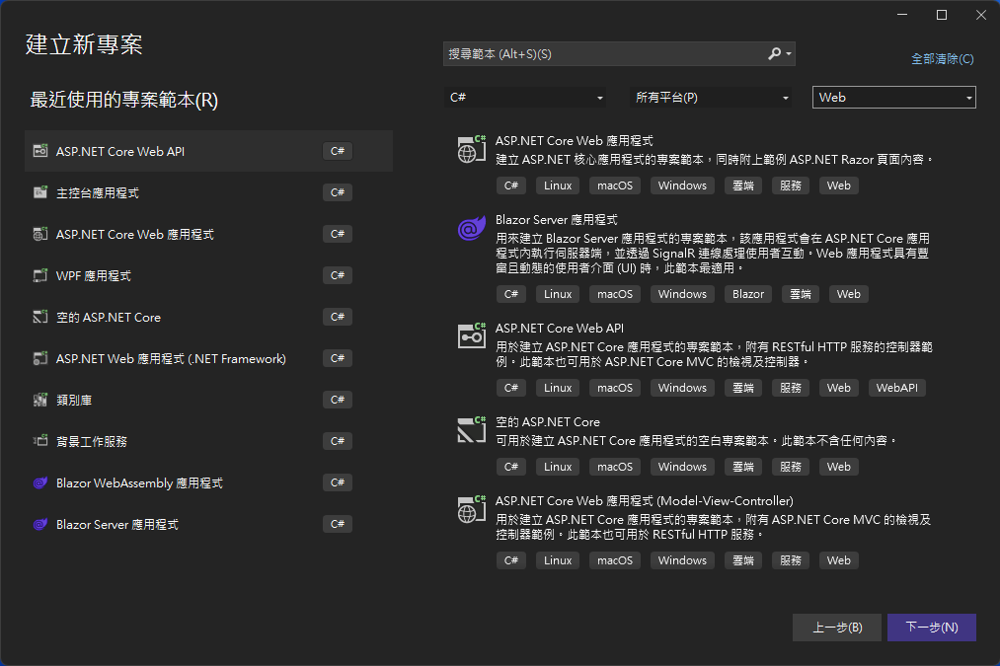
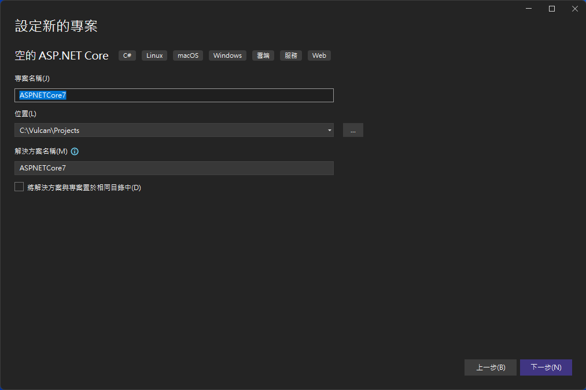
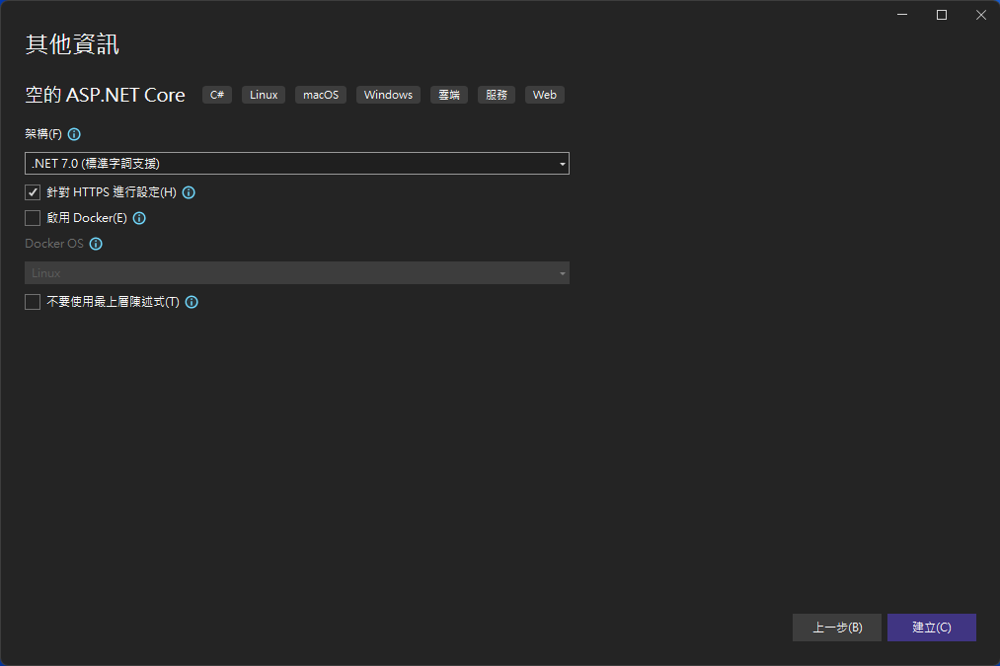
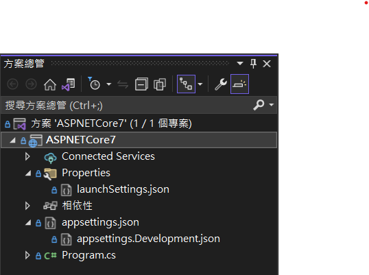
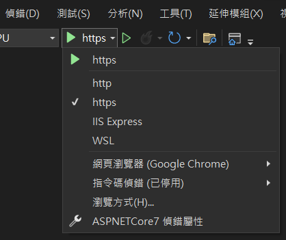
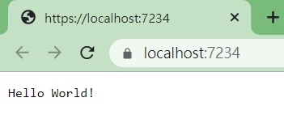

# 由 ASP.NET Core 空白專案範本來理解與學習 ASP.NET Core

在這個系列文章 由專案範本來理解與學習 ASP.NET Core 架構 中，將會透過 Visual Studio 2022 內建的幾個專案範本所產生的程式碼，了解 ASP.NET Core 7 的運作方式與在這些專案中的差異在哪裡？

* 1. 由 ASP.NET Core 空白專案範本來理解與學習 ASP.NET Core
* [2. 由 ASP.NET Core Web API 專案範本來理解與學習 ASP.NET Core](https://csharpkh.blogspot.com/2023/01/Learn-ASP-NET-Core7-From-Web-API-Project-Template)
* [3. 由 ASP.NET Core 應用程式 (Model-View-Controller) 專案範本來理解與學習 ASP.NET Core](https://csharpkh.blogspot.com/2023/01/Learn-ASP-NET-Core7-From-MVC-Project-Template)

對於更多關於 ASP.NET Core 7 的說明內容，可以參考 [ASP.NET Core 基本概念的概觀](https://learn.microsoft.com/zh-tw/aspnet/core/fundamentals/?view=aspnetcore-7.0&tabs=windows&WT.mc_id=DT-MVP-5002220)

首先先來建立一個 ASP.NET Core 空白專案，請依照底下說明來建立這個專案

* 打開 Visual Studio 2022 IDE 應用程式
* 從 [Visual Studio 2022] 對話窗中，點選右下方的 [建立新的專案] 按鈕
* 在 [建立新專案] 對話窗右半部
  * 切換 [所有語言 (L)] 下拉選單控制項為 [C#]
  * 切換 [所有專案類型 (T)] 下拉選單控制項為 [Web]
* 在中間的專案範本清單中，找到並且點選 [空的 ASP.NET Core] 專案範本選項

  

* 點選右下角的 [下一步] 按鈕
* 在 [設定新的專案] 對話窗
* 找到 [專案名稱] 欄位，輸入 `ASPNETCore7` 作為專案名稱
  
* 點選右下角的 [下一步] 按鈕
* 現在將會看到 [其他資訊] 對話窗
  
* 請點選右下角的 [建立] 按鈕

完成專案創建之後，將會看到 Visual Studio 2022 將這個新專案開啟，從 [方案總管] 視窗內，可以看到這個專案內所建立的檔案



首先，按下 F5 看看這個專案的執行結果會呈現甚麼樣貌

在 Visual Studio 2022 應用程式的上方，將會看到一個綠色三角形，請點選該綠色三角形右方的 白色 向下白色三角型，此時，將會彈出一個子功能表，從這裡可以選取要使用哪種方式來執行這個專案。

可以看到，預設會採用 HTTPS 方式來執行這個 Web 專案，當然也可以選擇第一個 http 項目，表示使用 HTTP 方式來執行這個專案，不論是哪個，都將會是採用 [ASP.NET Core 的 Kestrel 網頁伺服器](https://learn.microsoft.com/zh-tw/aspnet/core/fundamentals/servers/kestrel?view=aspnetcore-7.0&WT.mc_id=DT-MVP-5002220) 來啟動與執行這個網站，當然，也可以選擇 [IIS Express] 這個選項，透過 Windows 電腦中的 IIS Express 服務來運作這個網站。

在此，將會使用預設 https 方式來啟動此專案



一旦專案編譯、建置完成後，瀏覽器將會出現這個網頁

> 從上面剛剛提到的彈出功能表中，倒數第四項目，是可以選擇要採用哪種瀏覽器來執行這個網站網頁，因為沒有特別設定，從螢幕截圖可以看出，將會採用 Google Chrome 瀏覽器來開啟這個 ASP.NET Core 空白範本專案



在網頁上看出，這個網頁將採用 HTTPS 方式來連線到 Kestrel 網站服務，並且指定使用 7234 通訊埠來通訊；而從網頁上可以看到，僅有 `Hello World!` 這個文字。

## 從專案內容來理解為什麼會有這樣的執行結果

首先要看看 [Properties] 資料夾內的 [launchSettings.json] 檔案，這是一個 JSON 格式內容。

launchSettings.json 是用於制定 [在 ASP.NET Core 中使用多個環境](https://learn.microsoft.com/zh-tw/aspnet/core/fundamentals/environments?view=aspnetcore-7.0&WT.mc_id=DT-MVP-5002220) 運作的設定檔案

```json
{
  "iisSettings": {
    "windowsAuthentication": false,
    "anonymousAuthentication": true,
    "iisExpress": {
      "applicationUrl": "http://localhost:51976",
      "sslPort": 44358
    }
  },
  "profiles": {
    "http": {
      "commandName": "Project",
      "dotnetRunMessages": true,
      "launchBrowser": true,
      "applicationUrl": "http://localhost:5242",
      "environmentVariables": {
        "ASPNETCORE_ENVIRONMENT": "Development"
      }
    },
    "https": {
      "commandName": "Project",
      "dotnetRunMessages": true,
      "launchBrowser": true,
      "applicationUrl": "https://localhost:7234;http://localhost:5242",
      "environmentVariables": {
        "ASPNETCORE_ENVIRONMENT": "Development"
      }
    },
    "IIS Express": {
      "commandName": "IISExpress",
      "launchBrowser": true,
      "environmentVariables": {
        "ASPNETCORE_ENVIRONMENT": "Development"
      }
    }
  }
}
```

在這個 [iisSettings] 節點內，定義了 IIS Express 運作屬性，而在 [profiles] 內則會宣告可以有幾種啟動這個 Web 網站的方式，而且每個啟動方式可以指定不同參數

對於剛剛選擇的 https 執行模式，其啟動參數定義如下，將可以使用 https://localhost:7234 或者 http://localhost:5242 方式來連上這個專案網站，其中，因為 "ASPNETCORE_ENVIRONMENT": "Development" 設定值，將會強制環境參數為 Development，此時，將會影響到這個網站內的運作行為。

```json
"https": {
  "commandName": "Project",
  "dotnetRunMessages": true,
  "launchBrowser": true,
  "applicationUrl": "https://localhost:7234;http://localhost:5242",
  "environmentVariables": {
    "ASPNETCORE_ENVIRONMENT": "Development"
  }
}
```

接下來就是第二個檔案 appsettings.json ，這個檔案也是一個 JSON 格式內容，其預設檔案內容如下：

```json
{
  "Logging": {
    "LogLevel": {
      "Default": "Information",
      "Microsoft.AspNetCore": "Warning"
    }
  },
  "AllowedHosts": "*"
}
```

在 ASP.NET Core 7 中，將會提供 [ASP.NET Core 的設定](https://learn.microsoft.com/zh-tw/aspnet/core/fundamentals/configuration/?view=aspnetcore-7.0&WT.mc_id=DT-MVP-5002220) 功能，透過 [ASP.NET Core 的設定](https://learn.microsoft.com/zh-tw/aspnet/core/fundamentals/configuration/?view=aspnetcore-7.0&WT.mc_id=DT-MVP-5002220) 豐富能力，可以讓整個專案在設計與開發上更加有彈性。

最後一個就是這個專案的程式進入點，也就是這個 Web 網站的核心程式碼，這些程式碼將會在 [Program.cs] 檔案內，其內容如下：

```csharp
var builder = WebApplication.CreateBuilder(args);
var app = builder.Build();

app.MapGet("/", () => "Hello World!");

app.Run();
```

WebApplication.CreateBuilder 將會使用預先設定的預設值，建立一個 WebApplicationBuilder 執行個體，而這個專案可以透過型別為 WebApplicationBuilder 的 builder 物件，進行操作，例如，可以透過這個物件提供的 [WebApplicationBuilder.Services 屬性](https://learn.microsoft.com/zh-tw/dotnet/api/microsoft.aspnetcore.builder.webapplicationbuilder.services?view=aspnetcore-7.0&WT.mc_id=DT-MVP-5002220) 來進行相依性注入服務容器 或 稱之為 IoC 容器的相關服務註冊之用。

而對於 Configuration 屬性 將會要撰寫之應用程式的組態提供者集合

Environment 屬性 將 提供應用程式正在執行之 Web 主控環境的相關資訊

Host 屬性 將 無法修改，因為此唯讀屬性，若要在組態之後建置，請呼叫 Build() 方法

Logging 屬性 將 要撰寫之應用程式的記錄提供者集合

WebHost 屬性 將 用於設定伺服器特定屬性

因為這是一個相當簡單的 Web 專案，也就是空白專案，因此，將不會到  物件做任何操作，而是執行 `var app = builder.Build();` ，這樣就會產生一個型別為 WebApplication 物件，而將會透過 app 這個本地變數來存取。

對於 [WebApplication 類別](https://learn.microsoft.com/zh-tw/dotnet/api/microsoft.aspnetcore.builder.webapplication?view=aspnetcore-7.0&WT.mc_id=DT-MVP-5002220) 的物件，將會用來設定 HTTP 管線和路由的 Web 應用程式

app.MapGet 這個方法，將是提供 [最小 API](https://learn.microsoft.com/zh-tw/aspnet/core/fundamentals/minimal-apis?view=aspnetcore-7.0&WT.mc_id=DT-MVP-5002220) 模式來設計，並且透過這個方法可以宣告網站路由，從這個範例程式碼 `app.MapGet("/", () => "Hello World!");` 代表宣告一個網站首頁路由，一旦導航到個 "/" 路由，將會顯示 `Hello World!` 文字在網頁上。

到現在為止，應該可以知道，為什麼開啟這個網站，就會出現這段文字了吧！

最後一行程式碼 `app.Run()` 也就是執行應用程式並封鎖呼叫執行緒，直到主機關閉為止，此時，這個網站程式已經開始運作，可以讓使用者透過瀏覽器來進行各種互動；不過，因為這是一個相當精簡的專案，並沒有提供其他額外路由與功能。


