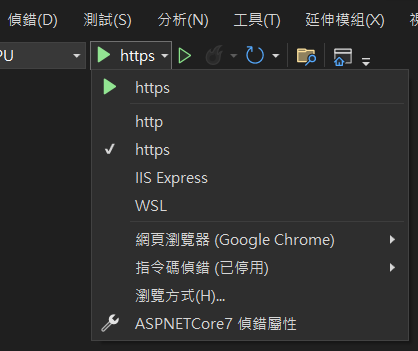
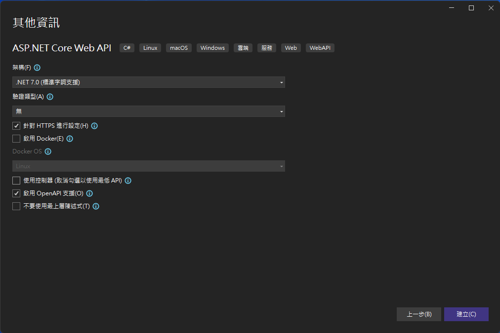

# 由 ASP.NET Core MVC (Model-View-Controller) 專案範本來理解與學習 ASP.NET Core

在這個系列文章 由專案範本來理解與學習 ASP.NET Core 架構 中，將會透過 Visual Studio 2022 內建的幾個專案範本所產生的程式碼，了解 ASP.NET Core 7 的運作方式與在這些專案中的差異在哪裡？

1. [ 由 ASP.NET Core 空白專案範本來理解與學習 ASP.NET Core](https://csharpkh.blogspot.com/2023/01/Learn-ASP-NET-Core7-From-Empty-Project-Template.html)
2. [由 ASP.NET Core Web API 專案範本來理解與學習 ASP.NET Core](https://csharpkh.blogspot.com/2023/01/Learn-ASP-NET-Core7-From-Web-API-Project-Template.html)
3. 由 ASP.NET Core 應用程式 (Model-View-Controller) 專案範本來理解與學習 ASP.NET Core

對於更多關於 ASP.NET Core 7 的說明內容，可以參考 [ASP.NET Core 基本概念的概觀](https://learn.microsoft.com/zh-tw/aspnet/core/fundamentals/?view=aspnetcore-7.0&tabs=windows&WT.mc_id=DT-MVP-5002220)

在上一篇文章中，使用 ASP.NET Core Web API 範本建立一個專案，並且從這個專案原始碼中，了解到 ASP.NET Core 的運作方式，並且，了解到 Web API 專案範本與 空白 專案範本的差異在哪裡，不過，透過 Web API 專案範本，卻可以提供這個 Web 網站具有 Web API 服務功能。

在這篇文章中，將會建立同樣名稱的專案，不過將會採用 ASP.NET Core Web 應用程式 (Model-View-Controller) 類型的專案範本，並且來比較這個 Web API 類型的專案與空白類型的專案有何不同。

首先先來建立一個 ASP.NET Core Web 應用程式 (Model-View-Controller) 專案，請依照底下說明來建立這個專案

* 打開 Visual Studio 2022 IDE 應用程式
* 從 [Visual Studio 2022] 對話窗中，點選右下方的 [建立新的專案] 按鈕
* 在 [建立新專案] 對話窗右半部
  * 切換 [所有語言 (L)] 下拉選單控制項為 [C#]
  * 切換 [所有專案類型 (T)] 下拉選單控制項為 [Web]
* 在中間的專案範本清單中，找到並且點選 [ASP.NET Core Web 應用程式 (Model-View-Controller)] 專案範本選項

  

* 點選右下角的 [下一步] 按鈕
* 在 [設定新的專案] 對話窗
* 找到 [專案名稱] 欄位，輸入 `ASPNETCore7` 作為專案名稱
  
* 點選右下角的 [下一步] 按鈕
* 現在將會看到 [其他資訊] 對話窗
* 找到 [使用控制器 (取消勾選已使用最低 API)] 檢查盒，注意，一定需要勾選這個選項，因為，在此先來觀察傳統的使用 API Controller 建立的專案長成甚麼樣子。
  
* 請點選右下角的 [建立] 按鈕

完成專案創建之後，將會看到 Visual Studio 2022 將這個新專案開啟，從 [方案總管] 視窗內，可以看到這個專案內所建立的檔案


首先，按下 F5 看看這個專案的執行結果會呈現甚麼樣貌

在 Visual Studio 2022 應用程式的上方，將會看到一個綠色三角形，請點選該綠色三角形來執行這個專案。



一旦專案編譯、建置完成後，瀏覽器將會出現這個網頁


在網頁上看出，並沒有像空白專案會顯示出 `Hello World!` 這個文字 或者 Web API 專案顯示出 Swagger 的網頁，這裡將會出現一個採用 MVC 開發框架所設計出來的網頁內容，接下來透過程式碼內容，來理解為什麼可以生成這樣的網頁內容。

## 從專案內容來理解為什麼會有這樣的執行結果

先來看一下 ASP.NET Core Web 應用程式 (Model-View-Controller) 專案的專案定義宣告檔案，也就是 [.csproj]。

可以透過直接點擊方案總管內的專案名稱節點，也就是 [ASPNETCore7] 或者 使用檔案總管找到 [ASPNETCore7.csproj] 這個檔案，便可以看到關於這個專案的定義宣告檔案。

底下的將會是空白專案的 [.csproj] 檔案內容

```xml
<Project Sdk="Microsoft.NET.Sdk.Web">

  <PropertyGroup>
    <TargetFramework>net7.0</TargetFramework>
    <Nullable>enable</Nullable>
    <ImplicitUsings>enable</ImplicitUsings>
  </PropertyGroup>

</Project>
```

這裡可以看到此專案定義宣告檔案，將會與 空白 專案所用到相同，都是採用 [Microsoft.NET.Sdk.Web] 這個 SDK，並且將會採用 .NET7 作為目的框架。既然都是相同，在這裡的專案可以使用 MVC 方式進行開發與顯示出更加豐富的網頁，這樣是怎麼做到的呢？

對於 [Properties] 資料夾內的 [launchSettings.json] 檔案 與 [appsettings.json] 這兩個檔案，其實與空白專案內的用法與意義是相同的。

接下來要來比較程式進入點差異，也就是這個 Web 網站的核心程式碼，這些程式碼將會在 [Program.cs] 檔案內，其內容如下：

```csharp
var builder = WebApplication.CreateBuilder(args);

// Add services to the container.
builder.Services.AddControllersWithViews();

var app = builder.Build();

// Configure the HTTP request pipeline.
if (!app.Environment.IsDevelopment())
{
    app.UseExceptionHandler("/Home/Error");
    // The default HSTS value is 30 days. You may want to change this for production scenarios, see https://aka.ms/aspnetcore-hsts.
    app.UseHsts();
}

app.UseHttpsRedirection();
app.UseStaticFiles();

app.UseRouting();

app.UseAuthorization();

app.MapControllerRoute(
    name: "default",
    pattern: "{controller=Home}/{action=Index}/{id?}");

app.Run();
```

從 Web 應用程式 (Model-View-Controller) 專案內產生的 [Program.cs] 檔案，同樣的使用 `var builder = WebApplication.CreateBuilder(args);` 敘述來建立一個 [WebApplicationBuilder] 型別物件到 [builder] 變數內。

在 Web 應用程式 (Model-View-Controller) 專案內，對於這個 builder 並沒有做其他的呼叫，僅呼叫 `builder.Build()` 方法，取得一個型別為 [WebApplication] 物件到 [app] 變數內`,也就是說，這裡沒有明確地進行要進行各種服務註冊到相依性注入容器內。

接下來就是要進行管道與中介軟體 Middleware 的宣告

`builder.Services.AddEndpointsApiExplorer()` ： 讓 Swagger 產生關於 Minimal APIs 資訊

`builder.Services.AddSwaggerGen()` ： 提供 API 資訊與描述，可以顯示在 Swagger 頁面上

接下來就是相關中介軟體 Middleware 的宣告

`if (app.Environment.IsDevelopment()){ ... }` ： 這裡將會使用 Environment 環境物件來查看，現在是否為開發環境下，若為真，則可以使用 Swagger 的 Web 網頁

`app.UseSwagger()` ： 新增 Swagger 中介軟體

`app.UseSwaggerUI()` ： 會啟用 Swagger 會使用到的靜態檔案中介軟體

`app.UseHttpsRedirection()` ： 將 HTTP 要求重新導向至 HTTPS

`app.UseAuthorization()` ： 授權中介軟可授權使用者存取安全資源

`app.MapControllers()` ： 對應屬性路由控制器

`app.Run()` ： 執行應用程式並封鎖呼叫執行緒，直到主機關閉為止

以上的內將會是採用 [使用控制器 (取消勾選已使用最低 API)] 模式來建立這個 Web API 專案，不過，若是在建立 Web API 專案過程中，在 [其他資訊] 視窗下方找到 [使用控制器 (取消勾選已使用最低 API)] 檢查盒，不要勾選這個選項



若想要觀察採用 [最小 API] 方式所建立的 Web API 專案長成甚麼樣子，請重新建立一個 Web API 專案，在 [其他資訊] 視窗下方找到 [使用控制器 (取消勾選已使用最低 API)] 檢查盒，不要勾選這個選項，這樣就會使用 [最小 API] 方式來建立 Web API 專案。

底下螢幕截圖，將會是採用 [最小 API] 模式建立的 Web API 專案所有檔案內容，原則上與 空白 專案的檔案幾乎是相同的。


不過，當打開 [Program.cs] 檔案後，會看底下內容

```csharp
var builder = WebApplication.CreateBuilder(args);

// Add services to the container.
// Learn more about configuring Swagger/OpenAPI at https://aka.ms/aspnetcore/swashbuckle
builder.Services.AddEndpointsApiExplorer();
builder.Services.AddSwaggerGen();

var app = builder.Build();

// Configure the HTTP request pipeline.
if (app.Environment.IsDevelopment())
{
    app.UseSwagger();
    app.UseSwaggerUI();
}

app.UseHttpsRedirection();

var summaries = new[]
{
    "Freezing", "Bracing", "Chilly", "Cool", "Mild", "Warm", "Balmy", "Hot", "Sweltering", "Scorching"
};

app.MapGet("/weatherforecast", () =>
{
    var forecast = Enumerable.Range(1, 5).Select(index =>
        new WeatherForecast
        (
            DateOnly.FromDateTime(DateTime.Now.AddDays(index)),
            Random.Shared.Next(-20, 55),
            summaries[Random.Shared.Next(summaries.Length)]
        ))
        .ToArray();
    return forecast;
})
.WithName("GetWeatherForecast")
.WithOpenApi();

app.Run();

internal record WeatherForecast(DateOnly Date, int TemperatureC, string? Summary)
{
    public int TemperatureF => 32 + (int)(TemperatureC / 0.5556);
}
```

在此，可以比較有使用 控制器 的專案，其實就可以知道，就是把所有的程式碼(控制器、資料模型等等)，全部都寫在同一個類別檔案內。

最後，在 [Controllers] 資料夾內有 [WeatherForecastController.cs] 檔案，這個檔案內容如下：

```csharp
using Microsoft.AspNetCore.Mvc;

namespace ASPNETCore7.Controllers
{
    [ApiController]
    [Route("[controller]")]
    public class WeatherForecastController : ControllerBase
    {
        private static readonly string[] Summaries = new[]
        {
        "Freezing", "Bracing", "Chilly", "Cool", "Mild", "Warm", "Balmy", "Hot", "Sweltering", "Scorching"
    };

        private readonly ILogger<WeatherForecastController> _logger;

        public WeatherForecastController(ILogger<WeatherForecastController> logger)
        {
            _logger = logger;
        }

        [HttpGet(Name = "GetWeatherForecast")]
        public IEnumerable<WeatherForecast> Get()
        {
            return Enumerable.Range(1, 5).Select(index => new WeatherForecast
            {
                Date = DateOnly.FromDateTime(DateTime.Now.AddDays(index)),
                TemperatureC = Random.Shared.Next(-20, 55),
                Summary = Summaries[Random.Shared.Next(Summaries.Length)]
            })
            .ToArray();
        }
    }
}
```

這個檔案內有個 [WeatherForecastController] 控制器類別，透過 `[ApiController]` 屬性標示，註明這是個 API 控制器

其中這個控制器內使用到的類別 WeatherForecast ，將會定義在 [WeatherForecast.cs] 檔案內

