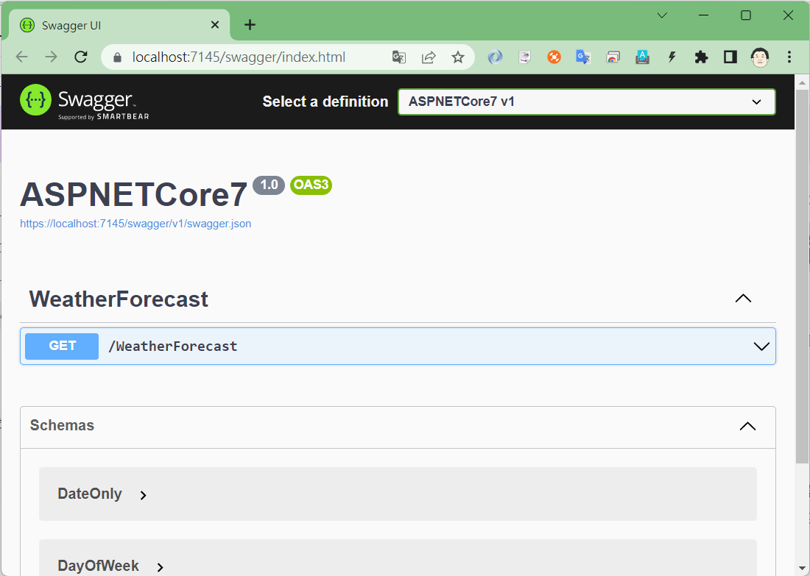

# 由 ASP.NET Core Web API 專案範本來理解與學習 ASP.NET Core

在這個系列文章 由專案範本來理解與學習 ASP.NET Core 架構 中，將會透過 Visual Studio 2022 內建的幾個專案範本所產生的程式碼，了解 ASP.NET Core 7 的運作方式與在這些專案中的差異在哪裡？

* [1. 由 ASP.NET Core 空白專案範本來理解與學習 ASP.NET Core](https://csharpkh.blogspot.com/2023/01/Learn-ASP-NET-Core7-From-Empty-Project-Template.html)
* 2. 由 ASP.NET Core Web API 專案範本來理解與學習 ASP.NET Core
* [3. 由 ASP.NET Core 應用程式 (Model-View-Controller) 專案範本來理解與學習 ASP.NET Core](https://csharpkh.blogspot.com/2023/01/Learn-ASP-NET-Core7-From-MVC-Project-Template)

對於更多關於 ASP.NET Core 7 的說明內容，可以參考 [ASP.NET Core 基本概念的概觀](https://learn.microsoft.com/zh-tw/aspnet/core/fundamentals/?view=aspnetcore-7.0&tabs=windows&WT.mc_id=DT-MVP-5002220)

在上一篇文章中，使用 ASP.NET Core 空白範本建立一個專案，並且從這個專案原始碼中，了解到 ASP.NET Core 的運作方式，首先使用 WebApplication.CreateBuilder 將會建立一個 WebApplicationBuilder 執行個體，接著執行 `var app = builder.Build();` ，這樣就會產生一個型別為 WebApplication 物件，最後執行 `app.Run()` ，這樣這個 Web 應用程式就會啟動了，可以接收來自於使用者的請求。

在這篇文章中，將會建立同樣名稱的專案，不過將會採用 ASP.NET Core Web API 類型的專案範本，並且來比較這個 Web API 類型的專案與空白類型的專案有何不同。

首先先來建立一個 ASP.NET Core Web API 專案，請依照底下說明來建立這個專案

* 打開 Visual Studio 2022 IDE 應用程式
* 從 [Visual Studio 2022] 對話窗中，點選右下方的 [建立新的專案] 按鈕
* 在 [建立新專案] 對話窗右半部
  * 切換 [所有語言 (L)] 下拉選單控制項為 [C#]
  * 切換 [所有專案類型 (T)] 下拉選單控制項為 [Web]
* 在中間的專案範本清單中，找到並且點選 [ASP.NET Core Web API] 專案範本選項

  

* 點選右下角的 [下一步] 按鈕
* 在 [設定新的專案] 對話窗
* 找到 [專案名稱] 欄位，輸入 `ASPNETCore7` 作為專案名稱
  
* 點選右下角的 [下一步] 按鈕
* 現在將會看到 [其他資訊] 對話窗
* 找到 [使用控制器 (取消勾選已使用最低 API)] 檢查盒，注意，一定需要勾選這個選項，因為，在此先來觀察傳統的使用 API Controller 建立的專案長成甚麼樣子。
  
* 請點選右下角的 [建立] 按鈕

完成專案創建之後，將會看到 Visual Studio 2022 將這個新專案開啟，從 [方案總管] 視窗內，可以看到這個專案內所建立的檔案


首先，按下 F5 看看這個專案的執行結果會呈現甚麼樣貌

在 Visual Studio 2022 應用程式的上方，將會看到一個綠色三角形，請點選該綠色三角形來執行這個專案。


一旦專案編譯、建置完成後，瀏覽器將會出現這個網頁



在網頁上看出，並沒有如同上一個空白專案會顯示出 `Hello World!` 這個文字，而是出現一個標題為 [Swagger UI] 的網頁內容，而更多關於 Swagger 的內容，可以參考 [Swashbuckle 與 ASP.NET Core 使用者入門](https://learn.microsoft.com/zh-tw/aspnet/core/tutorials/getting-started-with-swashbuckle?view=aspnetcore-7.0&tabs=visual-studio&WT.mc_id=DT-MVP-5002220)。

## 從專案內容來理解為什麼會有這樣的執行結果

在方案總管視窗內，將會看到這個 Web API 專案所產生出來的內容，將會多了一個 [Controllers] 資料夾，該資料夾內會有一個 [WeatherForecastController.cs] 檔案；另外，在專案的根目錄下，也產生了一個 [WeatherForecast.cs] 檔案。

也許會覺得很奇怪，只是多的這兩個檔案，就可以讓原本單純的 ASP.NET Core 空白專案，變成一個 ASP.NET Core Web API 專案，而且出來的畫面也會有所不同，接下來就來探討究竟發生了甚麼事情。

對於 [Properties] 資料夾內的 [launchSettings.json] 檔案 與 [appsettings.json] 這兩個檔案，其實與空白專案內的用法與意義是相同的。

不過，需要先來看一下 空白 與 Web API 這兩個專案的專案定義宣告檔案，也就是 [.csproj]。

可以透過直接點擊方案總管內的專案名稱節點，也就是 [ASPNETCore7] 或者 使用檔案總管找到 [ASPNETCore7.csproj] 這個檔案，便可以看到關於這個專案的定義宣告檔案。

底下的將會是空白專案的 [.csproj] 檔案內容

```xml
<Project Sdk="Microsoft.NET.Sdk.Web">

  <PropertyGroup>
    <TargetFramework>net7.0</TargetFramework>
    <Nullable>enable</Nullable>
    <ImplicitUsings>enable</ImplicitUsings>
  </PropertyGroup>

</Project>
```

這裡可以看到，這個 空白 專案，將會採用 [Microsoft.NET.Sdk.Web] 這個 SDK，並且將會採用 .NET7 作為目的框架。

底下的將會是 Web API 專案的 [.csproj] 檔案內容

```xml
<Project Sdk="Microsoft.NET.Sdk.Web">

  <PropertyGroup>
    <TargetFramework>net7.0</TargetFramework>
    <Nullable>enable</Nullable>
    <ImplicitUsings>enable</ImplicitUsings>
  </PropertyGroup>

  <ItemGroup>
    <PackageReference Include="Microsoft.AspNetCore.OpenApi" Version="7.0.1" />
    <PackageReference Include="Swashbuckle.AspNetCore" Version="6.4.0" />
  </ItemGroup>

</Project>
```

這個 Web API 專案，同樣的採用 [Microsoft.NET.Sdk.Web] 這個 SDK，與採用 .NET7 作為目的框架。

從 Web API 專案的 .csproj 檔案內，可以看到這個專案加入了兩個 NuGet 套件 [Microsoft.AspNetCore.OpenApi] 、 [Swashbuckle.AspNetCore] ，這兩個套件將會提供剛剛看到的 Swagger UI 網頁內容。

了解完第一個差異點，接下來要來比較程式進入點差異，也就是這個 Web 網站的核心程式碼，這些程式碼將會在 [Program.cs] 檔案內，其內容如下：

```csharp
var builder = WebApplication.CreateBuilder(args);

// Add services to the container.

builder.Services.AddControllers();
// Learn more about configuring Swagger/OpenAPI at https://aka.ms/aspnetcore/swashbuckle
builder.Services.AddEndpointsApiExplorer();
builder.Services.AddSwaggerGen();

var app = builder.Build();

// Configure the HTTP request pipeline.
if (app.Environment.IsDevelopment())
{
    app.UseSwagger();
    app.UseSwaggerUI();
}

app.UseHttpsRedirection();

app.UseAuthorization();

app.MapControllers();

app.Run();
```

從 Web API 專案內產生的 [Program.cs] 檔案，同樣的使用 `var builder = WebApplication.CreateBuilder(args);` 敘述來建立一個 [WebApplicationBuilder] 型別物件到 [builder] 變數內。

在 空白 專案內，對於這個 builder 並沒有做其他的呼叫，僅呼叫 `builder.Build()` 方法，取得一個型別為 [WebApplication] 物件到 [app] 變數內。

不過，在 Web API 專案內，將會透過 [WebApplicationBuilder] 類別提供的 [Services] 屬性，進行會使用到的服務註冊到相依性注入容器 (IoC 容器) 內，如此，其他的服務便可以透過建構式注入的方式，來取得這些宣告在 DI Dependency Injection 容器內的服務，進而做到程式碼間鬆散耦合設計需求。

第一個 [builder] 物件呼叫的方法將會是 `builder.Services.AddControllers();` ，這裡將會是將控制器的服務加入至指定的 IServiceCollection 。 這個方法不會註冊用於檢視或頁面的服務。

`builder.Services.AddEndpointsApiExplorer()` ： 讓 Swagger 產生關於 Minimal APIs 資訊

`builder.Services.AddSwaggerGen()` ： 提供 API 資訊與描述，可以顯示在 Swagger 頁面上

接下來就是相關中介軟體 Middleware 的宣告

`if (app.Environment.IsDevelopment()){ ... }` ： 這裡將會使用 Environment 環境物件來查看，現在是否為開發環境下，若為真，則可以使用 Swagger 的 Web 網頁

`app.UseSwagger()` ： 新增 Swagger 中介軟體

`app.UseSwaggerUI()` ： 會啟用 Swagger 會使用到的靜態檔案中介軟體

`app.UseHttpsRedirection()` ： 將 HTTP 要求重新導向至 HTTPS

`app.UseAuthorization()` ： 授權中介軟可授權使用者存取安全資源

`app.MapControllers()` ： 對應屬性路由控制器

`app.Run()` ： 執行應用程式並封鎖呼叫執行緒，直到主機關閉為止

以上的內將會是採用 [使用控制器 (取消勾選已使用最低 API)] 模式來建立這個 Web API 專案，不過，若是在建立 Web API 專案過程中，在 [其他資訊] 視窗下方找到 [使用控制器 (取消勾選已使用最低 API)] 檢查盒，不要勾選這個選項


若想要觀察採用 [最小 API] 方式所建立的 Web API 專案長成甚麼樣子，請重新建立一個 Web API 專案，在 [其他資訊] 視窗下方找到 [使用控制器 (取消勾選已使用最低 API)] 檢查盒，不要勾選這個選項，這樣就會使用 [最小 API] 方式來建立 Web API 專案。

底下螢幕截圖，將會是採用 [最小 API] 模式建立的 Web API 專案所有檔案內容，原則上與 空白 專案的檔案幾乎是相同的。


不過，當打開 [Program.cs] 檔案後，會看底下內容

```csharp
var builder = WebApplication.CreateBuilder(args);

// Add services to the container.
// Learn more about configuring Swagger/OpenAPI at https://aka.ms/aspnetcore/swashbuckle
builder.Services.AddEndpointsApiExplorer();
builder.Services.AddSwaggerGen();

var app = builder.Build();

// Configure the HTTP request pipeline.
if (app.Environment.IsDevelopment())
{
    app.UseSwagger();
    app.UseSwaggerUI();
}

app.UseHttpsRedirection();

var summaries = new[]
{
    "Freezing", "Bracing", "Chilly", "Cool", "Mild", "Warm", "Balmy", "Hot", "Sweltering", "Scorching"
};

app.MapGet("/weatherforecast", () =>
{
    var forecast = Enumerable.Range(1, 5).Select(index =>
        new WeatherForecast
        (
            DateOnly.FromDateTime(DateTime.Now.AddDays(index)),
            Random.Shared.Next(-20, 55),
            summaries[Random.Shared.Next(summaries.Length)]
        ))
        .ToArray();
    return forecast;
})
.WithName("GetWeatherForecast")
.WithOpenApi();

app.Run();

internal record WeatherForecast(DateOnly Date, int TemperatureC, string? Summary)
{
    public int TemperatureF => 32 + (int)(TemperatureC / 0.5556);
}
```

在此，可以比較有使用 控制器 的專案，其實就可以知道，就是把所有的程式碼(控制器、資料模型等等)，全部都寫在同一個類別檔案內。

最後，在 [Controllers] 資料夾內有 [WeatherForecastController.cs] 檔案，這個檔案內容如下：

```csharp
using Microsoft.AspNetCore.Mvc;

namespace ASPNETCore7.Controllers
{
    [ApiController]
    [Route("[controller]")]
    public class WeatherForecastController : ControllerBase
    {
        private static readonly string[] Summaries = new[]
        {
        "Freezing", "Bracing", "Chilly", "Cool", "Mild", "Warm", "Balmy", "Hot", "Sweltering", "Scorching"
    };

        private readonly ILogger<WeatherForecastController> _logger;

        public WeatherForecastController(ILogger<WeatherForecastController> logger)
        {
            _logger = logger;
        }

        [HttpGet(Name = "GetWeatherForecast")]
        public IEnumerable<WeatherForecast> Get()
        {
            return Enumerable.Range(1, 5).Select(index => new WeatherForecast
            {
                Date = DateOnly.FromDateTime(DateTime.Now.AddDays(index)),
                TemperatureC = Random.Shared.Next(-20, 55),
                Summary = Summaries[Random.Shared.Next(Summaries.Length)]
            })
            .ToArray();
        }
    }
}
```

這個檔案內有個 [WeatherForecastController] 控制器類別，透過 `[ApiController]` 屬性標示，註明這是個 API 控制器

其中這個控制器內使用到的類別 WeatherForecast ，將會定義在 [WeatherForecast.cs] 檔案內

