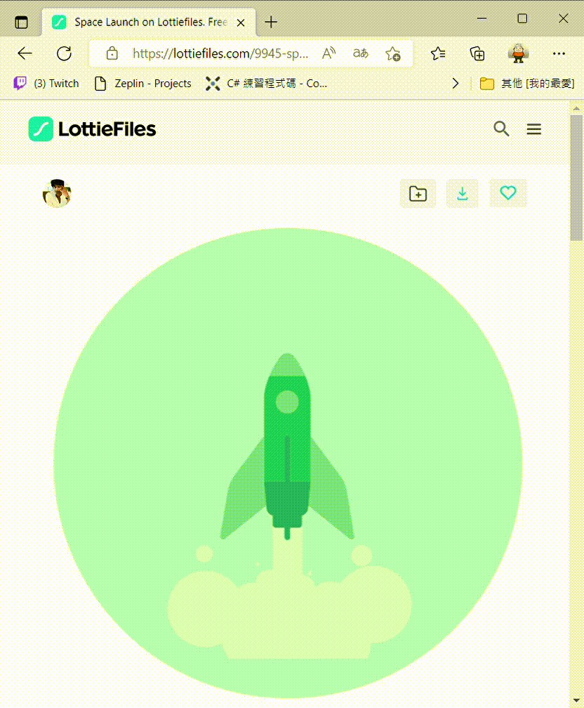

# 在 WPF 上建立與使用 Lottie 來設計出具有動畫效果

之前有寫過一篇 [建立與使用 Lottie 來設計出具有動畫效果的 App](https://csharpkh.blogspot.com/2022/07/Lottie-Anaimation-JSON-MAUI-Resource.html) 文章，說明如何在 .NET MAUI 專案中，使用 Lottie 檔案，產生出具有動畫效果的應用程式，這兩天聽到有個 WPF 上有這樣類似的需求，就想說是否可以在 WPF 上也能夠做出這樣的效果呢？

抱持這這樣的疑問，便開始先在網路進行搜尋，想要在 WPF 下來使用 Lottie 這樣機制的時候，究竟要使用哪個套件比較好，姊果發現到，現在可以找到的 Lottie 套件僅能夠在 .NET 5 以上的環境上運作。

而甚麼事 Lottie 呢？這是在 2015 年之後才出現的一個功能，根據維基百科上的描述可以得到這方面的說明

> Lottie is a file format for vectorial animation, and is named after Charlotte Reiniger, a German pioneer of silhouette animation.

在這個 [https://lottiefiles.com/](https://lottiefiles.com/) 網站上，可以看到種 Lottie 做出的動畫效果，而且可以下載到相當多的動畫 JSON 檔案


現在將來嘗試在 WPF 專案下，透過隨便下載的 Lottie JSON 檔案，將這個動畫能夠在 WPF 應用程式下來運行

## 建立 WPF 專案

* 開啟 Visual Studio 2022 開發工具

* 當 [Visual Studio 2022] 對話窗出現的時候
* 點選右下角的 [建立新的專案] 按鈕選項
* 現在將看到 [建立新專案] 對話窗
* 切換右上角的 [所有專案類型] 下拉選單控制項
* 找到並且點選 [桌面] 這個選項
* 從清單中找到並選擇 [WPF 應用程式] 這個專案範本 (記得要選擇使用 C# 程式語言)

  > 此專案可用於建立 .NET WPF 應用程式

* 點選右下角的 [下一步] 按鈕
* 此時將會看到 [設定新的專案] 對話窗
* 在 [專案名稱] 欄位，輸入 `wpfLottie`
* 點選右下角的 [下一步] 按鈕
* 最後會看到 [其他資訊] 對話窗
* 使用預設設定值，也就是 [架構] 為 [.NET 6.0 (長期支援)]
* 點選右下角的 [建立] 按鈕

## 加入 LottieSharp 的 NuGet 套件

* 滑鼠右擊該專案的 [相依性] 節點
* 從彈出功能表中選擇 [管理 NuGet 套件] 功能選項
* 此時，[NuGet: wpfLottie] 視窗將會出現
* 點選 [瀏覽] 標籤頁次
* 在左上方的搜尋文字輸入盒內輸入 `LottieSharp` 關鍵字
* 若你沒有看到 8.0 以上的版本，請勾選 [包括搶鮮版] 檢查盒控制項
* 現在，將會看到 LottieSharp 套件出現在清單內
* 點選這個 LottieSharp 套件，並且點選右上方的 [安裝] 按鈕，安裝這個套件到這個專案內。

## 下載與複製 Lottie 檔案道專案內

* 這裡將會從 [https://lottiefiles.com](https://lottiefiles.com) 網站內搜尋任何一個 Lottie 動畫
* 在此將會使用這個 [https://lottiefiles.com/9945-space-launch](https://lottiefiles.com/9945-space-launch) 連結的 Lottie 做為測試範例



* 下載完成後的檔案名稱將會為 [9945-space-launch.json]
* 透過檔案總管拖拉這個檔案到剛剛建立的 WPF 專案根目錄下
* 在方案總管點選這個檔案
* 在 [屬性] 視窗內
* 設定 [建置動作] 的屬性值為 [永遠複製]

## 設計使用 Lottie 元件的視窗

* 打開 [MainWindow.xaml] 檔案
* 將底下 XAML 宣告標記覆蓋掉這個檔案的內容

```xml
<Window x:Class="wpfLottie.MainWindow"
        xmlns="http://schemas.microsoft.com/winfx/2006/xaml/presentation"
        xmlns:x="http://schemas.microsoft.com/winfx/2006/xaml"
        xmlns:d="http://schemas.microsoft.com/expression/blend/2008"
        xmlns:mc="http://schemas.openxmlformats.org/markup-compatibility/2006"
         xmlns:lottie="clr-namespace:LottieSharp.WPF;assembly=LottieSharp"
       xmlns:local="clr-namespace:wpfLottie"
        mc:Ignorable="d"
        Title="Lottie 在 WPF 上的使用範例" Height="450" Width="800">
    <Grid>
        <lottie:LottieAnimationView
    Width="200"
    Height="300"
    HorizontalAlignment="Center"
    VerticalAlignment="Center"
    AutoPlay="True"
    FileName="9945-space-launch.json"
    RepeatCount="-1" />
    </Grid>
</Window>
```

## 啟動與執行

* 底下會是執行後的運作畫面


