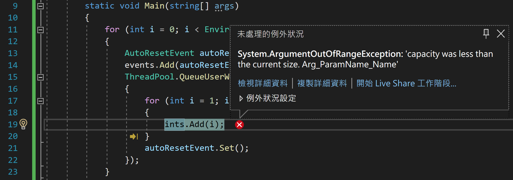

# 在進行多執行緒程式設計下， 若存取 List<int> 共用資源，是否會具有執行緒安全的特性呢？

執行緒安全這個議題，在進行多執行緒程式設計下，是個相當棘手與難處理的問題，很多情況下，是來自於開發者人類本身的思維，畢竟，我們人的思考並不是以平行方式來評量的，很多人同一個時間，畢竟僅能夠做一件事情。

這篇文章中，將要來說明一個多執行緒程式設計下常遇到的問題，那就是很多執行緒當要存取共用資源物件的時候，在這裡使用的靜態物件，該共用存取物件不具備 [執行緒安全 Thread Safety] 特性，就會造成執行結果是無法預期的，也就是說，每次執行結果都是不同的。

底下的範例，將會設計共用存取資源為 [List<T>](https://docs.microsoft.com/zh-tw/dotnet/api/system.collections.generic.list-1?WT.mc_id=DT-MVP-5002220)

```csharp
namespace Multiple_Thread_Using_List_Type_Is_Thread_Safety
{
    internal class Program
    {
        static int MaxCount = 2000;
        static int ThreadCount = Environment.ProcessorCount;
        static List<int> ints = new List<int>();
        static List<AutoResetEvent> events = new List<AutoResetEvent>();
        static void Main(string[] args)
        {
            for (int i = 0; i < Environment.ProcessorCount; i++)
            {
                AutoResetEvent autoResetEvent = new AutoResetEvent(false);
                events.Add(autoResetEvent);
                ThreadPool.QueueUserWorkItem(_ =>
                {
                    for (int i = 1; i <= MaxCount; i++)
                    {
                        ints.Add(i);
                    }
                    autoResetEvent.Set();
                });
            }

            WaitHandle.WaitAll(events.ToArray());

            var groupInts = ints.GroupBy(x => x)
                 .Select(x => new { Number = x.Key, Count = x.Count() })
                 .OrderBy(x => x.Count);

            //foreach (var item in groupInts)
            //{
            //    Console.WriteLine($"{item.Number} = {item.Count}");
            //}

            var groupByCount = groupInts
                .GroupBy(x => x.Count)
                .Select(x => new { Count = x.Key, Times = x.Count() })
                .OrderBy(x => x.Count);

            foreach (var item in groupByCount)
            {
                Console.WriteLine($"{item.Count} = {item.Times}");
            }
        }
    }
}
```

首先，將會透過執行緒集區取得這台電腦邏輯處理器數量的執行緒，在這些在這些執行緒內，都做同一件事情，那就是進行一個 2000 次的迴圈，並且把當時迴圈內的索引值，加入到這個 `List<int>` 靜態共用資源內，最後將會進行統計出，同樣的數值整數出現過幾次，理論上(在我的電腦上，邏輯處理器的數量為 8)，應該要看到 1~2000 這些數值，在 `List<int>` 這個集合物件內，每個數值都會看到有 8 次出現。

幻想是美麗的，現實是殘酷的，底下是這段程式碼的執行結果

多執行幾次，將會看到類似底下的不同結果顯示在螢幕上

```
1 = 1
2 = 6
3 = 64
4 = 396
5 = 862
6 = 672
```

```
2 = 32
3 = 332
4 = 426
5 = 719
6 = 293
7 = 189
8 = 9
13 = 1
```

身為程式開發者應該都是相當的聰明的，你可以想像到發生了什麼問題嗎？

沒錯，因為在多執行緒的環境下，造成了沒有執行緒安全現象，導致這個程式的執行結果是不可預期的

首先，在 [List<T>](https://docs.microsoft.com/zh-tw/dotnet/api/system.collections.generic.list-1?WT.mc_id=DT-MVP-5002220) 文件中可以看到底下這句話

```
執行緒安全性
此類型Visual Basic) 成員中的公用靜態 (Shared 是安全線程。 並非所有的執行個體成員都是安全執行緒。

在 上 List<T> 執行多個讀取作業是安全的，但如果正在讀取集合時修改集合，可能會發生問題。 為了確保執行緒安全，請在讀取或寫入作業期間鎖定集合。 若要讓多個執行緒存取集合以進行讀取和寫入，您必須實作自己的同步處理。 如需具有內建同步處理的集合，請參閱 命名空間中的 System.Collections.Concurrent 類別。 如需原本就安全線程的替代方法，請參閱 類別 ImmutableList<T> 。
```

很清楚的看出，因為這裡的共用資源(每個執行緒都要存取的物件)型別為 `List<T>` ，若產生這個型別出來的物件，並不是每個成員都是執行緒安全的，所以，使用這個型別的執行個體在多執行緒環境下來運行，當然會造成每次的執行結果是無法預期的。

> ## 提示
>
> 會發生不具有執行緒安全情況，是因為多執行緒彼此間發生了競賽條件所產生的，這是在計算機運行中一定會發生的，因此，需要特別進行設計，避免這些問題。

在非常渺茫的機會中，可能會看到期望中的執行結果，若你可以執行出來這樣的結果，那就表示你現在的手氣相當的好

```
8 = 2000
```

在執行過程中，多執行幾次，將會有遇到這樣的例外異常的機會



```
Unhandled exception. System.ArgumentOutOfRangeException: capacity was less than the current size. (Parameter 'value')
   at System.Collections.Generic.List`1.set_Capacity(Int32 value)
   at System.Collections.Generic.List`1.Grow(Int32 capacity)
   at System.Collections.Generic.List`1.AddWithResize(T item)
   at Multiple_Thread_Using_List_Type_Is_Thread_Safety.Program.<>c__DisplayClass4_0.<Main>b__6(Object _) in C:\Vulcan\Github\CSharp2022\Multiple-Thread-Using-List-Type-Is-Thread-Safety\Multiple-Thread-Using-List-Type-Is-Thread-Safety\Program.cs:line 19
   at System.Threading.QueueUserWorkItemCallbackDefaultContext.Execute()
   at System.Threading.ThreadPoolWorkQueue.Dispatch()
   at System.Threading.PortableThreadPool.WorkerThread.WorkerThreadStart()
   at System.Threading.Thread.StartCallback()
```

看到上述的說明，強烈建議開發者，若要進行多執行緒程式設計，要存取共用資源，選擇具有執行緒安全的型別；對於 .NET API 文件或者其他第三方套件，也要特別來查看，對於靜態成員或者執行個體成員，是否具有執行緒安全的特性，若沒有，就要考慮使用 [同步處理原始物件概觀](https://docs.microsoft.com/zh-tw/dotnet/standard/threading/overview-of-synchronization-primitives?WT.mc_id=DT-MVP-5002220) 其中一種機制來保護共用資源的存取行為。
