# C# : 將 EF Core 的資料模型類別庫，打包成為 NuGet 套件，並且上傳到公開 NuGet 伺服器上

在這篇文章，將會延續上一篇 [EF Core : 使用資料庫反向工程，取得 EF Core 的資料模型](https://csharpkh.blogspot.com/2022/07/Database-Reverse-Engineer-Model-Scaffold-DbContext.html) 的開發結果，準備要將已經開發好的一個 Entity Framework Core 模型類別庫，打包成為 [NuGet 套件](https://docs.microsoft.com/zh-tw/nuget/what-is-nuget?WT.mc_id=DT-MVP-5002220)，不過，在這裡將不會把這個 NuGet 套件上傳到 [www.nuget.org](https://www.nuget.org/) 網站上，而是會上傳到另外一個方便管理的 [MyGet](https://www.myget.org/) 伺服器上

## 將類別庫專案設定可以產生 NuGet 套件

* 再度開啟上篇文章所建立的 [DBReverse] 類別庫專案
* 滑鼠右擊 [DBReverse] 專案節點
* 從彈出功能表中，點選 [屬性] 選項
* 此時，將會看到該專案的 [屬性] 視窗顯示在螢幕上
* 請點選 [屬性] 視窗左方的清單選項 [套件] > [一般]

  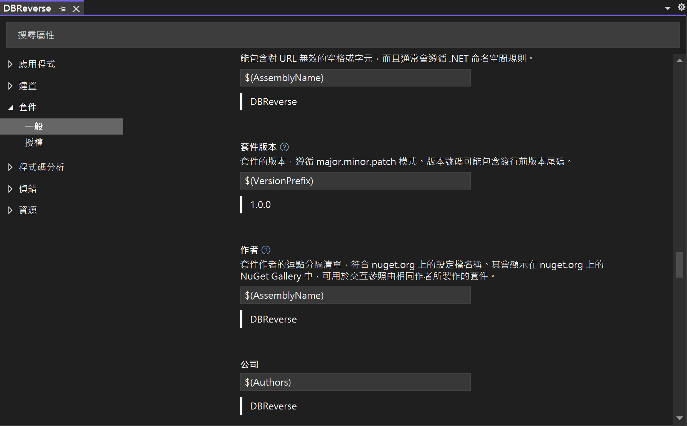

* 請勾選 [在建置時產生 NuGet 套件] 下方的 Checkbox 檢查盒。
* 對於下方的其他屬性設定值，可以依照自己的需要來做調整
* 底下將會是這個類別庫專案的設定內容

```xml
<Project Sdk="Microsoft.NET.Sdk">

  <PropertyGroup>
    <TargetFramework>net6.0</TargetFramework>
    <ImplicitUsings>enable</ImplicitUsings>
    <Nullable>enable</Nullable>
    <Authors>Vulcan Lee</Authors>
    <Product>EF Core 動手實作課程</Product>
    <GeneratePackageOnBuild>True</GeneratePackageOnBuild>
  </PropertyGroup>

  <ItemGroup>
    <PackageReference Include="Microsoft.EntityFrameworkCore.SqlServer" Version="6.0.7" />
    <PackageReference Include="Microsoft.EntityFrameworkCore.Tools" Version="6.0.7">
      <PrivateAssets>all</PrivateAssets>
      <IncludeAssets>runtime; build; native; contentfiles; analyzers; buildtransitive</IncludeAssets>
    </PackageReference>
  </ItemGroup>

</Project>
```

* 切換到 Release 模式下，建置這個類別庫專案
* 現在，可以從 Visual Studio 2022 中，看到 [bin] > [Release] 資料夾下有個 [DBReverse.1.0.0.nupkg] 檔案產生出來

  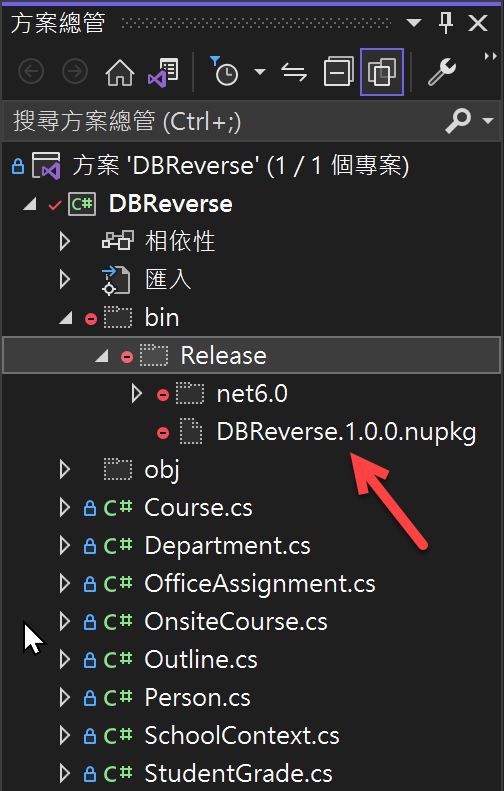

## 上ˇ傳到 MyGet 伺服器上

* 打開 https://www.myget.org/ 網站，並且登入到這個網站內
* 在首頁上，將會看到右方有底下的畫面

  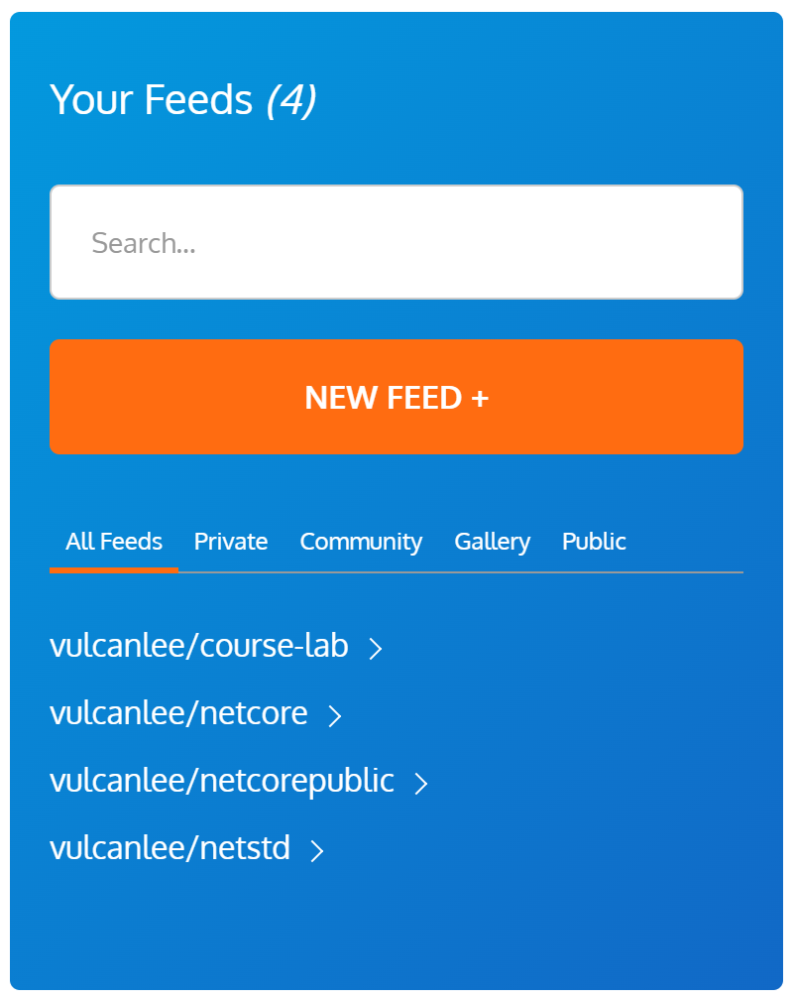

* 點選 [NEW FEED +] 這個按鈕
* 當出現了 [Create your MyGet feed] 畫面後
* 在 [Your feed URL] 欄位內輸入 `efcore-reverse-engineering`
* 在 [Your feed description] 欄位中輸入 `使用 Entity Framework Core 反向工程建立的模型與DbContext類別庫`
* 捲動該網頁到最下方，點選 [CREARE FEED] 按鈕

  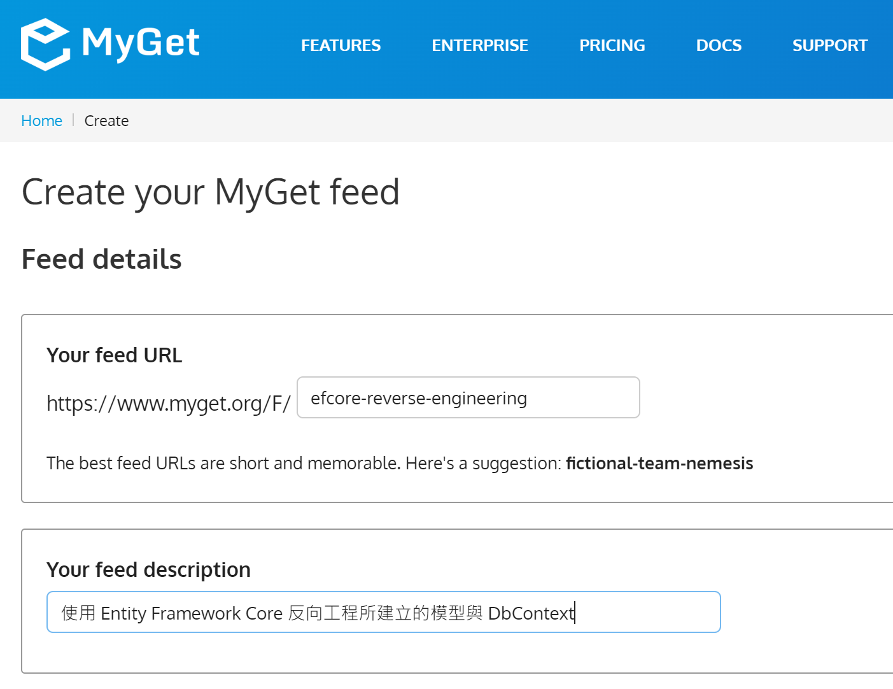

  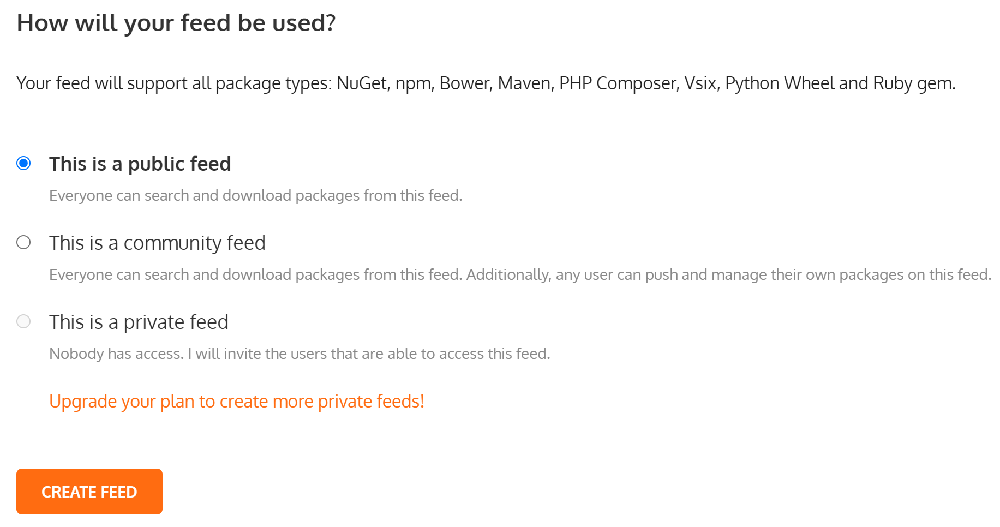

* 當出現 [efcore-reverse-engineering - Packages] 網頁畫面
* 請點選 [ADD PACKAGE] > [NuGet Package] 按鈕

  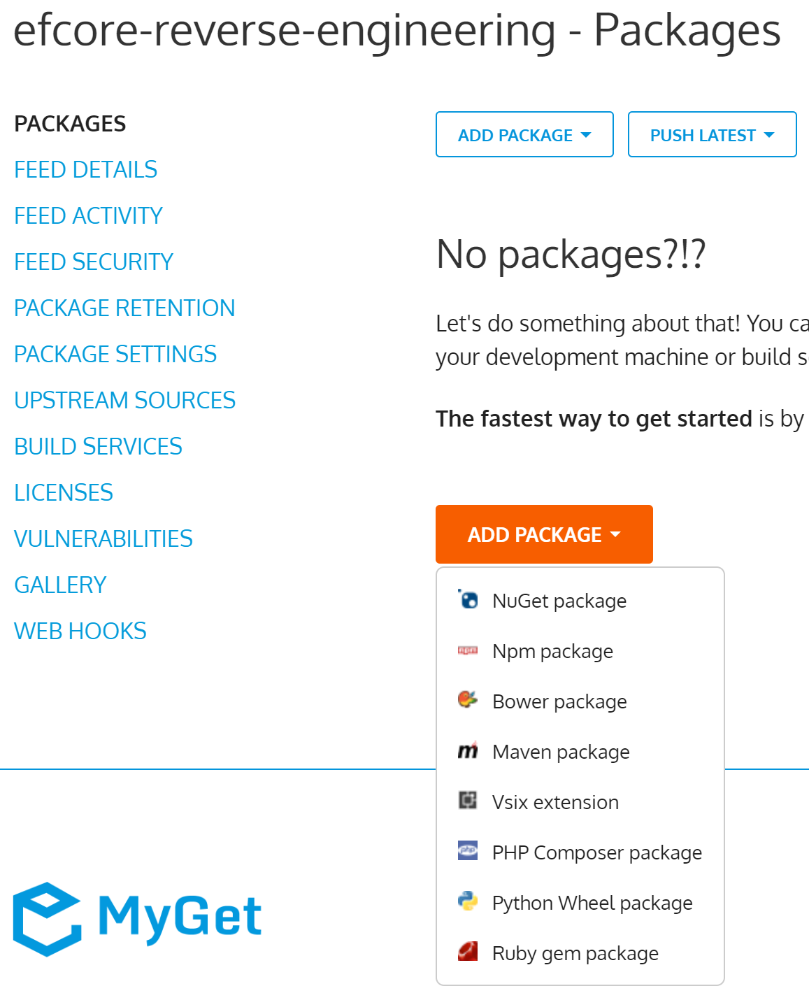

* 當 [Add Package] 對話窗出現的時候，切換到 [From an uploaded package] 標籤頁次
* 點選 [選擇檔案] 按鈕，找到剛剛產生的 NuGet 檔案 - [DBReverse.1.0.0.nupkg]

  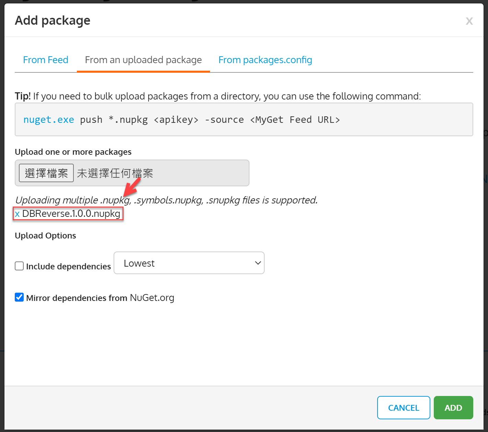

* 最後點選右下方的 [ADD] 綠色按鈕，上傳這個 NuGet 套件檔案
* 點選左邊的 [FEED DETAILS] 連結
* 找到 [Your NuGet V3 feed URL (Visual Studio 2015+)] 欄位
* 將該欄位的內容值複製到剪貼簿內，此時的欄位值為 `https://www.myget.org/F/efcore-reverse-engineering/api/v3/index.json`

  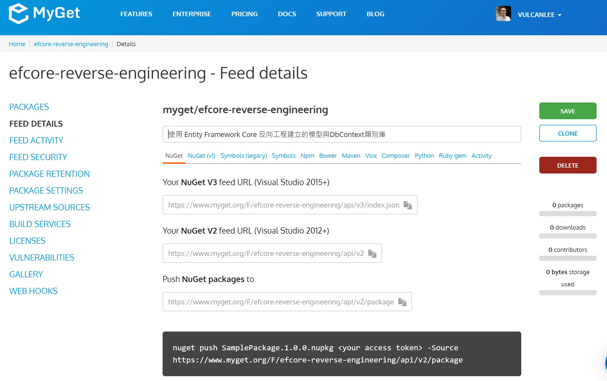

## 開始引用這個 MyGet 上的公開套件

* 打開 Visual Studio 2022
* 點選右下方的 [建立新的專案] 按鈕
* 選擇一個 [主控台應用程式] 的專案範本
* 點選右下方的 [下一步] 按鈕
* 在 [設定新的專案] 對話窗內，使用預設值即可
* 點選右下方的 [下一步] 按鈕
* 在 [其他資訊] 對話窗中
* 取消 [Do not use top-level statements] 這個 checkbox 檢查盒的勾選
* 點選右下方的 [建立] 按鈕
* 當這個專案建立完成後，接下來要設定飲用者個 NuGet 套件
* 點選功能表 [工具] > [選項]
* 此時， [選項] 對話窗將會出現
* 點選左邊清單的 [NuGet 套件管理員] > [套件來源]
* 點選右上方的綠色加號按鈕
* 此時，中間的 [套件來源] 清單中將會多了一筆紀錄
* 請在下方的 [名稱] 欄位輸入 `EF Core 反向工程產生的模型`
* 請在下方的 [來源] 欄位輸入 `https://www.myget.org/F/efcore-reverse-engineering/api/v3/index.json`
* 點選右下方的 [更新] 按鈕
* 點選右下方的 [確定] 按鈕，完成加入一個 NuGet 來源設定

  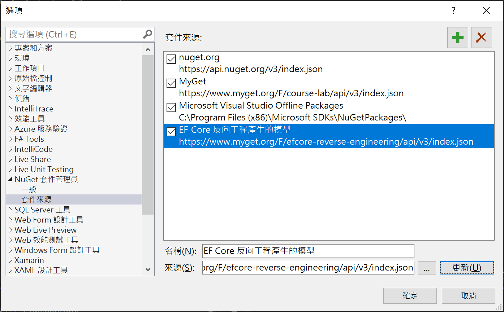

* 滑鼠右擊該專案內的 [相依性] 節點
* 從彈出功能表中，點選 [管理 NuGet 套件] 選項
* 當 NuGet 套件管理視窗出現之後
* 在該視窗的右上方，將會看到 [套件來源] 文字
* 點選該文字右方的下拉選單，選擇 [EF Core 反向工程產生的模型] 這個 NuGet 套件來源

  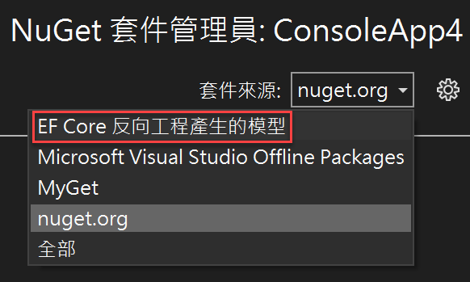

* 現在可以點選這個 NuGet 套件管理視窗左上方的 [瀏覽] 標籤頁次

  > 若沒有看到下圖畫面，請再度切換 [套件來源] 為 [EF Core 反向工程產生的模型] 
* 在現在的視窗內，將會看到 [DBReverse] 套件出現
* 點選這個套件，並且安裝到這個專案內

  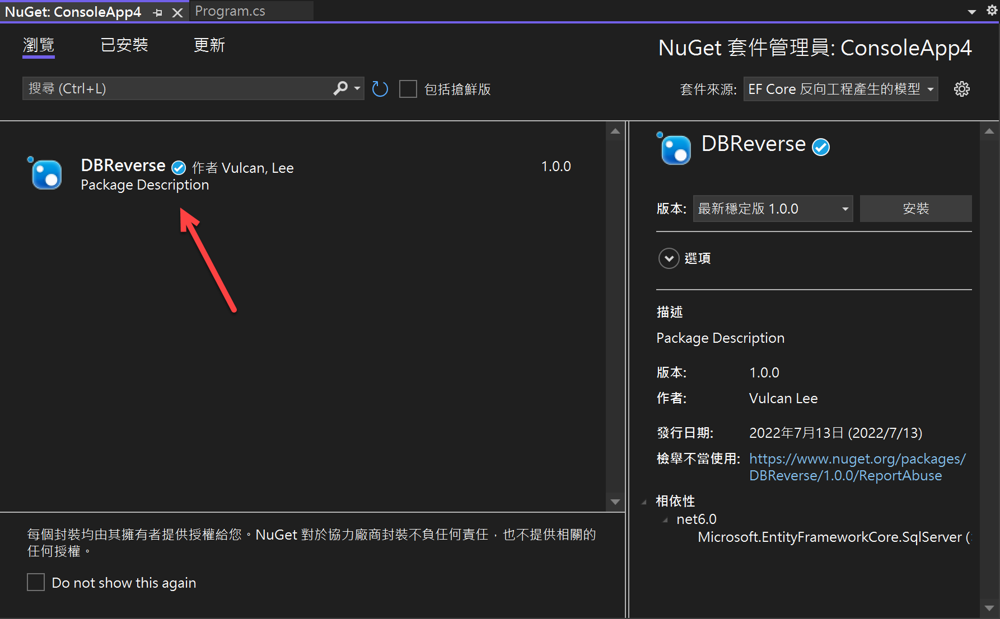

* 底下是輸出文字內容

```
正在還原 C:\Vulcan\Projects\ConsoleApp4\ConsoleApp4\ConsoleApp4.csproj 的封裝...
  GET https://api.nuget.org/v3-flatcontainer/dbreverse/index.json
  NotFound https://api.nuget.org/v3-flatcontainer/dbreverse/index.json 218 毫秒
  GET https://www.myget.org/F/course-lab/api/v3/flatcontainer/dbreverse/index.json
  NotFound https://www.myget.org/F/course-lab/api/v3/flatcontainer/dbreverse/index.json 263 毫秒
  GET https://www.myget.org/F/efcore-reverse-engineering/api/v3/flatcontainer/dbreverse/index.json
  OK https://www.myget.org/F/efcore-reverse-engineering/api/v3/flatcontainer/dbreverse/index.json 256 毫秒
  GET https://www.myget.org/F/efcore-reverse-engineering/api/v3/flatcontainer/dbreverse/1.0.0/dbreverse.1.0.0.nupkg
  OK https://www.myget.org/F/efcore-reverse-engineering/api/v3/flatcontainer/dbreverse/1.0.0/dbreverse.1.0.0.nupkg 1230 毫秒
已從具有內容雜湊 skICCYIMQu3qIpAssDu4OdxIfgUwjM8Q9B/WJeNr2D22466yO/C9flV/R01aYnWYNQskpn7POfVwI1XZfkIlYA== 的 https://www.myget.org/F/efcore-reverse-engineering/api/v3/index.json 安裝 DBReverse 1.0.0。
正在安裝 NuGet 套件 DBReverse 1.0.0。
正在產生 MSBuild 檔案 C:\Vulcan\Projects\ConsoleApp4\ConsoleApp4\obj\ConsoleApp4.csproj.nuget.g.props。
正在將資產檔案寫入磁碟。路徑: C:\Vulcan\Projects\ConsoleApp4\ConsoleApp4\obj\project.assets.json
已成功將 'DBReverse 1.0.0' 安裝到 ConsoleApp4
已成功將 'Microsoft.CSharp 4.5.0' 安裝到 ConsoleApp4
已成功將 'Microsoft.Data.SqlClient 2.1.4' 安裝到 ConsoleApp4
已成功將 'Microsoft.Data.SqlClient.SNI.runtime 2.1.1' 安裝到 ConsoleApp4
已成功將 'Microsoft.EntityFrameworkCore 6.0.7' 安裝到 ConsoleApp4
已成功將 'Microsoft.EntityFrameworkCore.Abstractions 6.0.7' 安裝到 ConsoleApp4
已成功將 'Microsoft.EntityFrameworkCore.Analyzers 6.0.7' 安裝到 ConsoleApp4
已成功將 'Microsoft.EntityFrameworkCore.Relational 6.0.7' 安裝到 ConsoleApp4
已成功將 'Microsoft.EntityFrameworkCore.SqlServer 6.0.7' 安裝到 ConsoleApp4
已成功將 'Microsoft.Extensions.Caching.Abstractions 6.0.0' 安裝到 ConsoleApp4
已成功將 'Microsoft.Extensions.Caching.Memory 6.0.1' 安裝到 ConsoleApp4
已成功將 'Microsoft.Extensions.Configuration.Abstractions 6.0.0' 安裝到 ConsoleApp4
已成功將 'Microsoft.Extensions.DependencyInjection 6.0.0' 安裝到 ConsoleApp4
已成功將 'Microsoft.Extensions.DependencyInjection.Abstractions 6.0.0' 安裝到 ConsoleApp4
已成功將 'Microsoft.Extensions.Logging 6.0.0' 安裝到 ConsoleApp4
已成功將 'Microsoft.Extensions.Logging.Abstractions 6.0.0' 安裝到 ConsoleApp4
已成功將 'Microsoft.Extensions.Options 6.0.0' 安裝到 ConsoleApp4
已成功將 'Microsoft.Extensions.Primitives 6.0.0' 安裝到 ConsoleApp4
已成功將 'Microsoft.Identity.Client 4.21.1' 安裝到 ConsoleApp4
已成功將 'Microsoft.IdentityModel.JsonWebTokens 6.8.0' 安裝到 ConsoleApp4
已成功將 'Microsoft.IdentityModel.Logging 6.8.0' 安裝到 ConsoleApp4
已成功將 'Microsoft.IdentityModel.Protocols 6.8.0' 安裝到 ConsoleApp4
已成功將 'Microsoft.IdentityModel.Protocols.OpenIdConnect 6.8.0' 安裝到 ConsoleApp4
已成功將 'Microsoft.IdentityModel.Tokens 6.8.0' 安裝到 ConsoleApp4
已成功將 'Microsoft.NETCore.Platforms 3.1.0' 安裝到 ConsoleApp4
已成功將 'Microsoft.Win32.Registry 4.7.0' 安裝到 ConsoleApp4
已成功將 'Microsoft.Win32.SystemEvents 4.7.0' 安裝到 ConsoleApp4
已成功將 'System.Collections.Immutable 6.0.0' 安裝到 ConsoleApp4
已成功將 'System.Configuration.ConfigurationManager 4.7.0' 安裝到 ConsoleApp4
已成功將 'System.Diagnostics.DiagnosticSource 6.0.0' 安裝到 ConsoleApp4
已成功將 'System.Drawing.Common 4.7.0' 安裝到 ConsoleApp4
已成功將 'System.IdentityModel.Tokens.Jwt 6.8.0' 安裝到 ConsoleApp4
已成功將 'System.Runtime.Caching 4.7.0' 安裝到 ConsoleApp4
已成功將 'System.Runtime.CompilerServices.Unsafe 6.0.0' 安裝到 ConsoleApp4
已成功將 'System.Security.AccessControl 4.7.0' 安裝到 ConsoleApp4
已成功將 'System.Security.Cryptography.Cng 4.5.0' 安裝到 ConsoleApp4
已成功將 'System.Security.Cryptography.ProtectedData 4.7.0' 安裝到 ConsoleApp4
已成功將 'System.Security.Permissions 4.7.0' 安裝到 ConsoleApp4
已成功將 'System.Security.Principal.Windows 4.7.0' 安裝到 ConsoleApp4
已成功將 'System.Text.Encoding.CodePages 4.7.0' 安裝到 ConsoleApp4
已成功將 'System.Windows.Extensions 4.7.0' 安裝到 ConsoleApp4
執行 NuGet 動作花費了 247 毫秒
經過時間: 00:00:04.0392165
========== 已完成 ==========

經過時間: 00:00:00.0572992
========== 已完成 ==========
```


* 打開 [Program.cs] 檔案，修改成為如下程式碼

```csharp
using DBReverse;
using Microsoft.EntityFrameworkCore;

namespace ConsoleApp4
{
    internal class Program
    {
        static async Task Main(string[] args)
        {
            SchoolContext context = new SchoolContext();
            var people = await context.People
                .OrderBy(x => x.LastName)
                .ThenBy(x => x.FirstName)
                .Where(x => x.LastName == "Li")
                .ToListAsync();

            var foo = context.People
                .OrderBy(x => x.LastName);
            foo = foo.ThenBy(z => z.FirstName);
            var bar = foo.Where(x => x.LastName == "Li");
            var bar1 = bar.ToList();
            foreach (var item in people)
            {
                Console.WriteLine($"人員:{item.LastName} {item.FirstName}");
            }
        }
    }
}
```

* 執行這個專案，並且查看結果是否為

```
人員:Li Yan
```

