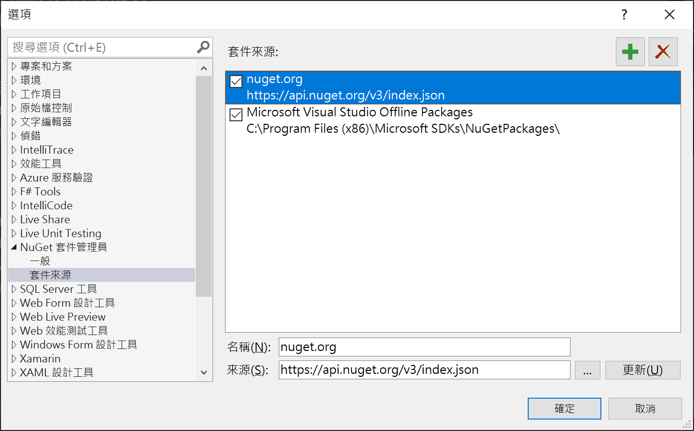
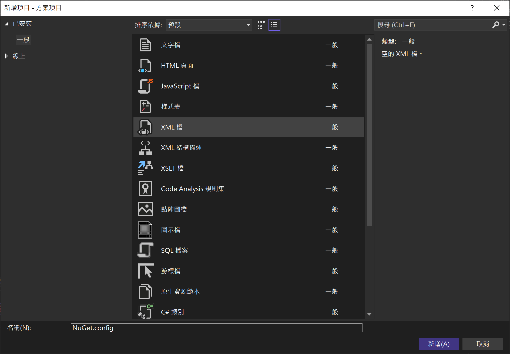
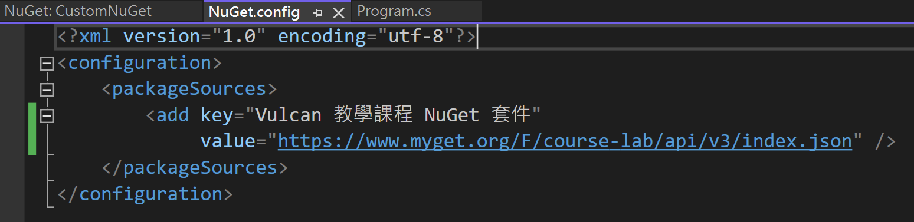
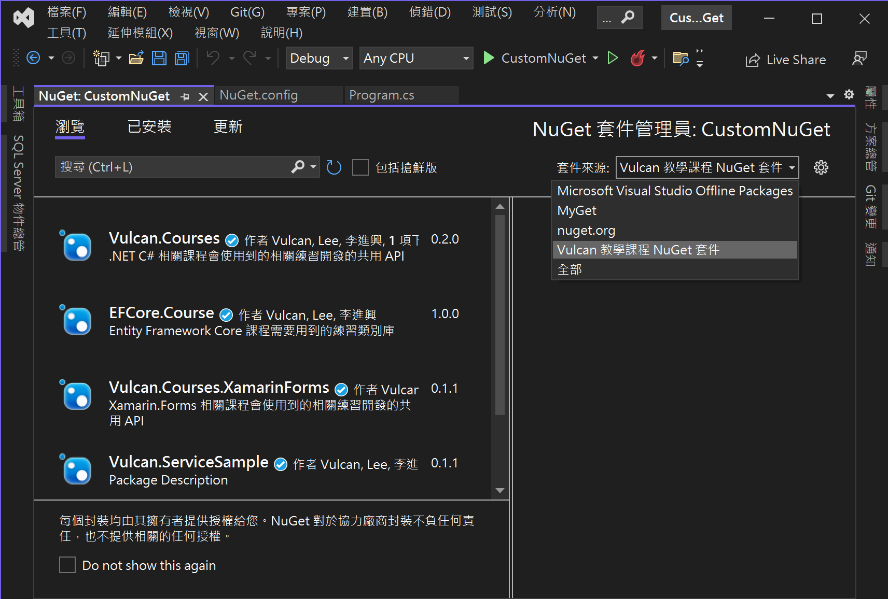

# 在開發方案中，加入自訂的 NuGet 套件來源，無需透過 工具 > 選項 > NuGet 來設定

在上一篇文章 [C# : 將 EF Core 的資料模型類別庫，打包成為 NuGet 套件，並且上傳到公開 NuGet 伺服器上](https://csharpkh.blogspot.com/2022/07/Project-Library-Package-NuGet-MyGet.html
) 中，說明到如何自己設計一個類別庫專案，並且將其打包成為一個 NuGet 套件，接著，將其發佈到私有的 NuGet 伺服器上，最後，透過在 Visual Studio 上加入這個私有的 NuGet 套件來源，成功的安裝這些套件到專案內來進行開發。

有些時候，在進行專案開發需要使用到一些 NuGet 套件，然而，有些時候需要參考到非 [https://www.nuget.org/](https://www.nuget.org/) 官方網站的套件，例如，許多套件是自己團隊或者公司開發的(或者，像是參加我的課程，也會用到我自行開發的 NuGet 套件，方便進行開發練習)，並且發佈到其他非 NuGet 的網站上，此時，若要使用這些套件，或者要打開這類專案，都需要事先在 Visual Studio 上進行宣告與設定，否則，將無法建置此類型的專案，因為，無法將這些套件從網路下載下來。

在進行此篇文章動手練習之前

* 請先打開 Visual Studio 2022
* 點選功能表 [工具] > [選項]
* 在 [選項] 對話窗中，展開 [NuGet 套件管理員] > [套件來源] 節點
* 確認此時對話窗的右方套件來源清單中，是安裝 Visual Studio 2022 預設的選項，沒有其他自行額外追加的項目，若有這些額外新增的項目，請先刪除掉

  

## 建立測試用的主控台應用程式專案

* 打開 Visual Studio 2022
* 點選右下方的 [建立新的專案] 按鈕
* 選擇一個 [主控台應用程式] 的專案範本
* 點選右下方的 [下一步] 按鈕
* 在 [設定新的專案] 對話窗內，在 [專案名稱] 欄位中，輸入 `CustomNuGet`
* 點選右下方的 [下一步] 按鈕
* 在 [其他資訊] 對話窗中
* 取消 [Do not use top-level statements] 這個 checkbox 檢查盒的勾選
* 點選右下方的 [建立] 按鈕
* 當這個專案建立完成後
* 滑鼠右擊 [解決方案] 節點
* 點選 [加入] > [新增項目]
* 在 [新增項目 - 方案項目] 對話窗內
* 在中間清單區域，選擇 [XML] 項目
* 在下方名稱欄位內，輸入 `NuGet.config`
* 點選右下方 [新增] 按鈕

  

* 當 [NuGet.config] 編輯視窗出現之後，便可以將底下的宣告內容輸入到這個檔案內

```xml
<?xml version="1.0" encoding="utf-8"?>
<configuration>
	<packageSources>
		<add key="Vulcan 教學課程 NuGet 套件" 
        value="https://www.myget.org/F/course-lab/api/v3/index.json" />
	</packageSources>
</configuration>
```



為了要讓這些新加入的內容生效，建議你將這個專案關閉起來，又或者關閉 Visual Studio 2022`,重新開啟 Visual Studio 2022 與 這個練習專案

## 驗證可以使用專案特定的 NuGet 套件來源

專案重新開啟之後，請依序進行底下操作，確認剛剛的設定可以正確完成無誤。

在這裡將會要透過剛剛新加入的 [Vulcan 教學課程 NuGet 套件] 套件來源中的一個 Entity Framework Core 課程練習用的套件，這個套件提供了 Entity Framework Core 反向工程的模型與 Code First 代碼優先的模型，有了這些模型便可以快速、方便的進行 Entity Framework Core 課程中的各項練習。

* 滑鼠右擊該專案的 [相依性] 節點
* 點選 [管理 NuGet 套件] 選項
* 當 [NuGet: CustomNuGet] 視窗出現後
* 點選該視窗右上方的 [套件來源] 右邊下拉選單控制項
* 從下拉選單清單中，選擇 [Vulcan 教學課程 NuGet 套件] 這個項目
* 點選該視窗左上方的 [瀏覽] 標籤頁次
* 沒意外的話，將會看到下面截圖的內容，在這個 NuGet 套件來源中，存在著底下的項目

  

* 請選擇 [EFCore.Course] 這個套件，並且安裝起來
* 底下是安裝這個套件的相關輸出文字

```
正在還原 C:\Vulcan\Projects\CustomNuGet\CustomNuGet\CustomNuGet.csproj 的封裝...
  GET https://www.myget.org/F/course-lab/api/v3/flatcontainer/efcore.course/index.json
  GET https://api.nuget.org/v3-flatcontainer/efcore.course/index.json
  OK https://www.myget.org/F/course-lab/api/v3/flatcontainer/efcore.course/index.json 295 毫秒
  GET https://www.myget.org/F/course-lab/api/v3/flatcontainer/efcore.course/1.0.0/efcore.course.1.0.0.nupkg
  NotFound https://api.nuget.org/v3-flatcontainer/efcore.course/index.json 810 毫秒
  OK https://www.myget.org/F/course-lab/api/v3/flatcontainer/efcore.course/1.0.0/efcore.course.1.0.0.nupkg 1268 毫秒
已從具有內容雜湊 UYMB5nZ2H2vdU53P7L/orsrojzPkdK6oYTDZltk3g/MpCmLhZeRw1Y6MCU5t/djYixEs91HZTXkCsogdi3PN2w== 的 https://www.myget.org/F/course-lab/api/v3/index.json 安裝 EFCore.Course 1.0.0。
正在安裝 NuGet 套件 EFCore.Course 1.0.0。
正在產生 MSBuild 檔案 C:\Vulcan\Projects\CustomNuGet\CustomNuGet\obj\CustomNuGet.csproj.nuget.g.props。
正在將資產檔案寫入磁碟。路徑: C:\Vulcan\Projects\CustomNuGet\CustomNuGet\obj\project.assets.json
已成功將 'EFCore.Course 1.0.0' 安裝到 CustomNuGet
已成功將 'Microsoft.CSharp 4.5.0' 安裝到 CustomNuGet
已成功將 'Microsoft.Data.SqlClient 2.1.4' 安裝到 CustomNuGet
已成功將 'Microsoft.Data.SqlClient.SNI.runtime 2.1.1' 安裝到 CustomNuGet
已成功將 'Microsoft.EntityFrameworkCore 6.0.6' 安裝到 CustomNuGet
已成功將 'Microsoft.EntityFrameworkCore.Abstractions 6.0.6' 安裝到 CustomNuGet
已成功將 'Microsoft.EntityFrameworkCore.Analyzers 6.0.6' 安裝到 CustomNuGet
已成功將 'Microsoft.EntityFrameworkCore.Relational 6.0.6' 安裝到 CustomNuGet
已成功將 'Microsoft.EntityFrameworkCore.SqlServer 6.0.6' 安裝到 CustomNuGet
已成功將 'Microsoft.Extensions.Caching.Abstractions 6.0.0' 安裝到 CustomNuGet
已成功將 'Microsoft.Extensions.Caching.Memory 6.0.1' 安裝到 CustomNuGet
已成功將 'Microsoft.Extensions.Configuration.Abstractions 6.0.0' 安裝到 CustomNuGet
已成功將 'Microsoft.Extensions.DependencyInjection 6.0.0' 安裝到 CustomNuGet
已成功將 'Microsoft.Extensions.DependencyInjection.Abstractions 6.0.0' 安裝到 CustomNuGet
已成功將 'Microsoft.Extensions.Logging 6.0.0' 安裝到 CustomNuGet
已成功將 'Microsoft.Extensions.Logging.Abstractions 6.0.0' 安裝到 CustomNuGet
已成功將 'Microsoft.Extensions.Options 6.0.0' 安裝到 CustomNuGet
已成功將 'Microsoft.Extensions.Primitives 6.0.0' 安裝到 CustomNuGet
已成功將 'Microsoft.Identity.Client 4.21.1' 安裝到 CustomNuGet
已成功將 'Microsoft.IdentityModel.JsonWebTokens 6.8.0' 安裝到 CustomNuGet
已成功將 'Microsoft.IdentityModel.Logging 6.8.0' 安裝到 CustomNuGet
已成功將 'Microsoft.IdentityModel.Protocols 6.8.0' 安裝到 CustomNuGet
已成功將 'Microsoft.IdentityModel.Protocols.OpenIdConnect 6.8.0' 安裝到 CustomNuGet
已成功將 'Microsoft.IdentityModel.Tokens 6.8.0' 安裝到 CustomNuGet
已成功將 'Microsoft.NETCore.Platforms 3.1.0' 安裝到 CustomNuGet
已成功將 'Microsoft.Win32.Registry 4.7.0' 安裝到 CustomNuGet
已成功將 'Microsoft.Win32.SystemEvents 4.7.0' 安裝到 CustomNuGet
已成功將 'System.Collections.Immutable 6.0.0' 安裝到 CustomNuGet
已成功將 'System.Configuration.ConfigurationManager 4.7.0' 安裝到 CustomNuGet
已成功將 'System.Diagnostics.DiagnosticSource 6.0.0' 安裝到 CustomNuGet
已成功將 'System.Drawing.Common 4.7.0' 安裝到 CustomNuGet
已成功將 'System.IdentityModel.Tokens.Jwt 6.8.0' 安裝到 CustomNuGet
已成功將 'System.Runtime.Caching 4.7.0' 安裝到 CustomNuGet
已成功將 'System.Runtime.CompilerServices.Unsafe 6.0.0' 安裝到 CustomNuGet
已成功將 'System.Security.AccessControl 4.7.0' 安裝到 CustomNuGet
已成功將 'System.Security.Cryptography.Cng 4.5.0' 安裝到 CustomNuGet
已成功將 'System.Security.Cryptography.ProtectedData 4.7.0' 安裝到 CustomNuGet
已成功將 'System.Security.Permissions 4.7.0' 安裝到 CustomNuGet
已成功將 'System.Security.Principal.Windows 4.7.0' 安裝到 CustomNuGet
已成功將 'System.Text.Encoding.CodePages 4.7.0' 安裝到 CustomNuGet
已成功將 'System.Windows.Extensions 4.7.0' 安裝到 CustomNuGet
執行 NuGet 動作花費了 196 毫秒
經過時間: 00:00:03.3675770
========== 已完成 ==========

經過時間: 00:00:00.0296857
========== 已完成 ==========
```

* 現在，這個主控台專案內，已經有可以存取後端資料庫的 Entity Framework Core Model 模型了

* 打開 [Program.cs] 檔案，修改成為如下程式碼

```csharp
using DBReverse;
using Microsoft.EntityFrameworkCore;

namespace ConsoleApp4
{
    internal class Program
    {
        static async Task Main(string[] args)
        {
            SchoolContext context = new SchoolContext();
            var people = await context.People
                .OrderBy(x => x.LastName)
                .ThenBy(x => x.FirstName)
                .Where(x => x.LastName == "Li")
                .ToListAsync();

            var foo = context.People
                .OrderBy(x => x.LastName);
            foo = foo.ThenBy(z => z.FirstName);
            var bar = foo.Where(x => x.LastName == "Li");
            var bar1 = bar.ToList();
            foreach (var item in people)
            {
                Console.WriteLine($"人員:{item.LastName} {item.FirstName}");
            }
        }
    }
}
```

* 執行這個專案，並且查看結果是否為

```
人員:Li Yan
```

