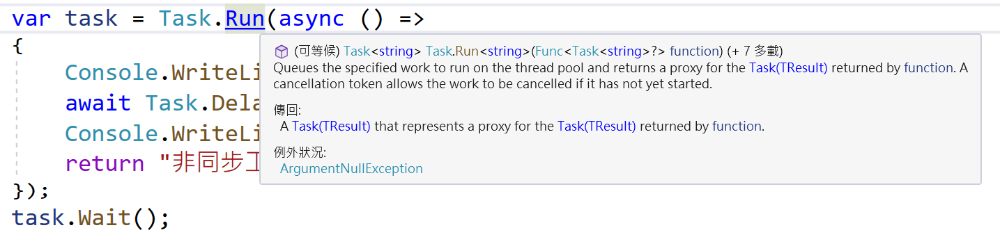
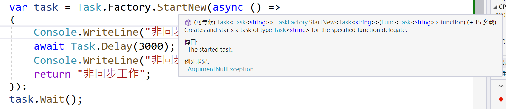

# Task.Run 與 Task.Factory.StartNew 傳入一個 async 非同步委派方法的運作差異

我們知道在 .NET Framework 4.0 的時候，微軟推出了 [TPL (Task Parallel Library) 工作平行程式庫](https://docs.microsoft.com/zh-tw/dotnet/standard/parallel-programming/task-parallel-library-tpl?WT.mc_id=DT-MVP-5002220) ， 而 TPL 存在的目的是透過 .NET Framework 提供的一組 API，並且將這些 API 組合在一個類別庫內，進而簡化平行處理程式設計的方法與設計流程，讓開發人員更有生產力與可以輕鬆地開發出平行、並行、非同步應用的應用程式。

在 .NET Framework 4.0 的時候，可以透過這個工廠方法 [Task.Factory](https://docs.microsoft.com/zh-tw/dotnet/api/system.threading.tasks.taskfactory?WT.mc_id=DT-MVP-5002220) 這個屬性所提供的 [TaskFactory.StartNew 方法](https://docs.microsoft.com/zh-tw/dotnet/api/system.threading.tasks.taskfactory.startnew?WT.mc_id=DT-MVP-5002220) 來建立並取得一個 工作 Task 物件 (建立並啟動所指定動作委派的工作)，代表一個非同步的作業；當使用 StartNew 方法的時候，需要傳入一個委派方法，代表這個非同步作業要執行的工作單元。

當 .NET Framework 進入到 4.5 版本的時候，微軟又推出了 [Task.Run 方法](https://docs.microsoft.com/zh-tw/dotnet/api/system.threading.tasks.task.run?WT.mc_id=DT-MVP-5002220) ，根據微軟官方的文件上表示，這個方法將會將指定在 ThreadPool 執行工作排入佇列，並傳回該工作的 `Task` 或 `Task<TResult>` 控制代碼。

在此同時，微軟同時在 C# 5.0 也推出了 [async 修飾詞](https://docs.microsoft.com/zh-tw/dotnet/csharp/language-reference/keywords/async?WT.mc_id=DT-MVP-5002220) 與 [await 運算子](https://docs.microsoft.com/zh-tw/dotnet/csharp/language-reference/operators/await?WT.mc_id=DT-MVP-5002220)。其目的在於可以讓 .NET 開發者採用同步的方式開發出有效率的非同步應用程式。

然而，對於 `Task.Factory.StartNew` 與 `Task.Run` 這兩個取得非同步工作物件的方法，面對於 async 方法的時候，將會有什麼不同問題呢？

首先，來看看同樣皆為 .NET Framework 4.5 推出的 async , await , Task.Run

底下為使用 Task.Run 取得一個 Task 物件，該非同步工作內將會有一個 async 非同步方法，採用 Lambda 來設計，程式碼如下：

```csharp
var task = Task.Run(async () =>
{
    Console.WriteLine("非同步工作執行開始"); 
    await Task.Delay(3000);
    Console.WriteLine("非同步工作執行完畢"); 
    return "非同步工作";
});
task.Wait();
```

當執行這個程式的時候，將會得到底下的執行結果

```
非同步工作執行開始
非同步工作執行完畢
Press any key for continuing...
```

從輸出結果可以很清楚的看出，一切的執行結果都如同當初所設計的安排所做到的。

一開始建立一個工作物件，該非同步工作指派了一個 async 的非同步委派方法，因為透過 [Task.Run] 來取得的工作物件，因此，該工作已經將會自動啟動與執行。

接下來將會執行 `task.Wait()` 方法，採用 Block 封鎖等待的方式，等候這個非同步工作的作業完成，因此，對於當前執行緒而言，將不會繼續往下執行任何程式碼。

當 async 非同步方法休息 3 秒鐘之後，將會執行完畢，因此， `task.Wait` 這個方法將會解除封鎖，繼續往下執行，因此，將會看到上面的輸出結果。

若在 Visual Studio 2022 開發工具中，將游標移動到 Task.Run 方法上，將會看到下面螢幕截圖，這說明了編譯將推論 Task.Run 這個支援方法，將會回傳一個 `Task<string>` 這個型別的物件回來，這也正是我們想要得到的結果，也是這個 Lambda 非同步方法真正的回傳結果，代表一個非同步的工作物件，該非同步工作物件將會有一個字串的回傳值。



因此，若將 `Task.Run` 修改成為 `Task.Run<string>` ，則編譯器也不會出現任何問題，並且執行結果也是相同的。

```csharp
var task = Task.Run<string>(async () =>
{
    Console.WriteLine("非同步工作執行開始"); 
    await Task.Delay(3000);
    Console.WriteLine("非同步工作執行完畢"); 
    return "非同步工作";
});
task.Wait();
```

上面的程式碼將會修改 `Task.Run` 成為 `Task.Factory.StartNew`

> 前者的方法將會存在於 .NET Framework 4.5 之後，而後者是在 .NET Framework 4.0 時候推出的。

底下將會是修改後的程式碼，編譯器將不會有任何錯誤產生

```csharp
var task = Task.Factory.StartNew(async () =>
{
    Console.WriteLine("非同步工作執行開始"); 
    await Task.Delay(3000);
    Console.WriteLine("非同步工作執行完畢"); 
    return "非同步工作";
});
task.Wait();
```

現在，執行上述程式碼，將會得到底下結果

```
非同步工作執行開始
Press any key for continuing...
非同步工作執行完畢
```

很明顯的，這樣的結果並不是當初設計所期望做到的，當初的設計是

* 建立與啟動一個非同步工作
* 採用封鎖式等候這個非同步工作執行完成，才會繼續往下執行

從執行結果可以看出，這個封鎖等待並沒有發生效用，並沒有真正的進行等待，而是繼續往下執行。

現在，來探究究竟發生了什麼問題？

同樣的，在 Visual Studio 2022 工具內，將游標移動到 StartNew 這個方法上，將會看到下圖結果



這表示編譯器推斷 [Task.Factory.StartNew] 這個方法，將會回傳一個 `Task<Task<string>>` 型別的物件，簡單來說，將會回傳一個工作物件，而該工作物件的回傳值為另為一個回傳為字串的工作物件。

回顧程式碼，當程式碼執行到 `await Task.Delay(3000);` 敘述的時候，將會立即 Return，因此，對於這樣回傳`Task<Task<string>>` 型別值的物件，最外面的 Task 表示已經完成了，因為委派方法已經 Return，而該非同步工作內的 `Task<string>` 回傳字串的非同步工作物件，卻還沒有執行完成，因此， `task.Wait();` 當然會繼續往下執行下去。

現在，將程式碼修改成為底下樣式

```csharp
var task = Task.Factory.StartNew(async () =>
{
    Console.WriteLine("非同步工作執行開始"); 
    await Task.Delay(3000);
    Console.WriteLine("非同步工作執行完畢"); 
    return "非同步工作";
});
Task<string> innerTask = task.Result;
innerTask.Wait();
```

把上述的程式碼重新執行一次，將會得到如同 Task.Run 相同的輸出結果，也是我們期望的設計結果

```
非同步工作執行開始
非同步工作執行完畢
Press any key for continuing...
```

最後，我想要參考如同 `Task.Run` 的用法，將這個方法改成 `Task.Run<string>`

也就是，把 ` Task.Factory.StartNew` 改成 ` Task.Factory.StartNew<string>` ， 現在來看看會有什麼結果了，底下將會是修改後的程式碼

```csharp
var task = Task.Factory.StartNew<string>(async () =>
{
    Console.WriteLine("非同步工作執行開始"); 
    await Task.Delay(3000);
    Console.WriteLine("非同步工作執行完畢"); 
    return "非同步工作";
});
task.Wait();
```

很不幸的，編譯器將會指出發現一個錯誤，錯誤訊息如下

```
CS4010	無法將非同步 Lambda 運算式 轉換成委派類型 'Func<string>'。非同步 Lambda 運算式 可能會傳回 void、Task 或 Task<T>，而這些都無法轉換成 'Func<string>'。
```

請問，你知道為什麼會有這樣的錯誤產生嗎？

> 提示：從前面的文章可以看出端倪喔

