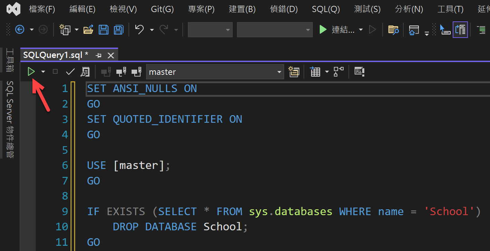

# EF Core : 使用資料庫反向工程，取得 EF Core 的資料模型

在使用 [Entity Framework Core](https://docs.microsoft.com/zh-tw/ef/core?WT.mc_id=DT-MVP-5002220) 進行專案開發的時候，需要先建立好 Entity Framework Core 需要使用的 [Model 模型](https://docs.microsoft.com/zh-tw/ef/core/modeling?WT.mc_id=DT-MVP-5002220)，這樣才能夠與後端的資料庫進行記錄的資料存取需求，而模型是由實體類別和表示與資料庫之會話的內容物件所組成。 

一般來說， Entity Framework Core 提供了底下的三種方法來建立要開發用到模型：

* 透過 Entity Framework Core 提供的工具命令，讀取現有的資料庫綱要 Schema 資訊來產生 EF Core 需要用到模型。
* 自己手做，將模型手動編寫成符合資料庫的程式碼，這樣子的做法十分刻苦，而且經常會容易出錯，不建議使用。
* 使用 C# 程式語言進行設計出許多 POCO (Plain Old CLR Object) 類別與 EF Core 會用到的模型之後，透過 EF [移轉 Migration](https://docs.microsoft.com/zh-tw/ef/core/managing-schemas/migrations?WT.mc_id=DT-MVP-5002220) 工具的協助，根據剛剛設計出來的模型資訊，分析並且建立資料庫。 當模型變更時，移轉可讓資料庫同步更新。

在這篇文章中，將會說明第一種的作法，那就是透過 Entity Framework Core 提供的工具命令，讀取現有的資料庫綱要 Schema 資訊來產生 EF Core 需要用到模型的過程與做法。

## 建立一個測試用的資料庫

為了要練習如何使用資料庫反向工程方式，來建立 EF Core 會用到的模型，在這裡將會建立出底下 ER 模型的資料庫出來，並且該資料庫內也會存在著許多範例紀錄


* 請使用瀏覽器開啟 [https://github.com/vulcanlee/Entity-Framework-Core-Getting-Started/blob/main/Database/SchemaAndData.sql](https://github.com/vulcanlee/Entity-Framework-Core-Getting-Started/blob/main/Database/SchemaAndData.sql) 這個網址
* 在該網頁的最右方中間地方(請參考下圖)，會看到一個 [Copy] 複製內容按鈕

  

* 請點選這個按鈕，把這裡 SQL 指令複製到剪貼簿內
* 開啟 Visual Studio 2022 開發工具
* 請點選右下角的 [不使用程式碼繼續] 的藍色文字

  

* 現在將進入到 Visual Studio 2022 開發工具內
* 從功能表中，點選 [檢視] > [SQL Server 物件總管]

  

* 此時，將會看到 [SQL Server 物件總管] 這個視窗出現在螢幕上
* 在這個 [SQL Server 物件總管] 視窗內
* 展開 [SQL Server] 節點
* 將會看到 [(localdb)\MSSQLLocalDB...] 這個 [SQL Server Express LocalDB](https://docs.microsoft.com/zh-tw/sql/database-engine/configure-windows/sql-server-express-localdb?WT.mc_id=DT-MVP-5002220) 這個節點
* 使用滑鼠右擊這個節點
* 從彈出功能表中，點選 [新增查詢] 這個選項

  

* 此時，將會看到 [SQLQuery1.sql] 視窗出現在螢幕上
* 將剛剛複製到剪貼簿內的 SQL 指令，貼到這個視窗內

  

* 最後，在 [SQLQuery1.sql] 視窗左上方，將會看到一個綠色三角形(請參考上面螢幕截圖紅色箭頭指向地方)
* 請點選這個綠色三角形按鈕，以便開始執行這個 SQL 指令
* 很快的，[School] 資料庫已經建立完成了，並且相關資料表內也都有紀錄存在

* 滑鼠再度右擊這個 [(localdb)\MSSQLLocalDB...] 節點
* 從彈出功能表中點選 [重新整理] 選項
* 此時，從 [SQL Server 物件總管] 視窗中，將會看到剛剛建立好的 [School] 資料庫與相關資料表物件

  

## 建立 EF Core 需要用到的 School 資料庫模型

為了要能夠建立起 EF Core 能夠用到的模型，可以建立一個 主控台專案 或者 一個 .NET 類別庫；因為，下一篇文章將會說明如何將一個類別庫，打包成為 NuGet 套件，並且上傳到 MyGet 伺服器上，以便可以日後重複使用，所以，在此，將會選擇建立一個 .NET 類別庫的方式

* 打開 Visual Studio 2022 開發工具
* 從 Visual Studio 2022 啟動視窗右下方，找到並點選 [建立新新的專案] 這個按鈕

  

* 此時，將會看到 [建立新專案] 對話窗出現在螢幕上
* 請在該對話窗的上方，將會看到三個下拉選單
* 在最左邊的 [所有語言] 下拉選單中，點取與選擇 [C#] 這個項目
* 在最右邊的 [所有專案類型] 下拉選單中，點取與選擇 [程式庫] 這個項目

  

* 在中間的清單區域，第一個項目將會是 [類別庫] 專案，用於建立以 .NET 或 .NET Standard 為目標的類別庫
* 請點選這個項目
* 點選右下角的 [下一步] 按鈕
* 在 [設定新的專案] 對話窗中
* 找到 [專案名稱] 欄位，在此輸入 `DBReverse` 作為這個類別庫專案名稱

  

* 點選右下角的 [下一步] 按鈕
* 看到 [其他資訊] 對話窗出現後，可以選擇預設選項 [.NET 6 (長期支援)]

  

* 點選右下角的 [建立] 按鈕
* 一旦這個專案建立成功後，在 [方案總管] 中找到並且刪除 [Class1.cs] 檔案
* 滑鼠右擊 [DBReverse] 專案內的 [相依性] 節點
* 從彈出功能表中選擇 [管理 NuGet 套件]
* 搜尋並且安裝 [Microsoft.EntityFrameworkCore.SqlServer] 套件
* 搜尋並且安裝 [Microsoft.EntityFrameworkCore.Tools] 套件
* 點選功能表 [工具] > [NuGet 套件管理員] > [套件管理器主控台]
* 請在 [套件管理器主控台] 視窗內，輸入底下指令

  `Scaffold-DbContext "Data Source=(localdb)\MSSQLLocalDB;Initial Catalog=School" Microsoft.EntityFrameworkCore.SqlServer` 

  

* 底下是執行後的輸出文字

```
每個封裝均由其擁有者提供授權給您。NuGet 對於協力廠商封裝不負任何責任，也不提供相關的任何授權。某些封裝可能包含須由其他授權控管的相依項目。請遵循封裝來源 (摘要) URL 決定有無任何相依項目。

套件管理員主控台主機版本 6.2.0.146

輸入 'get-help NuGet' 可查看所有可用的 NuGet 命令。

PM> Scaffold-DbContext "Data Source=(localdb)\MSSQLLocalDB;Initial Catalog=School" Microsoft.EntityFrameworkCore.SqlServer
Build started...
Build succeeded.
To protect potentially sensitive information in your connection string, you should move it out of source code. You can avoid scaffolding the connection string by using the Name= syntax to read it from configuration - see https://go.microsoft.com/fwlink/?linkid=2131148. For more guidance on storing connection strings, see http://go.microsoft.com/fwlink/?LinkId=723263.
PM> 
```

## 檢視反向工程的執行結果

* 查看 [方案總管] 將會看到如下圖的畫面
 
  

* 根據最前面所提到的這個 School 資料庫關聯關係圖

  

* 可以看的出來，所有在資料庫內的資料表，都有在 [方案總管] 內出現
* 每個資料表都會對應到一個 C# 類別
* 例如 對於資料庫上的 [Person] 這個資料表，將會自動產生出一個 [Person.cs] 檔案來對應
* 底下將會是這個 Person 資料表的 SQL 指令

```sql
-- Create the Person table.
IF NOT EXISTS (SELECT * FROM sys.objects 
        WHERE object_id = OBJECT_ID(N'[dbo].[Person]') 
        AND type in (N'U'))
BEGIN
CREATE TABLE [dbo].[Person](
    [PersonID] [int] IDENTITY(1,1) NOT NULL,
    [LastName] [nvarchar](50) NOT NULL,
    [FirstName] [nvarchar](50) NOT NULL,
    [HireDate] [datetime] NULL,
    [EnrollmentDate] [datetime] NULL,
 CONSTRAINT [PK_School.Student] PRIMARY KEY CLUSTERED 
(
    [PersonID] ASC
)WITH (IGNORE_DUP_KEY = OFF) ON [PRIMARY]
) ON [PRIMARY]
END
GO
```

* 底下將會是這個 Person.cs 檔案的 C# 程式碼

```csharp
public partial class Person
{
    public Person()
    {
        StudentGrades = new HashSet<StudentGrade>();
        Courses = new HashSet<Course>();
    }
    public int PersonId { get; set; }
    public string LastName { get; set; } = null!;
    public string FirstName { get; set; } = null!;
    public DateTime? HireDate { get; set; }
    public DateTime? EnrollmentDate { get; set; }
    public virtual OfficeAssignment OfficeAssignment { get; set; } = null!;
    public virtual ICollection<StudentGrade> StudentGrades { get; set; }
    public virtual ICollection<Course> Courses { get; set; }
}
```

* 最後則是最重要的檔案 [SchoolContext.cs] 
* 這是一個繼承 [DbContext](https://docs.microsoft.com/zh-tw/dotnet/api/microsoft.entityframeworkcore.dbcontext?WT.mc_id=DT-MVP-5002220) 類別，這個 DbContext 將會提供與資料庫系統之間的對話，可以用於查詢與儲存記錄從 C# 物件內到資料庫的資料表紀錄裡，原則上，DbContext 是個 Unit Of Work 工作單位 與 Repository 存放酷的設計模式組合而成的。
* SchoolContext.cs 的程式碼如下所示

```csharp
using System;
using System.Collections.Generic;
using Microsoft.EntityFrameworkCore;
using Microsoft.EntityFrameworkCore.Metadata;

namespace DBReverse
{
    public partial class SchoolContext : DbContext
    {
        public SchoolContext()
        {
        }

        public SchoolContext(DbContextOptions<SchoolContext> options)
            : base(options)
        {
        }

        public virtual DbSet<Course> Courses { get; set; } = null!;
        public virtual DbSet<Department> Departments { get; set; } = null!;
        public virtual DbSet<OfficeAssignment> OfficeAssignments { get; set; } = null!;
        public virtual DbSet<OnsiteCourse> OnsiteCourses { get; set; } = null!;
        public virtual DbSet<Outline> Outlines { get; set; } = null!;
        public virtual DbSet<Person> People { get; set; } = null!;
        public virtual DbSet<StudentGrade> StudentGrades { get; set; } = null!;

        protected override void OnConfiguring(DbContextOptionsBuilder optionsBuilder)
        {
            if (!optionsBuilder.IsConfigured)
            {
#warning To protect potentially sensitive information in your connection string, you should move it out of source code. You can avoid scaffolding the connection string by using the Name= syntax to read it from configuration - see https://go.microsoft.com/fwlink/?linkid=2131148. For more guidance on storing connection strings, see http://go.microsoft.com/fwlink/?LinkId=723263.
                optionsBuilder.UseSqlServer("Data Source=(localdb)\\MSSQLLocalDB;Initial Catalog=School");
            }
        }

        protected override void OnModelCreating(ModelBuilder modelBuilder)
        {
            modelBuilder.Entity<Course>(entity =>
            {
                entity.ToTable("Course");

                entity.Property(e => e.CourseId)
                    .ValueGeneratedNever()
                    .HasColumnName("CourseID");

                entity.Property(e => e.DepartmentId).HasColumnName("DepartmentID");

                entity.Property(e => e.Title).HasMaxLength(100);

                entity.HasOne(d => d.Department)
                    .WithMany(p => p.Courses)
                    .HasForeignKey(d => d.DepartmentId)
                    .OnDelete(DeleteBehavior.ClientSetNull)
                    .HasConstraintName("FK_Course_Department");

                entity.HasMany(d => d.People)
                    .WithMany(p => p.Courses)
                    .UsingEntity<Dictionary<string, object>>(
                        "CourseInstructor",
                        l => l.HasOne<Person>().WithMany().HasForeignKey("PersonId").OnDelete(DeleteBehavior.ClientSetNull).HasConstraintName("FK_CourseInstructor_Person"),
                        r => r.HasOne<Course>().WithMany().HasForeignKey("CourseId").OnDelete(DeleteBehavior.ClientSetNull).HasConstraintName("FK_CourseInstructor_Course"),
                        j =>
                        {
                            j.HasKey("CourseId", "PersonId");

                            j.ToTable("CourseInstructor");

                            j.IndexerProperty<int>("CourseId").HasColumnName("CourseID");

                            j.IndexerProperty<int>("PersonId").HasColumnName("PersonID");
                        });
            });

            modelBuilder.Entity<Department>(entity =>
            {
                entity.ToTable("Department");

                entity.Property(e => e.DepartmentId)
                    .ValueGeneratedNever()
                    .HasColumnName("DepartmentID");

                entity.Property(e => e.Budget).HasColumnType("money");

                entity.Property(e => e.Name).HasMaxLength(50);

                entity.Property(e => e.StartDate).HasColumnType("datetime");
            });

            modelBuilder.Entity<OfficeAssignment>(entity =>
            {
                entity.HasKey(e => e.InstructorId);

                entity.ToTable("OfficeAssignment");

                entity.Property(e => e.InstructorId)
                    .ValueGeneratedNever()
                    .HasColumnName("InstructorID");

                entity.Property(e => e.Location).HasMaxLength(50);

                entity.Property(e => e.Timestamp)
                    .IsRowVersion()
                    .IsConcurrencyToken();

                entity.HasOne(d => d.Instructor)
                    .WithOne(p => p.OfficeAssignment)
                    .HasForeignKey<OfficeAssignment>(d => d.InstructorId)
                    .OnDelete(DeleteBehavior.ClientSetNull)
                    .HasConstraintName("FK_OfficeAssignment_Person");
            });

            modelBuilder.Entity<OnsiteCourse>(entity =>
            {
                entity.HasKey(e => e.CourseId);

                entity.ToTable("OnsiteCourse");

                entity.Property(e => e.CourseId)
                    .ValueGeneratedNever()
                    .HasColumnName("CourseID");

                entity.Property(e => e.Days).HasMaxLength(50);

                entity.Property(e => e.Location).HasMaxLength(50);

                entity.Property(e => e.Time).HasColumnType("smalldatetime");

                entity.HasOne(d => d.Course)
                    .WithOne(p => p.OnsiteCourse)
                    .HasForeignKey<OnsiteCourse>(d => d.CourseId)
                    .OnDelete(DeleteBehavior.ClientSetNull)
                    .HasConstraintName("FK_OnsiteCourse_Course");
            });

            modelBuilder.Entity<Outline>(entity =>
            {
                entity.ToTable("Outline");

                entity.Property(e => e.OutlineId).HasColumnName("OutlineID");

                entity.Property(e => e.CourseId).HasColumnName("CourseID");

                entity.Property(e => e.Title).HasMaxLength(100);

                entity.HasOne(d => d.Course)
                    .WithMany(p => p.Outlines)
                    .HasForeignKey(d => d.CourseId)
                    .OnDelete(DeleteBehavior.ClientSetNull)
                    .HasConstraintName("FK_Outline_Course");
            });

            modelBuilder.Entity<Person>(entity =>
            {
                entity.ToTable("Person");

                entity.Property(e => e.PersonId).HasColumnName("PersonID");

                entity.Property(e => e.EnrollmentDate).HasColumnType("datetime");

                entity.Property(e => e.FirstName).HasMaxLength(50);

                entity.Property(e => e.HireDate).HasColumnType("datetime");

                entity.Property(e => e.LastName).HasMaxLength(50);
            });

            modelBuilder.Entity<StudentGrade>(entity =>
            {
                entity.HasKey(e => e.EnrollmentId);

                entity.ToTable("StudentGrade");

                entity.Property(e => e.EnrollmentId).HasColumnName("EnrollmentID");

                entity.Property(e => e.CourseId).HasColumnName("CourseID");

                entity.Property(e => e.Grade).HasColumnType("decimal(3, 2)");

                entity.Property(e => e.StudentId).HasColumnName("StudentID");

                entity.HasOne(d => d.Course)
                    .WithMany(p => p.StudentGrades)
                    .HasForeignKey(d => d.CourseId)
                    .OnDelete(DeleteBehavior.ClientSetNull)
                    .HasConstraintName("FK_StudentGrade_Course");

                entity.HasOne(d => d.Student)
                    .WithMany(p => p.StudentGrades)
                    .HasForeignKey(d => d.StudentId)
                    .OnDelete(DeleteBehavior.ClientSetNull)
                    .HasConstraintName("FK_StudentGrade_Student");
            });

            OnModelCreatingPartial(modelBuilder);
        }

        partial void OnModelCreatingPartial(ModelBuilder modelBuilder);
    }
}
```
