# AzureAD認證 1 : 在 Azure AD 上建立一個可用於 MSAL 的應用程式

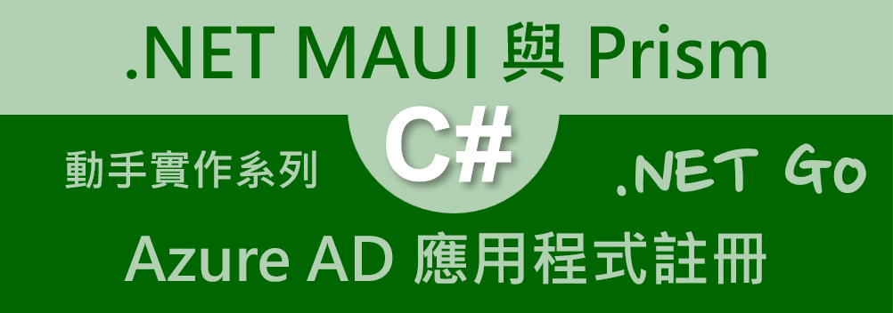

當在進行 .NET MAUI 專案開發的時候，若需要透過 Azure AD 來提供身分驗證，可以有多種方式可以來實作出來，其中一種是在 .NET MAUI 官方網站上所提供 [平臺整合](https://learn.microsoft.com/zh-tw/dotnet/maui/platform-integration/?view=net-maui-7.0&WT.mc_id=DT-MVP-5002220) 的 [Web 驗證器](https://learn.microsoft.com/zh-tw/dotnet/maui/platform-integration/communication/authentication?view=net-maui-7.0&tabs=windows&WT.mc_id=DT-MVP-5002220) 來做到，在這篇文章將會使用 [Microsoft 驗證程式庫(MSAL)](https://learn.microsoft.com/zh-tw/azure/active-directory/develop/msal-overview?WT.mc_id=DT-MVP-5002220) 這個工作來做這樣需求。

Microsoft驗證程式庫 (MSAL) 可讓開發人員從Microsoft 身分識別平臺取得安全性權杖，以驗證使用者並存取受保護的 Web API，而在自身的需求是，若要使用這個 App 的相關功能，則需要透過 Azure AD 進行身分驗證，只有通過身分驗證的使用者才能夠切換到首頁且開始使用此行動應用程式功能。

想要完成這樣的需求，首先要在 Azure 上註冊一個應用程式

## 在 Azure 上註冊應用程式

* 打開 [https://portal.azure.com/](https://portal.azure.com/) 網頁
* 在最上方的文字搜尋盒中，輸入 `App registrations`
* 此時在彈出清單中，將會看到有個 [App registrations] 項目
* 點選 [App registrations] 項目

  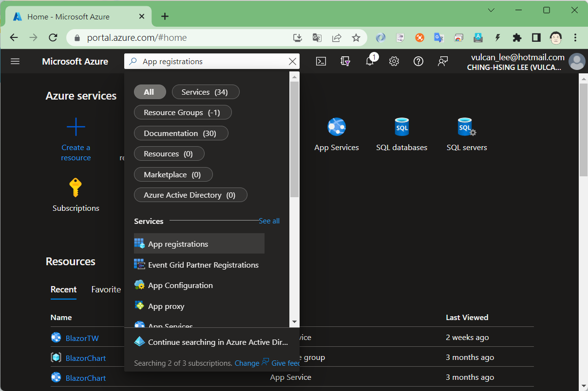
* 在 [App registrations] 頁面內，點選左上方的 [+ New registration] 這個連結
 
  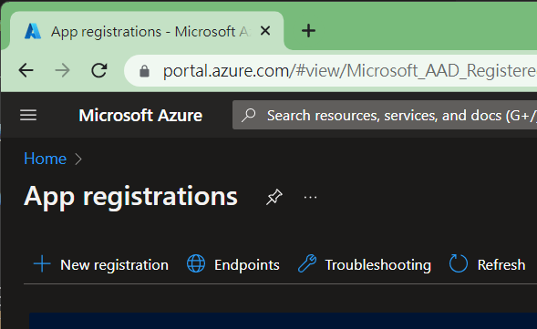
* 現在進入到應用程式註冊頁面
* 在 [Name] 欄位內，輸入這個應用程式的表名稱，在這裡將會命名為 [MauiWithMSAL]
* 在下方有個 [Supported account types
] 要來設定，這裡要選擇甚麼樣的使用者可以來使用這個應用程式
* 在這篇文章中，將會選擇第三個選項，表示 任何組織內的使用者或者任何個人微軟帳號，都可以通過身分驗證
* 最後點選最下方的 [Register] 按鈕

  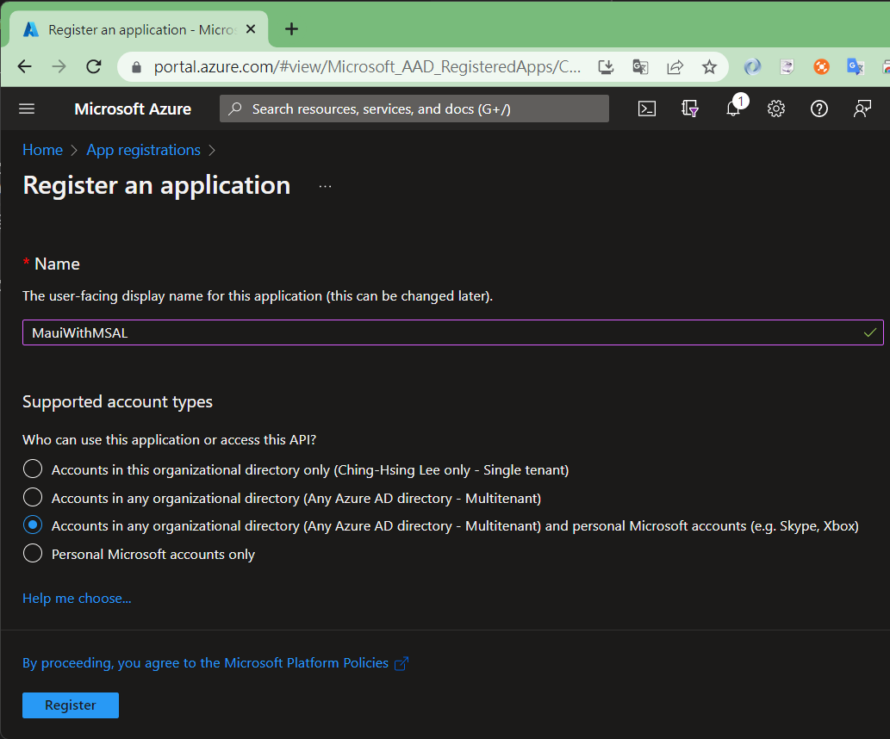
* 這個應用程式已經可以看到了，如底下畫面截圖

  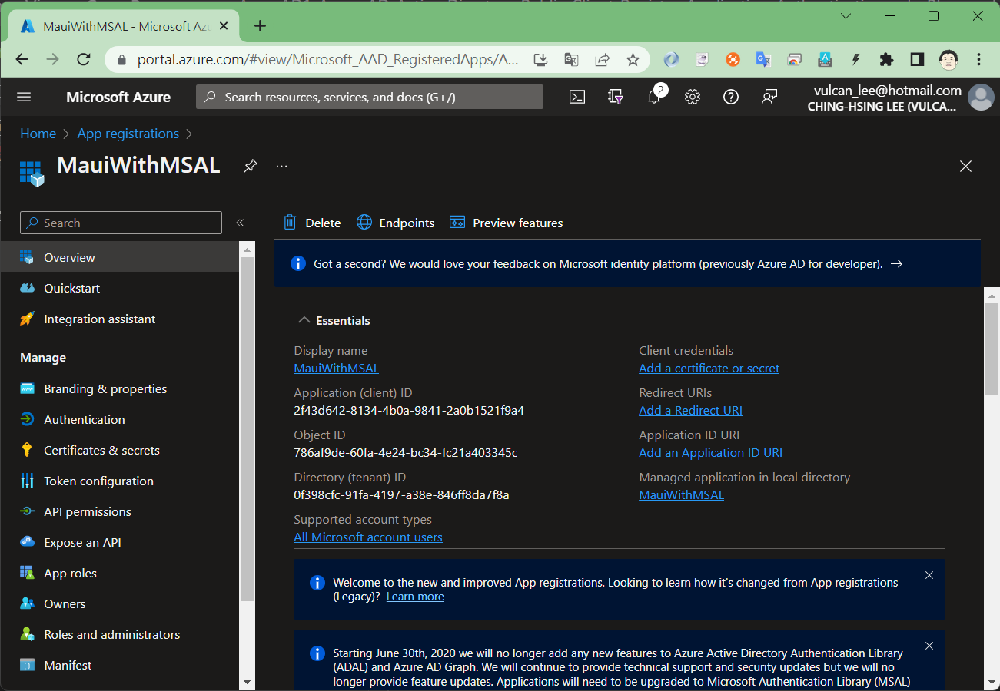
* 在 [MauiWithMSAL] 左側清單中，找到並且點選 [Authtication] 項目
* 現在將會看到 [MauiWithMSAL | Authentication] 這個視窗，如下圖所示 
* 點選 [+ Add a platform] 連結，準備加入一個新的認證平台

  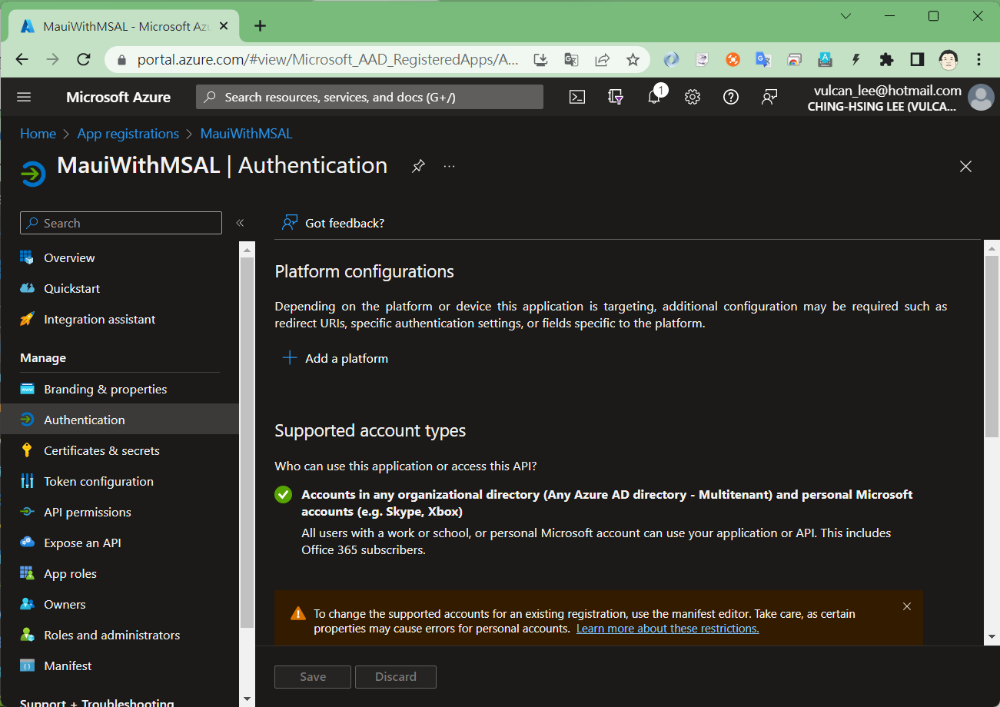
* 現在，在網頁左側，將會出現一個 [Configure platforms] 區域
* 這裡將會有兩種類型的應用程式可以選擇，一個是 [Web applications] ，另外一個是 [Mobile and desktop] 類型應用程式
* 現在，請點選最下方的 [Moble and desktop applications] 項目

  > Windows, UWP, Console, IoT & Limited-entry Devices, Classic iOS + Android

  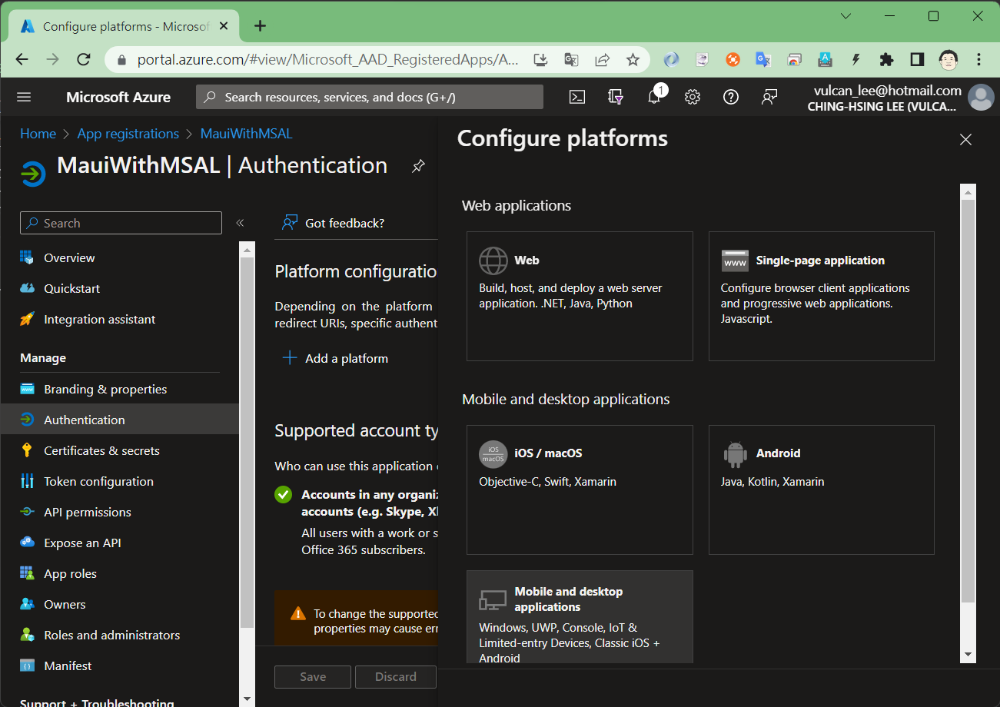
* 此時看到的是 [Configure Desktop + devices] 設定視窗
* 在這裡需要設定這個應用程式需要用到的 [Redirect URLs]
* 從下面截圖可以看到，這裡是選擇了 [msal2f43d642-8134-4b0a-9841-2a0b1521f9a4://auth] 這個項目做為 [Redirect URLs]
* 對於下方的 [Custom redirect URIs] 欄位，則可以忽略不用輸入
* 請點選最下方的 [Configure] 按鈕，完成設定
  
  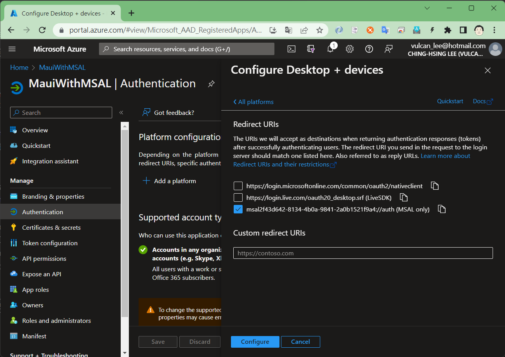
* 一旦完成 [Authentication] 設定之後，將會看到底下的話面截圖

  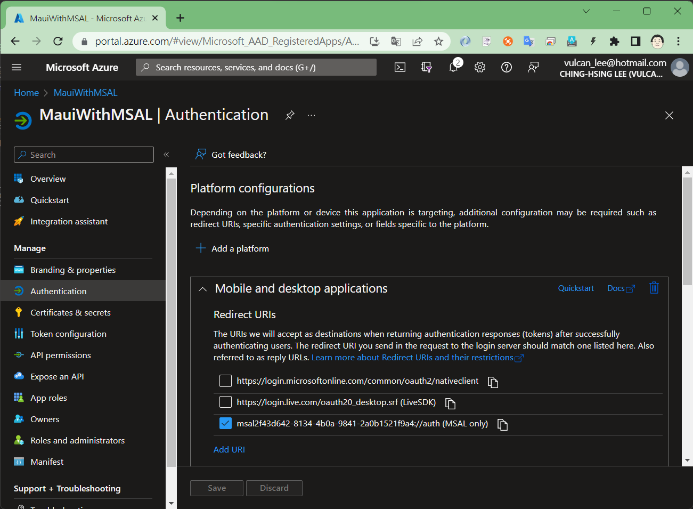

* 點選左側面板中的 [API permissions] 項目
* 網頁畫面將會變成底下畫面截圖

  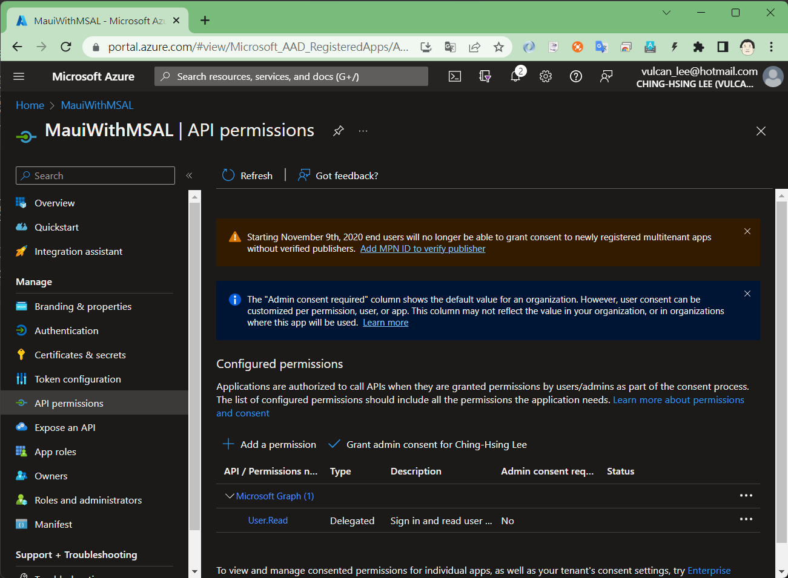

* 在最下方的 [Configured permissions] 區域，僅會看到有一個 API 權限在這裡宣告，那就是 [User.Read]
* 點選 [+ Add a permission] 這個按鈕連結
* 現在網頁畫面將會變成如下畫面截圖
* 在這個 [Request API permissions] 頁面中，可用來指定要增加那些應用平台的可用權限
* 請點選在最上方的 [Microsoft Graph] 項目

  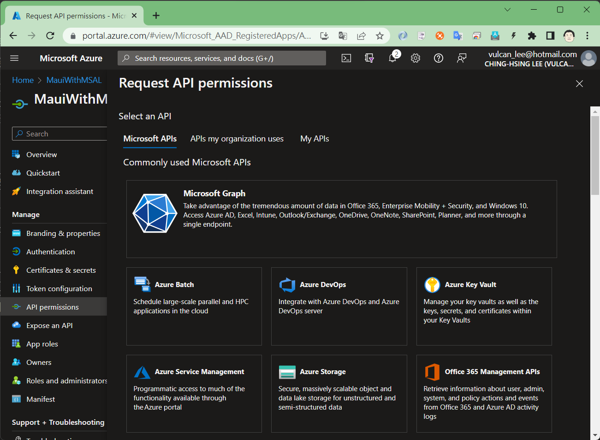
* 此時，將會看底下螢幕結果
* 這裡有兩個選項，分別是 [Delegated permissions] 與 [Application permissions]
* 依據需求，這裡需要點選 [Delegated permissions] 這個選項

  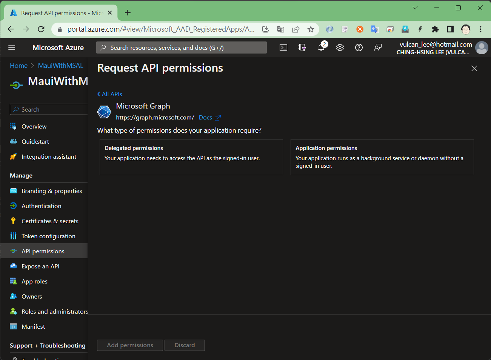

* 此時將會看到有許多的權限項目出現在這裡

  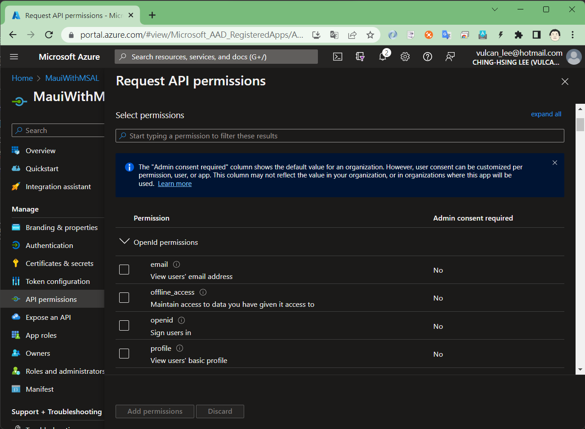

* 先在依序加入了 [email]、[openid]、[profile] 這三個新加入的權限
* 點選最下方的 [Add permissions] 按鈕，將這些權限將入到這個應用程式內
  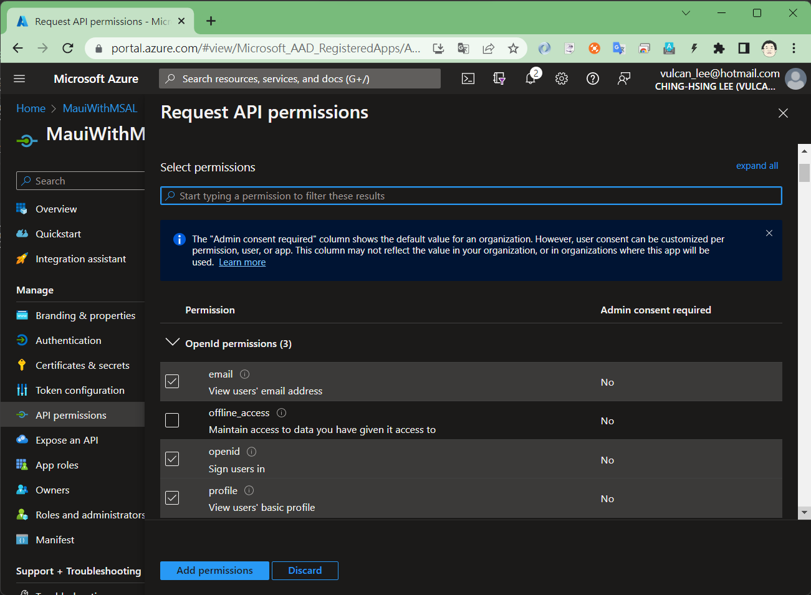

* 現在回到 [MauiWithMSAL | API permissions] 頁面
* 從下方螢幕截圖的下面，看到這個應用程式總共有四個 API 權限宣告

  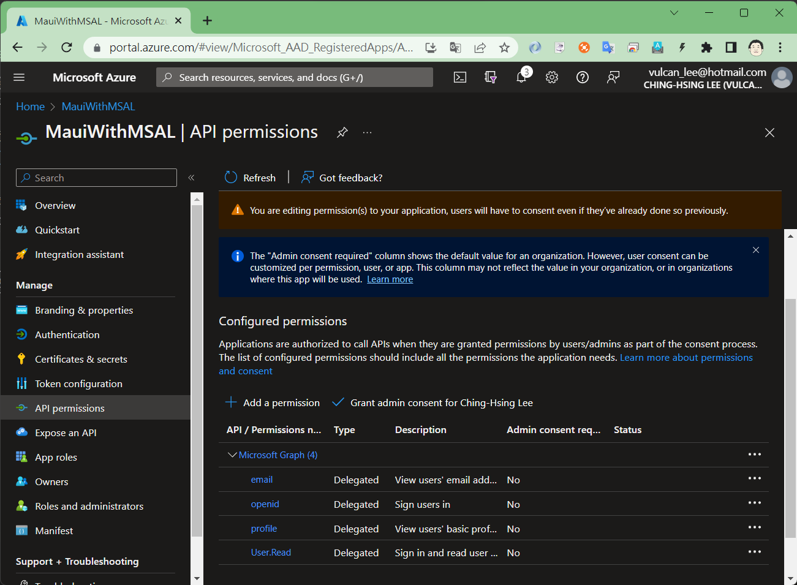

* 點選左測面板最上方的 [Overview] 項目
* 現在將會看到下面螢幕截圖
* 在中間的上方，會看到有個欄位 [Application (client) ID]
* 請將底下的 Client ID 值複製下來
* 在這個應用程式的 Client ID 值為 2f43d642-8134-4b0a-9841-2a0b1521f9a4
* 要複製這個數值，因為稍後在開發 .NET MAUI 應用程式會用到

  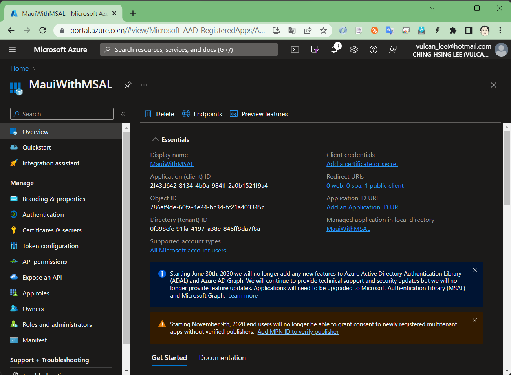

