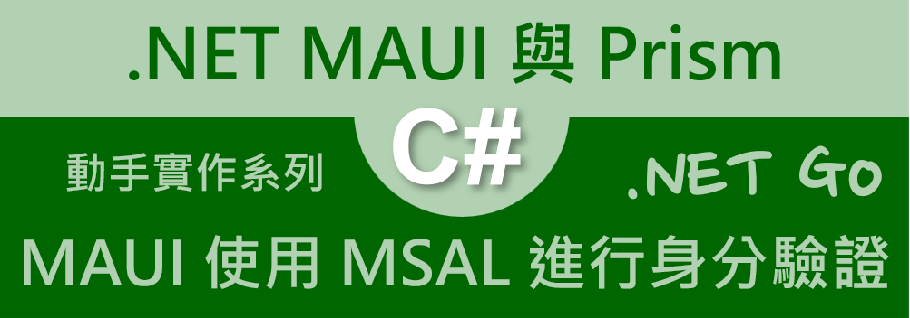
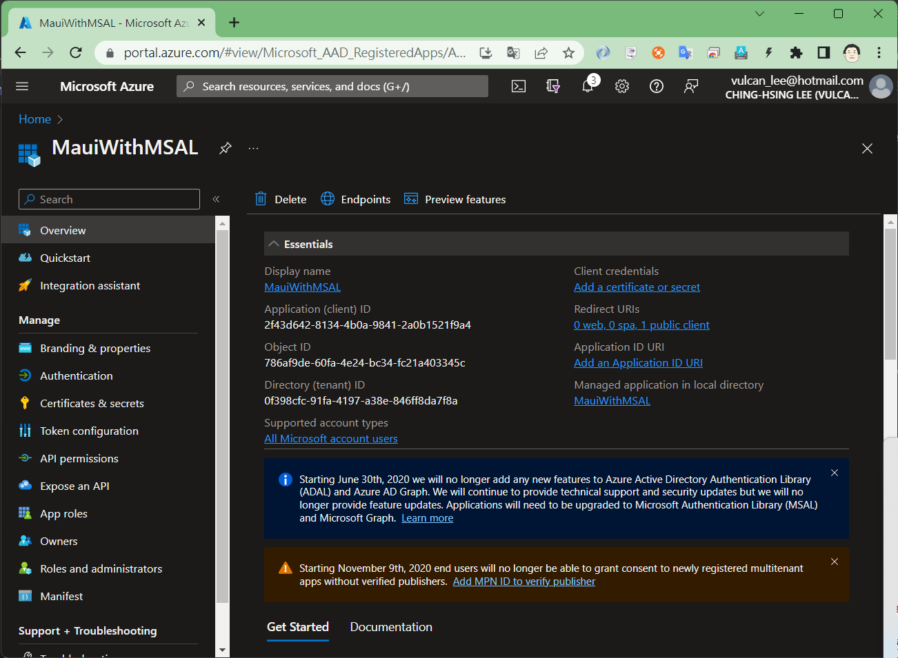
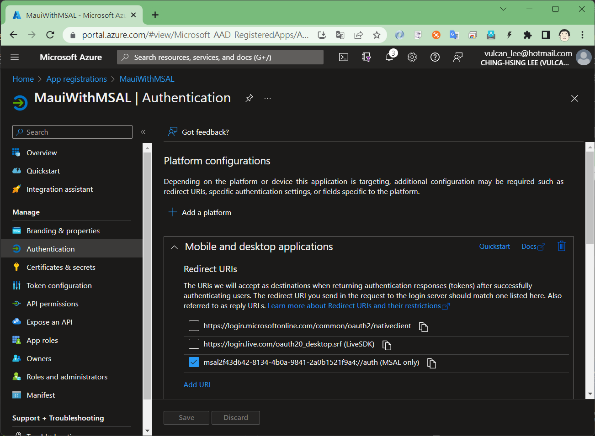
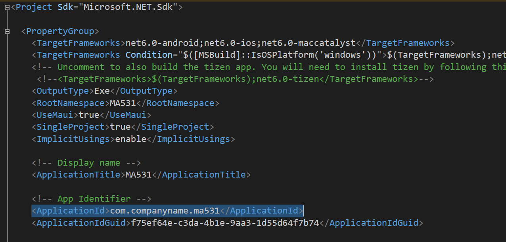
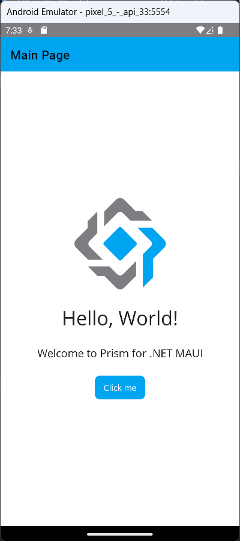
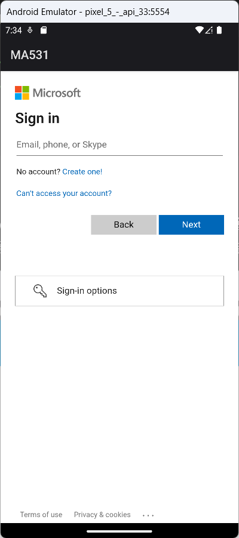
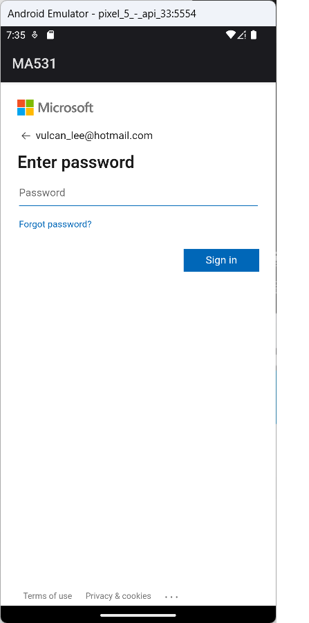
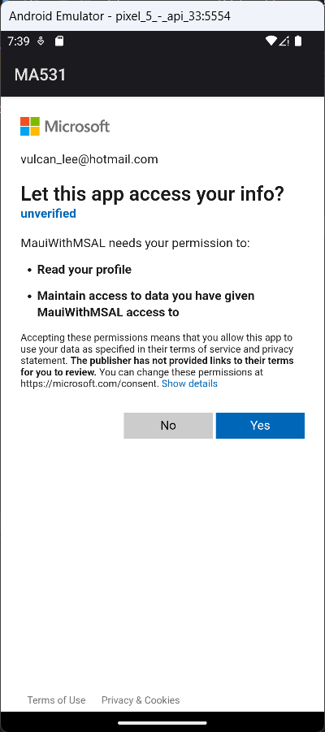
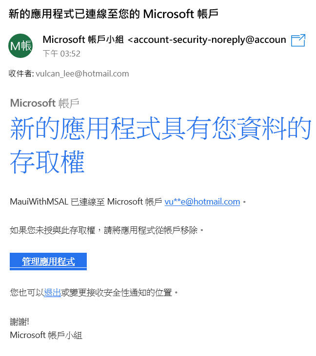
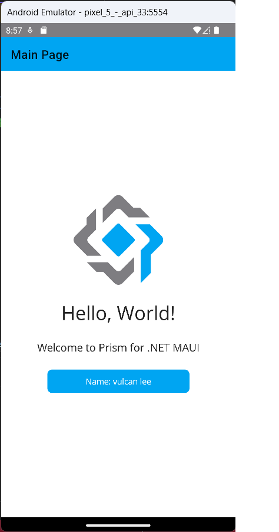

# AzureAD認證 2 : 在 .NET MAUL 專案內使用 Microsoft 驗證程式庫 (MSAL) 進行使用者身分驗證



剛剛完成了 Azure AD 應用程式的註冊程序，現在可以進行 .NET MAUI 跨平台應用程式的開發，透過剛剛建立起來的應用程式，做到透過 Azure AD 進行身分驗證的程序。

## 建立採用 Prism 開發框架的 MAUI 專案

* 打開 Visual Studio 2022 IDE 應用程式
* 從 [Visual Studio 2022] 對話窗中，點選右下方的 [建立新的專案] 按鈕
* 在 [建立新專案] 對話窗右半部
  * 切換 [所有語言 (L)] 下拉選單控制項為 [C#]
  * 切換 [所有專案類型 (T)] 下拉選單控制項為 [MAUI]
* 在中間的專案範本清單中，找到並且點選 [Vulcan Custom Prism .NET MAUI App] 專案範本選項
  
  >若沒有看到這個專案範本，請參考 [使用 Vulcan.Maui.Template 專案範本來進行 MAUI for Prism 專案開發](https://csharpkh.blogspot.com/2023/01/Create-First-MAUI-Project-By-Vulcan-Template.html) 文章，進行安裝這個專案範本到 Visual Studio 2022 內
* 點選右下角的 [下一步] 按鈕
* 在 [設定新的專案] 對話窗
* 在 [專案名稱] 欄位內輸入 `MA531` 做為這個專案名稱
* 請點選右下角的 [建立] 按鈕
* 此時，將會建立一個可以用於 MAUI 開發的專案

## 安裝需要用到的 NuGet 套件

* 滑鼠右擊專案內的 [相依性] 節點
* 從彈出功能表清單內選擇 [管理 NuGet 套件]
* 點選 NuGet 視窗上方的 [瀏覽] 標籤頁次
* 在文字搜尋盒內輸入 `Microsoft.Identity.Client`
* 一旦搜尋到 [Microsoft.Identity.Client] 這個套件，點選此套件並且安裝此套件

  >從 NuGet 上看到底下關於此套件的說明內容
  >
  >This package contains the binaries of the Microsoft Authentication Library for .NET (MSAL.NET).
  >
  >MSAL.NET makes it easy to obtain tokens from the Microsoft identity platform for developers (formally Azure AD v2.0) signing-in users with work & school accounts, Microsoft personal accounts, and social identities via Azure AD B2C. These tokens provide access to Microsoft Cloud API and any other API secured by the Microsoft identity platform. This version supports adding authentication functionality to your .NET based clients - .NET, .NET Framework, .NET MAUI, Xamarin iOS, Xamarin Android and UWP

* 滑鼠右擊專案內的 [相依性] 節點
* 從彈出功能表清單內選擇 [管理 NuGet 套件]
* 點選 NuGet 視窗上方的 [瀏覽] 標籤頁次
* 在文字搜尋盒內輸入 `System.IdentityModel.Tokens.Jwt`
* 一旦搜尋到 [System.IdentityModel.Tokens.Jwt] 這個套件，點選此套件並且安裝此套件

## 建立支援分類用的資料夾

* 滑鼠右擊專案節點
* 從彈出視窗中點選 [加入] > [新增資料夾]
* 使用 [Helpers] 名稱取代剛剛建立好的資料夾名稱

## 建立支援類別 - Constants.cs

* 滑鼠右擊專案節點下的 [Helpers] 節點
* 從彈出視窗中，點選 [加入] > [類別]
* 當 [新增項目] 對話窗出現之後，在下方 [名稱] 欄位內，輸入 `Constants`
* 最後點選右下方的 [新增] 按鈕
* 使用底下程式碼替換掉剛剛產生的程式碼

```csharp
namespace MA531.Helpers;

public static class Constants
{
    //The Application or Client ID will be generated while registering the app in the Azure portal. Copy and paste the GUID.
    public static readonly string ClientId = "2f43d642-8134-4b0a-9841-2a0b1521f9a4";

    //Leaving the scope to its default values.
    public static readonly string[] Scopes =
        new string[] { "User.Read", "profile", "openid" ,
             "email"};
}
```

## 建立支援類別 - Constants.cs

* 滑鼠右擊專案節點下的 [Helpers] 節點
* 從彈出視窗中，點選 [加入] > [類別]
* 當 [新增項目] 對話窗出現之後，在下方 [名稱] 欄位內，輸入 `AuthService`
* 最後點選右下方的 [新增] 按鈕
* 使用底下程式碼替換掉剛剛產生的程式碼

```csharp
using Microsoft.Identity.Client;
using System;
using System.Collections.Generic;
using System.Linq;
using System.Text;
using System.Threading.Tasks;

namespace MA531.Helpers;

public class AuthService
{
    private readonly IPublicClientApplication authenticationClient;

    // Providing the RedirectionUri to receive the token based on success or failure.
    public AuthService()
    {
        authenticationClient = PublicClientApplicationBuilder.Create(Constants.ClientId)
            .WithRedirectUri($"msal{Constants.ClientId}://auth")
            .Build();
    }

    public async Task Test()
    {
        var foo = await authenticationClient.GetAccountAsync(Constants.ClientId);
    }

    // Propagates notification that the operation should be cancelled.
    public async Task<AuthenticationResult> LoginAsync(CancellationToken cancellationToken)
    {
        AuthenticationResult result;
        try
        {
            result = await authenticationClient
                .AcquireTokenInteractive(Constants.Scopes)
                .WithPrompt(Prompt.ForceLogin) //This is optional. If provided, on each execution, the username and the password must be entered.
#if ANDROID
                .WithParentActivityOrWindow(Microsoft.Maui.ApplicationModel.Platform.CurrentActivity)
#endif
                .WithUseEmbeddedWebView(true)
                .ExecuteAsync(cancellationToken);

            return result;
        }
        catch (MsalClientException)
        {
            return null;
        }
    }
}
```

## 修正 ViewModel 程式碼

* 在 [ViewModels] 資料夾內找到並且打開 [MainPageViewModel.cs] 檔案
* 在最上方命名空間宣告處，加入底下程式碼

```csharp
using MA531.Helpers;
using Microsoft.Identity.Client;
using System.IdentityModel.Tokens.Jwt;
using System.Net.Http.Headers;
using System.Text;
```

* 找到 [Count()] 方法的宣告地方
* 使用底下程式碼替換掉原先的 Count() 方法程式碼

```csharp
private async Task Count()
{
    try
    {
        var authService = new AuthService();
        var result = await authService.LoginAsync(CancellationToken.None);
        var token = result?.IdToken; // AccessToken also can be used

        if (token != null)
        {
            var handler = new JwtSecurityTokenHandler();
            var data = handler.ReadJwtToken(token);
            var claims = data.Claims.ToList();
            if (data != null)
            {
                var stringBuilder = new StringBuilder();
                stringBuilder.AppendLine($"Name: {data.Claims.FirstOrDefault(x => x.Type.Equals("name"))?.Value}");
                stringBuilder.AppendLine($"Email: {data.Claims.FirstOrDefault(x => x.Type.Equals("preferred_username"))?.Value}");

                Text = stringBuilder.ToString();
                //await Toast.Make(stringBuilder.ToString()).Show();
            }
        }
    }
    catch (MsalClientException ex)
    {
        //await Toast.Make(ex.Message).Show();
    }
}
```

## Android 平台的修正

* 在專案節點下，找到 [Platforms] > [Android] > [MainActivity.cs] 檔案，並且打開這個檔案
* 在這個檔案最上方，加入這個命名空間宣告

```csharp
using Android.Content;
```

* 找到 [MainActivity] 類別
* 在這個類別內加入底下的方法

```csharp
protected override void OnActivityResult(int requestCode, Result resultCode, Intent? data)
{
    base.OnActivityResult(requestCode, resultCode, data);
    AuthenticationContinuationHelper.SetAuthenticationContinuationEventArgs(requestCode, resultCode, data);
}
```

* 更新 Android 資訊清單以支援 System WebView
* 在專案節點下，找到 [Platforms] > [Android] > [AndroidManifest.xml] 檔案，並且打開這個檔案
* 找到 [application] 節點
* 在這個節點內加入底下的宣告

```xml
<activity android:name="microsoft.identity.client.BrowserTabActivity"  android:exported="true">
    <intent-filter>
        <action android:name="android.intent.action.VIEW" />
        <category android:name="android.intent.category.DEFAULT" />
        <category android:name="android.intent.category.BROWSABLE" />
        <data android:scheme="msal2f43d642-8134-4b0a-9841-2a0b1521f9a4" android:host="auth" />
    </intent-filter>
</activity>
```

* 其中對於 `msal2f43d642-8134-4b0a-9841-2a0b1521f9a4` 這串文字，可以從 Azure Portal 上取得
* 請在剛剛建立的 [MauiWithMSAL] 之 [App registrations] 網頁上，在左半部面板的上方，可以找到 [Overview] 文字，請點選這個文字連結
* 在右半部面板的最右方，可以找到 [Redirect URIs] 文字
* 在其下方會有這個文字 [0 web, 0 spa, 1 public client] ，請點選這個文字連結

  

* 現在來到 [MauiWithMSAL | Authentication] 頁面
* 請找到 [Mobile and desktop applications] 區塊
* 將會看到一個已經有勾選檢查盒項目，該檢查盒的項目值為 msal 開頭，並且是以 ://auth 為結尾
* 請將這個 Redirect URLs 複製下來，不過請將 ://auth 文字移除掉
* 在這裡所複製的文字內容將會為底下內容，這是 .NET MAUI App 需要用到的 Redirect URLs

```
msal2f43d642-8134-4b0a-9841-2a0b1521f9a4
```

  

* 將剛剛取得的 .NET MAUI App 需要用到的 Redirect URLs 文字內容，填入到 `<data android:scheme="" android:host="auth" />` 這裡的 [scheme] 欄位內

* 在 [user-permission] 節點的上方，加入底下的宣告

```xml
<queries>
    <package android:name="com.azure.authenticator" />
    <package android:name="com.companyname.ma531" />
    <!-- This value should be copied from the MauiAuthApp.csproj file -->
    <package android:name="com.microsoft.windowsintune.companyportal" />
</queries>
```

* 其中，這個 `<package android:name="com.companyname.ma531" />` 宣告的 [name] 標籤值，必須要與這個 Android 專案要用到的套件名稱相同
* 對於 Android 平台下的套件名稱，可以透過底下方式找到或者來修改
* 滑鼠雙擊這個專案節點
* 現在將會看到這個專案定義檔案內容
* 在這個 xml 內容中，找到 `ApplicationId` 標籤，就可以看到套件名稱了

  

## 執行結果

* 切換到 [Android Emulator] 模式，選擇一個適合的模擬器，開始執行此專案，將會看到底下結果

  

* 點選下方的 [Click me] 按鈕
* 此時，將會切換到微軟帳號認證的網頁畫面，要求使用者輸入帳號與密碼
* 因為這個網頁是從微軟伺服器產生的，所以，使用者所輸入的帳號與密碼，這個 App 是無法知道的
* 請輸入一個合法的微軟帳號
  
  

* 請輸入該帳號的密碼

  

* 若是第一次使用，將會看到底下畫面，這裡會要求使用者確認授權這個 App 可以具有 [Read your profile] 與 [Maintain access to data you have given MauiWithMSAL] access to] 這兩個權限
* 也就是說，使用者必須同意 [MauiWithMSAL] 這個應用程式，可以代表該使用者去做/執行所授予權限的工作
  
  

* 若已經授予權限，剛剛登入的微軟帳號信箱，將會收到一封電子郵件，說明剛剛有授予一個 Azure Application 存取權限
* 若想要撤銷此授權，則可以透過該郵件下方的 [管理應用程式] 按鈕，開啟微軟帳號的管理網頁，就可以進行撤銷操作。

  
  
* 若輸入的帳號與密碼是正確的，此時，按鈕上的文字將會出現剛剛登入帳號的名字

  


