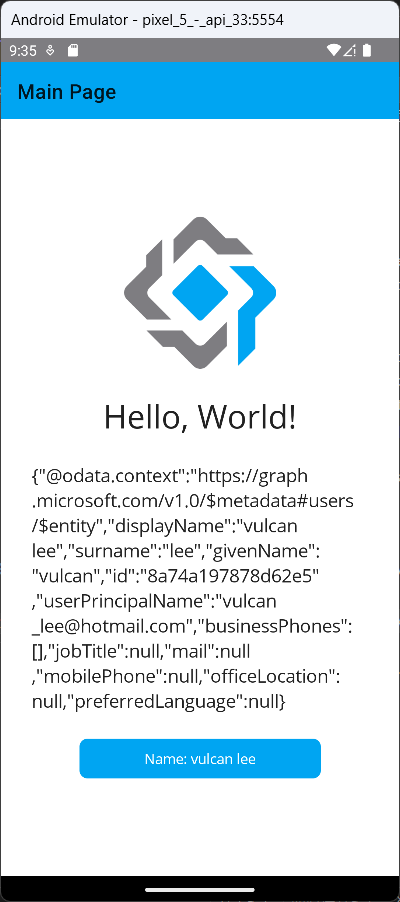

# AzureAD認證 3 : 如何透過 .NET MAUI 與  MSAL 得到的存取權杖，呼叫 Microsoft Graph API


在上一個練習中，在 Azure Portal 上建立一個 Azure Application，接著，建立一個 .NET MAUI 專案，並且在這個專案內加入了 MSAL 類別庫，透過 MSAL 所提供的 API，讓這個 App 可以使用微軟帳號，在微軟身分平台上進行驗證程序。

一旦通過微軟身分平台的驗證，便可以取得一個存取權杖，透過此存取權杖，便可以依照當初申請的權限，進行微軟 Graph API 的呼叫，執行各項工作了，例如，讀取郵件、讀取行事曆等等。

在這裡，將會延續剛剛練習的專案，透過微軟的 Graph API，讀取這個帳號的 Email 信箱資訊。

* 開啟上一個練習的 .NET MAUI 專案
* 從專案結下，找到並且打開 [ViewModels] > [MainPageViewModel.cs] 檔案
* 找到 `#region Property Member` 文字
* 在該文字下方輸入底下程式碼

```csharp
[ObservableProperty]
string graphMessage = "Welcome to Prism for .NET MAUI";
```

* 找到 `var handler = new JwtSecurityTokenHandler();` 程式碼
* 在其上方加入底下程式碼

```csharp
#region 呼叫 Microsoft Graph API
HttpClient client = new HttpClient();
client.DefaultRequestHeaders.Authorization =
    new AuthenticationHeaderValue("Bearer", result.AccessToken);
HttpResponseMessage response = await client
    .GetAsync("https://graph.microsoft.com/v1.0/me");

var bar = response.IsSuccessStatusCode;
var res = await response.Content.ReadAsStringAsync();
GraphMessage = res;
#endregion
```

* 從專案結下，找到並且打開 [Views] > [MainPage.xaml] 檔案
* 找到 `<Label Text="Welcome to Prism for .NET MAUI"` 標記宣告文字
* 將找到的文字修改為 `<Label Text="{Binding GraphMessage}"`


## 執行結果

* 切換到 [Android Emulator] 模式，選擇一個適合的模擬器，開始執行此專案
* 點選下方的 [Click me] 按鈕
* 此時，將會切換到微軟帳號認證的網頁畫面，要求使用者輸入帳號與密碼
* 若帳號密碼輸入正確無誤且為合法的，將會看到底下的畫面

  
  
