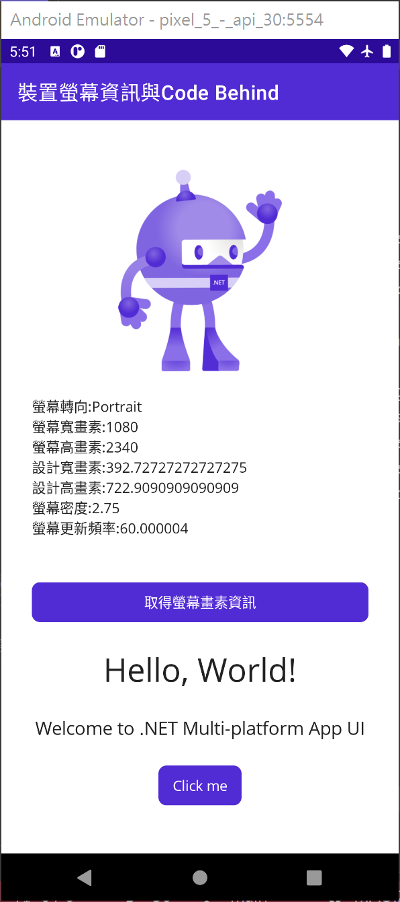
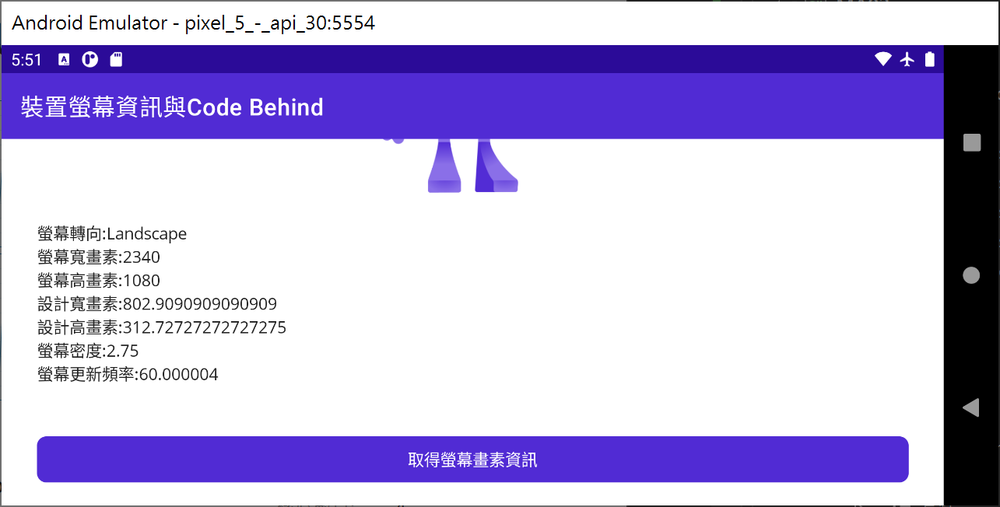

# 使用 Code Behind 取得裝置畫素與設計尺寸

對於想要使用 .NET MAUI 來進行跨平台開發的程式設計師，大部分的人最初心選擇將可能是採用 Code Behind 模式，而不是採用 MVVM 的方式，我猜想可能的原因是，絕大部分第一次採用 MAUI 開發的人，對於 MVVM 不太孰悉，有或者是有些懼怕這個新的設計模式的使用，也對於資料綁定 Data Binding 的用法有所懼怕吧。

在這裡將會使用 Code Behind 的方式，透過 .NET MAUI 內建的 [平臺整合](https://docs.microsoft.com/zh-tw/dotnet/maui/platform-integration?WT.mc_id=DT-MVP-5002220) 內的 [裝置顯示資訊](https://docs.microsoft.com/zh-tw/dotnet/maui/platform-integration/device/display?tabs=android&WT.mc_id=DT-MVP-5002220) API ，來讀取這些數據。

在這個練習中，其實最重要的是要表達設計尺寸這樣的觀念

## 建立 .NET MAUI 應用程式 專案

* 開啟 Visual Studio 2022 Preview 版本
* 點選螢幕右下角的 [建立新的專案] 按鈕
* 切換右上角的 [所有專案類型] 下拉選單控制項
* 找到並且點選 [MAUI] 這個選項
* 從清單中找到並選擇 [.NET MAUI 應用程式] 這個專案範本

  > 此專案可用於建立適用於 iOS、Android、Mac Catalyst、Tizen和WinUI 的 .NET MAUI 應用程式
* 點選右下角的 [下一步] 按鈕
* 當出現了 [設定新的專案] 對話窗
* 在 [專案名稱] 欄位內，輸入 `MA02`
* 點選右下角的 [下一步] 按鈕
* 當出現了 [其他資訊] 對話窗
* 對於 [架構] 的下拉選單控制項，使用預設值
* 點選右下角的 [建立] 按鈕

## 修正 View 檢視頁面

* 在專案根目錄找到並且打開 [MainPage.xaml] 檔案
* 使用底下 XAML 標記替換這個檔案內容

```xml
<?xml version="1.0" encoding="utf-8" ?>
<ContentPage xmlns="http://schemas.microsoft.com/dotnet/2021/maui"
             xmlns:x="http://schemas.microsoft.com/winfx/2009/xaml"
             x:Class="MA02.MainPage"
             Title="裝置螢幕資訊與Code Behind">

    <ScrollView>
        <VerticalStackLayout
            Spacing="25"
            Padding="30,0"
            VerticalOptions="Center">

            <Image
                Source="dotnet_bot.png"
                SemanticProperties.Description="Cute dot net bot waving hi to you!"
                HeightRequest="200"
                HorizontalOptions="Center" />

            <Label
                x:Name="labelDisplay"/>

            <Button
                x:Name="btnGetDisplayInformation"
                Clicked="btnGetDisplayInformation_Clicked"
                Text="取得螢幕畫素資訊"/>

            <Label
                Text="Hello, World!"
                SemanticProperties.HeadingLevel="Level1"
                FontSize="32"
                HorizontalOptions="Center" />

            <Label
                Text="Welcome to .NET Multi-platform App UI"
                SemanticProperties.HeadingLevel="Level2"
                SemanticProperties.Description="Welcome to dot net Multi platform App U I"
                FontSize="18"
                HorizontalOptions="Center" />

            <Button
                x:Name="CounterBtn"
                Text="Click me"
                SemanticProperties.Hint="Counts the number of times you click"
                Clicked="OnCounterClicked"
                HorizontalOptions="Center" />

        </VerticalStackLayout>
    </ScrollView>

</ContentPage>
```

在這裡，首先在這個根項目 Root Element ，也就是 ContentPage 內容頁面內，加入一個 Title 屬性，在這裡宣告了這個頁面的主題名稱，而這個文字將會顯示在這個頁面最上方。

在這個 版面配置 Layout 的 VerticalStackLayout 裡面，加入兩個檢視，第一個為文字標籤 `<Label x:Name="labelDisplay"/>`，在這個文字標籤內，使用標記延伸 Markup Extension 語法，也就是 `x:Name` 宣告這個控制項將會產生一個欄位名稱，也就是 labelDisplay，這個欄位將可以用於這個頁面類別內，讓各種方法或者事件來存取，如此，便可以透過這個物件來變更該文字標籤控制項的各個屬性或者樣貌。

底下將會是 .NET MAUI 根據 MainPage.xaml 這個 XAML 文件檔案內容，採用 [原始碼產生器](https://docs.microsoft.com/zh-tw/dotnet/csharp/roslyn-sdk/source-generators-overview?WT.mc_id=DT-MVP-5002220) 技術，所產生出來的一個 MainPage 類別。

從這裡首先得知，每個頁面 .xaml 檔案，最終都會形成 .NET 中的一個類別，而在此 XAML 文件中宣告的各個 版面配置、檢視，都會透過這裡的敘述 `global::Microsoft.Maui.Controls.Xaml.Extensions.LoadFromXaml(this, typeof(MainPage));` 產生出相對應的 .NET 執行個體，總而言之，這些 xaml 內容，都會有相對應的 .NET 物件存在，每個 XAML 物件，都有相對應的 .NET 類別。

最後，因為在 XAML 文件中有使用到 `x:Name="..."` 這樣的 [XAML 標記延伸](https://docs.microsoft.com/zh-tw/xamarin/xamarin-forms/xaml/markup-extensions?WT.mc_id=DT-MVP-5002220) 敘述，因此，將會在這個頁面類別內，宣告一個私有欄位 `private global::Microsoft.Maui.Controls.Label labelDisplay;` ，並且在建構式內，取得這個私有欄位對應的實際 XAML 中宣告的檢視物件 `labelDisplay = global::Microsoft.Maui.Controls.NameScopeExtensions.FindByName<global::Microsoft.Maui.Controls.Label>(this, "labelDisplay");`

為了要能夠做到與使用者互動機制，因此，加入一個按鈕 Button 按鈕，並且在這個按鈕的 Clicked 屬性中，宣告綁定一個事件 btnGetDisplayInformation_Clicked ，這個事件將會於 Code Behind 區段內進行設計相關商業邏輯程式碼。

```csharp
[assembly: global::Microsoft.Maui.Controls.Xaml.XamlResourceId("MA02.MainPage.xaml", "MainPage.xaml", typeof(global::MA02.MainPage))]
namespace MA02
{
	[global::Microsoft.Maui.Controls.Xaml.XamlFilePath("MainPage.xaml")]
	public partial class MainPage : global::Microsoft.Maui.Controls.ContentPage
	{
		[global::System.CodeDom.Compiler.GeneratedCode("Microsoft.Maui.Controls.SourceGen", "1.0.0.0")]
		private global::Microsoft.Maui.Controls.Label labelDisplay;

		[global::System.CodeDom.Compiler.GeneratedCode("Microsoft.Maui.Controls.SourceGen", "1.0.0.0")]
		private global::Microsoft.Maui.Controls.Button btnGetDisplayInformation;

        ...

		private void InitializeComponent()
		{
			global::Microsoft.Maui.Controls.Xaml.Extensions.LoadFromXaml(this, typeof(MainPage));
			labelDisplay = global::Microsoft.Maui.Controls.NameScopeExtensions.FindByName<global::Microsoft.Maui.Controls.Label>(this, "labelDisplay");
			btnGetDisplayInformation = global::Microsoft.Maui.Controls.NameScopeExtensions.FindByName<global::Microsoft.Maui.Controls.Button>(this, "btnGetDisplayInformation");
			
            ...
		}
	}
}
```

## 修正 View 檢視頁面 Code Behind 程式碼

* 在專案根目錄找到並且打開 [MainPage.xaml.cs] 檔案
* 使用底下 C# 程式碼替換這個檔案內容

```csharp
namespace MA02;

public partial class MainPage : ContentPage
{
    int count = 0;

    public MainPage()
    {
        InitializeComponent();
    }

    private void OnCounterClicked(object sender, EventArgs e)
    {
        count++;

        if (count == 1)
            CounterBtn.Text = $"Clicked {count} time";
        else
            CounterBtn.Text = $"Clicked {count} times";

        SemanticScreenReader.Announce(CounterBtn.Text);
    }

    private void btnGetDisplayInformation_Clicked(object sender, EventArgs e)
    {
        double designWidth =this.Width;
        double designHeight = this.Height;
        IDeviceDisplay display = DeviceDisplay.Current;
        labelDisplay.Text = $"螢幕轉向:{display.MainDisplayInfo.Orientation}{Environment.NewLine}" +
            $"螢幕寬畫素:{display.MainDisplayInfo.Width}{Environment.NewLine}" +
            $"螢幕高畫素:{display.MainDisplayInfo.Height}{Environment.NewLine}" +
            $"設計寬畫素:{designWidth}{Environment.NewLine}" +
            $"設計高畫素:{designHeight}{Environment.NewLine}" +
            $"螢幕密度:{display.MainDisplayInfo.Density}{Environment.NewLine}"+
            $"螢幕更新頻率:{display.MainDisplayInfo.RefreshRate}{Environment.NewLine}";
    }
}
```

這個類別 MainPage ，設計為一個 [partial class](https://docs.microsoft.com/zh-tw/dotnet/csharp/programming-guide/classes-and-structs/partial-classes-and-methods?WT.mc_id=DT-MVP-5002220)  部分類別，那表示了在另外一個地方，也就是原始碼產生器產生的地方，將會產生一個同樣名稱的部分類別，在整個專案編譯過程中，將會把這兩個部分類別程式碼組合成為同一個類別。

在最後面，加入一個 `private void btnGetDisplayInformation_Clicked(object sender, EventArgs e)` 事件委派方法，在該方法內首先取得這個內容頁面的設計畫素寬度與高度值，接著透過 平台整合 內的 DeviceDisplay.Current 屬性，取得當前這個裝置的螢幕相關資訊，在此將會取得與螢幕有關的相關資訊，例如，這個裝置的真正可用寬度與高度的畫素，現在的密度，也稱之為縮放比率。一旦取得這些資訊之後，便可以將這些字串設定到螢幕上的 文字標籤 檢視的 Text 屬性內，這樣，當使用者點選這個按鈕之後，就可以看到這些相關資訊在畫面中了。

## 在 Android 平台執行專案

* 點選中間上方工具列的 [Windows Machine] 這個工具列按鈕旁的下拉選單三角形
* 從彈出功能表中，找到 [Android Emulators] 內的任何一個模擬器
* 接者，開始執行這個專案，讓他可以在 Android 模擬器出現
* 此時，終於可以看到 [裝置螢幕資訊與Code Behind] 這個頁面了
* 請點選 [取得螢幕畫素資訊] 按鈕
* 將會看到底下資訊

  

* 將這個螢幕旋轉 90 度
* 請點選 [取得螢幕畫素資訊] 按鈕
* 將會看到底下資訊

  


