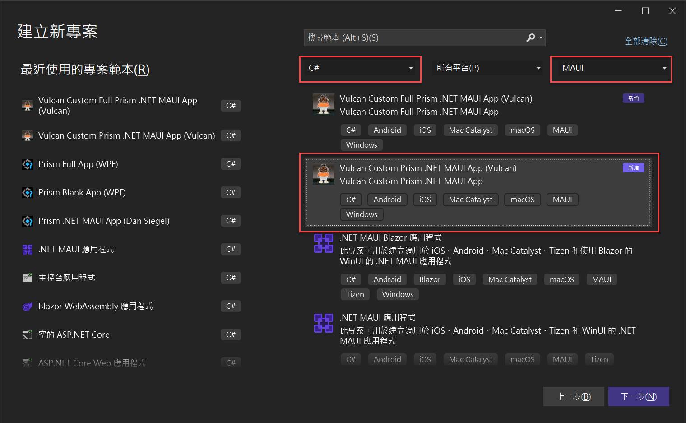
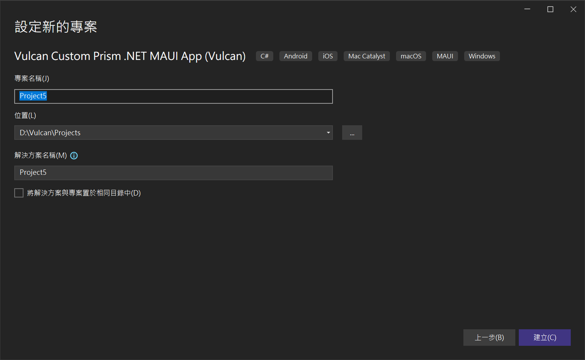
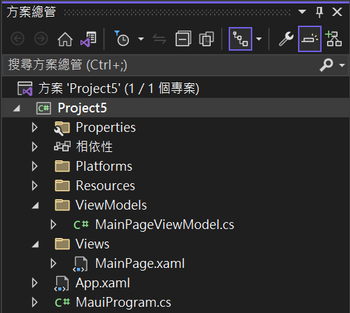
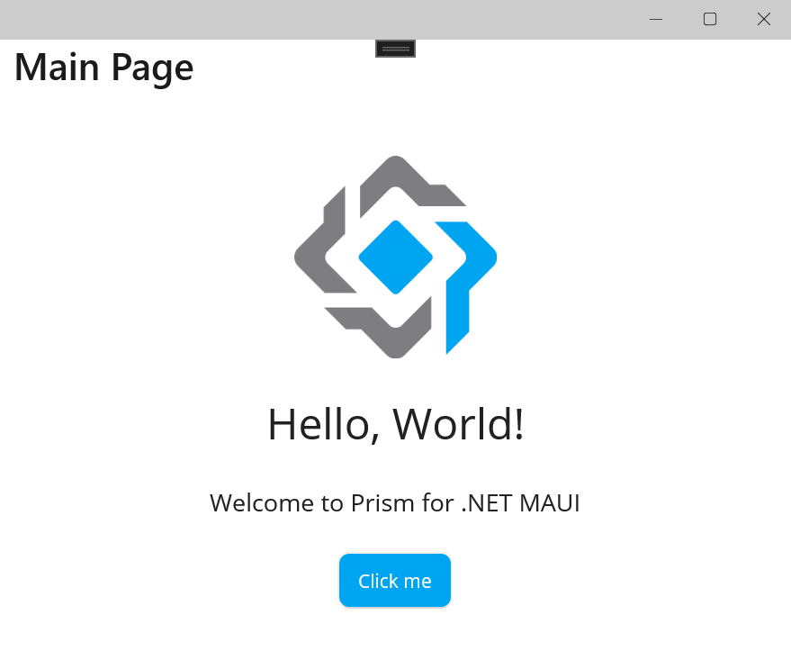
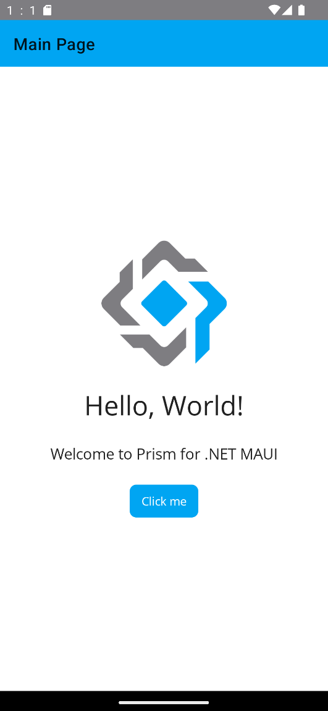

# 使用 Vulcan.Maui.Template 專案範本來進行 MAUI for Prism 專案開發

早期在進行 Xamarin.Forms 專案開發的時候，通常會搭配 Prism 這套開發框架來進行 MVVM 設計模式的程式碼開發，由於 Prism 是一個 Framework 開發框架，因此，當要第一次建立專案的時候，若採用 Xamarin.Forms 所提供的預設專案範本所建立的專案，將會需要做許多的修正，才能夠在專案內使用 Prism 開發框架所提供的功能；然而，Prism 團隊也提供了一個 Prism Template Pack 擴充工具，可以安裝在 Visual Studio IDE 內，一旦想要進行 Xamarin.Forms 專案開發的時候，便可以透過 Prism Template Pack 所提供的專案範本來進行專案開發。

隨著 MAUI 開發工具的到來，Prism Template Pack 並沒有隨之提供最新版本的 MAUI 支援，想要在 MAUI 專案內使用 Prism 所提供的功能，需要安裝 [Prism.Maui](https://github.com/PrismLibrary/Prism.Maui) 這個套件，當然，同樣的也需要將使用原生 MAUI 專案範本所建立的專案，進行調整。

Prism 開發團隊內的 Dan Siegel 提供了一個暫時性的替代方案，那就是 [Prism.Templates](https://www.nuget.org/packages/Prism.Templates) ，安裝好這個套件之後，就會在 Visual Studio 2022 開發工具內，出現可以使用 Prism 來開發 MAUI 的專案範本，可是， [Prism.Maui] 這個套件有升級，且使用方式有所不同，而且是會造成 Break Change ，可是，使用 [Prism.Templates] 所建立的專案範本卻沒有隨之升級，造成每次建立新的 MAUI 專案的時候，為了使用最新的 [Prism.Maui] 套件所提供的最新功能，又需要手動進行變更專案內的原始碼，使用起來相當的不方便。

有鑑於此，我自己進行開發出的可以採用最新 [Prism.Maui] 套件的專案範本套件，也就是 [Vulcan.Maui.Template](https://www.nuget.org/packages/Vulcan.Maui.Template) ，透過這個套件所產生出來的專案原始碼，已經預設安裝好 [CommunityToolkit.Mvvm](https://learn.microsoft.com/zh-tw/dotnet/communitytoolkit/mvvm?WT.mc_id=DT-MVP-5002220) 這個套件來進行 MVVM 的程式碼設計 (之前都是使用 PropertyChanged.Fody 這個套件來支援 MVVM 的開發)，使用起來便會更加方便了。

## 安裝

* 打開命令提示字元視窗
* 輸入 `dotnet new install Vulcan.Maui.Template`
* 底下將會是解除安裝過程出現的內容

```
C:\>dotnet new install Vulcan.Maui.Template
將安裝下列範本套件:
   Vulcan.Maui.Template

成功: Vulcan.Maui.Template::0.2.2 已安裝下列範本:
範本名稱                                 簡短名稱     語言  標記
---------------------------------------  -----------  ----  -------------------------------------------
Vulcan Custom Full Prism .NET MAUI App   Full-Maui    [C#]  MAUI/Android/iOS/macOS/Mac Catalyst/Windows
Vulcan Custom Prism .NET MAUI App        Vulcan-Maui  [C#]  MAUI/Android/iOS/macOS/Mac Catalyst/Windows
Vulcan Custom Prism View and View Model  MVVMItem     [C#]  MAUI/Android/iOS/macOS/Mac Catalyst/Windows
```

## 解除安裝
* 打開命令提示字元視窗
* 輸入 `dotnet new uninstall Vulcan.Maui.Template`
* 底下將會是解除安裝過程出現的內容

```
C:\>dotnet new uninstall Vulcan.Maui.Template
成功: Vulcan.Maui.Template::0.2.2 已解除安裝。
```

## 建立採用 Prism 開發框架的 MAUI 專案

* 打開 Visual Studio 2022 IDE 應用程式
* 從 [Visual Studio 2022] 對話窗中，點選右下方的 [建立新的專案] 按鈕
* 在 [建立新專案] 對話窗右半部
  * 切換 [所有語言 (L)] 下拉選單控制項為 [C#]
  * 切換 [所有專案類型 (T)] 下拉選單控制項為 [MAUI]
* 在中間的專案範本清單中，找到並且點選 [Vulcan Custom Prism .NET MAUI App] 專案範本選項

  

* 點選右下角的 [下一步] 按鈕
* 在 [設定新的專案] 對話窗

  
* 請點選右下角的 [建立] 按鈕
* 此時，將會建立一個可以用於 MAUI 開發的專案

## 專案結構內容說明

* 底下是建立好的專案結構螢幕截圖

  
* 在此專案內，已經預先建立好 [Views] 與 [ViewModels] 這兩個資料夾
* 底下將會是 [MauiProgram.cs] 的檔案內容

```csharp
using Prism.Ioc;
using Project5.ViewModels;
using Project5.Views;

namespace Project5;

public static class MauiProgram
{
    public static MauiApp CreateMauiApp()
    {
        var builder = MauiApp.CreateBuilder();
        builder
            .UseMauiApp<App>()
            .UsePrism(prism =>
            {

                prism.RegisterTypes(container =>
                      {
                          container.RegisterForNavigation<MainPage, MainPageViewModel>();
                      })
                     .OnInitialized(() =>
                      {
                          // Do some initializations here
                      })
                     .OnAppStart(async navigationService =>
                     {
                         // Navigate to First page of this App
                         var result = await navigationService
                         .NavigateAsync("NavigationPage/MainPage");
                         if (!result.Success)
                         {
                             System.Diagnostics.Debugger.Break();
                         }
                     });
            })
            .ConfigureFonts(fonts =>
            {
                fonts.AddFont("OpenSans-Regular.ttf", "OpenSansRegular");
                fonts.AddFont("OpenSans-Semibold.ttf", "OpenSansSemibold");
            });

        return builder.Build();
    }
}
```

* 這個專案將會使用 [Prism.DryIoc.Maui] 8.1.273-pre 這個現在最新的本版
* 在 [CreateMauiApp] 方法內，將會使用 [UsePrism] 這個擴充方法來進行對 Prism 開發框架的宣告
* 從 [RegisterTypes] 這個委派方法內，將會進行此專案會用到的各種服務、頁面的 IoC 容器註冊動作
* 從 [OnAppStart] 這個委派方法內，將會看到在此設定需要第一個開啟的頁面

* 底下將會是 [MainPage.xaml] 的檔案內容
* 在這裡加入一個 [viewModel] 命名空間宣告與使用 [x:DataType] 宣告需要使用編譯時期的資料綁定行為

```xml
<?xml version="1.0" encoding="utf-8" ?>
<ContentPage xmlns="http://schemas.microsoft.com/dotnet/2021/maui"
             xmlns:x="http://schemas.microsoft.com/winfx/2009/xaml"
             Title="{Binding Title}"
             x:Class="Project5.Views.MainPage"
             xmlns:viewModel="clr-namespace:Project5.ViewModels"
             x:DataType="viewModel:MainPageViewModel">

  <ScrollView>
    <VerticalStackLayout
            Spacing="25"
            Padding="30,0"
            VerticalOptions="Center">

      <Image Source="prism.png"
             SemanticProperties.Description="Cute dot net bot waving hi to you!"
             HeightRequest="150"
             HorizontalOptions="Center" />

      <Label Text="Hello, World!"
             SemanticProperties.HeadingLevel="Level1"
             FontSize="32"
             HorizontalOptions="Center" />

      <Label Text="Welcome to Prism for .NET MAUI"
             SemanticProperties.HeadingLevel="Level2"
             SemanticProperties.Description="Welcome to Prism for dot net Multi platform App U I"
             FontSize="18"
             HorizontalOptions="Center" />

      <Button Text="{Binding Text}"
              SemanticProperties.Hint="Counts the number of times you click"
              Command="{Binding CountCommand}"
              HorizontalOptions="Center" />

    </VerticalStackLayout>
  </ScrollView>

</ContentPage>
```

* 在這裡加入一個 [viewModel] 命名空間宣告與使用 [x:DataType] 宣告需要使用編譯時期的資料綁定行為

* 底下將會是 [MainPage.xaml] 的檔案內容

```csharp
using CommunityToolkit.Mvvm.ComponentModel;
using CommunityToolkit.Mvvm.Input;

namespace Project5.ViewModels;

public partial class MainPageViewModel : ObservableObject, INavigatedAware
{
    private int _count;

    public MainPageViewModel()
    {
    }

    [ObservableProperty]
    string title = "Main Page";

    [ObservableProperty]
    string text = "Click me";


    [RelayCommand]
    private void Count()
    {
        _count++;
        if (_count == 1)
            Text = "Clicked 1 time";
        else if (_count > 1)
            Text = $"Clicked {_count} times";
    }

    public void OnNavigatedFrom(INavigationParameters parameters)
    {
    }

    public void OnNavigatedTo(INavigationParameters parameters)
    {
    }
}
```

* 從最上方看出，這個 ViewModel 類別內，已經加入 Microsoft MVVM Toolkit 的命名空間宣告
* 這個 [MainPageViewModel] 類別也繼承了 [ObservableObject] 類別，並且該類別也宣告了 [partial]，表示了在這個類別內，可以開始使用 Microsoft MVVM Toolkit 所提供的功能
* 若想要設計一個資料綁定 Data Binding 的屬性，在這個類別內僅需要以 欄位 Field 的方式來設計此一成員，並且此欄位的名稱，需要符合欄位名稱命名慣例，也就是第一個字需要為小寫，最後，在該欄位上方加入 `[ObservableProperty]` 這個屬性宣告，如此，編譯器所觸發的原始碼產生器，將會自動產生出一個 屬性 Property 成員出來，並且也會實作出 [INotifyPropertyChanged] 會用到的各種方法
* 對於想要設計一個可用於命令綁定的物件，在此僅需要設計一個方法(並不一定需要 public)，接著，在此方法上方加入 `[RelayCommand]` 這個屬性宣告，如此，編譯器所觸發的原始碼產生器，將會自動產生出一個以這個方法名稱加入 [Command] 的 RelayCommand 物件，有了這個物件，便可以在相對應的頁面上，使用這個物件來進行命令的綁定。

## 執行結果

* 切換到 [Windows Machine] 模式，開始執行此專案，將會看到底下結果

  

* 切換到 [Android Emulator] 模式，選擇一個適合的模擬器，開始執行此專案，將會看到底下結果

  


