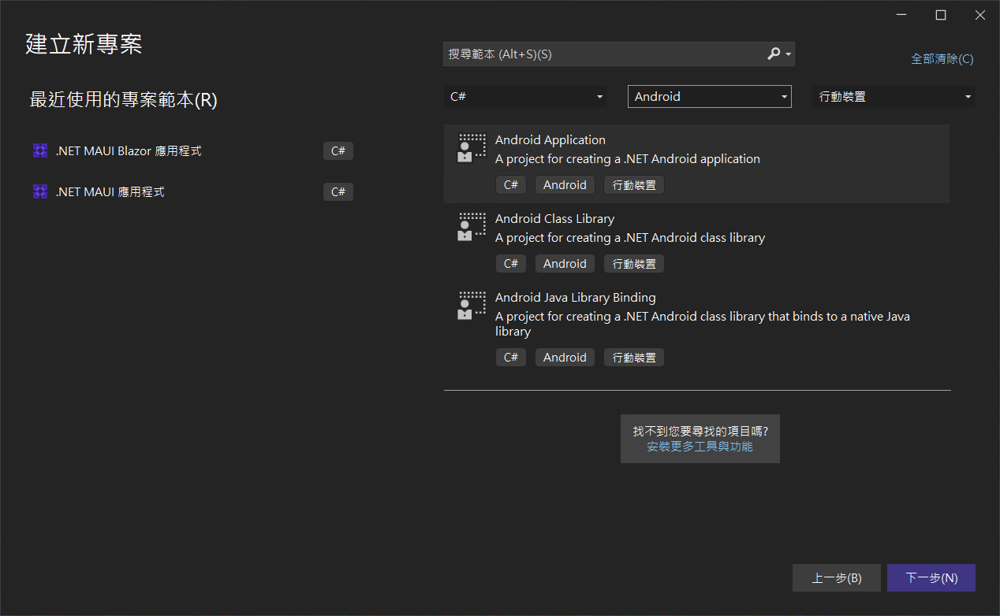
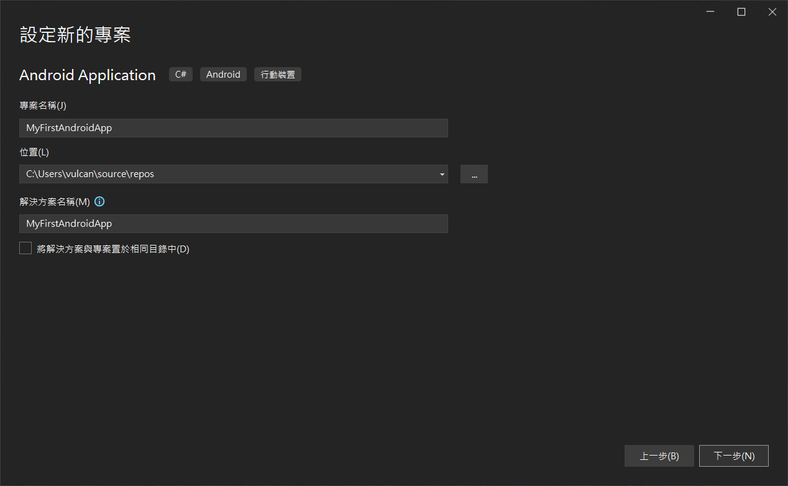
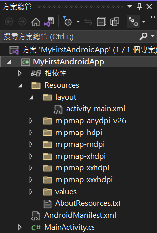
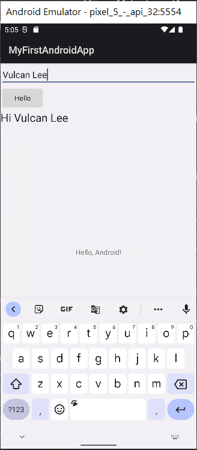

# 在 Visual Studio 2022 來建立 Android 原生 App 應用程式

在這篇文章中，將會說明如何建立一個 Android 原生應用程式，在這裡將會設計一個 Hello World 應用程式，其中將會包含一個可以輸入文字的 Widget 與 一個按鈕 和 一個顯示文字的 Widget。

使用者可以輸入文字的控制項中輸入任何的文字內容，接著，點選這個 [Hello] 按鈕，此時，將會觸發一個按鈕事件，在這個按鈕事件委派方法內，將會把剛剛輸入的文字，在其前面加入一個 Hello 文字，並且顯示到一個顯示文字的 Widget 上。

## 建立 Android 原生 App 專案

* 啟動 Visual Studio 2022 
* 看到 Visual Studio 2022 對話窗
* 請點選右下方的 [建立新的專案] 表示透過程式碼 Scaffolding 選擇專案範本以開始使用
* 當出現 [建立新專案] 對話窗
* 在中間最上方有三個下拉選單控制項
* 切換 [所有語言] 下拉選單控制項為 [C#]
* 切換 [所有平台] 下拉選單控制項為 [Android]
* 切換 [所有專案類型] 下拉選單控制項為 [行動裝置]
* 此時，在中間區域將會看到有三種專案範本可以選擇
* 請點選最上方那個 [Android Application] A project for creating a .NET Android Application
* 最後，點選右下方的 [下一步] 按鈕


* 在 [設定新的專案] 對話窗出現後
* 在 [專案名稱] 欄位內輸入 `MyFirstAndroidApp`
* 點選右下方的 [下一步] 按鈕

  
* 看到 [其他資訊] 對話窗，點選右下方的 [建立] 按鈕
* 稍微等候 Visual Studio 建立這個專案
* 底下是建立好的 Android 原生應用程式 整體方案的結構

  

## 設計該應用程式的頁面

* 在該專案下，找到 [Resources] 資料夾 > [layout] 資料夾 > [activity_main.xml] 檔案，並且打開這個檔案

* 請將底下的內容，複製到這個檔案內

```xml
<?xml version="1.0" encoding="utf-8"?>
<RelativeLayout xmlns:android="http://schemas.android.com/apk/res/android"
    xmlns:app="http://schemas.android.com/apk/res-auto"
    xmlns:tools="http://schemas.android.com/tools"
    android:layout_width="match_parent"
    android:layout_height="match_parent">
    <TextView 
        android:layout_width="wrap_content"
        android:layout_height="wrap_content"
        android:layout_centerInParent="true"
        android:text="@string/app_text"
    />
    <EditText
        android:layout_width="match_parent"
        android:layout_height="wrap_content"
        android:id="@+id/editText1" />
    <Button
        android:text="Hello"
        android:layout_width="wrap_content"
        android:layout_height="wrap_content"
        android:layout_below="@+id/editText1"
        android:id="@+id/button1" />
    <TextView
        android:text="Large Text"
        android:textAppearance="?android:attr/textAppearanceLarge"
        android:layout_width="wrap_content"
        android:layout_height="wrap_content"
        android:layout_below="@+id/button1"
        android:id="@+id/textView1" />

</RelativeLayout>
```

在這個 XML 檔案中，宣告了一個 [EditText] Widget，用來讓使用者可以輸入任何的文字，在其下方有個 [Button] Widget ，其按鈕名稱為 [Hello]，而最後加入的一個是 [TextView] Widget，將會用來顯示一個問好的唯讀文字在螢幕上。

* 現在，找到 [MainActivity.cs] 檔案，並打開這個檔案，使用底下的程式碼將其替換

```csharp
namespace MyFirstAndroidApp
{
    [Activity(Label = "@string/app_name", MainLauncher = true)]
    public class MainActivity : Activity
    {
        protected override void OnCreate(Bundle? savedInstanceState)
        {
            base.OnCreate(savedInstanceState);

            // Set our view from the "main" layout resource
            SetContentView(Resource.Layout.activity_main);

            EditText editText = FindViewById<EditText>(Resource.Id.editText1);
            TextView textView = FindViewById<TextView>(Resource.Id.textView1);
            Button button = FindViewById<Button>(Resource.Id.button1);

            button.Click += (s, e) =>
            {
                textView.Text = "Hi " + editText.Text;
            };

        }
    }
}
```

在這個 [MainActivity] 類別中，將會有個 [OnCreate] 覆寫方法，請在這個方法內，使用 [FindViewById] 方法，找出畫面中剛剛加入的三個 Widget，並且綁定到 .NET 中的三個區域變數內，最後，宣告 button 這個物件內的 [Click] 事件，一旦這個按鈕被使用者點選之後，將會觸發與執行這個委派事件，如此將會把剛剛輸入的文字，在其前面加入 [Hello] 文字，並且顯示在螢幕上。

## 執行並且檢視其執行結果

* 在最上方工具列中間區域，會看到一個綠色實體三角形，請下拉這個下拉選單控制項，從這裡個清單中，選擇 [Android Emulators] > [Pixel 5 - API 32 (Android 12.1 - API 32)] 這個選項

這裡將會是執行結果




