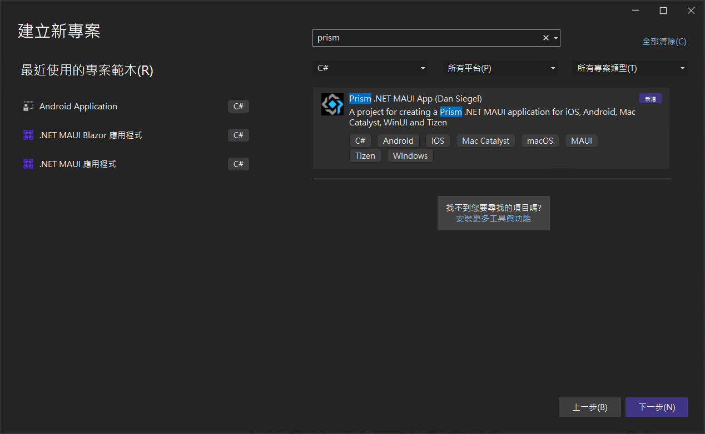
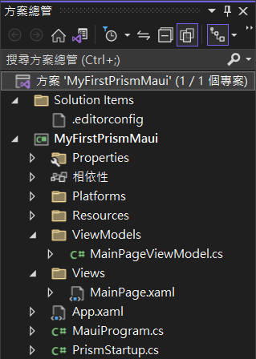
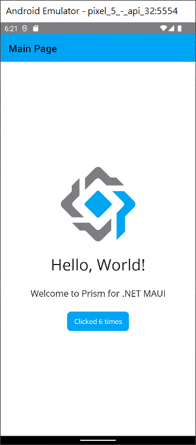

# 使用 Prism Template 來建立 MAUI 應用程式

在這個時間點，想要開發 MAUI 應用程式，需先要安裝 Visual Studio 2022 的 17.3 Preview 版本，因此，這裡已經安裝好可以開發 MAUI 專案的 17.3 Preview 開發工具了。

首先，要先安裝 Prism Template for MAUI ，想要做到這樣的需求，請先使用管理者權限來開啟 命令提示字元視窗，接著，在該視窗內輸入

dotnet new --install Prism.Templates::8.1.97

就可以把這個專案範本安裝到 Visual Studio 內，底下是下達這個命令之後的執行結果內容。

```
C:\Windows\system32>dotnet new --install Prism.Templates::8.1.97

歡迎使用 .NET 6.0!
---------------------
SDK 版本: 6.0.400-preview.22330.6

遙測
---------
.NET 工具會收集使用資料，協助我們改進您的體驗。資料會由 Microsoft 收集，並分享給社群使用。您可以選擇退出遙測，只要使用您慣用的殼層，將 DOTNET_CLI_TELEMETRY_OPTOUT 環境變數設定為 '1' 或 'true' 即可。

閱讀更多有關 .NET CLI 工具遙測的內容: https://aka.ms/dotnet-cli-telemetry

----------------
已安裝 ASP.NET Core HTTPS 開發憑證。
若要信任憑證，請執行 'dotnet dev-certs https --trust' (僅限 Windows 與 macOS )。
深入了解 HTTPS: https://aka.ms/dotnet-https
----------------
撰寫第一個應用程式: https://aka.ms/dotnet-hello-world
了解全新功能: https://aka.ms/dotnet-whats-new
探索文件: https://aka.ms/dotnet-docs
於 GitHub 回報問題和尋找來源: https://github.com/dotnet/core
Use 'dotnet --help' 查看可用的命令或瀏覽: https://aka.ms/dotnet-cli
--------------------------------------------------------------------------------------
將安裝下列範本套件:
   Prism.Templates::8.1.97

成功: Prism.Templates::8.1.97 已安裝下列範本:
範本名稱                         簡短名稱         語言  標記
-------------------------------  ---------------  ----  ------------------------------------------------------------
Prism .NET MAUI App              prism-maui       [C#]  MAUI/Android/iOS/macOS/Mac Catalyst/Windows/Tizen
Prism Blank App (Uno Platform)   uno-blank        [C#]  Prism/Xamarin/Uno Platform/WebAssembly/iOS/Android/WinUI/UWP
Prism Blank App (WPF)            wpf-core-blank   [C#]  Desktop
Prism Blank App (Xamarin.Forms)  xf-blank         [C#]  Prism/Xamarin/Xamarin.Forms
Prism Full App (WPF)             wpf-core-full    [C#]  Desktop
Prism Module (WPF)               wpf-module-core  [C#]  Desktop
Prism Module (Xamarin)           xf-module        [C#]  Prism/Xamarin/Xamarin.Forms
```

## 建立一個可以支援 Prism 開發框架的 MAUI 專案

* 開啟 Visual Studio 2022 Preview 版本
* 點選螢幕右下角的 [建立新的專案] 按鈕
* 在最上方的 [搜尋範本] 文字輸入盒內
* 輸入 `prism` 找出可用的專案範本

  

* 現在可以從 [建立新專案] 對話窗內出現了 [Prism .NET MAUI App (Dan Siegel)] 這個專案範本
* 選擇這個專案範本
* 點選右下角的 [下一步] 按鈕
* 當出現了 [設定新的專案] 對話窗
* 在 [專案名稱] 欄位內，輸入 `MyFirstPrismMaui`
* 點選右下角的 [建立] 按鈕

現在使用 Prism 開發框架的 MAUI 專案已經成功建立了

底下是建立好的整個專案結構



首先打開 [MauiProgram.cs] 這個檔案，將會看到底下的內容

```csharp
namespace MyFirstPrismMaui;

public static class MauiProgram
{
    public static MauiApp CreateMauiApp()
    {
        var builder = MauiApp.CreateBuilder();
        builder
            .UsePrismApp<App>(PrismStartup.Configure)
            .ConfigureFonts(fonts =>
            {
                fonts.AddFont("OpenSans-Regular.ttf", "OpenSansRegular");
                fonts.AddFont("OpenSans-Semibold.ttf", "OpenSansSemibold");
            });

        return builder.Build();
    }
}
```

在這裡所看到的是標準 MAUI 專案的啟動內容，不過，在此使用了

UsePrismApp<App>(PrismStartup.Configure)

敘述，指定要使用 Prism 作為這個專案的開發框架

因此，在這個專案根目錄下，找到並且打開 [PrismStartup.cs] 這個檔案，底下是這個檔案的內容

```csharp
using MyFirstPrismMaui.Views;

namespace MyFirstPrismMaui;

internal static class PrismStartup
{
    public static void Configure(PrismAppBuilder builder)
    {
        builder.RegisterTypes(RegisterTypes)
                .OnAppStart("NavigationPage/MainPage");
    }

    private static void RegisterTypes(IContainerRegistry containerRegistry)
    {
        containerRegistry.RegisterForNavigation<MainPage>()
                     .RegisterInstance(SemanticScreenReader.Default);
    }
}
```

在這裡將會看到 Prism 在這個專案中的設定程式碼，首先，對於 DI / IoC Container 相依性注入容器，並不是使用微軟內建的原件，而是 Prism 自己的，因此，想要注入的相關服務，要在這裡來進行註冊，當然，要使用到的頁面，也需要在這裡來宣告。


點選中間上方工具列的 [Windows Machine] 這個工具列按鈕旁的下拉選單三角形

從彈出功能表中，找到 [Android Emulators] 內的任何一個模擬器

接者，開始執行這個專案，讓他可以在 Android 模擬器出現

底下是執行後的結果



