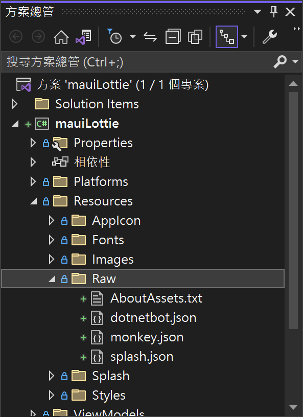
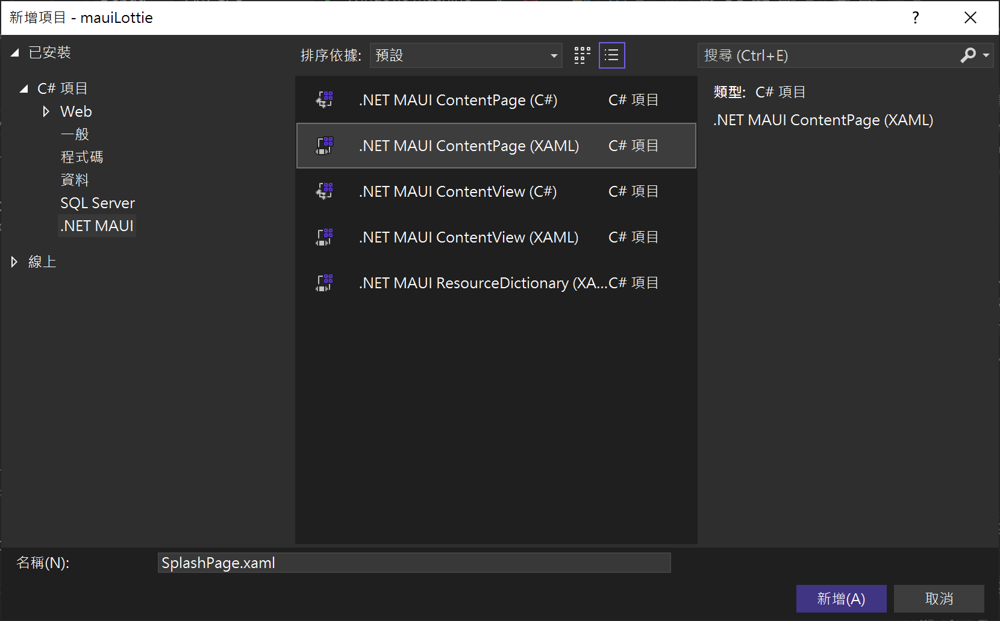
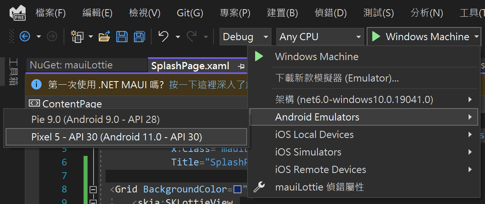
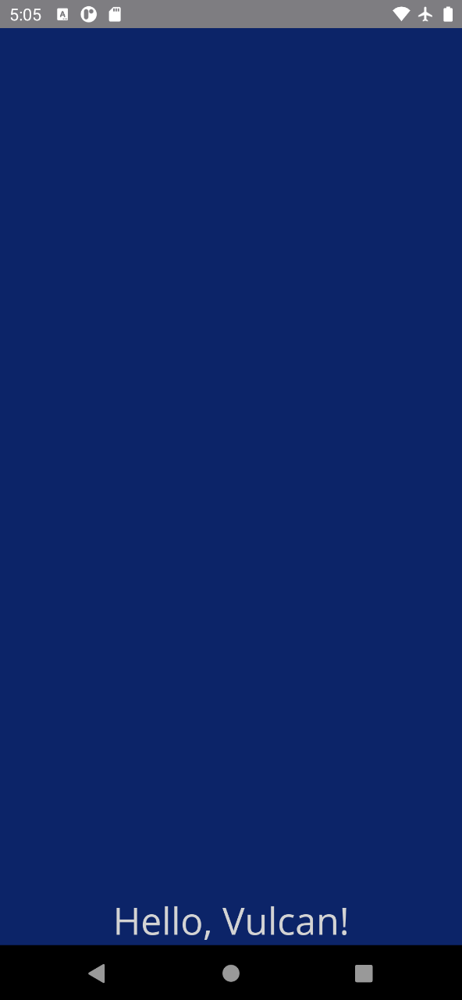
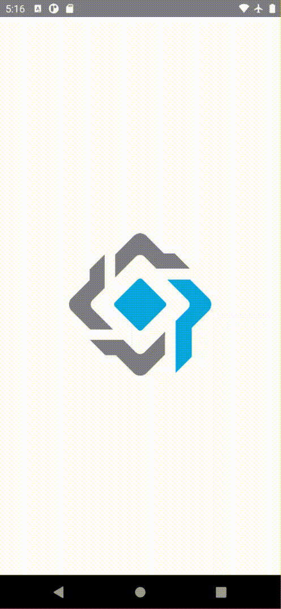

# 建立與使用 Lottie 來設計出具有動畫效果的 App

昨天觀看了一部教學影片，該影片中介紹了如何使用 [Lottie](https://airbnb.io/lottie/#/) 來設計出具有動畫效果的 App，其中，這個網站上對於 Lottie 的說明為 : Lottie 是一個適用於 Android、iOS、Web 和 Windows 的庫，它解析 [Adob​​e After Effects](https://www.adobe.com/products/aftereffects.html) 動畫，使用 [Bodymovin](https://github.com/airbnb/lottie-web) 導出為 json並在移動設備和 Web 上本地呈現它們！

整體呈現效果讓我覺得十分驚艷，因此，今天特別來自己動手實際來做一次，不過，在進行 MAUI 專案開發之前，我們需要一個 Lottie 檔案，這樣才能夠有動畫效果產生，因此，將會從 [LottieFiles](https://lottiefiles.com/) 網站中隨意搜尋出一個 Lottie JSON 檔案來進行操作。

## 建立新專案

* 開啟 Visual Studio 2022 Preview 開發工具

  > 在這個時間點，若想要使用 MAUI 專案來進行開發，需要安裝 Visual Studio 2022 17.3 Preview 版本，才能夠順利建立 MAUI 專案
* 當 [Visual Studio 2022 Preview] 對話窗出現的時候
* 點選右下角的 [建立新的專案] 按鈕選項
* 現在將看到 [建立新專案] 對話窗
* 切換右上角的 [所有專案類型] 下拉選單控制項
* 找到並且點選 [MAUI] 這個選項
* 從清單中找到並選擇 [Prism .NET MAUI App (Dan Siegel)] 這個專案範本

  > A project for creating a Prism .NET MAUI application for iOS, Android, Mac Catalyst, WinUI and Tizen

* 點選右下角的 [下一步] 按鈕
* 此時將會看到 [設定新的專案] 對話窗
* 在 [專案名稱] 欄位，輸入 `mauiLottie`
* 點選右下角的 [下一步] 按鈕
* 最後會看到 [其他資訊] 對話窗
* 使用預設設定值，也就是 [架構] 為 [.NET 6.0 (長期支援)]
* 點選右下角的 [建立] 按鈕

## 加入 PropertyChanged.Fody 的 NuGet 套件

* 滑鼠右擊該專案的 [相依性] 節點
* 從彈出功能表中選擇 [管理 NuGet 套件] 功能選項
* 此時，[NuGet: mauiLottie] 視窗將會出現
* 點選 [瀏覽] 標籤頁次
* 在左上方的搜尋文字輸入盒內輸入 `PropertyChanged.Fody` 關鍵字
* 若你沒有看到 8.0 以上的版本，請勾選 [包括搶鮮版] 檢查盒控制項
* 現在，將會看到 PropertyChanged.Fody 套件出現在清單內
* 點選這個 PropertyChanged.Fody 套件，並且點選右上方的 [安裝] 按鈕，安裝這個套件到這個專案內。

## 加入 SkiaSharp.Extended.UI.Maui 的 NuGet 套件

* 滑鼠右擊該專案的 [相依性] 節點
* 從彈出功能表中選擇 [管理 NuGet 套件] 功能選項
* 此時，[NuGet: mauiLottie] 視窗將會出現
* 點選 [瀏覽] 標籤頁次
* 在這個時間點，這個套件尚在 Preview 階段，因此，請先勾選 [包括搶鮮版] 檢查盒控制項
* 在左上方的搜尋文字輸入盒內輸入 `SkiaSharp.Extended.UI.Maui` 關鍵字
* 現在，將會看到 SkiaSharp.Extended.UI.Maui 套件出現在清單內
* 點選這個 SkiaSharp.Extended.UI.Maui 套件，並且點選右上方的 [安裝] 按鈕，安裝這個套件到這個專案內。

  > 安裝這個套件需要一些時間，請耐心等待

## 加入 Lottie 原始檔案

* 打開檔案總管
* 指向已經下載好的 Lottie 檔案
* 拖拉到方案總管內的 [mauiLottie] 專案節點 > [Resources] > [Raw] 資料夾內
* 這裡放入了三個 Lottie 檔案
* 完成後如下圖所示

  

## 註冊 SkiaSharp 服務

* 在專案根目錄下
* 找到並打開 [MauiProgram.cs] 檔案
* 在 `UsePrismApp<App>(PrismStartup.Configure)` 之後，加入 `.UseSkiaSharp()`
* 底下是完成後的程式碼

```csharp
using SkiaSharp.Views.Maui.Controls.Hosting;

namespace mauiLottie;

public static class MauiProgram
{
    public static MauiApp CreateMauiApp()
    {
        var builder = MauiApp.CreateBuilder();
        builder
            .UsePrismApp<App>(PrismStartup.Configure)
            .UseSkiaSharp()
            .ConfigureFonts(fonts =>
            {
                fonts.AddFont("OpenSans-Regular.ttf", "OpenSansRegular");
                fonts.AddFont("OpenSans-Semibold.ttf", "OpenSansSemibold");
            });

        return builder.Build();
    }
}
```

## 建立一個 Splash 頁面 View 與 ViewModel

* 滑鼠右擊 [Views] 資料夾
* 點選彈出功能表清單內的 [加入] > [新增項目] 選項
* 當 [新增項目 - mauiLottie] 對話窗出現後
* 點選左方清單 [已安裝] > [C#項目] > [.NET MAUI]
* 請在該對話窗中間區域，點選 [.NET MAUI ContentPage (XAML)] 第二個選項

  > 不是選擇第一個喔
* 在下方名稱文字輸入盒內，輸入 `SplashPage.xaml`
* 點選右下角的 [新增] 按鈕

  

* 將底下的 XAML 標記宣告替換現在這個頁面內容

```xml
<?xml version="1.0" encoding="utf-8" ?>
<ContentPage xmlns="http://schemas.microsoft.com/dotnet/2021/maui"
             xmlns:x="http://schemas.microsoft.com/winfx/2009/xaml"
             xmlns:skia="clr-namespace:SkiaSharp.Extended.UI.Controls;assembly=SkiaSharp.Extended.UI"
             x:Class="mauiLottie.Views.SplashPage"
             Title="SplashPage">

  <Grid BackgroundColor="#0c2468">
      <skia:SKLottieView
                Source="splash.json"
                RepeatCount="-1"
                SemanticProperties.Description="Cute dot net bot waving hi to you!"
                HeightRequest="480"
                WidthRequest="320"
                HorizontalOptions="Center" VerticalOptions="Center" />

      <Label
                Text="Hello, Vulcan!"
                SemanticProperties.HeadingLevel="Level1"
                FontSize="32" TextColor="LightGray"
                HorizontalOptions="Center" VerticalOptions="End" />
  </Grid>
</ContentPage>
```

* 滑鼠右擊 [ViewModels] 資料夾
* 點選彈出功能表清單內的 [加入] > [類別] 選項
* 當 [新增項目 - mauiLottie] 對話窗出現後
* 在下方名稱文字輸入盒內，輸入 `SplashPageViewModel.cs`
* 點選右下角的 [新增] 按鈕
* 將剛剛建立的 ViewModel 檔案內容，使用底下程式碼替換

```csharp
using System;
using System.Collections.Generic;
using System.Linq;
using System.Text;
using System.Threading.Tasks;

namespace mauiLottie.ViewModels
{
    using System.ComponentModel;
    using Prism.Events;
    using Prism.Navigation;
    using Prism.Services;
    public class SplashPageViewModel : INotifyPropertyChanged, INavigationAware
    {
        public event PropertyChangedEventHandler PropertyChanged;

        private readonly INavigationService navigationService;

        public SplashPageViewModel(INavigationService navigationService)
        {
            this.navigationService = navigationService;

        }

        public void OnNavigatedFrom(INavigationParameters parameters)
        {
        }

        public void OnNavigatedTo(INavigationParameters parameters)
        {
        }

    }
}
```

## 進行註冊剛剛建立的 View 與 ViewModel

* 在專案根目錄下
* 找到並打開 [PrismStartup.cs] 檔案
* 這裡是 Prism 的啟動與服務註冊的地方
* 找到 [Configure] 這個方法
* 將產生出來的 `builder.RegisterTypes(RegisterTypes).OnAppStart("NavigationPage/MainPage");` 敘述刪除掉
* 在原先位置上輸入 `builder.RegisterTypes(RegisterTypes).OnAppStart("SplashPage");` 敘述
* 找到 [RegisterTypes] 這個方法
* 在這個方法內加入 `containerRegistry.RegisterForNavigation<SplashPage>();` 敘述
* 底下是完成後的程式碼

```csharp
using mauiLottie.Views;

namespace mauiLottie;

internal static class PrismStartup
{
    public static void Configure(PrismAppBuilder builder)
    {
        builder.RegisterTypes(RegisterTypes)
                .OnAppStart("SplashPage");
    }

    private static void RegisterTypes(IContainerRegistry containerRegistry)
    {
        containerRegistry.RegisterForNavigation<MainPage>()
                     .RegisterInstance(SemanticScreenReader.Default);
        containerRegistry.RegisterForNavigation<SplashPage>();
    }
}
```

## 開始進行測試與觀看結果

* 點選中間上方工具列的 [Windows Machine] 這個工具列按鈕旁的下拉選單三角形
* 從彈出功能表中，找到 [Android Emulators] 內的任何一個模擬器
  
  
* 接者，開始執行這個專案，讓他可以在 Android 模擬器出現
* 底下是執行後的結果

  

很不幸的，在這裡竟然無法看到 Lottie 動畫

花了一點時間來做測試與研究，發現道並不是我的實作方法出了問題，而是 Prism.Maui 與 似乎有不相容現象，因此， 若按照底下步驟做些修正，其實，也就是這個 MAUI 專案不要使用 Prism.MAUI 這個套件，一切就會正常運作了，關於這個問題，我已經在 [Prism.Maui](https://github.com/PrismLibrary/Prism.Maui) 網頁中，建立一個 [Issue](https://github.com/PrismLibrary/Prism.Maui/issues/97) ，期待這個套件的維護工作者們，能否幫忙解決此一問題。

現在，來體驗看看正確版本的 Lottie 動畫效果吧～

## 移除 Prism.Maui 套件功能

* 在專案根目錄下
* 找到並且打開 [MauiProgram.cs] 檔案
* 將 `.UsePrismApp<App>(PrismStartup.Configure)` 移除
* 替換使用 `.UseMauiApp<App>()`
* 在專案根目錄下
* 找到並且打開 [App.xaml.cs] 檔案
* 找到 `InitializeComponent();` 敘述
* 在其底下加入 `MainPage = new SplashPage();`


## 開始進行測試與觀看結果

* 點選中間上方工具列的 [Windows Machine] 這個工具列按鈕旁的下拉選單三角形
* 從彈出功能表中，找到 [Android Emulators] 內的任何一個模擬器
* 接者，開始執行這個專案，讓他可以在 Android 模擬器出現
* 底下是執行後的結果

  

完美，這才是我想要的效果


