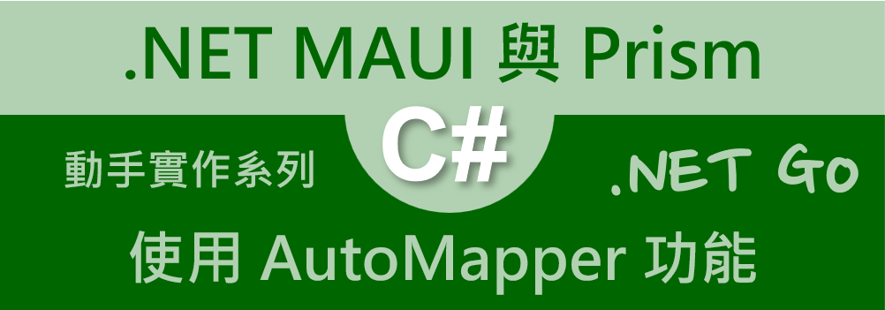
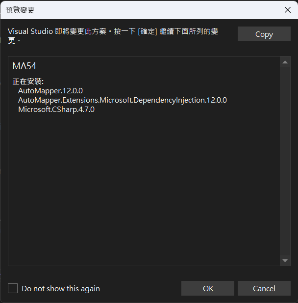
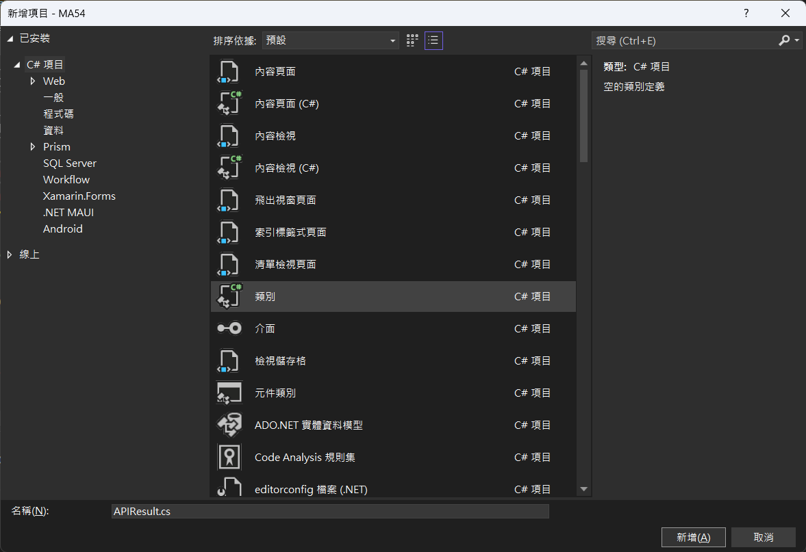
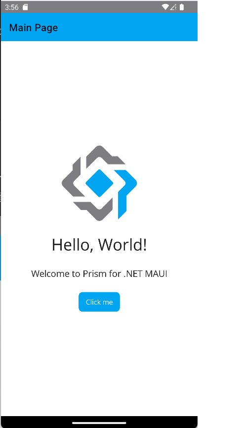
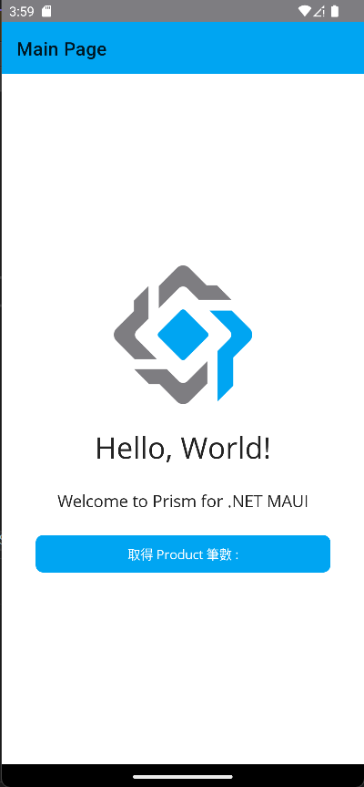

# 在 .NET MAUI 專案內使用 AutoMapper 套件，將 DTO 轉換成為 Model



在進行 .NET MAUI 專案開發的時候，通常會使用 Web API 的方式與外部系統進行通訊，進行相關資料的處理工作，為了要讓這兩個系統(.NET MAUI App 與 Web API 的系統)能夠具有鬆散耦合的協同運作方式，對於要進行 請求 Request 與 回應 Response 的資料模型，會抽取出來另外進行設計，兩個系統將會透過這個 DTO , Data Transfer Object 資料傳輸物件模型定義內容，進行彼此間的溝通。可是，對於各自系統內，將會有屬於自己的資料模型、商業模型、檢視模型等等，這個時候若自行進行這些模型物件的轉換工作，將會是相當耗費時間與人力成本的，因此，可以透過類似 AutoMapper 這樣的套件來完成這樣的需求，不用重新再次發明輪子。

AutoMapper 是一個 .NET C# 中的物件映射套件，它可以自動將一個類別的屬性映射到另一個類別的屬性。這個套件可以幫助您省去手動映射類別屬性的麻煩，並且可以大大簡化您的程式碼。

使用 AutoMapper，您只需要建立一個映射配置檔案，然後就可以讓 AutoMapper 自動地將一個類別的屬性映射到另一個類別的屬性。例如，如果您有一個 User 類別和一個 UserDTO 類別，您可以使用 AutoMapper 將 User 物件的屬性映射到 UserDTO 物件的屬性，而不需要手動逐個設定屬性。

在這裡將會要設計一個 .NET MAUI 專案，在此專案內將呼叫一個遠端 Web API，此 Web API 將會回傳一個 APIResult 型別的物件，其中在 Payload 屬性將會存放著型別為 ProductDto 型別的物件，接下來要來看看如何在 .NET MAUI 專案內，如何使用 AutoMapper 這個套件。

## 建立採用 Prism 開發框架的 MAUI 專案

* 打開 Visual Studio 2022 IDE 應用程式
* 從 [Visual Studio 2022] 對話窗中，點選右下方的 [建立新的專案] 按鈕
* 在 [建立新專案] 對話窗右半部
  * 切換 [所有語言 (L)] 下拉選單控制項為 [C#]
  * 切換 [所有專案類型 (T)] 下拉選單控制項為 [MAUI]
* 在中間的專案範本清單中，找到並且點選 [Vulcan Custom Prism .NET MAUI App] 專案範本選項
* 點選右下角的 [下一步] 按鈕
* 現在顯示出 [設定新的專案] 對話窗
* 在 [專案名稱] 欄位內輸入 `MA54` 作為此專案的名稱
* 請點選右下角的 [建立] 按鈕
* 此時，將會建立一個可以用於 MAUI 開發的專案

## 安裝 AutoMapper 套件

使用 AutoMapper 可以說相當的容易，僅需要安裝一個 [AutoMapper.Extensions.Microsoft.DependencyInjection] 套件，便可以開始使用

* 滑鼠右擊專案根目錄下的 [相依性] 節點
* 選擇 [管理 NuGet 套件] 選項
* 在 NuGet 視窗內，點選 [瀏覽] 標籤頁次
* 在 [搜尋] 文字輸入盒內，輸入 `AutoMapper.Extensions.Microsoft.DependencyInjection`
* 當搜尋到這個套件，點選這個套件，接著點選右上方的 [安裝] 按鈕，進行這個套件的安裝

  

## 建立 DTO 模型 APIResult 類別

在這個專案將會呼叫一個遠端 Web API，而該 API 服務將會回傳一個 [APIResult] 物件，這個物件就是一個 Data Transfer Object , DTO 型別的物件，主要的目的是提供呼叫各個 Web API ，都有統一回傳格式。

* 滑鼠右擊專案節點
* 在彈出功能清單視窗內，選擇 [加入] > [資料夾]
* 將剛剛產生的新資料夾命名為 `Dtos`
* 滑鼠右擊專案根目錄節點下的 [Dtos]
* 在彈出功能清單視窗內，選擇 [加入] > [類別]
* 在 [新增項目] 視窗的下方 [名稱] 欄位內輸入 `APIResult.cs`
* 點選視窗右下方的 [新增] 按鈕
  
  

* 使用底下程式碼替換掉剛剛建立檔案內容

```csharp
namespace MA54.Dtos;

/// <summary>
/// 呼叫 API 回傳的制式格式
/// </summary>
public class APIResult : ICloneable
{
    /// <summary>
    /// 此次呼叫 API 是否成功
    /// </summary>
    public bool Status { get; set; } = true;
    public int HTTPStatus { get; set; } = 200;
    public int ErrorCode { get; set; }
    /// <summary>
    /// 呼叫 API 失敗的錯誤訊息
    /// </summary>
    public string Message { get; set; } = "";
    /// <summary>
    /// 呼叫此API所得到的其他內容
    /// </summary>
    public object Payload { get; set; }

    #region 介面實作
    public APIResult Clone()
    {
        return ((ICloneable)this).Clone() as APIResult;
    }
    object ICloneable.Clone()
    {
        return this.MemberwiseClone();
    }
    #endregion
}
```

* 在這個 APIResult 類別內的程式碼，都已經加上了相關註解說明
* 通常在使用的時候，會如底下過程
  * 一旦呼叫 Web API 之後，所得到的 JSON 物件，將會是 [APIResult] 型別
  * 透過 [Status] 這個屬性，可以知道此次呼叫 Web API 結果是否有成功
  * 若不成功，可以透過 [Message] 屬性得到此次呼叫失敗的原因為何
  * 若呼叫 Web API 是成功的，將會有一個 JSON 物件存在放 [Payload] 屬性內，而其 .NET C# 的型別將會取決於各個 Web API 實際回傳物件而定。

## 建立 DTO 模型 ProductDto 類別

在這個練習中，若成功呼叫 Web API 之後，將會有個 [List<ProductDto>] 集合型別物件可以在 [Payload] 屬性中得到，因此，需要在此 App 中建立 [ProductDto] 型別類別。

* 滑鼠右擊專案根目錄節點下的 [Dtos]
* 在彈出功能清單視窗內，選擇 [加入] > [類別]
* 在 [新增項目] 視窗的下方 [名稱] 欄位內輸入 `ProductDto.cs`
* 點選視窗右下方的 [新增] 按鈕
* 使用底下程式碼替換掉剛剛建立檔案內容

```csharp
namespace MA54.Dtos;

public class ProductDto : ICloneable
{
    public int Id { get; set; }
    public string Name { get; set; }
    public short ModelYear { get; set; }
    public decimal ListPrice { get; set; }

    #region 介面實作
    public ProductDto Clone()
    {
        return ((ICloneable)this).Clone() as ProductDto;
    }
    object ICloneable.Clone()
    {
        return this.MemberwiseClone();
    }
    #endregion
}
```

* 在後端 Web API 內，將會有個 Product 型別，用來宣告每個 產品 應該要有哪些屬性要儲存
* 透過 Web API 的呼叫，在後端 Web API 將會把 [Product] 型別轉換成為 [ProductDto] 型別

  >在這個練習中，為了簡化操作，因此對於 [Product] 與 [ProductDto] 這兩個類別內的屬性成員，都是相同的

## 建立 產品模型 Product 類別

由於透過 Web API 取得的 [ProductDto] 型別物件，將是用於呼叫 Web API 傳送或回應之用，而在 .NET MAUI 應用專案內，當需要用到這些 [ProductDto] 物件，將會有些不方便，例如，這些 [xxxDto] 型別的物件內，都沒有實作 [INotifyPropertyChanged] 介面，因此，沒有辦法直接把這些 [xxxDto] 型別的物件用於 MVVM 設計模式下；所以，在 .NET MAUI 專案內將會需要設計一個 [Product] 型別，用於行動應用程式專案內使用，當然，這裡的 [Product] 型別物件會有可能與後端 Web API 內的 [Product] 型別物件有些不同

* 滑鼠右擊專案節點
* 在彈出功能清單視窗內，選擇 [加入] > [資料夾]
* 將剛剛產生的新資料夾命名為 `Models`
* 滑鼠右擊專案根目錄節點下的 [Models]
* 在彈出功能清單視窗內，選擇 [加入] > [類別]
* 在 [新增項目] 視窗的下方 [名稱] 欄位內輸入 `Product.cs`
* 點選視窗右下方的 [新增] 按鈕
* 使用底下程式碼替換掉剛剛建立檔案內容

```csharp
using CommunityToolkit.Mvvm.ComponentModel;

namespace MA54.Models;

public partial class Product : ObservableObject, ICloneable
{
    [ObservableProperty]
    int id = 0;
    [ObservableProperty]
    string name = string.Empty;
    [ObservableProperty]
    short modelYear = 0;
    [ObservableProperty]
    decimal listPrice = 0;

    #region 介面實作
    public Product Clone()
    {
        return ((ICloneable)this).Clone() as Product;
    }
    object ICloneable.Clone()
    {
        return this.MemberwiseClone();
    }
    #endregion
}
```

* 對於這裡新建立的 [Product] 類別，將會套用 [MVVM 工具組 , CommunityToolkit.Mvvm , 或稱之為 MVVM Toolkit](https://learn.microsoft.com/zh-tw/dotnet/communitytoolkit/mvvm?WT.mc_id=DT-MVP-5002220) 套件所提供的功能
* 因此，將會使用 [自動實作的屬性](https://learn.microsoft.com/zh-tw/dotnet/csharp/programming-guide/classes-and-structs/auto-implemented-properties?WT.mc_id=DT-MVP-5002220) 方式來宣告類別的屬性成員
* 而是使用 [欄位 Field](https://learn.microsoft.com/zh-tw/dotnet/csharp/programming-guide/classes-and-structs/fields?WT.mc_id=DT-MVP-5002220) 方式來宣告這些屬性成員，另外，都是使用 [Private] 方式來宣告
* 對於公開 Public 的屬性，將會透過 .NET Compiler Platform (Roslyn) 內的 [來源產生器](https://learn.microsoft.com/zh-tw/dotnet/csharp/roslyn-sdk/source-generators-overview?WT.mc_id=DT-MVP-5002220) 來產生出來
* 對於要用於 來源產生器 產生的屬性，在這些欄位上方都要使用 `[ObservableProperty]` 屬性來宣告
* 對於類別的宣告部分，這些類別需要繼承 [ObservableObject] 類別，而且，在類別前面需要使用 [partial] 這個修飾詞，這樣 MVVM Toolkit 才能夠正常運作

## 建立 AutoMapper 設定 類別

現在要來設計 AutoMapper 要用到的對應方式宣告，這裡需要告知 AutoMapper 物件，要將哪個型別對應到另外一個型別上(或者可以指定那些屬性使用那些組合會者自訂對應關係)

* 滑鼠右擊專案節點
* 在彈出功能清單視窗內，選擇 [加入] > [資料夾]
* 將剛剛產生的新資料夾命名為 `Helpers`
* 滑鼠右擊專案根目錄節點下的 [Helpers]
* 在彈出功能清單視窗內，選擇 [加入] > [類別]
* 在 [新增項目] 視窗的下方 [名稱] 欄位內輸入 `AutoMapping.cs`
* 點選視窗右下方的 [新增] 按鈕
* 使用底下程式碼替換掉剛剛建立檔案內容

```csharp
using AutoMapper;
using MA54.Dtos;
using MA54.Models;

namespace MA54.Helpers;

public class AutoMapping : Profile
{
    public AutoMapping()
    {
        #region DTO - Model 對應關係宣告
        CreateMap<Product, ProductDto>();
        CreateMap<ProductDto, Product>();
        #endregion
    }
}
```

* 這裡設計的類別將會需要繼承 [Profile] 類別
* 在該類別的建構式內，使用 `CreateMap<T1,T2>()` 方法，宣告不同型別的對應方式
* 在這裡宣告了當有個 [Product] 物件，可以透過 AutoMapper 將這個物件內的值，轉換到型別為 [ProductDto] 物件內
* 另外也宣告了當有個 [ProductDto] 物件，可以透過 AutoMapper 將這個物件內的值，轉換到型別為 [Product] 物件內

## 在程式進入點宣告 AutoMapper 服務

現在，為了要讓 AutoMapper 可以正常運作，需要將 AutoMapper 用到的服務註冊到相依性注入容器內

* 在專案根目錄下，找到並且打開 [MauiProgram.cs] 檔案
* 在該檔案最上方，加入底下的命名空間宣告

```csharp
using MA53.Helpers;
```

* 找到 `var builder = MauiApp.CreateBuilder();` 敘述
* 在其下方加入底下程式碼

```csharp
#region AutoMapper 服務註冊
builder.Services.AddAutoMapper(c => c.AddProfile<AutoMapping>());
#endregion
```

* 底下將會是完成後的程式碼

```csharp
using MA54.ViewModels;
using MA54.Views;
using MA54.Helpers;

namespace MA54;

public static class MauiProgram
{
    public static MauiApp CreateMauiApp()
    {
        var builder = MauiApp.CreateBuilder();

        #region AutoMapper 服務註冊
        builder.Services.AddAutoMapper(c => c.AddProfile<AutoMapping>());
        #endregion

        builder
            .UseMauiApp<App>()
            .UsePrism(prism =>
            {

                prism.RegisterTypes(container =>
                      {
                          container.RegisterForNavigation<MainPage, MainPageViewModel>();
                      })
                     .OnInitialized(() =>
                      {
                          // Do some initializations here
                      })
                     .OnAppStart(async navigationService =>
                     {
                         // Navigate to First page of this App
                         var result = await navigationService
                         .NavigateAsync("NavigationPage/MainPage");
                         if (!result.Success)
                         {
                             System.Diagnostics.Debugger.Break();
                         }
                     });
            })
            .ConfigureFonts(fonts =>
            {
                fonts.AddFont("OpenSans-Regular.ttf", "OpenSansRegular");
                fonts.AddFont("OpenSans-Semibold.ttf", "OpenSansSemibold");
            });

        return builder.Build();
    }
}
```

## 開始使用 AutoMapper 功能

完成相關準備與設定工作之後，便可以開始來使用 AutoMapper，當要使用 AutoMapper 的時候，可謂相當的簡單，只需要在建構式內注入 [IMapper] 這個型別物件，之後便可以透過此物件來進行不同型別物件的轉換工作。

* 在專案根目錄下，打開 [ViewModels] > [MainPageViewModel.cs] 檔案
* 在程式碼最上方加入底下命名空間的宣告

```csharp
using MA54.Dtos;
using MA54.Models;
```

* 使用底下程式碼，建立一個 [IMapper] 型別的私有欄位

```csharp
private readonly IMapper mapper;
```

* 找到這個 ViewModel 類別的建構式，也就是 `public MainPageViewModel(INavigationService navigationService)`
* 將這個建構式使用底下程式碼來取代

```csharp
public MainPageViewModel(INavigationService navigationService,
    IMapper mapper)
{
    this.navigationService = navigationService;
    this.mapper = mapper;
}
```

* 找到 `private void Count()` 方法宣告
* 將這個 Count() 方法程式碼，使用底下程式碼來替換

```csharp
private async Task Count()
{
    APIResult apiReslut = new();
    Text = "請稍後 ...";
    HttpClient client = new HttpClient();
    var responseMessage = await client
        .GetAsync("https://blazortw.azurewebsites.net/api/SampleAutoMapper");
    apiReslut = await responseMessage.Content.ReadFromJsonAsync<APIResult>();
    if (responseMessage.IsSuccessStatusCode)
    {
        if (apiReslut.Status == true)
        {
            List<ProductDto> productDtos = JsonConvert
                .DeserializeObject<List<ProductDto>>(
                apiReslut.Payload.ToString());
            List<Product> products = mapper.Map<List<Product>>(productDtos);
            Text = $"取得 Product 筆數 : {products.Count}";

            foreach (var item in products)
            {
                Text += $",{item.Name}";
            }
        }
    }
}
```

* 在 [Count()] 方法內，首先建立一個 [HttpClient] 物件，需要透過此物件進行 Web API 呼叫
* 使用 [HttpClient.GetAsync] 方法，發出一個 HTTP Get 請求 Request
* 當取得型別為 [HttpResponseMessage] 物件，也就是存放在 [responseMessage] 變數內，透過 `responseMessage.Content.ReadFromJsonAsync<APIResult>()` 取得 API 的回應結果，並且將回應 JSON 物件，反序列化成為 [APIResult] 型別的物件
* 若這個 [APIResult] 物件內的 [Status] 屬性為 true，那就表示此次呼叫 Web API 是成功的，若有回應 JSON 內容，將會存放在 [Payload] 屬性內
* 透過 `JsonConvert.DeserializeObject<List<ProductDto>>(apiReslut.Payload.ToString())` 方法，將 [Payload] 的 JSON 物件反序列化為 [List<ProductDto>] 型別的 .NET 物件
* 這裡反序列化的結果將會儲存在 [productDtos] 物件內
* 最後透過 `mapper.Map<List<Product>>(productDtos)` 方法，使用 IMapper 型別物件(該物件是透過建構式注入的方式來取得)內提供的 [Map]  泛型 API ，將取得的 `List<ProductDto>` 集合物件，轉換成為 `List<Product>` 型別的物件
* 完成這樣的需求僅需要一行程式碼即可以做到，若沒有類似 [AutoMapper] 這樣的物件，那就需要更多的程式碼來完成同樣的需求

## 執行結果

現在來實際測試看看執行結果

* 切換到 [Android Emulator] 模式，選擇一個適合的模擬器，開始執行此專案，將會看到底下結果

  

* 點選 [Click me] 按鈕，將會出現底下畫面結果

  


