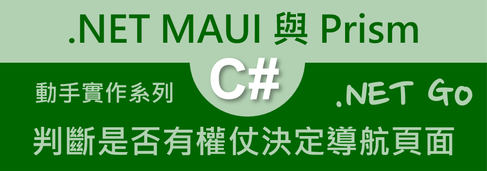
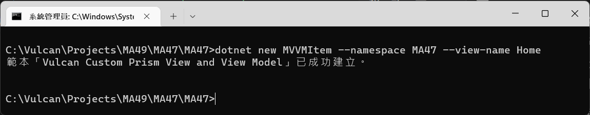
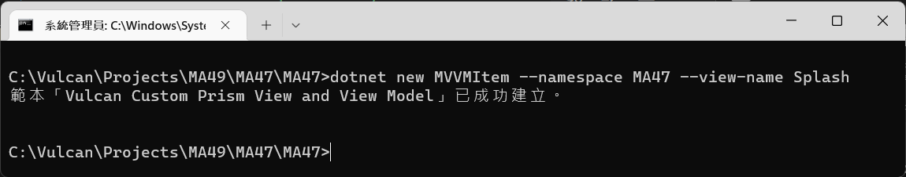
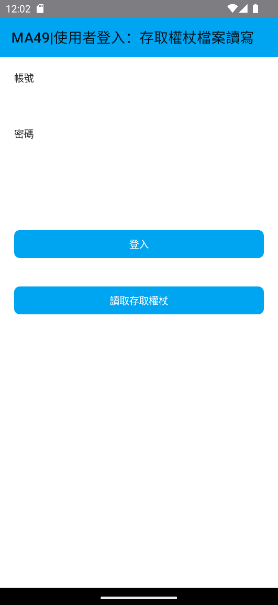
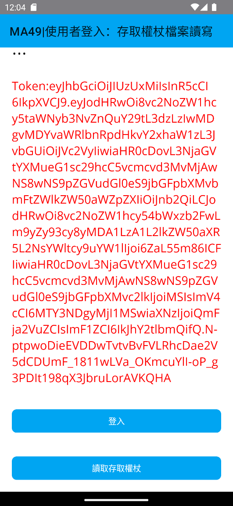

# 使用者登入：建立起動頁面，判斷存取權仗是否存在，決定需要導航到哪個頁面



在上一個動手實作練習中，[用者登入：透過呼叫 Web API 成功取得存取權杖後，進行檔案讀寫操作]，對於這個專案中，一旦取得通過身分驗證的存取權杖之後，將會得到一個 [LoginResponseDto] 之 JSON 序列化的字串，透過 .NET MAUI 內建的 [檔案系統協助程式](https://learn.microsoft.com/zh-tw/dotnet/maui/platform-integration/storage/file-system-helpers?WT.mc_id=DT-MVP-5002220) API，使用此 API 所提供的可以取得 [應用程式資料目錄] 路徑功能，便可以得到此應用程式在此行動中裝置內專屬的讀寫檔案路徑，為什麼稱之為專屬呢？這是因為這個目錄下的所有檔案，僅限於該應用程式可以來存取，別的應用程式是無法來讀寫的。

有了可以讀寫檔案的根目錄路徑之後，便可以使用 .NET BCL API 的 [File.ReadAllTextAsync 方法] 或 [File.WriteAllTextAsync 方法] 來進行文字內容的讀取與寫入需求，這也就表示了，可以把 JWT 物件或者其他 JSON 物件(這兩者都是文字內容)寫入到檔案內，若下次重新啟動這個應用程式之後，便可以重新從檔案中將這些內容讀取出來，以便可以在應用程式內繼續來使用。

在實際應用環境下，一旦成功通過身分驗證之後，取得了存取權杖之後，用戶端的程式需要將這個存取權杖儲存到本機環境內，不論這個 App 是否有重新啟動，日後都可以再將存取權杖重新讀取出來，用來呼叫受到保護的遠端 RESTful Web API。

現在要繼續接著上一個練習專案，接下來看看如何進行這樣需求的程式設計

## 建立 Home 首頁 View & ViewModel

* 打開命令提示字元視窗
* 切換到該專案目錄下 (例如： `C:\Vulcan\Projects\MA49\MA47\MA47` )
* 請在命令提示字元視窗內輸入 `dotnet new MVVMItem --namespace MA47 --view-name Home` 

  >這個命令將會在這個專案內的 Views 資料夾內產生 HomePage.xaml / HomePage.xaml.cs 這個 View 檔案
  >
  >另外，會在 ViewModels 資料夾內，產生 HomePageViewModel.cs 這個 ViewModel 檔案
  >
  >這兩個 View 與 ViewModel 檔案，都已經有預設一些內容在裡面

  

## 建立 Splash 啟動頁面 View & ViewModel

* 打開命令提示字元視窗
* 切換到該專案目錄下 (例如： `C:\Vulcan\Projects\MA49\MA47\MA47` )
* 請在命令提示字元視窗內輸入 `dotnet new MVVMItem --namespace MA47 --view-name Splash` 

  >這個命令將會在這個專案內的 Views 資料夾內產生 SplashPage.xaml / SplashPage.xaml.cs 這個 View 檔案
  >
  >另外，會在 ViewModels 資料夾內，產生 SplashPageViewModel.cs 這個 ViewModel 檔案
  >
  >這兩個 View 與 ViewModel 檔案，都已經有預設一些內容在裡面

  

## 針對剛剛建立的 View 與 ViewModel 對 IoC 容器進行註冊

* 一般來說，當建立一個新的 View 或者 ViewModel 之後，就需要在 DI 容器內宣告這兩個型別，以便日後可以進行導航與注入之用
* 在專案根目錄下，找到並且打開 [MauiProgram.cs] 檔案
* 找到 `container.RegisterForNavigation<MainPage, MainPageViewModel>();` 敘述
* 在該敘述下方加入底下程式碼

```csharp
container.RegisterForNavigation<SplashPage, SplashPageViewModel>();
container.RegisterForNavigation<HomePage, HomePageViewModel>();
```


* 在此將不會另外建立一個新的專案
* 打開剛剛實作練習完成的專案
* 在專案內，打開 [ViewModels] > [MainPageViewModel.cs] 檔案
* 找到 `string message = string.Empty;` 敘述，在其下方加入宣告一個型別為 LoginResponseDto 欄位，修正後的程式碼如下

```csharp
LoginResponseDto responseDto = new LoginResponseDto();
```

* 這個 responseDto 物件，將會持有呼叫 RESTful Web API 成功後的結果值

## 加入可以讀取 LoginResponseDto 物件的方法

* 找到 [async Task GetLoginTokenAsync()] 方法，在這個方法之後，加入一個類別要用到的非同步方法成員，程式碼如下

```csharp
async Task<bool> ReadLoginResponseAsync()
{
    string filename = Path.Combine(FileSystem.Current.AppDataDirectory,
        "LoginResponse.dat");
    try
    {
        string responseDtoContext = await File.ReadAllTextAsync(filename);
        responseDto = JsonConvert.DeserializeObject<LoginResponseDto>(responseDtoContext);
        return true;
    }
    catch (Exception ex)
    {
        responseDto = new LoginResponseDto();
        return false;
    }
}
```

* 這個讀取方法首先要建立該檔案的絕對路徑，這裡透過 [FileSystem.Current.AppDataDirectory] 取得該應用程式在行動裝置內儲存檔案的絕對路徑
* 接著透過 [Path.Combine] 方法，將這個路徑與要寫入的檔案名稱組合成為一個絕對檔案路徑字串
* 透過 .NET BCL 提供的 [File.ReadAllTextAsync] API，將這個檔案所有文字內容讀取出來，儲存在 [responseDtoContext] 區域變數內。
* 此時，要將剛剛讀取出來的文字，也就是一個 JSON 物件內容，反序列化成為 .NET 物件，這裡使用到 [JsonConvert.DeserializeObject<LoginResponseDto>] 這個強型別反序列方法來做到
* 反序列化的物件將會儲存到 [responseDto] 這個類別欄位成員內
* 若整個過程沒有發生例外異常，則會回傳 true，否則會回傳 false

## 加入可以寫入 LoginResponseDto 物件的方法

* 找到剛剛完成的 [ReadLoginResponseAsync()] 方法，在這個方法之後，加入一個類別要用到的非同步方法成員，程式碼如下

```csharp
async Task<bool> WriteLoginResponseAsync()
{
    string filename = Path.Combine(FileSystem.Current.AppDataDirectory,
        "LoginResponse.dat");
    try
    {
        string responseDtoContext = JsonConvert.SerializeObject(responseDto);
        await File.WriteAllTextAsync(filename, responseDtoContext);
        return true;
    }
    catch (Exception ex)
    {
        return false;
    }
}
```

* 在這個方法 [WriteLoginResponseAsync] 內，同樣的要先產生要寫入檔案的路徑內容
* 這裡透過 [FileSystem.Current.AppDataDirectory] 取得該應用程式在行動裝置內儲存檔案的絕對路徑
* 接著透過 [Path.Combine] 方法，將這個路徑與要寫入的檔案名稱組合成為一個絕對檔案路徑字串
* 接下來要將準備寫入檔案的 [responseDto] .NET 物件，序列化成為 JSON 物件，也就是一串文字內容
* 這裡透過 [JsonConvert.SerializeObject] API ，傳入 [responseDto] 物件，便會得到 JSON 文字內容，這個 JSON 物件將會暫時存放於 [responseDtoContext] 區域變數內
* 透過 .NET BCL 提供的 [File.WriteAllTextAsync] API，將檔案名稱與 JSON 物件傳入到這個 API 內，如此，將會把所有文字內容寫入到指定檔案內。
* 若整個過程沒有發生例外異常，則會回傳 true，否則會回傳 false

## 修正 Login 方法，使其可以將 JWT 存取權杖寫入到檔案內

* 找到 [async Task Login()] 方法
* 在 [responseDto = JsonConvert.DeserializeObject<LoginResponseDto>(apiResult.Payload.ToString());] 方法之後，加入底下敘述

```csharp
await WriteLoginResponseAsync();
```

* 這裡將會呼叫 [WriteLoginResponseAsync] 方法，將 [LoginResponseDto] .NET 物件，序列化成為 JSON 物件，接著寫入到指定檔案內

## 加入從檔案讀取 JWT 存取權杖的命令用方法

* 找到 [async Task Login()] 方法
* 在其下方加入一個命令使用的委派方法，其程式碼如下

```csharp
[RelayCommand]
async Task GetLoginTokenAsync()
{
    var success = await ReadLoginResponseAsync();
    if(success == true)
    {
        Message = responseDto.Token;
    }
    else
    {
        Message = $"無法讀取出存取權杖";
    }
}
```

* 透過 `[RelayCommand]` 屬性的宣告，使得可以在 XAML 頁面中，使用命令綁定方式來綁定到這個 [GetLoginTokenAsync] 方法上
* 所以當使用者在螢幕上點選了一個按鈕，而該按鈕有綁定這個命令物件，此時，這個 [GetLoginTokenAsync] 就會執行
* 首先將會呼叫 [ReadLoginResponseAsync] 方法，從特定檔案內讀取出含有 JWT 存取權杖的 JSON 文字物件出來，接著使用 JSON 反序列化方法產生出一個 .NET 物件
* 若該方法回傳 true ，這表示含有 JWT 存取權杖的物件已經成功還原回來，並且儲存在 [respnseDto] 欄位成員內，此時將存取權杖的文字內容指派給 [Message] 屬性，透過資料綁定的機制運作，螢幕上就會看到這個存取權杖內容了。
* 底下將會是完整的 ViewModel 程式碼

```csharp
using CommunityToolkit.Mvvm.ComponentModel;
using CommunityToolkit.Mvvm.Input;
using MA47.Dtos.Models;
using Newtonsoft.Json;
using System.Net.Http.Json;

namespace MA47.ViewModels;

public partial class MainPageViewModel : ObservableObject, INavigatedAware
{
    public MainPageViewModel()
    {
    }

    [ObservableProperty]
    string title = "MA49|使用者登入：存取權杖檔案讀寫";
    [ObservableProperty]
    string account = string.Empty;
    [ObservableProperty]
    string password = string.Empty;
    [ObservableProperty]
    string message = string.Empty;
    LoginResponseDto responseDto = new LoginResponseDto();

    [RelayCommand]
    async Task Login()
    {
        APIResult apiResult = await UserAuthenticationAsync();
        if (apiResult.Status == true)
        {
            responseDto = JsonConvert
                .DeserializeObject<LoginResponseDto>(apiResult.Payload.ToString());
            await WriteLoginResponseAsync();
            Message = $"Token:{responseDto.Token}";
        }
        else
        {
            Message = $"錯誤訊息:{apiResult.Message}";
        }
    }

    [RelayCommand]
    async Task GetLoginTokenAsync()
    {
        var success = await ReadLoginResponseAsync();
        if(success == true)
        {
            Message = responseDto.Token;
        }
        else
        {
            Message = $"無法讀取出存取權杖";
        }
    }


    async Task<bool> ReadLoginResponseAsync()
    {
        string filename = Path.Combine(FileSystem.Current.AppDataDirectory,
            "LoginResponse.dat");
        try
        {
            string responseDtoContext = await File.ReadAllTextAsync(filename);
            responseDto = JsonConvert.DeserializeObject<LoginResponseDto>(responseDtoContext);
            return true;
        }
        catch (Exception ex)
        {
            responseDto = new LoginResponseDto();
            return false;
        }
    }

    async Task<bool> WriteLoginResponseAsync()
    {
        string filename = Path.Combine(FileSystem.Current.AppDataDirectory,
            "LoginResponse.dat");
        try
        {
            string responseDtoContext = JsonConvert.SerializeObject(responseDto);
            await File.WriteAllTextAsync(filename, responseDtoContext);
            return true;
        }
        catch (Exception ex)
        {
            return false;
        }
    }

    public void OnNavigatedFrom(INavigationParameters parameters)
    {
    }

    public void OnNavigatedTo(INavigationParameters parameters)
    {
    }

    async Task<APIResult> UserAuthenticationAsync()
    {
        APIResult apiResult = null;
        LoginRequestDto loginRequestDto = new LoginRequestDto()
        {
            Account = Account,
            Password = Password,
        };

        HttpClient client = new HttpClient();
        client.BaseAddress = new Uri("https://blazortw.azurewebsites.net");
        HttpResponseMessage httpResponse = await client.PostAsJsonAsync("/api/Login", loginRequestDto);
        if (httpResponse.IsSuccessStatusCode)
        {
            apiResult = await httpResponse.Content.ReadFromJsonAsync<APIResult>();
            return apiResult;
        }
        else
        {
            apiResult = await httpResponse.Content.ReadFromJsonAsync<APIResult>();
            return apiResult;
        }
    }
}
```

## 加入一個讀取存取權杖的按鈕到頁面上

* 在專案內，打開 [Views] > [MainPage.xaml] 檔案
* 找到 `<Button Text="登入" Margin="0,40,0,0" Command="{Binding LoginCommand}"/>` 宣告標記
* 在其下方加入另外一個按鈕

```xml
<Button Text="讀取存取權杖"
        Margin="0,40,0,0"
        Command="{Binding GetLoginTokenCommand}"/>
```

* 底下將會是整個頁面的 XAML 內容

```xml
<?xml version="1.0" encoding="utf-8" ?>
<ContentPage xmlns="http://schemas.microsoft.com/dotnet/2021/maui"
             xmlns:x="http://schemas.microsoft.com/winfx/2009/xaml"
             Title="{Binding Title}"
             x:Class="MA47.Views.MainPage"
             xmlns:viewModel="clr-namespace:MA47.ViewModels"
             x:DataType="viewModel:MainPageViewModel">

    <ScrollView>
        <VerticalStackLayout
            Margin="20">
            <Label Text="帳號"/>
            <Entry Text="{Binding Account}"/>

            <Label Text="密碼"
                   Margin="0,20,0,0"/>
            <Entry Text="{Binding Password}"
                   IsPassword="True"/>

            <Label Text="{Binding Message}"
                   Margin="0,20,0,0"
                   FontSize="20"
                   TextColor="Red"/>

            <Button Text="登入"
                    Margin="0,40,0,0"
                    Command="{Binding LoginCommand}"/>
            <Button Text="讀取存取權杖"
                    Margin="0,40,0,0"
                    Command="{Binding GetLoginTokenCommand}"/>
        </VerticalStackLayout>
    </ScrollView>

</ContentPage>
```

## 執行結果

* 切換到 [Android Emulator] 模式，選擇一個適合的模擬器，開始執行此專案
* 現在將會看到螢幕上多了一個 [讀取存取權杖] 按鈕

  

* 請在 帳號 與 密碼 欄位輸入正確的使用者憑證，再點選 [登入] 按鈕，就會看到底下成功登入後取得 JWT 存取權杖的畫面

  >合法的使用者憑證為
  >
  >帳號：god
  >
  >密碼：123

  

* 現在，可以關閉這個應用程式，接著重新執行此專案
* 當畫面出現後， [讀取存取權杖] 按鈕，便會看到剛剛寫入的存取權杖了


