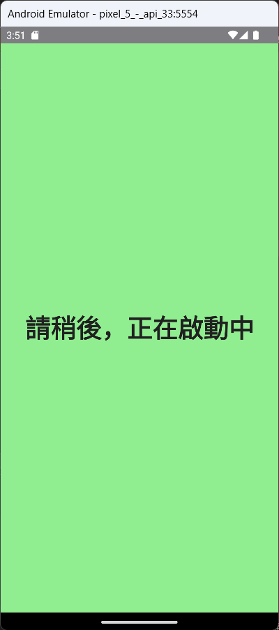
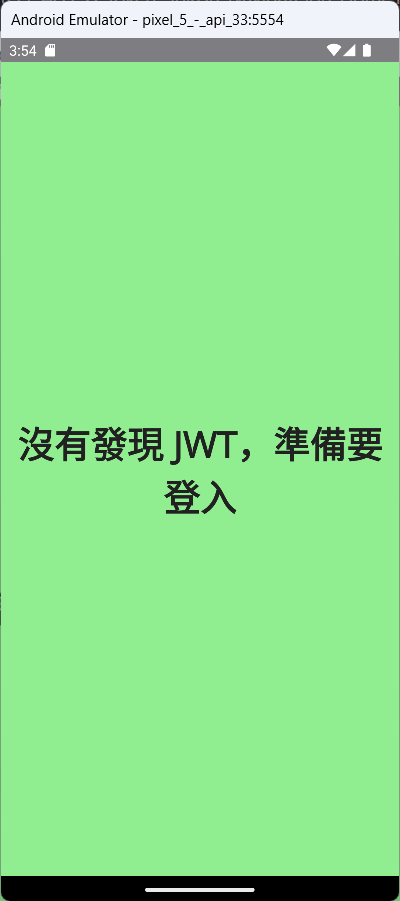
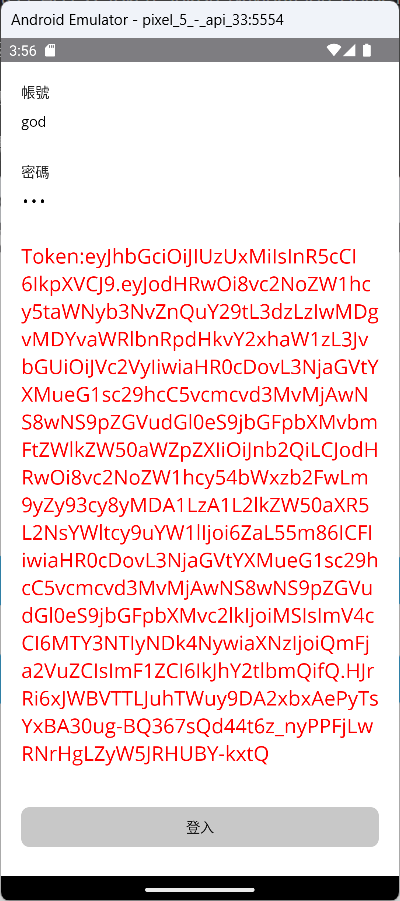
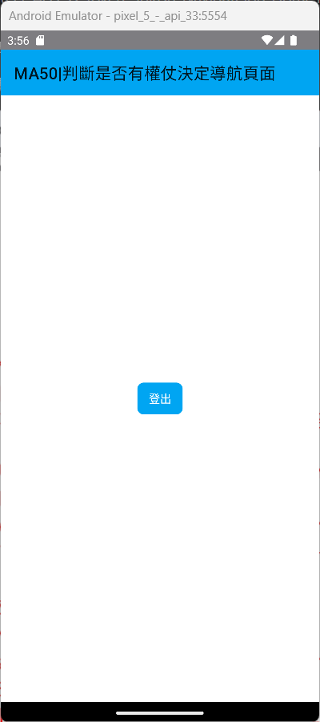

# 使用者登入：建立起動頁面，判斷存取權仗是否存在，決定需要導航到哪個頁面


在上一個動手實作練習中，[用者登入：透過呼叫 Web API 成功取得存取權杖後，進行檔案讀寫操作]，對於這個專案中，一旦取得通過身分驗證的存取權杖之後，將會得到一個 [LoginResponseDto] 之 JSON 序列化的字串，透過 .NET MAUI 內建的 [檔案系統協助程式](https://learn.microsoft.com/zh-tw/dotnet/maui/platform-integration/storage/file-system-helpers?WT.mc_id=DT-MVP-5002220) API，使用此 API 所提供的可以取得 [應用程式資料目錄] 路徑功能，便可以得到此應用程式在此行動中裝置內專屬的讀寫檔案路徑，為什麼稱之為專屬呢？這是因為這個目錄下的所有檔案，僅限於該應用程式可以來存取，別的應用程式是無法來讀寫的。

有了可以讀寫檔案的根目錄路徑之後，便可以使用 .NET BCL API 的 [File.ReadAllTextAsync 方法] 或 [File.WriteAllTextAsync 方法] 來進行文字內容的讀取與寫入需求，這也就表示了，可以把 JWT 物件或者其他 JSON 物件(這兩者都是文字內容)寫入到檔案內，若下次重新啟動這個應用程式之後，便可以重新從檔案中將這些內容讀取出來，以便可以在應用程式內繼續來使用。

在實際應用環境下，一旦成功通過身分驗證之後，取得了存取權杖之後，用戶端的程式需要將這個存取權杖儲存到本機環境內，不論這個 App 是否有重新啟動，日後都可以再將存取權杖重新讀取出來，用來呼叫受到保護的遠端 RESTful Web API。

現在要繼續接著上一個練習專案，接下來看看如何進行這樣需求的程式設計

## 建立 Home 首頁 View & ViewModel

* 打開命令提示字元視窗
* 切換到該專案目錄下 (例如： `C:\Vulcan\Projects\MA49\MA47\MA47` )
* 請在命令提示字元視窗內輸入 `dotnet new MVVMItem --namespace MA47 --view-name Home` 

  >這個命令將會在這個專案內的 Views 資料夾內產生 HomePage.xaml / HomePage.xaml.cs 這個 View 檔案
  >
  >另外，會在 ViewModels 資料夾內，產生 HomePageViewModel.cs 這個 ViewModel 檔案
  >
  >這兩個 View 與 ViewModel 檔案，都已經有預設一些內容在裡面

  

## 建立 Splash 啟動頁面 View & ViewModel

* 打開命令提示字元視窗
* 切換到該專案目錄下 (例如： `C:\Vulcan\Projects\MA49\MA47\MA47` )
* 請在命令提示字元視窗內輸入 `dotnet new MVVMItem --namespace MA47 --view-name Splash` 

  >這個命令將會在這個專案內的 Views 資料夾內產生 SplashPage.xaml / SplashPage.xaml.cs 這個 View 檔案
  >
  >另外，會在 ViewModels 資料夾內，產生 SplashPageViewModel.cs 這個 ViewModel 檔案
  >
  >這兩個 View 與 ViewModel 檔案，都已經有預設一些內容在裡面

  

## 針對剛剛建立的 View 與 ViewModel 對 IoC 容器進行註冊

* 一般來說，當建立一個新的 View 或者 ViewModel 之後，就需要在 DI 容器內宣告這兩個型別，以便日後可以進行導航與注入之用
* 在專案根目錄下，找到並且打開 [MauiProgram.cs] 檔案
* 找到 `container.RegisterForNavigation<MainPage, MainPageViewModel>();` 敘述
* 在該敘述下方加入底下程式碼

```csharp
container.RegisterForNavigation<SplashPage, SplashPageViewModel>();
container.RegisterForNavigation<HomePage, HomePageViewModel>();
```

## 修正此專案啟動之後，要先顯示 SplashPage 頁面

* 原先此 App 啟動之後，將會顯示 [MainPage] 頁面，該頁面在此專案將會設計為讓使用者可以輸入帳號與密碼之用
* 因此，需要將此 App 啟動之後，先顯示此次要建立的 [SplashPage] 頁面，並且在此頁面中設計一段商業邏輯程式碼，判斷 JWT 資訊是否存在，決定接下來要導航到哪個頁面內。
* 找到 `NavigateAsync("NavigationPage/MainPage")` 程式碼
* 修正此程式碼為 `NavigateAsync("/SplashPage")`

  >這表示此 App 啟動之後，第一個要顯示的頁面是具有導航工具列的 [SplashPage] 頁面

## 設計 SplashPageViewModel 程式碼

* 打開專案內 [ViewModels] 資料夾內找到並且打開 [SplashPageViewModel.cs] 檔案
* 此檔案內的現在程式碼如下

```csharp
using CommunityToolkit.Mvvm.ComponentModel;
using CommunityToolkit.Mvvm.Input;

namespace MA47.ViewModels;

public partial class SplashPageViewModel : ObservableObject, INavigatedAware
{
    #region Field Member
    private readonly INavigationService navigationService;
    #endregion

    #region Property Member
    #endregion

    #region Constructor
    public SplashPageViewModel(INavigationService navigationService)
    {
        this.navigationService = navigationService;
    }
    #endregion

    #region Method Member
    #region Command Method
    #endregion

    #region Navigation Event
    public void OnNavigatedFrom(INavigationParameters parameters)
    {
    }

    public void OnNavigatedTo(INavigationParameters parameters)
    {
    }
    #endregion

    #region Other Method
    #endregion
    #endregion
}
```
* 使用底下程式碼替換掉現在程式碼

```csharp
using CommunityToolkit.Mvvm.ComponentModel;
using CommunityToolkit.Mvvm.Input;
using MA47.Dtos.Models;
using Newtonsoft.Json;

namespace MA47.ViewModels;

// 使用 dotnet new MVVMItem --namespace MA47 --view-name Splash 產生出來
public partial class SplashPageViewModel : ObservableObject, INavigatedAware
{
    #region Field Member
    private readonly INavigationService navigationService;
    #endregion

    #region Property Member
    [ObservableProperty]
    string currentStatus = "請稍後，正在啟動中";
    #endregion

    #region Constructor
    public SplashPageViewModel(INavigationService navigationService)
    {
        this.navigationService = navigationService;
    }
    #endregion

    #region Method Member
    #region Command Method
    #endregion

    #region Navigation Event
    public void OnNavigatedFrom(INavigationParameters parameters)
    {
    }

    public async void OnNavigatedTo(INavigationParameters parameters)
    {
        await Task.Delay(5000);
        var result = await CheckJWTStatusAsync();
        if (result)
        {
            CurrentStatus = $"發現 JWT，切換到首頁";
            await Task.Delay(2000);
            await navigationService.NavigateAsync("/NavigationPage/HomePage");
        }
        else
        {
            CurrentStatus = $"沒有發現 JWT，準備要登入";
            await Task.Delay(2000);
            await navigationService.NavigateAsync("/MainPage");
        }
    }
    #endregion

    #region Other Method
    async Task<bool> CheckJWTStatusAsync()
    {
        string filename = Path.Combine(FileSystem.Current.AppDataDirectory,
            "LoginResponse.dat");
        try
        {
            LoginResponseDto responseDto;
            string responseDtoContext = await File.ReadAllTextAsync(filename);
            responseDto = JsonConvert.DeserializeObject<LoginResponseDto>(responseDtoContext);
            if (responseDto != null && responseDto.Token != null)
                return true;
            else
                return false;
        }
        catch (Exception ex)
        {
            return false;
        }
    }
    #endregion
    #endregion
}
```

* 這裡使用 `[ObservableProperty]` 宣告 `string currentStatus = "請稍後，正在啟動中"` 成為一個可用於資料綁定的字串物件
* 新增一個非同步方法 `async Task<bool> CheckJWTStatusAsync()`，用來判斷此該 App 是否擁有一個 JWT 物件，若有，則會回傳 true，否則將會回傳 false
* 這個方法將會來嘗試讀取 [LoginResponse.dat] 裡面內容，並且嘗試將此 JSON 物件來反序列化成為一個 .NET 物件，並且此派給 [responseDto] 變數
* 若 responseDto.Token 有內容，表示現在這個 App 可以取得上次獲得的 JWT 物件，否則就表示此時該 App 沒有擁有任何 JWT 物件
* 在 [OnNavigatedTo] 導航事件內，也要加入呼叫剛剛設計的 [CheckJWTStatusAsync()] 方法，依據回傳結果，來判斷要切換到哪個頁面
* 為了要能夠看到這一連串的動作，這裡將會故意使用 [Task.Delay] 方法來延遲一段時間，並且在螢幕上顯示一段文字，表示這段程式碼現在處理到哪個段落
* 若發現到有 JWT 存在，將會使用 `await navigationService.NavigateAsync("/NavigationPage/HomePage");` 敘述，導航到 [HomePage] 頁面，將會進入與開始用這個 App。

  >這裡使用到的 navigationService 將會是透過相依性注入來取得的物件，這個物件將會用於頁面導航用途
* 若沒有發現到 JWT 存在，將會使用 `await navigationService.NavigateAsync("/MainPage");` 敘述，導航到 [MainPage] 頁面，讓使用者要進行帳號與密碼的輸入，進行身分驗證工作。

## 設計 SplashPage XAML 標記

* 打開專案內 [Views] 資料夾內找到並且打開 [SplashPage.xaml] 檔案
* 使用底下 XMAL 宣告標記替換掉原先的內容

```xml
<?xml version="1.0" encoding="utf-8" ?>
<ContentPage xmlns="http://schemas.microsoft.com/dotnet/2021/maui"
             xmlns:x="http://schemas.microsoft.com/winfx/2009/xaml"
             x:Class="MA47.Views.SplashPage"
             xmlns:viewModel="clr-namespace:MA47.ViewModels"
             x:DataType="viewModel:SplashPageViewModel"
             BackgroundColor="LightGreen">

    <Grid>
        <Label Text="{Binding CurrentStatus}"
               FontSize="36" FontAttributes="Bold"
               HorizontalTextAlignment="Center" VerticalTextAlignment="Center"/>
    </Grid>

</ContentPage>
```

* 在 ContentPage 項目內，使用 [BackgroundColor] 屬性，宣告這個頁面的背景顏色為 [LightGreen]
* 在此頁面的 內容屬性 [Content Property] 內，使用一個 [Grid] 版面配置項目
* 在此項目內，加入一個 [Label] 項目，宣告 [Text] 這個要顯示文字內容屬性，將會透過 `{Binding ...}` 這樣的標記延伸語法，宣告 [Text] 這個屬性，將會與 ViewModel 內的 [CurrentStatus] 屬性進行資料綁定。

## 設計 HomePageViewModel 程式碼

* 打開專案內 [ViewModels] 資料夾內找到並且打開 [HomePageViewModel.cs] 檔案
* 使用底下程式碼替換掉現在的 C# 程式碼

```csharp
using CommunityToolkit.Mvvm.ComponentModel;
using CommunityToolkit.Mvvm.Input;
using Newtonsoft.Json;
using System.Xml.Linq;

namespace MA47.ViewModels;

// 使用 dotnet new MVVMItem --namespace MA47 --view-name Home 產生出來
public partial class HomePageViewModel : ObservableObject, INavigatedAware
{
    #region Field Member
    private readonly INavigationService navigationService;
    #endregion

    #region Property Member
    #endregion

    #region Constructor
    public HomePageViewModel(INavigationService navigationService)
    {
        this.navigationService = navigationService;
    }
    #endregion

    #region Method Member
    #region Command Method
    [RelayCommand]
    async Task LogoutAsync()
    {
        await RemoveJwtAsync();
        await navigationService.NavigateAsync("/MainPage");
    }
    #endregion

    #region Navigation Event
    public void OnNavigatedFrom(INavigationParameters parameters)
    {
    }

    public void OnNavigatedTo(INavigationParameters parameters)
    {
    }
    #endregion

    #region Other Method
    async Task RemoveJwtAsync()
    {
        string filename = Path.Combine(FileSystem.Current.AppDataDirectory,
            "LoginResponse.dat");
        try
        {
            File.Delete(filename);
        }
        catch (Exception ex)
        {
        }
    }
    #endregion
    #endregion
}
```

* 在這個 ViewModel 內，將會透 `[RelayCommand]` 屬性宣告用法，宣告 `async Task LogoutAsync()` 成為一個可用於命令綁定的物件

  > 這裡將會透過 Microsoft MVVM Toolkit 套件提供之原始碼自動產生功能，產生出一個 [LogoutCommand] 物件，而這個物件因為實作了 [ICommand] 介面，因此，可以用於 XAML 內的 [Command] 命令綁定屬性內，用來進行將 XAML 內的命令與 ViewModel 內的方法綁定在一起。
* 在 [LogoutAsync()] 方法內，將會呼叫 [RemoveJwtAsync] 這個方法，從這個方法名稱可以看出，此方法將會提供將本機中儲存的 JWT 檔案內容，進行刪除掉，如此，下次重新開啟 App 之後，就會因為找不到此檔案，判斷此 App 現在沒有持有 JWT 物件。
* 接著將會執行 `await navigationService.NavigateAsync("/MainPage");` 敘述，使用絕對導航的方式，切換到 [HomePage] 這個頁面內。
* 這裡也新增一個 [RemoveJwtAsync()] 方法，使用 [File.Delete(filename)] API，嘗試要將存放 JWT 物件的檔案進行刪除。

## 設計 HomePage XAML 標記

* 打開專案內 [Views] 資料夾內找到並且打開 [HomePage.xaml] 檔案
* 使用底下 XMAL 宣告標記替換掉原先的內容

```xml
<?xml version="1.0" encoding="utf-8" ?>
<ContentPage xmlns="http://schemas.microsoft.com/dotnet/2021/maui"
             xmlns:x="http://schemas.microsoft.com/winfx/2009/xaml"
             Title="MA50|判斷是否有權仗決定導航頁面"
             x:Class="MA47.Views.HomePage"
             xmlns:viewModel="clr-namespace:MA47.ViewModels"
             x:DataType="viewModel:HomePageViewModel">

    <Grid>
        <Button Text="登出"
                HorizontalOptions="Center" VerticalOptions="Center"
                Command="{Binding LogoutCommand}"
                />
    </Grid>

</ContentPage>
```

* 在這個 [HomePage] 頁面內，很單純的加入一個 [Button] 按鈕到頁面內
* 該按鈕將會透過 [Command] 屬性與 ViewModel 內的 [LogoutCommand] 這個物件進行資料綁定在一起
* 一旦使用者在螢幕上點擊此按鈕之後，將會觸發與執行 ViewModel 內的 [LogoutAsync] 方法，並且嘗試將儲存 JWT 物件的檔案刪除掉，接著，導航切換到可以輸入帳號與密碼的 [MainPage] 頁面內

## 設計 MainPageViewModel 程式碼

* 打開專案內 [ViewModels] 資料夾內找到並且打開 [MainPageViewModel.cs] 檔案
* 找到 `Login()` 方法程式碼所在地方
* 在 `Login()` 方法內找到 `Message = $"Token:{responseDto.Token}";` 敘述
* 在這個敘述之後，加入底下程式碼

```csharp
await Task.Delay(5000);
await navigationService.NavigateAsync("/NavigationPage/HomePage");
```

* 找到這個類別的建構式 Constuctor
* 搜尋這個類別內有這個文字 `public MainPageViewModel()`
* 將這個建構式程式碼，使用底下程式碼來進行替換

```csharp
private readonly INavigationService navigationService;
public MainPageViewModel(INavigationService navigationService)
{
    this.navigationService = navigationService;
}
```

* 在這個建構式內，加入一個建構式參數，其型別為 [INavigationService]的 navigationService 參數
* 這個參數將會透過 DI 容器進行建構式注入的方式來取得
* 最後，使用使用 `this.navigationService = navigationService;` 敘述，將這個建構式參數指派給這個 [this.navigationService] 類別欄位成員

## 執行結果

* 切換到 [Android Emulator] 模式，選擇一個適合的模擬器，開始執行此專案
* 若為第一次開始執行此專案的時候，將會先看到此畫面

  

* 因為沒有發現到 JWT 資訊，便會顯示此畫面

  

* 接著，就會看到要使用者身分驗證的畫面

* 請在 帳號 與 密碼 欄位輸入正確的使用者憑證，再點選 [登入] 按鈕，就會看到底下成功登入後取得 JWT 存取權杖的畫面

  >合法的使用者憑證為
  >
  >帳號：god
  >
  >密碼：123

  

* 通過身分驗證後，就會切換到首頁頁面
* 在首頁頁面內，點選 [登出] 按鈕

  


