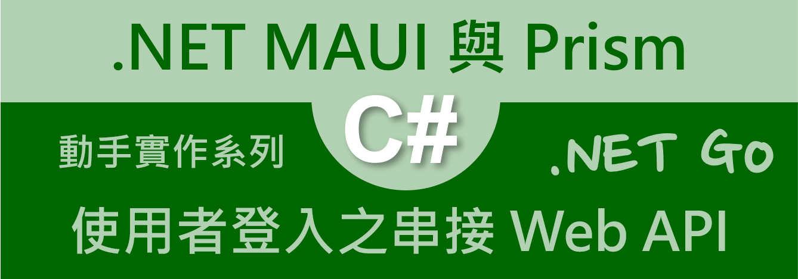
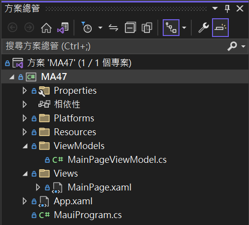
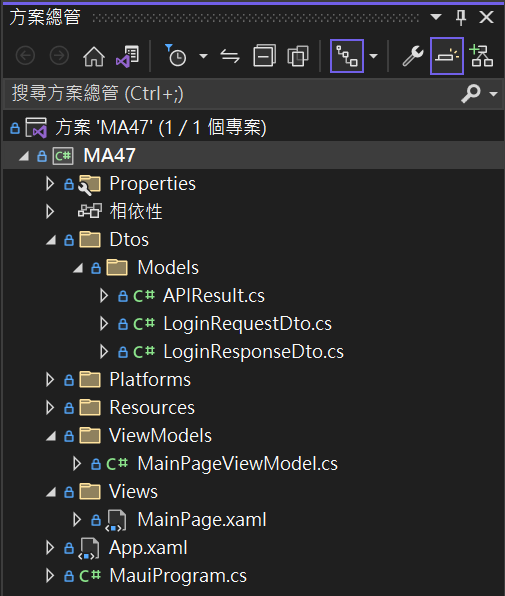
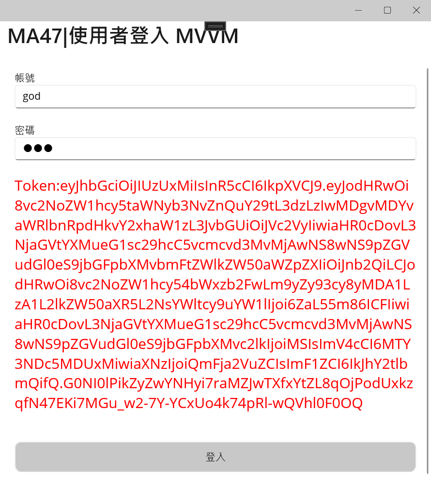
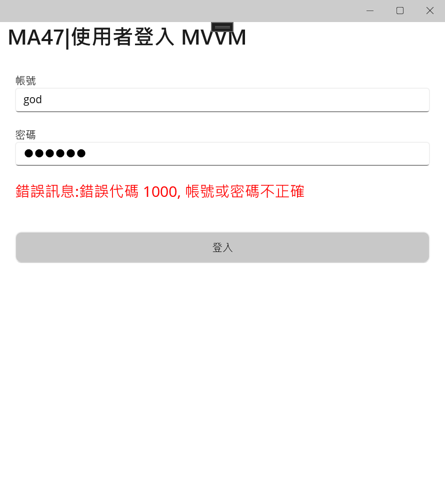
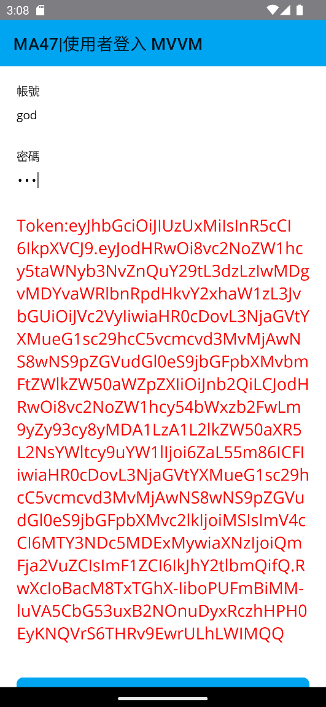
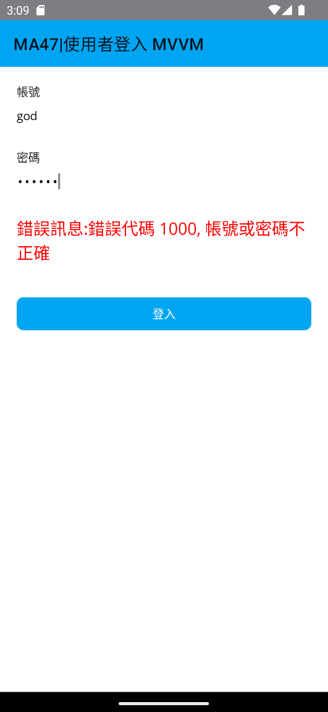

# 使用者登入：使用 HttpClient 呼叫身分認證 RESTful Web API，並且取得 JWT 存取權杖



在上一個動手實作中，使用了 [Vulcan Custom Prism .NET MAUI App] 專案範本來建立了一個具有使用者登入功能的 App，該 App 是採用了 Microsoft MVVM Toolkit 這個套件來進行與使用 MVVM 設計模式進行專案開發。

不過，這個練習專案僅可以接受使用將要進行身分驗證的帳號與密碼輸入到 App 內，然而，一般這類應用開發過程中，將會需要把這個使用診憑證傳送到遠端 RESTful Web API 主機內，若所提供的帳號與密碼是正確的，此時將會通過身分驗證程序，後端 Web API 將會根據此憑證資訊，產生出相對應的 JWT 權杖 Token ，並且回傳到呼叫用戶端。

因此，這裡將會接續上一個手動實作練習，繼續進行專案開發，完成這個練習專案程式設計，使其具有取得合法與有效的 JWT 存取權杖 Access Token 能力。

## 加入 資料傳輸物件 Data Transfer Object 類別

### 建立需要用到的資料夾

* 在此將不會另外建立一個新的專案
* 打開剛剛實作練習完成的 [MA47] 專案
* 下圖將會是 [MA47] 專案結構螢幕截圖

  
* 接下來會先要建立用與後端 RESTful Web API 通訊用到的資料傳輸物件類別，這裡將會包含要進行登入驗證用的憑證資訊、取得 Web API 回傳結果的標準格式類別、和通過身分驗證後的類別
* 滑鼠右擊專案節點
* 從彈出功能表中，點選 [加入] > [新增資料夾]
* 當新增資料夾建立完成後，重新命名此資料夾名稱為 `Dtos`
* 滑鼠右擊 [Dtos] 資料夾節點
* 從彈出功能表中，點選 [加入] > [類別]
* 當新增資料夾建立完成後，重新命名此資料夾名稱為 `Models`

## 建立登入請求 Request 資料模型
* 滑鼠右擊專案 [Dtos] > [Models] 節點
* 從彈出功能表中，點選 [加入] > [類別]
* 當 [新增項目] 對話窗出現之後
* 在名稱欄位內輸入 [LoginRequestDto.cs]
* 點選對話窗右下角的 [新增] 按鈕
* 當這個 [LoginRequestDto] 類別視窗出現之後，使用底下程式碼替換掉原先產生出來的程式碼

```csharp
using System.ComponentModel;
using System.ComponentModel.DataAnnotations;

namespace MA47.Dtos.Models;

public class LoginRequestDto : ICloneable, INotifyPropertyChanged
{
    [Required]
    public string Account { get; set; }
    [Required]
    public string Password { get; set; }

    #region 介面實作
    public event PropertyChangedEventHandler PropertyChanged;

    public LoginRequestDto Clone()
    {
        return ((ICloneable)this).Clone() as LoginRequestDto;
    }
    object ICloneable.Clone()
    {
        return this.MemberwiseClone();
    }
    #endregion
}
```

* 原則上，這裡新增的類別會是一個 POCO 類別，裡面包含了兩個 屬性 Property，分別是 Account 帳號 與 Password 密碼，這兩個屬性將會用於將使用者輸入過的帳號與密碼，傳遞到遠端 RESTful Web API 主機服務內
* 不過，在這裡也因為一些需要，需要在這個類別內實作出很基本的 [ICloneable] 與 [INotifyPropertyChanged] 這兩個介面

  >對於想要了解如何實作出具有強行別的物件複製方法，可以參考 [ICloneable 介面](https://learn.microsoft.com/zh-tw/dotnet/api/system.icloneable?WT.mc_id=DT-MVP-5002220)，對於 [INotifyPropertyChanged 介面](https://learn.microsoft.com/zh-tw/dotnet/api/system.componentmodel.inotifypropertychanged?WT.mc_id=DT-MVP-5002220) 則是會用於 MVVM 設計模式中，用來通知用戶端已變更屬性值功能。

## 建立登入回應 Response 資料模型
* 滑鼠右擊專案 [Dtos] > [Models] 節點
* 從彈出功能表中，點選 [加入] > [類別]
* 當 [新增項目] 對話窗出現之後
* 在名稱欄位內輸入 [LoginResponseDto.cs]
* 點選對話窗右下角的 [新增] 按鈕
* 當這個 [LoginResponseDto] 類別視窗出現之後，使用底下程式碼替換掉原先產生出來的程式碼

```csharp
using System.ComponentModel;

namespace MA47.Dtos.Models;

public class LoginResponseDto : ICloneable, INotifyPropertyChanged
{
    public int Id { get; set; }
    public string Account { get; set; }
    public string Name { get; set; }
    public string Token { get; set; }
    public int TokenExpireMinutes { get; set; }
    public string RefreshToken { get; set; }
    public int RefreshTokenExpireDays { get; set; }

    #region 介面實作
    public event PropertyChangedEventHandler PropertyChanged;

    public LoginResponseDto Clone()
    {
        return ((ICloneable)this).Clone() as LoginResponseDto;
    }
    object ICloneable.Clone()
    {
        return this.MemberwiseClone();
    }
    #endregion
}
```

* 在這個類別類建立了許多屬性，這些屬性將是當使用者成功通過身分驗證之後，並且產生出相對應的 JWT 存取權杖 Access Token 與 更新權杖 Refresh Token ，此時將會需要將特定資訊寫入到這些屬性內，並且回傳到用戶端內。
* 其中 [Token] 將會是告知 JWT 存取權杖的內容是甚麼
* [RefreshToken] 將會是告知 JWT 更新權杖的內容是甚麼

## 建立呼叫 Web API 的制式回應格式資料模型
* 滑鼠右擊專案 [Dtos] > [Models] 節點
* 從彈出功能表中，點選 [加入] > [類別]
* 當 [新增項目] 對話窗出現之後
* 在名稱欄位內輸入 [APIResult.cs]
* 點選對話窗右下角的 [新增] 按鈕
* 當這個 [APIResult] 類別視窗出現之後，使用底下程式碼替換掉原先產生出來的程式碼

```csharp
using System.ComponentModel;

namespace MA47.Dtos.Models;

/// <summary>
/// 呼叫 API 回傳的制式格式
/// </summary>
public class APIResult : ICloneable, INotifyPropertyChanged
{
    /// <summary>
    /// 此次呼叫 API 是否成功
    /// </summary>
    public bool Status { get; set; } = true;
    public int HTTPStatus { get; set; } = 200;
    public int ErrorCode { get; set; }
    /// <summary>
    /// 呼叫 API 失敗的錯誤訊息
    /// </summary>
    public string Message { get; set; } = "";
    /// <summary>
    /// 呼叫此API所得到的其他內容
    /// </summary>
    public object Payload { get; set; }

    #region 介面實作
    public event PropertyChangedEventHandler PropertyChanged;

    public APIResult Clone()
    {
        return ((ICloneable)this).Clone() as APIResult;
    }
    object ICloneable.Clone()
    {
        return this.MemberwiseClone();
    }
    #endregion
}
```

* 每次用戶端呼叫遠端 Web API，不論是否可以正常執行完畢或者成功與否，都希望能夠回傳一個標準與制式的格式，而這個類別所定義的屬性，將會滿足這樣的需求。
* 這個類別內已經加入相關程式碼備註說明，可以說相當的容易了解
* 在這裡特別說明三個屬性，經常在完成 API 呼叫之後，將會透過 [Status] 屬性的檢查，確認此次 Web API 呼叫結果是否已經成功且正確執行完畢，這可以透過其布林型別的物件值來確認
* 一旦呼叫結果是成功的，呼叫此 Web API 要回傳的 JSON 物件，將會儲存在 [Payload] 這個屬性內，取得這個屬性值，再透過 JSON 反序列化動作，便可以取得其 .NET 物件值。
* 若呼叫結果不成功，相對應的錯誤訊息將會記錄在 [Message] 屬性內，此時可以顯示這個屬性文字內容到螢幕上，告知用戶發生了甚麼事情，又或者記錄到日誌檔案內。

* 底下將會是完成後的專案結構螢幕截圖

  

## 設計 檢視模型 ViewModel 類別

* 在專案內，打開 [ViewModels] > [MainPageViewModel.cs] 檔案
* 找到 `Login()` 方法，將其修正為底下的非同步方法，修正後的程式碼如下

```csharp
async Task Login()
{
    APIResult apiResult = await UserAuthenticationAsync();
    if (apiResult.Status == true)
    {
        LoginResponseDto loginResponseDto = JsonConvert
            .DeserializeObject<LoginResponseDto>(apiResult.Payload.ToString());
        Message = $"Token:{loginResponseDto.Token}";
    }
    else
    {
        Message = $"錯誤訊息:{apiResult.Message}";
    }
}
```

* 這裡，因為該 Login 方法內有使用到 await 運算子，所以，需要將該方法的回傳 void 宣告，修改成為 async Task，這樣的設計動作將會形成一個非同步方法。
* 在此方法內，將會呼叫 [UserAuthenticationAsync] ，這個方法將會呼叫 Web API 服務，不論成功與否，都會回傳型別為 [APIResult] 的物件。
* 透過檢查 APIResult.Status 這個布林值，若此次呼叫 Web API 是成功的，也就是此次使用者輸入的帳號與密碼是正確無誤的，透過 [JsonConvert.DeserializeObject<LoginResponseDto>()] 方法，把 [apiResult.Payload.ToString()] 回傳 JSON 物件進行反序列化，此時，就會得到型別為 [LoginResponseDto] 物件
* 接下來就可以將 [LoginResponseDto.Token] 這個屬性值指派給這個 ViewModel 內的 [Message] 屬性，此時，透過 MVVM 內的 資料綁定 Data Binding 機制，螢幕上就會看到這次取的存取權杖內容了。

* 在這個類別內加入底下的 [UserAuthenticationAsync] 非同步方法定義

```csharp
async Task<APIResult> UserAuthenticationAsync()
{
    APIResult apiResult = null;
    LoginRequestDto loginRequestDto = new LoginRequestDto()
    {
        Account = Account,
        Password = Password,
    };
    HttpClient client = new HttpClient();
    client.BaseAddress = new Uri("https://blazortw.azurewebsites.net");
    HttpResponseMessage httpResponse = await client.PostAsJsonAsync("/api/Login", loginRequestDto);
    if (httpResponse.IsSuccessStatusCode)
    {
        apiResult = await httpResponse.Content.ReadFromJsonAsync<APIResult>();
        return apiResult;
    }
    else
    {
        apiResult = await httpResponse.Content.ReadFromJsonAsync<APIResult>();
        return apiResult;
    }
}
```

* 在這個 [UserAuthenticationAsync] 方法內，首先建立一個 [LoginRequestDto] 型別的物件，並且指定使用者輸入的帳號與密碼到這個物件內的屬性內。
* 接著，建立一個 [HttpClient] 型別的物件
* 使用 [HttpClient.BaseAddress 屬性](https://learn.microsoft.com/zh-tw/dotnet/api/system.net.http.httpclient.baseaddress?view=net-7.0#system-net-http-httpclient-baseaddress&WT.mc_id=DT-MVP-5002220) 設定傳送要求時所使用之網際網路資源的統一資源識別元 (URI) 基底位址
* 之後，使用 [PostAsJsonAsync] 方法對遠端 [/api/Login] 服務端點進行 [Post] 請求，把 [LoginRequestDto] 這個物件之 JSON 內容，傳送到遠端的 RESTful Web API 內，這個 [PostAsJsonAsync] 方法將會回傳一個 [HttpResponseMessage] 物件
* 現在可以判斷此次 HTTP Post 呼叫動作的回傳狀態值是否為成功的狀態
* 不論是否為成功狀態，透過 [HttpResponseMessage.Content.ReadFromJsonAsync<APIResult>()] 方法呼叫，取得 HTTP 回應的 Payload 內容，並且反序列化此 JSON 物件成為 [APIResult] 型別的物件
* 此時，便可以將此物件回傳回去
* 底下為最終完成的 ViewModel 類別程式碼

```csharp
using CommunityToolkit.Mvvm.ComponentModel;
using CommunityToolkit.Mvvm.Input;
using MA47.Dtos.Models;
using Newtonsoft.Json;
using System.Net.Http.Json;

namespace MA47.ViewModels;

public partial class MainPageViewModel : ObservableObject, INavigatedAware
{
    public MainPageViewModel()
    {
    }

    [ObservableProperty]
    string title = "MA47|使用者登入 MVVM";
    [ObservableProperty]
    string account = string.Empty;
    [ObservableProperty]
    string password = string.Empty;
    [ObservableProperty]
    string message = string.Empty;

    [RelayCommand]
    async Task Login()
    {
        APIResult apiResult = await UserAuthenticationAsync();
        if (apiResult.Status == true)
        {
            LoginResponseDto loginResponseDto = JsonConvert
                .DeserializeObject<LoginResponseDto>(apiResult.Payload.ToString());
            Message = $"Token:{loginResponseDto.Token}";
        }
        else
        {
            Message = $"錯誤訊息:{apiResult.Message}";
        }
    }

    public void OnNavigatedFrom(INavigationParameters parameters)
    {
    }

    public void OnNavigatedTo(INavigationParameters parameters)
    {
    }

    async Task<APIResult> UserAuthenticationAsync()
    {
        APIResult apiResult = null;
        LoginRequestDto loginRequestDto = new LoginRequestDto()
        {
            Account = Account,
            Password = Password,
        };

        HttpClient client = new HttpClient();
        client.BaseAddress = new Uri("https://blazortw.azurewebsites.net");
        HttpResponseMessage httpResponse = await client.PostAsJsonAsync("/api/Login", loginRequestDto);
        if (httpResponse.IsSuccessStatusCode)
        {
            apiResult = await httpResponse.Content.ReadFromJsonAsync<APIResult>();
            return apiResult;
        }
        else
        {
            apiResult = await httpResponse.Content.ReadFromJsonAsync<APIResult>();
            return apiResult;
        }
    }
}
```

## 設計 檢視 View (也就是 頁面) XAML 檔案

* 在這個實作練習中，將不需要對 [Views] > [MainPage.xaml] 檔案進行任何修正

## 執行結果

* 切換到 [Windows Machine] 模式，開始執行此專案

* 請在 帳號 與 密碼 欄位輸入正確的使用者憑證，再點選 [登入] 按鈕，就會看到底下成功登入後取得 JWT 存取權杖的畫面

  >合法的使用者憑證為
  >
  >帳號：god
  >
  >密碼：123

  

* 現在，請在 帳號 與 密碼 欄位輸入不正確的使用者憑證，再點選 [登入] 按鈕，就會看到底下無法成功通過身分驗證訊息的畫面

  

* 切換到 [Android Emulator] 模式，選擇一個適合的模擬器，開始執行此專案

* 請在 帳號 與 密碼 欄位輸入正確的使用者憑證，再點選 [登入] 按鈕，就會看到底下成功登入後取得 JWT 存取權杖的畫面

  >合法的使用者憑證為
  >
  >帳號：god
  >
  >密碼：123

  

* 現在，請在 帳號 與 密碼 欄位輸入不正確的使用者憑證，再點選 [登入] 按鈕，就會看到底下無法成功通過身分驗證訊息的畫面

  


