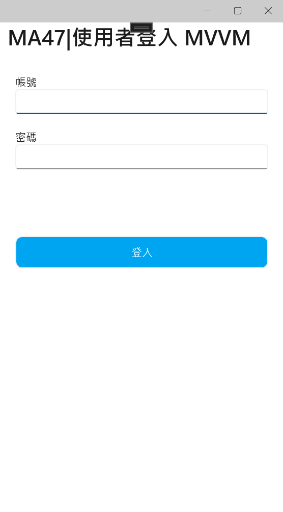
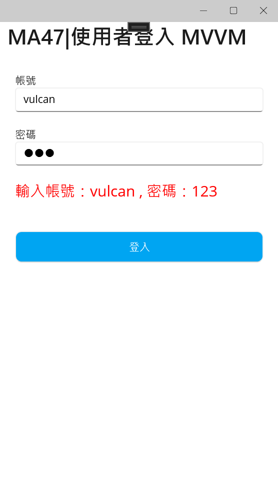
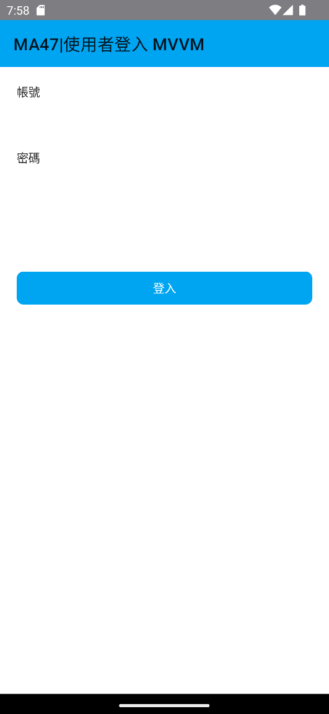
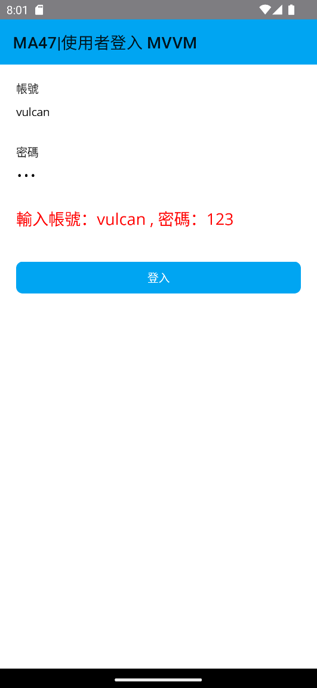

# 使用者登入 ： 使用 MVVM 設計模式進行專案開發


在進行行動應用 App 專案開發的時候，必定會須要有使用者身分驗證這樣的頁面設計需求，這包含了如何設計一個具有使用者可以輸入帳號與密碼的頁面 (View) 、 如何取得使用者輸入帳號與密碼的商業邏輯處理之檢視模型 (ViewModel)，所以，就先針對這樣的需求來進行操作。

## 建立採用 Prism 開發框架的 MAUI 專案

* 打開 Visual Studio 2022 IDE 應用程式
* 從 [Visual Studio 2022] 對話窗中，點選右下方的 [建立新的專案] 按鈕
* 在 [建立新專案] 對話窗右半部
  * 切換 [所有語言 (L)] 下拉選單控制項為 [C#]
  * 切換 [所有專案類型 (T)] 下拉選單控制項為 [MAUI]
* 在中間的專案範本清單中，找到並且點選 [Vulcan Custom Prism .NET MAUI App] 專案範本選項
  
  >若沒有看到這個專案範本，請參考 [使用 Vulcan.Maui.Template 專案範本來進行 MAUI for Prism 專案開發](https://csharpkh.blogspot.com/2023/01/Create-First-MAUI-Project-By-Vulcan-Template.html) 文章，進行安裝這個專案範本到 Visual Studio 2022 內
* 點選右下角的 [下一步] 按鈕
* 在 [設定新的專案] 對話窗
* 在 [專案名稱] 欄位內輸入 `MA47` 做為這個專案名稱
* 請點選右下角的 [建立] 按鈕
* 此時，將會建立一個可以用於 MAUI 開發的專案

## 設計 檢視模型 ViewModel 類別

* 在專案內，打開 [ViewModels] > [MainPageViewModel.cs] 檔案
* 移除原先專案範本所建立的檢視模型類別內不用的程式碼，完成結果如下所示

```csharp
using CommunityToolkit.Mvvm.ComponentModel;
using CommunityToolkit.Mvvm.Input;

namespace MA47.ViewModels;

public partial class MainPageViewModel : ObservableObject, INavigatedAware
{
    public MainPageViewModel()
    {
    }

    [ObservableProperty]
    string title = "MA47|使用者登入 MVVM";

    public void OnNavigatedFrom(INavigationParameters parameters)
    {
    }

    public void OnNavigatedTo(INavigationParameters parameters)
    {
    }
}
```

* 這裡的程式碼將會是最基礎的檢視模型 ViewModel 類別會用到的程式碼，接下來就要來進行擴充這個類別
* 找到 `string title = "MA47|使用者登入 MVVM";` 敘述，在此下方加入此頁面會用到的資料綁定物件，這裡將會需要加入 [帳號]、[密碼]、[訊息] 這三個 欄位 Field 成員，程式碼如下

```csharp
string account = string.Empty;
string password = string.Empty;
string message = string.Empty;
```

* 注意事項，因為這裡使用 [CommunityToolkit.Mvvm](https://learn.microsoft.com/zh-tw/dotnet/communitytoolkit/mvvm?WT.mc_id=DT-MVP-5002220) 這個套件做為簡化 MVVM 設計過程，此套件透過了 [Roslyn Source Generators 原始碼產生器](https://learn.microsoft.com/en-us/dotnet/csharp/roslyn-sdk/source-generators-overview?WT.mc_id=DT-MVP-5002220) 功能，自動為這個專案產生出許多的程式碼，而這些程式碼將會於 MVVM 設計模式內會使用到的，透過這樣的功能，將會在進行 檢視模型 ViewModel 類別的時候，可以減少撰寫許多程式碼，讓整個 C# 類別變得更加清爽，當然，也就更加好維護。
* 這裡加入三個類別成員，都是型別為字串的欄位成員，可以注意到的是
  * 這三個成員不需要為 公開 public ，因此，在這裡將會宣告為私有 private
  * 對於物件名稱，需要遵循 .NET C# 欄位命名慣例，這部分請參考 [C# 編碼慣例](https://learn.microsoft.com/zh-tw/dotnet/csharp/fundamentals/coding-style/coding-conventions?WT.mc_id=DT-MVP-5002220) 也就是不能夠採用 Pascal 命名法的大小寫 命名做法，而是要採用 Camel 大小寫 命名方式，也就是第一個字母必須為小寫，否則編譯器將產生錯誤
    >要這麼做的原因除了因為這個成員是個欄位，本來就需要採用以小寫為開頭的命名作法，另外一個原因在於當使用了 `[ObservableProperty]` 這個屬性，宣告這個欄位成員將會用於 MVVM 資料綁定之用，此時，編譯器將會自動生成該欄位的 屬性 Property 成員，當然，這個屬性將會採用 Pascal 命名法，第一個字母將會是大小。

* 在這三個欄位成員前面，分別加入 [ObservableProperty]` 這個屬性宣告，讓編譯器自動產生用於資料綁定機制需要用的程式碼與屬性成員。
* 完成的程式碼如下

```csharp
[ObservableProperty]
string account = string.Empty;
[ObservableProperty]
string password = string.Empty;
[ObservableProperty]
string message = string.Empty;
```

* 最後，要加入一個方法，用於當使用點選螢幕上 [登入] 按鈕之後，需要在螢幕上顯示一段文字
* 請在該類別內加入此方法

```csharp
void Login()
{
    Message = $"輸入帳號：{Account} , 密碼：{Password}";
}
```

* 因為在此使用 MVVM 設計模式，因此，在設計 C# 程式碼的時候，無須關注 檢視/頁面 內的 XAML 標記，或者稱之為使用者控制項，使用者在螢幕上輸入帳號或者密碼之後，將會自動儲存到剛剛設計的 account 與 password 欄位成員內。
* 在這個 [Login()] 方法內，僅有一個敘述 `Message = $"輸入帳號：{Account} , 密碼：{Password}"` ，這表示要將使用者輸入的帳號與密碼內容，組合成為一個字串，並且指定給 [Message] 這個屬性。

  >特別注意，除了在宣告資料的時候，要使用欄位成員方式進行設計，其他的時候，若要使用這些具有資料綁定成員的時候，請一定需要使用 屬性 Property (這些屬性是由編譯器自動產生的)來操作，否則，將會發生與造成莫名異常現象問題

* 請在這個方法上方，加入 `[RelayCommand]` 這個屬性宣告，標示這個方法可以用於命令綁定
* 完成後的程式碼如下

```csharp
[RelayCommand]
void Login()
{
    Message = $"輸入帳號：{Account} , 密碼：{Password}";
}
```

* 這裡的方法也不需要宣告為 public 公開
* 加入了 `[RelayCommand]` 屬性之後，編譯器將會自動生成一段原始碼，將會產生出一個型別為 [RelayCommand] 的物件 (此物件將會實作 [ICommand](https://learn.microsoft.com/zh-tw/dotnet/api/system.windows.input.icommand?WT.mc_id=DT-MVP-5002220) 這個介面)，因為有實作 [ICommand] 介面，因此，這個物件便可以用於 XAML 內的命令綁定之用。

  >編譯器產生的 [RelayCommand] 物件，將會使用該函式名稱附加上 Command 這個文字，以這裡的例子而言，所產生的 [RelayCommand] 物件的名稱將會是 [LoginCommand]，因此，在 XAML 進行命令綁定的時候，需要使用這個 [LoginCommand] 物件名稱。

* 底下為最終完成的 ViewModel 類別程式碼

```csharp
using CommunityToolkit.Mvvm.ComponentModel;
using CommunityToolkit.Mvvm.Input;

namespace MA47.ViewModels;

public partial class MainPageViewModel : ObservableObject, INavigatedAware
{
    public MainPageViewModel()
    {
    }

    [ObservableProperty]
    string title = "MA47|使用者登入 MVVM";
    [ObservableProperty]
    string account = string.Empty;
    [ObservableProperty]
    string password = string.Empty;
    [ObservableProperty]
    string message = string.Empty;

    [RelayCommand]
    void Login()
    {
        Message = $"輸入帳號：{Account} , 密碼：{Password}";
    }

    public void OnNavigatedFrom(INavigationParameters parameters)
    {
    }

    public void OnNavigatedTo(INavigationParameters parameters)
    {
    }
}
```

## 設計 檢視 View (也就是 頁面) XAML 檔案

* 在專案內，打開 [Views] > [MainPage.xaml] 檔案
* 移除原先專案範本所建立的檢視檔案內不用的標記，完成結果如下所示

```xml
<?xml version="1.0" encoding="utf-8" ?>
<ContentPage xmlns="http://schemas.microsoft.com/dotnet/2021/maui"
             xmlns:x="http://schemas.microsoft.com/winfx/2009/xaml"
             Title="{Binding Title}"
             x:Class="MA47.Views.MainPage"
             xmlns:viewModel="clr-namespace:MA47.ViewModels"
             x:DataType="viewModel:MainPageViewModel">

  <ScrollView>
  </ScrollView>

</ContentPage>
```

* 將 [ScrollView] 標記修正為底下內容

```xml
<ScrollView>
      <VerticalStackLayout
          Margin="20">
          <Label Text="帳號"/>
          <Entry Text="{Binding Account}"/>
          <Label Text="密碼"
                 Margin="0,20,0,0"/>
          <Entry Text="{Binding Password}"
                 IsPassword="True"/>
          <Label Text="{Binding Message}"
                 Margin="0,20,0,0"
                 FontSize="20"
                 TextColor="Red"/>
          <Button Text="登入"
                  Margin="0,40,0,0"
                  Command="{Binding LoginCommand}"/>
      </VerticalStackLayout>
</ScrollView>
```

* 在帳號 [Entry] 標記項目 Element (也可以稱之為 控制項 Control) 的 [Text] 屬性內，使用 `{Binding ...}` 這樣的[取用 XAML 標記延伸 Markup Extnesion](https://learn.microsoft.com/zh-tw/dotnet/maui/xaml/markup-extensions/consume?WT.mc_id=DT-MVP-5002220) 用法，宣告這個 [Entry] 項目的 [Text] 屬性，將會使用資料綁定的方式，將 [Text] 屬性與 ViewModel 內的 [Account] 屬性進行資料綁定連結，有了這樣的宣告，一旦使用者在此頁面的帳號欄位輸入任何文字，便可以在 ViewModel 內，透過 [Account] 這個 ViewModel 類別屬性成員，取得使用輸入的文字內容。
* 同樣的將密碼 [Entry] 標記項目 Element 的 [Text] 屬性與 ViewModel 內的 [Password] 屬性，使用 `Text="{Binding Password}"` 方式，進行資料綁定宣告
* 對於訊息 [Label] 項目，則是將其 [Text] 屬性與 ViewModel 內的 [Message] 屬性，宣告要進行資料綁定，如此，當在 ViewModel 內有變更 [Message] 屬性物件文字內容的時候，透過 MVVM 所提供的機制，螢幕上將會自動顯示出該文字內容。
* 最後，對於 [Button] 項目，透過 [Command] 屬性與 ViewModel 內型別為 [RelayCommand] 的 [LoginCommand] 物件，使用 `Command="{Binding LoginCommand}"` 標記宣告，進行命令的綁定；當使用者在螢幕上點選這個按鈕之後，將會自動觸發 ViewModel 內的 [Login()] 方法
* 在 [Login()] 方法內，將會變更 [Message] 文字內容，如此將會造成螢幕上顯示出最新的 [Message] 文字內容

* 底下將會是完成後的頁面 XAML 檔案內容

```xml
<?xml version="1.0" encoding="utf-8" ?>
<ContentPage xmlns="http://schemas.microsoft.com/dotnet/2021/maui"
             xmlns:x="http://schemas.microsoft.com/winfx/2009/xaml"
             Title="{Binding Title}"
             x:Class="MA47.Views.MainPage"
             xmlns:viewModel="clr-namespace:MA47.ViewModels"
             x:DataType="viewModel:MainPageViewModel">

    <ScrollView>
        <VerticalStackLayout
            Margin="20">
            <Label Text="帳號"/>
            <Entry Text="{Binding Account}"/>

            <Label Text="密碼"
                   Margin="0,20,0,0"/>
            <Entry Text="{Binding Password}"
                   IsPassword="True"/>

            <Label Text="{Binding Message}"
                   Margin="0,20,0,0"
                   FontSize="20"
                   TextColor="Red"/>

            <Button Text="登入"
                    Margin="0,40,0,0"
                    Command="{Binding LoginCommand}"/>
        </VerticalStackLayout>
    </ScrollView>

</ContentPage>
```

## 執行結果

* 切換到 [Windows Machine] 模式，開始執行此專案，將會看到底下結果

  

  請在 帳號 與 密碼 欄位輸入任何文字，再點選 [登入] 按鈕，就會看到底下畫面

  

* 切換到 [Android Emulator] 模式，選擇一個適合的模擬器，開始執行此專案，將會看到底下結果

  

  請在 帳號 與 密碼 欄位輸入任何文字，再點選 [登入] 按鈕，就會看到底下畫面

  


