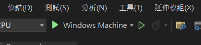
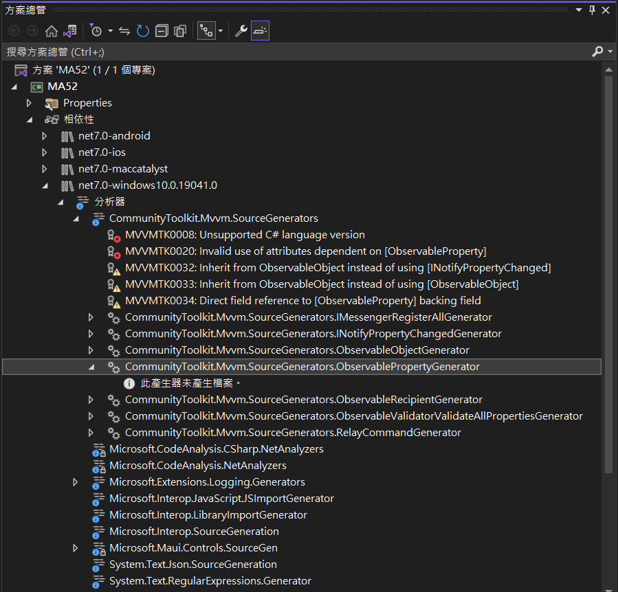
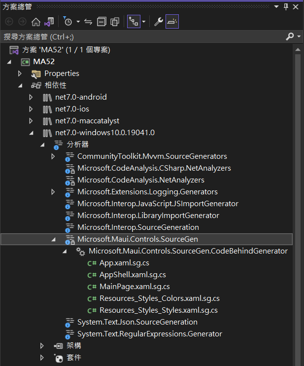
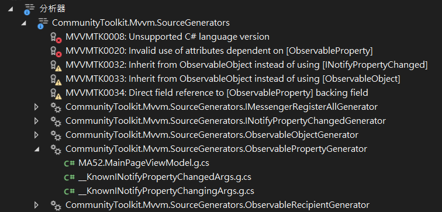
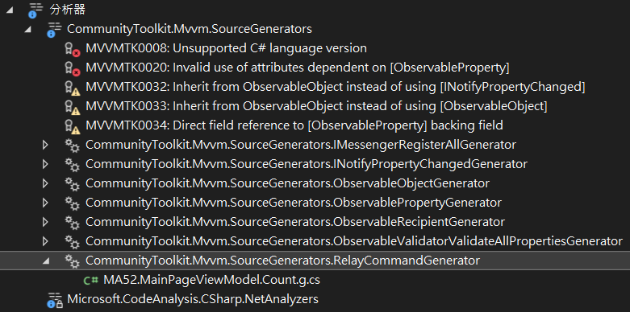

# 解析 .NET MAUI 中 Microsoft.Toolkit.Mvvm 的運作方式

在以往進行 Xamarin.Forms 專案開發時期，通常會使用 Prism 開發框架來進行整體專案開發，這是因為 Prism 提供了相當豐富的功能來方便與簡化行動裝置應用程式的開發，然而對於 MVVM 的開發上，進行 ViewModel 類別設計過程中，並沒有使用到繼承 [BindableBase] 這個類別來施做，而是使用了 [PropertyChanged.Fody] 這個套件來進行設計。

底下會是 [BindableBase] 類別的程式碼

```csharp
public abstract class BindableBase : INotifyPropertyChanged
{
    public event PropertyChangedEventHandler PropertyChanged;

    protected virtual bool SetProperty<T>(ref T storage, T value, [CallerMemberName] string propertyName = null)
    {
        if (EqualityComparer<T>.Default.Equals(storage, value)) return false;

        storage = value;
        RaisePropertyChanged(propertyName);

        return true;
    }

    protected virtual bool SetProperty<T>(ref T storage, T value, Action onChanged, [CallerMemberName] string propertyName = null)
    {
        if (EqualityComparer<T>.Default.Equals(storage, value)) return false;

        storage = value;
        onChanged?.Invoke();
        RaisePropertyChanged(propertyName);

        return true;
    }

    protected void RaisePropertyChanged([CallerMemberName] string propertyName = null)
    {
        OnPropertyChanged(new PropertyChangedEventArgs(propertyName));
    }

    protected virtual void OnPropertyChanged(PropertyChangedEventArgs args)
    {
        PropertyChanged?.Invoke(this, args);
    }
}
```

從這個類別中可以看出，其實將會實作 [INotifyPropertyChanged] 介面，也就是在這個類別內需要有 `public event PropertyChangedEventHandler PropertyChanged;` 這個成員宣告存在。

對於想要能夠讓 資料綁定 Data Binding 機制可以正常運作，需要透過呼叫 [SetProperty] 這個泛型方法。

底下將會是使用繼承一個 [BindableBase] 類別，並且在 ViewModel 內宣告 [Text] 屬性，使得這個屬性可以用於 XAML 中的 `{Binding Text}` 延伸標記用法，這樣就完成了一個 資料綁定 的設計。

```csharp
private string _text = "Click me";
public string Text
{
    get => _text;
    set => SetProperty(ref _text, value);
}
```

對於 [Text] 屬性的設計，將會採用 C# [自動實作的屬性](https://learn.microsoft.com/zh-tw/dotnet/csharp/programming-guide/classes-and-structs/auto-implemented-properties?WT.mc_id=DT-MVP-5002220) 來設計；一旦當 [Text] 屬性有變更的時候，將會呼叫 [SetProperty] 這個方法，以便可以觸發 [PropertyChanged] 這個事件，如此，有關注或綁定這個事件的物件，將會收到通知，以便進行相對應的處理工作。

以上是對於一般資料型態的資料綁定的設計方式，對於需要綁定到 XAML 內的 [Command] 屬性上的命令綁定，則是透過在 ViewModel 內宣告 `public DelegateCommand CountCommand { get; }` 這個屬性，並且在建構式內，使用 `CountCommand = new DelegateCommand(OnCountCommandExecuted);` 敘述，產生一個 [DelegateCommand] 型別的物件，而在建立此物件的時候，至少需要傳入一個委派方法，而當這個命令被觸發的時候，將會來執行這裏所指定的委派方法。

在 PrismLibrary 內，對於 [DelegateCommand] 這個型別，將會繼承 [DelegateCommandBase] 類別，最終需要實作出 [ICommand] 這個介面，如此，才能夠使用這樣的物件於 XAML 內的 Command 來進行命令綁定之用

從這裡可看出，想要讓 MVVM 設計模式正常運作，達到關注點分離與鬆散耦合設計效果，程式設計師需要寫出相當多的程式碼，當然也就造成寫出許多原始碼內容，當然也會造成許多不良的副作用影響。

所以， [MVVM 工具] ，也就是 CommunityToolkit.Mvvm 套件，(也稱為 MVVM Toolkit，先前稱為 Microsoft.Toolkit.Mvvm) 是模組化的 MVVM 程式庫，使用了 [Roslyn] SDK 內提供的 來源產生器 Source Generators，透過這個機制， 來源產生器 ，可讓 C# 開發人員檢查正在編譯的使用者程式碼，來源產生器可以在即時新增至使用者的編譯時建立新的 C# 來源檔案。所得到的效果將會是可以讓整個專案原始碼變得更加簡潔與清爽，因為，Roslyn 編譯器已經把許多繁雜、瑣碎的工作與程式碼，都自動產生出來了。

現在，就來了解看看， [CommunityToolkit.Mvvm] 這個套件，在 .NET MAUI 專案內是如何運行的

## 建立 .NET MAUI 應用程式 專案

* 開啟 Visual Studio 2022
* 點選螢幕右下角的 [建立新的專案] 按鈕
* 切換右上角的 [所有專案類型] 下拉選單控制項
* 找到並且點選 [MAUI] 這個選項
* 從清單中找到並選擇 [.NET MAUI 應用程式] 這個專案範本
* 點選右下角的 [下一步] 按鈕
* 當出現了 [設定新的專案] 對話窗
* 在 [專案名稱] 欄位內，輸入 `MA52`
* 點選右下角的 [下一步] 按鈕
* 當出現了 [其他資訊] 對話窗
* 對於 [架構] 的下拉選單控制項，使用預設值
* 點選右下角的 [建立] 按鈕

## 加入 CommunityToolkit.Mvvm 的 NuGet 套件

* 滑鼠右擊該專案的 [相依性] 節點
* 從彈出功能表中選擇 [管理 NuGet 套件] 功能選項
* 此時，[NuGet: csCommunityToolkitMVVM] 視窗將會出現
* 點選 [瀏覽] 標籤頁次
* 在左上方的搜尋文字輸入盒內輸入 `CommunityToolkit.Mvvm` 關鍵字
* 現在，將會看到 CommunityToolkit.Mvvm 套件出現在清單內
* 點選這個 CommunityToolkit.Mvvm 套件，並且點選右上方的 [安裝] 按鈕，安裝這個套件到這個專案內。

## 建立 MainPageViewModel 類別

在這個建立好的專案，採用的是 .NET MAUI 預設的專案模板，因此，並沒有 ViewModel 預設建立在這個專案內，所以，在這裡先來建立一個 MainPage 這個 View 要使用的 ViewModel 類別

* 滑鼠右擊該專案節點
* 從彈出功能表中選擇 [加入] > [類別] 功能選項
* 此時，[新增項目] 對話窗將會出現
* 在對話窗下方的 [名稱] 欄位內，輸入 `MainPageViewModel` 作為這個類別的名稱
* 點選右下方 [新增] 按鈕
* 底下將會這次產生出來的類別檔案內容

```csharp
using System;
using System.Collections.Generic;
using System.Linq;
using System.Text;
using System.Threading.Tasks;

namespace MA52
{
    internal class MainPageViewModel
    {
    }
}
```

## 檢查 Rolysn 來源產生器有沒有甚麼程式碼自動產生

* 因為 .NET MAUI 採用單一專案架構，但是可以在不同平來下來執行，因此，請先確認現在的執行平台是哪個
* 預設來說，將會是 [Windows Machine] ，可以在 Visual Studio 2022 最上方找到 綠色 三角形的工具列按鈕，確認是否如下圖樣貌

  

* 滑鼠右擊該專案節點
* 從彈出功能表中選擇 [重建] 功能選項
* 現在這個專案將會重新編譯
* 一旦建置完成後
* 找到專案節點，參考下圖，依序展開這些節點 [MA52] > [相依性] > [net7.0-windows10.0.19041.0] > [分析器]

  

* 可以看到 [分析器] 將會看到 [CommunityToolkit.Mvvm.SourceGenerators]節點存在
* 展開這個點之後，將會看到更多節點項目，請找到 [CommunityToolkit.Mvvm.SourceGenerators.ObservablePropertyGenerator] 這個節點項目
* 請展開這個節點，將會出現 [此產生氣未產生檔案] 訊息，表示這裡尚未產生任何內容，不過，後面的內容，將會可以看到這裡產生出新項目。
* 不過，另外可以看到有個 [Microsoft.Maui.Controls.SourceGen] 節點
* 展開此節點將會看到有個 [Microsoft.Maui.Controls.SourceGen.CodeBehindGenerator] 節點存在
* 請繼續展開此節點，將會如下面節圖
* 從展開內容名稱可以猜測出來，這些都是 [Rolysn] 來源產生器產生出來的程式碼，而且都是在此專案內找到所有 .xaml 檔案，產生出相對應的 Code Behind 程式碼
* 有興趣的人，可以打開這些產生檔案名稱，就會看到產生出來的程式碼

  

* 底下將會是 [App.xaml.sg.cs] 節點內容

```csharp
//------------------------------------------------------------------------------
// <auto-generated>
//     This code was generated by a .NET MAUI source generator.
//
//     Changes to this file may cause incorrect behavior and will be lost if
//     the code is regenerated.
// </auto-generated>
//------------------------------------------------------------------------------

[assembly: global::Microsoft.Maui.Controls.Xaml.XamlResourceId("MA52.App.xaml", "App.xaml", typeof(global::MA52.App))]
namespace MA52
{
	[global::Microsoft.Maui.Controls.Xaml.XamlFilePath("App.xaml")]
	public partial class App : global::Microsoft.Maui.Controls.Application
	{
		[global::System.CodeDom.Compiler.GeneratedCode("Microsoft.Maui.Controls.SourceGen", "1.0.0.0")]
#if NET5_0_OR_GREATER
#endif
		private void InitializeComponent()
		{
			global::Microsoft.Maui.Controls.Xaml.Extensions.LoadFromXaml(this, typeof(App));
		}
	}
}
```

## 簡化預設產生的 MainPage 內容

* 因為預設產生的頁面檔案，有使用到 Code Behind 內容，為了接下來的深入理解內容，故在此先將這個頁面內容簡化
* 在專案根目錄下，找到並且打開 [MainPage.xaml] 檔案
* 使用底下 XAML 標記內容，替換掉剛剛打開的檔案內容

```xml
<?xml version="1.0" encoding="utf-8" ?>
<ContentPage xmlns="http://schemas.microsoft.com/dotnet/2021/maui"
             xmlns:x="http://schemas.microsoft.com/winfx/2009/xaml"
             x:Class="MA52.MainPage">

    <ScrollView>
        <VerticalStackLayout
            Spacing="25" Padding="30,0"
            VerticalOptions="Center">

            <Image
                Source="dotnet_bot.png"
                HeightRequest="200" HorizontalOptions="Center" />

            <Label
                Text="Hello, World!"
                FontSize="32" HorizontalOptions="Center" />

            <Label
                Text="Welcome to .NET Multi-platform App UI"
                FontSize="18" HorizontalOptions="Center" />

            <Button
                Text="Click me"
                HorizontalOptions="Center" />

        </VerticalStackLayout>
    </ScrollView>

</ContentPage>
```

* 在專案根目錄下，找到並且打開 [MainPage.xaml.cs] 檔案
* 使用底下 C# 標記內容，替換掉剛剛打開的檔案程式碼

```csharp
namespace MA52;

public partial class MainPage : ContentPage
{
	public MainPage()
	{
		InitializeComponent();
	}
}
```

## 修正 MainPageViewModel 可以使用 CommunityToolkit.MVVM 功能

* 在專案根目錄下，找到並且打開 [MainPageViewModel.cs] 檔案
* 使用底下 C# 程式碼替換掉這個檔案內容

```csharp
using CommunityToolkit.Mvvm.ComponentModel;

namespace MA52;

public partial class MainPageViewModel : ObservableObject
{
}
```

* 這裡展示了一個採用 [CommunityToolkit.MVVM] 套件的 ViewModel 標準類別設計形式
* 首先， ViewModel 類別需要繼承 [ObservableObject] 這個類別，因為該類別內有實作 [INotifyPropertyChanged] 與 [INotifyPropertyChanging] 這兩個介面，有了實作介面的相關程式碼，便可以實踐出 MVVM 內的 資料綁定 Data Binding 機制了
* 接下來，還要做個修正，那就是這個類別必須修改使用 [partial] 這個修飾詞，也就是要使用 [部分類別](https://learn.microsoft.com/zh-tw/dotnet/csharp/programming-guide/classes-and-structs/partial-classes-and-methods#partial-classes?WT.mc_id=DT-MVP-5002220) 來進行設計

  >若在此沒有加入 [partial] 這個修飾詞，將會導致等下要加入的程式碼，產生類似這樣的錯誤訊息
  >
  >錯誤	CS0260	類型 'MainPageViewModel' 的宣告中遺漏 partial 修飾元; 還存在此類型的其他部分宣告	MA52 (net7.0-android), MA52 (net7.0-ios), MA52 (net7.0-maccatalyst), MA52 (net7.0-windows10.0.19041.0)	C:\Vulcan\Projects\MA52\MA52\MainPageViewModel.cs	5	作用中
  >
  >若忘記加入，也沒有關係，編譯器到時候會提醒你要加入回去
  >

## 使用 CommunityToolkit.MVVM 提供的資料綁定功能

* 假設這裡需要在 ViewModel 內，設計一個 Text 屬性，可以用於 XAML 中來進行資料綁定之用
* 當使用 [PrismLibrary] 提供的 [BindableBase] 類別，需要使用底下六行 C# 程式碼來進行設計
* 要宣告一個 Public 的 屬性 Property

```csharp
private string _text = "Click me";
public string Text
{
    get => _text;
    set => SetProperty(ref _text, value);
}
```

* 同樣的需求，對於使用 [CommunityToolkit.MVVM] 方法來設計，就僅需要使用底下的兩行 C# 程式碼就可以完成了

```csharp
[ObservableProperty]
string text = "Click me";
```

* 這裡需要宣告一個類別的 欄位 Field ，而不是 屬性 Property，當然，既然是 欄位 成員，就不需要是 public，這裡將會使用預設 private 存取權限
* 還有一個特別要注意的事情，那就是這個 欄位 成員的名稱，必須採用 Camel Case (駝峰式) 命名規範，也就是第一個英文字母必須為小寫
* 若採用 Pascal Case (Pascal式) 命名規範，也就是第一個英文字母必須為大寫，將會造成編譯器發出錯誤通知，背後的理由很單純，因為，編譯器會產生一個使用 Pascal Case 命名方式的 屬性 Property 成員原始碼，並且在這裡會加入更多的程式碼
* 現在，可以從方案總管視窗內找看到 [分析器] 節點內的 [CommunityToolkit.Mvvm.SourceGenerators]，在這個節點內展開 [CommunityToolkit.Mvvm.SourceGenerators.ObservablePropertyGenerator] 這個節點項目，將會看到如下面畫面截圖

  

* 打開 [MA52.MainPageViewModel.g.cs] 這個由編譯器產生出來的原始碼，將會看到底下的內容

```csharp
// <auto-generated/>
#pragma warning disable
#nullable enable
namespace MA52
{
    partial class MainPageViewModel
    {
        /// <inheritdoc cref="text"/>
        [global::System.CodeDom.Compiler.GeneratedCode("CommunityToolkit.Mvvm.SourceGenerators.ObservablePropertyGenerator", "8.1.0.0")]
        [global::System.Diagnostics.CodeAnalysis.ExcludeFromCodeCoverage]
        public string Text
        {
            get => text;
            set
            {
                if (!global::System.Collections.Generic.EqualityComparer<string>.Default.Equals(text, value))
                {
                    OnTextChanging(value);
                    OnPropertyChanging(global::CommunityToolkit.Mvvm.ComponentModel.__Internals.__KnownINotifyPropertyChangingArgs.Text);
                    text = value;
                    OnTextChanged(value);
                    OnPropertyChanged(global::CommunityToolkit.Mvvm.ComponentModel.__Internals.__KnownINotifyPropertyChangedArgs.Text);
                }
            }
        }

        /// <summary>Executes the logic for when <see cref="Text"/> is changing.</summary>
        [global::System.CodeDom.Compiler.GeneratedCode("CommunityToolkit.Mvvm.SourceGenerators.ObservablePropertyGenerator", "8.1.0.0")]
        partial void OnTextChanging(string value);
        /// <summary>Executes the logic for when <see cref="Text"/> just changed.</summary>
        [global::System.CodeDom.Compiler.GeneratedCode("CommunityToolkit.Mvvm.SourceGenerators.ObservablePropertyGenerator", "8.1.0.0")]
        partial void OnTextChanged(string value);
    }
}
```

* [Rosyln] 編譯器產生了一個 [MainPageViewModel] 類別，由於這裡也使用到了 [partial] 修飾詞，因此，這兩個 [MainPageViewModel] 類別將會由編譯器編譯到同一個類別內。
* 如同剛剛說明到的，來源產生器產生了一個 [Text] 屬性，並且在 [set] 屬性存取子內，也產生出許多程式碼，用於完成資料綁定所需要的工作
* 試想看看，若開發人員在進行 MVVM 專案開發的過程，沒有 [CommunityToolkit.MVVM] 套件的幫助，將會需要自己來寫出這些程式碼，並且也要確保這些自己寫出的程式碼正確性，對於日後要進行維護專案程式碼的時候，將會面臨到自己寫出繁多程式碼，也會造成維護上的負擔。

## 使用 CommunityToolkit.MVVM 提供的命令綁定功能

* 假設這裡需要在 ViewModel 內，設計一個型別為 [RelayCommand] 的 [CountCommand] 屬性，可以用於 XAML 中來進行命令綁定之用；例如，可以綁定到按鈕的 [Command] 屬性上，使用 `<Button Command{Binding CountCommand}>`

```csharp
[RelayCommand]
void Count()
{ }
```

* 在這裡請先設計一個這個 ViewModel 類別內的 [Count] 方法成員，該方法名稱命名方式將會依照 .NET C# 內建議的 Pascal Case 命名式 (每個英文字的第一個字母要大小)
* 最後，僅需要在這個方法的上方，使用 `[RelayCommand]` 這個屬性宣告即可
* 現在，可以從方案總管視窗內找看到 [分析器] 節點內的 [CommunityToolkit.Mvvm.SourceGenerators]，在這個節點內展開 [CommunityToolkit.Mvvm.SourceGenerators.RelayCommandGenerator] 這個節點項目，將會看到如下面畫面截圖

  

* 打開 [MA52.MainPageViewModel.Count.g.cs] 這個由編譯器產生出來的原始碼，將會看到底下的內容

```csharp
// <auto-generated/>
#pragma warning disable
#nullable enable
namespace MA52
{
    partial class MainPageViewModel
    {
        /// <summary>The backing field for <see cref="CountCommand"/>.</summary>
        [global::System.CodeDom.Compiler.GeneratedCode("CommunityToolkit.Mvvm.SourceGenerators.RelayCommandGenerator", "8.1.0.0")]
        private global::CommunityToolkit.Mvvm.Input.RelayCommand? countCommand;
        /// <summary>Gets an <see cref="global::CommunityToolkit.Mvvm.Input.IRelayCommand"/> instance wrapping <see cref="Count"/>.</summary>
        [global::System.CodeDom.Compiler.GeneratedCode("CommunityToolkit.Mvvm.SourceGenerators.RelayCommandGenerator", "8.1.0.0")]
        [global::System.Diagnostics.CodeAnalysis.ExcludeFromCodeCoverage]
        public global::CommunityToolkit.Mvvm.Input.IRelayCommand CountCommand => countCommand ??= new global::CommunityToolkit.Mvvm.Input.RelayCommand(new global::System.Action(Count));
    }
}
```

* 從這裡產生的程式碼可以看到，這裡又是產生一個 [MainPageViewModel] 的 [partial] 類別
* 這裡宣告一個型別為 [RelayCommand] 的 [countCommand] 欄位成員
* 接著建立一個 [屬性之運算式主體成員](https://learn.microsoft.com/zh-tw/dotnet/csharp/programming-guide/statements-expressions-operators/expression-bodied-members#properties?WT.mc_id=DT-MVP-5002220) 的 CountCommand 屬性
* 有了這個公開的 CountCommand 屬性，便可以在 XAML 頁面內，宣告與使用命令綁定功能

