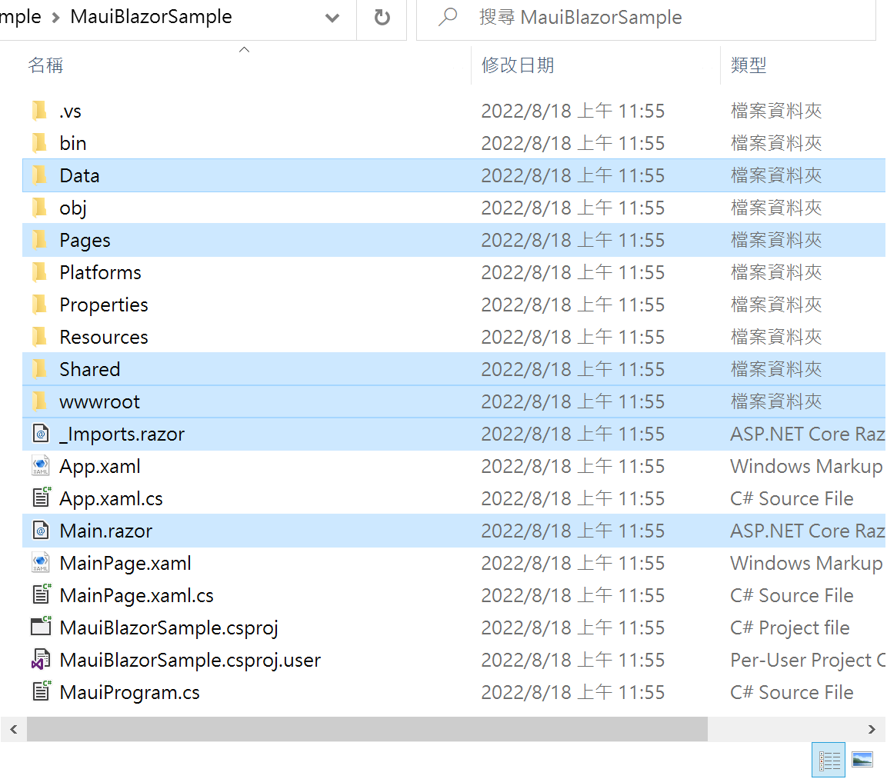
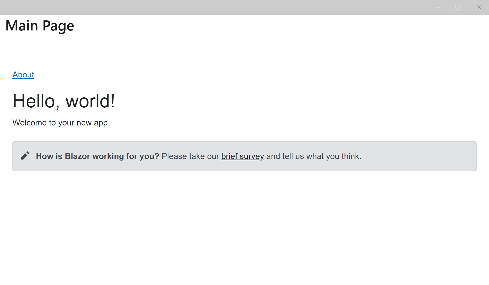
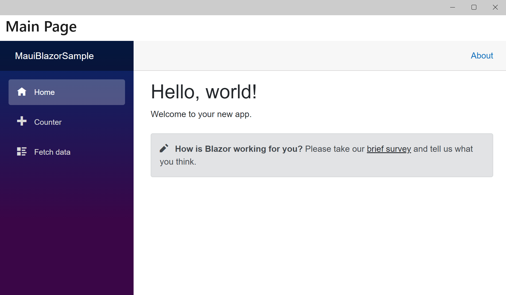
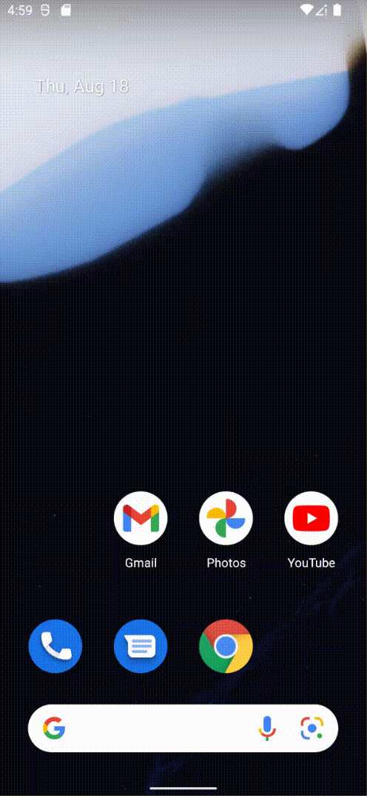

# 如何使用 Prism.Maui 製作出來 .NET MAUI 專案，擴充成為可以使用 Blazor Hybrid 功能

當想要在 .NET MAUI 專案中，使用 Blazor Hybrid 功能，除非一開始使用的專案範本就是 .NET MAUI Blazor 應用程式 這個專案範本，否則，就需要進行一系列的設定與初始化的工作，畢竟，這需要把 Blazor 要用到的相關 Web 檔案內容，都需要放置到 .NET MAUI 專案內，這不是件輕鬆的事情。

相關 Blazor Hybrid 資訊，可以參考 [ASP.NET Core Blazor Hybrid](https://docs.microsoft.com/zh-tw/aspnet/core/blazor/hybrid?WT.mc_id=DT-MVP-5002220)

在這篇文章將會採用一個簡單的方式，那就是事先建立一個範本為 .NET MAUI Blazor 應用程式的專案，接著建立一個使用 Prism.Maui 專案範本的專案，將 Blazor Hybrid 會用到的檔案或者內容，從前者專案複製到後者的專案內。

## 建立 .NET MAUI Blazor 應用程式專案

* 啟動 Visual Studio 2022 
* 看到 Visual Studio 2022 對話窗
* 請點選右下方的 [建立新的專案] 表示透過程式碼 Scaffolding 選擇專案範本以開始使用
* 當出現 [建立新專案] 對話窗
* 在中間最上方有三個下拉選單控制項
* 切換 [所有語言] 下拉選單控制項為 [C#]
* 切換 [所有專案類型] 下拉選單控制項為 [MAUI]
* 此時，在中間區域將會看到有三種專案範本可以選擇
* 請點選中間那個 [.NET MAUI Blazor 應用程式] 此專案可用於建立適用於 iOS、Android、Mac Catalyst、Tizen 和使用 Blazor 的 WinUI 的 .NET MAUI 應用程式
* 最後，點選右下方的 [下一步] 按鈕
* 在 [設定新的專案] 對話窗出現後
* 在 [專案名稱] 欄位內輸入 `MauiBlazorSample`
* 點選右下方的 [下一步] 按鈕
* 看到 [其他資訊] 對話窗，點選右下方的 [建立] 按鈕
* 稍微等候 Visual Studio 建立這個專案
* 底下是建立好的 MAUI 整體方案的結構

## 建立 Prism.Maui 開發框架的 MAUI 專案

* 開啟 Visual Studio 2022 Preview 版本
* 點選螢幕右下角的 [建立新的專案] 按鈕
* 在最上方的 [搜尋範本] 文字輸入盒內
* 輸入 `prism` 找出可用的專案範本
* 現在可以從 [建立新專案] 對話窗內出現了 [Prism .NET MAUI App (Dan Siegel)] 這個專案範本
* 選擇這個專案範本
* 點選右下角的 [下一步] 按鈕
* 當出現了 [設定新的專案] 對話窗
* 在 [專案名稱] 欄位內，輸入 `mauiPrismBlazor`
* 點選右下角的 [建立] 按鈕

## 複製 Blazor Hybrid 專案內的檔案與資料夾到 Prism.Maui 專案

* 滑鼠右擊 [MauiBlazorSample] 專案節點
* 選擇彈跳功能表清單最後面的 [使用檔案總管開啟資料夾] 選項
* 當 [MauiBlazorSample] 目錄內容顯示出來之後
* 請複選底下的資料夾與檔案

  Data, Pages, Shared, wwwroot, _Imports.razor, Main.razor

  

* 將已經選取好的項目，從檔案總管中拖拉到 mauiPrismBlazor 專案的根目錄節點內，如此，將會複製這些檔案到這個 mauiPrismBlazor 專案內

## 修正 Blazor Hybrid 需要用到的設定

### 升級 Prism.Maui 套件

在這個時間點，透過 Prism.Template 所建立起來的專案，使用的是 [Prism.DryIoc.Maui] 8.1.191-beta 這個版本，請升級這個套件到 8.1.254-beta

### 安裝 Microsoft.AspNetCore.Components.WebView.Maui

* 滑鼠右擊該專案的 [相依性] 節點
* 從彈出功能表中選擇 [管理 NuGet 套件] 功能選項
* 此時，[NuGet: mauiLottie] 視窗將會出現
* 點選 [瀏覽] 標籤頁次
* 在左上方的搜尋文字輸入盒內輸入 `Microsoft.AspNetCore.Components.WebView.Maui` 關鍵字
* 現在，將會看到 Microsoft.AspNetCore.Components.WebView.Maui 套件出現在清單內
* 點選這個 Microsoft.AspNetCore.Components.WebView.Maui 套件，並且點選右上方的 [安裝] 按鈕，安裝這個套件到這個專案內。

### 專案設定

* 滑鼠雙擊 mauiPrismBlazor 專案節點
* 打開這個 mauiPrismBlazor 專案的設定 XML 編輯頁面
* 將第一行的 `<Project Sdk="Microsoft.NET.Sdk">` 修改成為 `<Project Sdk="Microsoft.NET.Sdk.Razor">`
* 找到 `<ImplicitUsings>enable</ImplicitUsings>` 宣告
* 在其下方加入 `<EnableDefaultCssItems>false</EnableDefaultCssItems>` 這樣的宣告設定

### MauiProgram.cs

* 在 mauiPrismBlazor 專案根目錄下
* 找到並且打開 [MauiProgram.cs] 檔案
* 找到 `return builder.Build();` 敘述
* 在此敘述前，加入底下的 C# 程式碼

```csharp
builder.Services.AddMauiBlazorWebView();
#if DEBUG
builder.Services.AddBlazorWebViewDeveloperTools();
#endif

builder.Services.AddSingleton<WeatherForecastService>();
```

### 修正 MainPage.xaml

* 在 Views 目錄下找到並且打開 MainPage.xaml 檔案
* 使用底下 XAML 標記替換掉這個檔案內容

```xml
<?xml version="1.0" encoding="utf-8" ?>
<ContentPage xmlns="http://schemas.microsoft.com/dotnet/2021/maui"
             xmlns:x="http://schemas.microsoft.com/winfx/2009/xaml"
             Title="{Binding Title}"
             xmlns:local="clr-namespace:mauiPrismBlazor"
             x:Class="mauiPrismBlazor.Views.MainPage">

  <BlazorWebView HostPage="wwwroot/index.html">
    <BlazorWebView.RootComponents>
      <RootComponent Selector="#app" ComponentType="{x:Type local:Main}" />
    </BlazorWebView.RootComponents>
  </BlazorWebView>

</ContentPage>
```

### 常是第一次建置 mauiPrismBlazor 專案

* 滑鼠右擊 mauiPrismBlazor 專案節點
* 從彈出功能選單中，點選 [建置] 功能選項

此時，將會出現建置失敗的最後結果，從輸出視窗內，將會看到底下內容

```
已開始建置...
1>------ 已開始建置: 專案: mauiPrismBlazor, 設定: Debug Any CPU ------
1>C:\Vulcan\Github\CSharp2022\mauiPrismBlazor\mauiPrismBlazor\mauiPrismBlazor\Pages\Index.razor(7,1,7,56): warning RZ10012: Found markup element with unexpected name 'SurveyPrompt'. If this is intended to be a component, add a @using directive for its namespace.
1>C:\Vulcan\Github\CSharp2022\mauiPrismBlazor\mauiPrismBlazor\mauiPrismBlazor\_Imports.razor(8,24,8,30): error CS0234: 命名空間 'MauiBlazorSample' 中沒有類型或命名空間名稱 'Shared' (是否遺漏了組件參考?)
1>C:\Vulcan\Github\CSharp2022\mauiPrismBlazor\mauiPrismBlazor\mauiPrismBlazor\_Imports.razor(8,24,8,30): error CS0234: 命名空間 'MauiBlazorSample' 中沒有類型或命名空間名稱 'Shared' (是否遺漏了組件參考?)
1>C:\Vulcan\Github\CSharp2022\mauiPrismBlazor\mauiPrismBlazor\mauiPrismBlazor\_Imports.razor(8,24,8,30): error CS0234: 命名空間 'MauiBlazorSample' 中沒有類型或命名空間名稱 'Shared' (是否遺漏了組件參考?)
1>C:\Vulcan\Github\CSharp2022\mauiPrismBlazor\mauiPrismBlazor\mauiPrismBlazor\_Imports.razor(8,24,8,30): error CS0234: 命名空間 'MauiBlazorSample' 中沒有類型或命名空間名稱 'Shared' (是否遺漏了組件參考?)
1>C:\Vulcan\Github\CSharp2022\mauiPrismBlazor\mauiPrismBlazor\mauiPrismBlazor\_Imports.razor(8,24,8,30): error CS0234: 命名空間 'MauiBlazorSample' 中沒有類型或命名空間名稱 'Shared' (是否遺漏了組件參考?)
1>C:\Vulcan\Github\CSharp2022\mauiPrismBlazor\mauiPrismBlazor\mauiPrismBlazor\_Imports.razor(8,24,8,30): error CS0234: 命名空間 'MauiBlazorSample' 中沒有類型或命名空間名稱 'Shared' (是否遺漏了組件參考?)
1>C:\Vulcan\Github\CSharp2022\mauiPrismBlazor\mauiPrismBlazor\mauiPrismBlazor\_Imports.razor(8,24,8,30): error CS0234: 命名空間 'MauiBlazorSample' 中沒有類型或命名空間名稱 'Shared' (是否遺漏了組件參考?)
1>C:\Vulcan\Github\CSharp2022\mauiPrismBlazor\mauiPrismBlazor\mauiPrismBlazor\_Imports.razor(8,24,8,30): error CS0234: 命名空間 'MauiBlazorSample' 中沒有類型或命名空間名稱 'Shared' (是否遺漏了組件參考?)
1>C:\Vulcan\Github\CSharp2022\mauiPrismBlazor\mauiPrismBlazor\mauiPrismBlazor\Pages\Index.razor(7,1,7,56): warning RZ10012: Found markup element with unexpected name 'SurveyPrompt'. If this is intended to be a component, add a @using directive for its namespace.
1>C:\Vulcan\Github\CSharp2022\mauiPrismBlazor\mauiPrismBlazor\mauiPrismBlazor\Pages\Index.razor(7,1,7,56): warning RZ10012: Found markup element with unexpected name 'SurveyPrompt'. If this is intended to be a component, add a @using directive for its namespace.
1>C:\Vulcan\Github\CSharp2022\mauiPrismBlazor\mauiPrismBlazor\mauiPrismBlazor\_Imports.razor(8,24,8,30): error CS0234: 命名空間 'MauiBlazorSample' 中沒有類型或命名空間名稱 'Shared' (是否遺漏了組件參考?)
1>C:\Vulcan\Github\CSharp2022\mauiPrismBlazor\mauiPrismBlazor\mauiPrismBlazor\_Imports.razor(8,24,8,30): error CS0234: 命名空間 'MauiBlazorSample' 中沒有類型或命名空間名稱 'Shared' (是否遺漏了組件參考?)
1>C:\Vulcan\Github\CSharp2022\mauiPrismBlazor\mauiPrismBlazor\mauiPrismBlazor\_Imports.razor(8,24,8,30): error CS0234: 命名空間 'MauiBlazorSample' 中沒有類型或命名空間名稱 'Shared' (是否遺漏了組件參考?)
1>C:\Vulcan\Github\CSharp2022\mauiPrismBlazor\mauiPrismBlazor\mauiPrismBlazor\_Imports.razor(8,24,8,30): error CS0234: 命名空間 'MauiBlazorSample' 中沒有類型或命名空間名稱 'Shared' (是否遺漏了組件參考?)
1>C:\Vulcan\Github\CSharp2022\mauiPrismBlazor\mauiPrismBlazor\mauiPrismBlazor\_Imports.razor(8,24,8,30): error CS0234: 命名空間 'MauiBlazorSample' 中沒有類型或命名空間名稱 'Shared' (是否遺漏了組件參考?)
1>C:\Vulcan\Github\CSharp2022\mauiPrismBlazor\mauiPrismBlazor\mauiPrismBlazor\_Imports.razor(8,24,8,30): error CS0234: 命名空間 'MauiBlazorSample' 中沒有類型或命名空間名稱 'Shared' (是否遺漏了組件參考?)
1>C:\Vulcan\Github\CSharp2022\mauiPrismBlazor\mauiPrismBlazor\mauiPrismBlazor\_Imports.razor(8,24,8,30): error CS0234: 命名空間 'MauiBlazorSample' 中沒有類型或命名空間名稱 'Shared' (是否遺漏了組件參考?)
1>C:\Vulcan\Github\CSharp2022\mauiPrismBlazor\mauiPrismBlazor\mauiPrismBlazor\_Imports.razor(8,24,8,30): error CS0234: 命名空間 'MauiBlazorSample' 中沒有類型或命名空間名稱 'Shared' (是否遺漏了組件參考?)
1>C:\Vulcan\Github\CSharp2022\mauiPrismBlazor\mauiPrismBlazor\mauiPrismBlazor\_Imports.razor(8,24,8,30): error CS0234: 命名空間 'MauiBlazorSample' 中沒有類型或命名空間名稱 'Shared' (是否遺漏了組件參考?)
1>C:\Vulcan\Github\CSharp2022\mauiPrismBlazor\mauiPrismBlazor\mauiPrismBlazor\_Imports.razor(8,24,8,30): error CS0234: 命名空間 'MauiBlazorSample' 中沒有類型或命名空間名稱 'Shared' (是否遺漏了組件參考?)
1>C:\Vulcan\Github\CSharp2022\mauiPrismBlazor\mauiPrismBlazor\mauiPrismBlazor\_Imports.razor(8,24,8,30): error CS0234: 命名空間 'MauiBlazorSample' 中沒有類型或命名空間名稱 'Shared' (是否遺漏了組件參考?)
1>C:\Vulcan\Github\CSharp2022\mauiPrismBlazor\mauiPrismBlazor\mauiPrismBlazor\_Imports.razor(8,24,8,30): error CS0234: 命名空間 'MauiBlazorSample' 中沒有類型或命名空間名稱 'Shared' (是否遺漏了組件參考?)
1>C:\Vulcan\Github\CSharp2022\mauiPrismBlazor\mauiPrismBlazor\mauiPrismBlazor\_Imports.razor(8,24,8,30): error CS0234: 命名空間 'MauiBlazorSample' 中沒有類型或命名空間名稱 'Shared' (是否遺漏了組件參考?)
1>C:\Vulcan\Github\CSharp2022\mauiPrismBlazor\mauiPrismBlazor\mauiPrismBlazor\_Imports.razor(8,24,8,30): error CS0234: 命名空間 'MauiBlazorSample' 中沒有類型或命名空間名稱 'Shared' (是否遺漏了組件參考?)
1>C:\Vulcan\Github\CSharp2022\mauiPrismBlazor\mauiPrismBlazor\mauiPrismBlazor\_Imports.razor(8,24,8,30): error CS0234: 命名空間 'MauiBlazorSample' 中沒有類型或命名空間名稱 'Shared' (是否遺漏了組件參考?)
1>C:\Vulcan\Github\CSharp2022\mauiPrismBlazor\mauiPrismBlazor\mauiPrismBlazor\_Imports.razor(8,24,8,30): error CS0234: 命名空間 'MauiBlazorSample' 中沒有類型或命名空間名稱 'Shared' (是否遺漏了組件參考?)
1>專案 "mauiPrismBlazor.csproj" 建置完成 -- 失敗。
1>C:\Vulcan\Github\CSharp2022\mauiPrismBlazor\mauiPrismBlazor\mauiPrismBlazor\Pages\Index.razor(7,1,7,56): warning RZ10012: Found markup element with unexpected name 'SurveyPrompt'. If this is intended to be a component, add a @using directive for its namespace.
1>C:\Vulcan\Github\CSharp2022\mauiPrismBlazor\mauiPrismBlazor\mauiPrismBlazor\_Imports.razor(8,24,8,30): error CS0234: 命名空間 'MauiBlazorSample' 中沒有類型或命名空間名稱 'Shared' (是否遺漏了組件參考?)
1>C:\Vulcan\Github\CSharp2022\mauiPrismBlazor\mauiPrismBlazor\mauiPrismBlazor\_Imports.razor(8,24,8,30): error CS0234: 命名空間 'MauiBlazorSample' 中沒有類型或命名空間名稱 'Shared' (是否遺漏了組件參考?)
1>C:\Vulcan\Github\CSharp2022\mauiPrismBlazor\mauiPrismBlazor\mauiPrismBlazor\_Imports.razor(8,24,8,30): error CS0234: 命名空間 'MauiBlazorSample' 中沒有類型或命名空間名稱 'Shared' (是否遺漏了組件參考?)
1>C:\Vulcan\Github\CSharp2022\mauiPrismBlazor\mauiPrismBlazor\mauiPrismBlazor\_Imports.razor(8,24,8,30): error CS0234: 命名空間 'MauiBlazorSample' 中沒有類型或命名空間名稱 'Shared' (是否遺漏了組件參考?)
1>C:\Vulcan\Github\CSharp2022\mauiPrismBlazor\mauiPrismBlazor\mauiPrismBlazor\_Imports.razor(8,24,8,30): error CS0234: 命名空間 'MauiBlazorSample' 中沒有類型或命名空間名稱 'Shared' (是否遺漏了組件參考?)
1>C:\Vulcan\Github\CSharp2022\mauiPrismBlazor\mauiPrismBlazor\mauiPrismBlazor\_Imports.razor(8,24,8,30): error CS0234: 命名空間 'MauiBlazorSample' 中沒有類型或命名空間名稱 'Shared' (是否遺漏了組件參考?)
1>C:\Vulcan\Github\CSharp2022\mauiPrismBlazor\mauiPrismBlazor\mauiPrismBlazor\_Imports.razor(8,24,8,30): error CS0234: 命名空間 'MauiBlazorSample' 中沒有類型或命名空間名稱 'Shared' (是否遺漏了組件參考?)
1>C:\Vulcan\Github\CSharp2022\mauiPrismBlazor\mauiPrismBlazor\mauiPrismBlazor\_Imports.razor(8,24,8,30): error CS0234: 命名空間 'MauiBlazorSample' 中沒有類型或命名空間名稱 'Shared' (是否遺漏了組件參考?)
1>專案 "mauiPrismBlazor.csproj" 建置完成 -- 失敗。
========== 組建: 成功 0 個，失敗 1 個，已更新 0 個，略過 0 個==========
```

### 修正這個專案要使用的命名空間

* 在 mauiPrismBlazor 專案根目錄下
* 找到並且打開 _Imports.razor 檔案
* 將 MauiBlazorSample 文字，替換為 mauiPrismBlazor

### 重新建置與執行這個專案

現在將會看到這個專案已經可以成功建置了

* 請執行這個專案

可是，現在看到底下的畫面，此時所出現的畫面不正確



### 修正 index.html

* 在 wwwroot 目錄下找到並且打開 index.html 檔案
* 找到 `<link href="MauiBlazorSample.styles.css" rel="stylesheet" />` 宣告，將此行宣告修正為 `<link href="mauiPrismBlazor.styles.css" rel="stylesheet" />`

### 重新執行這個專案

現在已經可以成功的在 Prism.Maui 專案內，引用了 Blazor Hybrid 功能，因此，在這個專案內，將會可以開始進行使用 Blazor 的方式來進行專案開發了。





