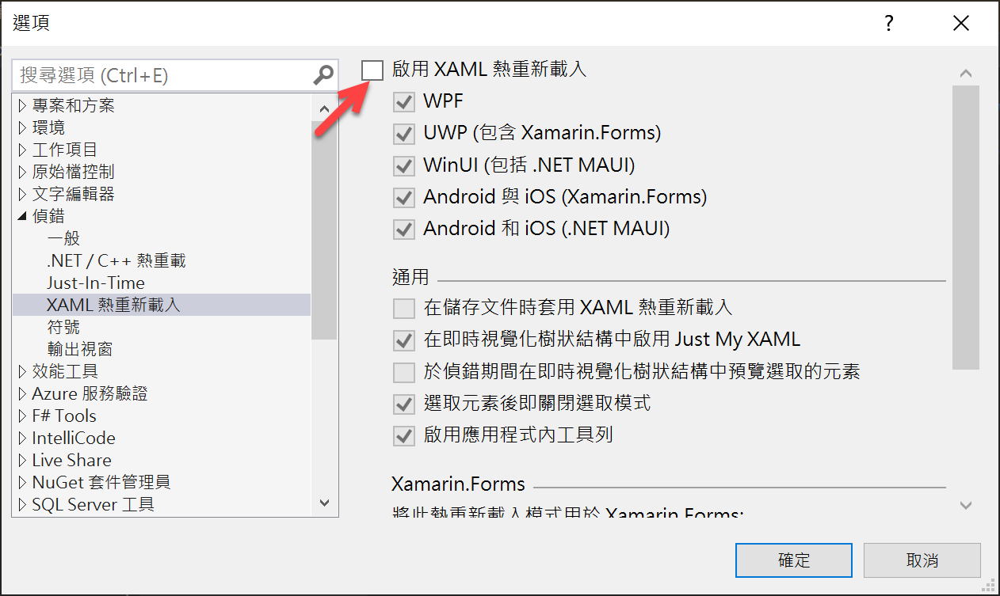

# 在 .NET MAUI 專案下，使用 LiveCharts2 套件，產生統計圖形

今天在 Twitter 上看到一個訊息，提到有個 [LiveChart](https://lvcharts.com/) 元件，可以產生出統計圖形，並且是支援 .NET MAUI 開發平台的，覺得這樣的套件相當有趣與實用，因此，想說能否在 Prism.Maui 支援的環境下來使用，因此，就來進行測試，覺得效果相當的不錯。

## 建立 Prism.Maui 專案

* 開啟 Visual Studio 2022 Preview 版本
* 點選螢幕右下角的 [建立新的專案] 按鈕
* 切換右上角的 [所有專案類型] 下拉選單控制項
* 找到並且點選 [MAUI] 這個選項
* 從清單中找到並選擇 [Prism .NET MAUI App (Dan Siegel)] 這個專案範本

  > A project for creating a Prism .NET MAUI application for iOS, Android, Mac Catalyst, WinUI and Tizen
* 點選右下角的 [下一步] 按鈕
* 當出現了 [設定新的專案] 對話窗
* 在 [專案名稱] 欄位內，輸入 `mauiLiveChart`
* 點選右下角的 [建立] 按鈕

## 安裝相關 NuGet 套件

### 加入 PropertyChanged.Fody 的 NuGet 套件

* 滑鼠右擊該專案的 [相依性] 節點
* 從彈出功能表中選擇 [管理 NuGet 套件] 功能選項
* 此時，[NuGet: PrismMonkey] 視窗將會出現
* 點選 [瀏覽] 標籤頁次
* 在左上方的搜尋文字輸入盒內輸入 `PropertyChanged.Fody` 關鍵字
* 現在，將會看到 PropertyChanged.Fody 套件出現在清單內
* 點選這個 PropertyChanged.Fody 套件
* 點選右上方的 [安裝] 按鈕，安裝這個套件到這個專案內。

### 加入 LiveChartsCore.SkiaSharpView 的 NuGet 套件

* 滑鼠右擊該專案的 [相依性] 節點
* 從彈出功能表中選擇 [管理 NuGet 套件] 功能選項
* 此時，[NuGet: PrismMonkey] 視窗將會出現
* 點選 [瀏覽] 標籤頁次
* 在左上方的搜尋文字輸入盒內輸入 `LiveChartsCore.SkiaSharpView` 關鍵字
* 現在，將會看到 PropertyChanged.Fody 套件出現在清單內
* 點選這個 PropertyChanged.Fody 套件
* 點選右上方的 [安裝] 按鈕，安裝這個套件到這個專案內。

## 修正 MainPageViewModel 

* 在專案下，找到 [ViewModels] 資料夾
* 找到並打開 [MainPageViewModel.cs] 檔案
* 使用底下程式碼替換掉這個檔案內容

```csharp
namespace mauiLiveChart.ViewModels;

using System.Collections.ObjectModel;
using System.ComponentModel;
using LiveChartsCore;
using LiveChartsCore.SkiaSharpView;
using Prism.Events;
using Prism.Navigation;
using Prism.Services;
public class MainPageViewModel : INotifyPropertyChanged, INavigationAware
{
    public event PropertyChangedEventHandler PropertyChanged;

    private readonly INavigationService navigationService;
    public ObservableCollection<ISeries> Series { get; set; } =
        new ObservableCollection<ISeries>();
    public MainPageViewModel(INavigationService navigationService)
    {
        this.navigationService = navigationService;

    }

    public void OnNavigatedFrom(INavigationParameters parameters)
    {
    }

    public void OnNavigatedTo(INavigationParameters parameters)
    {
        Series.Add(new PieSeries<double> { Values = new double[] { 2 } });
        Series.Add(new PieSeries<double> { Values = new double[] { 4 } });
        Series.Add(new PieSeries<double> { Values = new double[] { 1 } });
        Series.Add(new PieSeries<double> { Values = new double[] { 4 } });
        Series.Add(new PieSeries<double> { Values = new double[] { 3 } });
    }

}
```

在這個 ViewModel 內，宣告了一個 `ObservableCollection<ISeries> Series { get; set; }` 屬性，這裡將會要來產生這個圓餅圖需要用到的數據。

一旦這個頁面顯示之後，將會觸發與執行 OnNavigatedTo 這個方法，因此，在這裡進行這個圓餅圖要顯示相關數據資訊。

## 修正 MainPage
* 在專案下，找到 [Views] 資料夾
* 找到並打開 [MainPage.xaml] 檔案
* 使用底下 XAML 標記替換掉這個檔案內容

```xml
<?xml version="1.0" encoding="utf-8" ?>
<ContentPage xmlns="http://schemas.microsoft.com/dotnet/2021/maui"
             xmlns:x="http://schemas.microsoft.com/winfx/2009/xaml"
             Title="LiveChart2"
             xmlns:local="clr-namespace:mauiLiveChart.ViewModels"
             xmlns:lvc="clr-namespace:LiveChartsCore.SkiaSharpView.Maui;assembly=LiveChartsCore.SkiaSharpView.Maui"
             x:DataType="local:MainPageViewModel"
             x:Class="mauiLiveChart.Views.MainPage">

  <Grid BackgroundColor="White">
    <Label Text="Hello LiveChart2"
           Margin="10"
           FontSize="30"/>
    <lvc:PieChart
      Series="{Binding Series}">
    </lvc:PieChart>
  </Grid>
  
</ContentPage>
```

在這個 XAML 頁面內，僅簡單的加入兩個檢視控制項，一個 Label ，這個僅僅是用來標示用的，另外一個才是重點，一個 PieChart 檢視，用來顯示圓餅圖之用

## 進行測試與察看結果

* 點選中間上方工具列的 [Windows Machine] 這個工具列按鈕旁的下拉選單三角形
* 從彈出功能表中，找到 [Android Emulators] 內的任何一個模擬器
* 接者，開始執行這個專案，讓他可以在 Android 模擬器出現
* 此時，終於可以看到 [LiveChart2] 這個頁面了

  

> 若再 Android 進行開發與測試，若發現到無法看到上面的圓餅圖形，可以嘗試關閉 XAML 熱重載機制，請使用底下說明來關閉
>
> * 在功能表中，點選 [工具] > [選項]
> * 當 [選項] 對話窗出現之後
> * 點選 [偵錯] > [XAML 熱重新載入]
> * 取消 [啟用 XAML 熱重新載入] 這個檢查盒設定
> 
> 
>
> 再次重新執行，就會看到了


