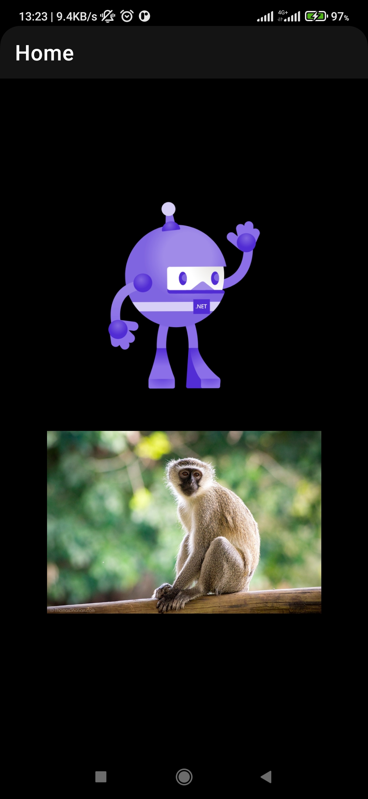
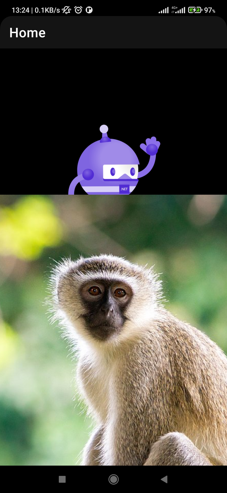

# .NET MAUI 可以使用雙指放大與移動的設計效果

## 建立 .NET MAUI 應用程式 專案

* 開啟 Visual Studio 2022 版本
* 點選螢幕右下角的 [建立新的專案] 按鈕
* 切換右上角的 [所有專案類型] 下拉選單控制項
* 找到並且點選 [MAUI] 這個選項
* 從清單中找到並選擇 [.NET MAUI 應用程式] 這個專案範本

  > 此專案可用於建立適用於 iOS、Android、Mac Catalyst、Tizen和WinUI 的 .NET MAUI 應用程式
* 點選右下角的 [下一步] 按鈕
* 當出現了 [設定新的專案] 對話窗
* 在 [專案名稱] 欄位內，輸入 `mauiPinchZoomImage`
* 點選右下角的 [下一步] 按鈕
* 當出現了 [其他資訊] 對話窗
* 對於 [架構] 的下拉選單控制項，使用預設值
* 點選右下角的 [建立] 按鈕

## 加入 PropertyChanged.Fody 的 NuGet 套件

* 滑鼠右擊該專案的 [相依性] 節點
* 從彈出功能表中選擇 [管理 NuGet 套件] 功能選項
* 此時，[NuGet: mauiLottie] 視窗將會出現
* 點選 [瀏覽] 標籤頁次
* 在左上方的搜尋文字輸入盒內輸入 `Bertuzzi.MAUI.PinchZoomImage` 關鍵字
* 現在，將會看到 Bertuzzi.MAUI.PinchZoomImage 套件出現在清單內
* 點選這個 Bertuzzi.MAUI.PinchZoomImage 套件，並且點選右上方的 [安裝] 按鈕，安裝這個套件到這個專案內。

## 修正頁面

* 在根目錄下找到並且打開 MainPage.xaml 這個檔案
* 在這個 XAML 檔案內的 ContentPage 根節點內，加入一個新的命名空間

  xmlns:pinch="clr-namespace:Bertuzzi.MAUI.PinchZoomImage;assembly=Bertuzzi.MAUI.PinchZoomImage"

* 將這個頁面的整個 XAML 內容，使用底下的 XAML 標記來替換

```xml
<?xml version="1.0" encoding="utf-8" ?>
<ContentPage xmlns="http://schemas.microsoft.com/dotnet/2021/maui"
             xmlns:x="http://schemas.microsoft.com/winfx/2009/xaml"
             xmlns:pinch="clr-namespace:Bertuzzi.MAUI.PinchZoomImage;assembly=Bertuzzi.MAUI.PinchZoomImage"
             x:Class="mauiPinchZoomImage.MainPage">

    <StackLayout HorizontalOptions="Center" VerticalOptions="Center"
            Spacing="25"
            Padding="30,0">

        <Image
                Source="dotnet_bot.png"
                SemanticProperties.Description="Cute dot net bot waving hi to you!"
                HeightRequest="200"
                HorizontalOptions="Center" />

        <pinch:PinchZoom
            Margin="20">
            <Image Source="https://upload.wikimedia.org/wikipedia/commons/thumb/e/ea/Vervet_Monkey_%28Chlorocebus_pygerythrus%29.jpg/1200px-Vervet_Monkey_%28Chlorocebus_pygerythrus%29.jpg?20181109194254"/>
        </pinch:PinchZoom>
    </StackLayout>

</ContentPage>
```

在這個頁面內，使用 StackLayout 作為這個頁面的根項目，在最後面使用 pinch:PinchZoon 來加入這個可以縮放的控制項，而在這個控制項內容屬性 Content Property 指定一個 Image 做為其要顯示的內容，這裡將會隨機從網路找到一個圖片 URL ，做為要顯示這個圖片的來源。

現在可以建置與執行看看，將會得到底下的畫面



現在可以使用雙指在猴子圖片上，進行捏合與放開的操作，就可以看到圖片正在即時的放大效果，而，若使用單指在猴子圖片上進行拖拉，則可以移動這個圖片的位置。



