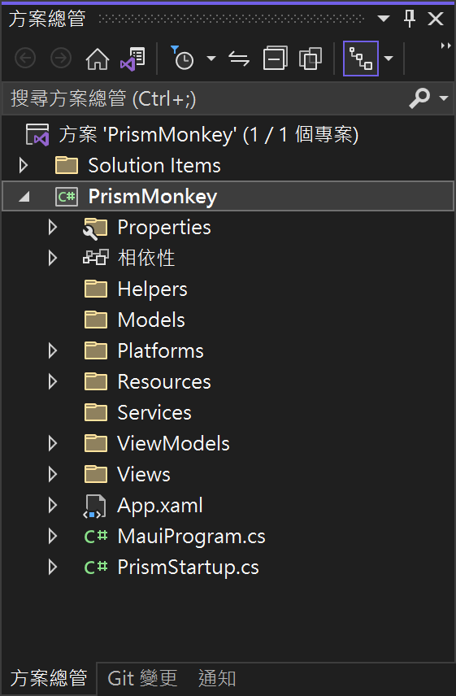

# 建立專案與核心服務

一旦開發 MAUI App 的工具與環境都設定好之後，現在將要準備開始進行這個專案開發的工作；不過，在此將會先建立起使用 Prism.Maui 框架的 MAUI 應用程式專案，緊接著將整個應用程式專案的架構建立起來，然後會建立這個應用程式會使用到的服務與資料模型和支援服務類別，因此，在這裡準備要進行的工作可以整理為：

* 建立 Prism.Maui 專案
* 了解 MAUI 專案結構
* 安裝相關 NuGet 套件
* 建立方案資料夾
* 建立 資料模型 Model 類別
* 建立 服務 Service 類別與註冊該服務
* 建立 支援 Helper 類別

## 建立 Prism.Maui 專案

* 開啟 Visual Studio 2022 Preview 版本
* 點選螢幕右下角的 [建立新的專案] 按鈕

  
* 切換右上角的 [所有專案類型] 下拉選單控制項
* 找到並且點選 [MAUI] 這個選項
* 從清單中找到並選擇 [Prism .NET MAUI App (Dan Siegel)] 這個專案範本

  > A project for creating a Prism .NET MAUI application for iOS, Android, Mac Catalyst, WinUI and Tizen

  

* 點選右下角的 [下一步] 按鈕
* 當出現了 [設定新的專案] 對話窗
* 在 [專案名稱] 欄位內，輸入 `PrismMonkey`

  

* 點選右下角的 [建立] 按鈕

## 了解 MAUI 專案結構 Todo

現在使用 Prism 開發框架的 MAUI 專案已經成功建立了

底下是建立好的整個專案結構


## 初次體驗在 Android 平台執行專案

* 點選中間上方工具列的 [Windows Machine] 這個工具列按鈕旁的下拉選單三角形
* 從彈出功能表中，找到 [Android Emulators] 內的任何一個模擬器

  

* 接者，開始執行這個專案，讓他可以在 Android 模擬器出現

  
* 底下是執行後的結果


現在確定這個專案是有效的，而且可以建置與成功在 Android 模擬器上運行，接下來要來進行開發這個專案會用到的 NuGet 套件安裝。

## 安裝相關 NuGet 套件

### 加入 PropertyChanged.Fody 的 NuGet 套件

* 滑鼠右擊該專案的 [相依性] 節點
* 從彈出功能表中選擇 [管理 NuGet 套件] 功能選項
* 此時，[NuGet: PrismMonkey] 視窗將會出現
* 點選 [瀏覽] 標籤頁次
* 在左上方的搜尋文字輸入盒內輸入 `PropertyChanged.Fody` 關鍵字
* 現在，將會看到 PropertyChanged.Fody 套件出現在清單內
* 點選這個 PropertyChanged.Fody 套件

  

  
* 點選右上方的 [安裝] 按鈕，安裝這個套件到這個專案內。

### 加入 Newtonsoft.Json 的 NuGet 套件

* 滑鼠右擊該專案的 [相依性] 節點
* 從彈出功能表中選擇 [管理 NuGet 套件] 功能選項
* 此時，[NuGet: PrismMonkey] 視窗將會出現
* 點選 [瀏覽] 標籤頁次
* 在左上方的搜尋文字輸入盒內輸入 `Newtonsoft.Json` 關鍵字
* 現在，將會看到 Newtonsoft.Json 套件出現在清單內
* 點選這個 Newtonsoft.Json 套件

  
* 點選右上方的 [安裝] 按鈕，安裝這個套件到這個專案內。

### 檢查這個專案內安裝了那些 NuGet 套件

* 滑鼠雙擊 [PrismMonkey] 這個專案節點
* 可以在這個 [PrismMonkey.csproj] 檔案中，看到底下內容

```xml
<ItemGroup>
  <PackageReference Include="Newtonsoft.Json" Version="13.0.1" />
  <PackageReference Include="Prism.DryIoc.Maui" Version="8.1.191-beta" />
  <PackageReference Include="PropertyChanged.Fody" Version="3.4.1" />
</ItemGroup>
```

* 這裡描述了這個專案內，已經安裝了那些 NuGet 套件

## 建立方案資料夾

* 滑鼠右擊 [PrismMonkey] 專案節點
* 從彈出功能表中，點選 [加入] > [新增資料夾]
* 將這個新資料夾重新命名為 `Helpers`

  > 這個資料夾將會用來儲存此專案會用到的支援類別 .cs 檔案
* 滑鼠右擊 [PrismMonkey] 專案節點
* 從彈出功能表中，點選 [加入] > [新增資料夾]
* 將這個新資料夾重新命名為 `Models`

  > 這個資料夾將會用來儲存此專案會用各個資料模型 Model 類別 .cs 檔案，這裡所謂的 Model，指的就是 MVVM Model-View-ViewModel 中的第一個字
* 滑鼠右擊 [PrismMonkey] 專案節點
* 從彈出功能表中，點選 [加入] > [新增資料夾]
* 將這個新資料夾重新命名為 `Services`

  > 這個資料夾將會用來儲存此專案會用到的相關服務類別 .cs 檔案，例如，在這裡將會把要讀取遠端網路上的 JSON 資料這樣的需求，設計到一個服務類別內，接著註冊到相依性注入容器內，而後在 ViewModel 內透過建構式注入的方式，取得這個服務執行個體，便可以在 ViewModel 內進行讀取遠端 JSON 工作了。

底下是完成後的整個方案結構



## 建立 資料模型 Model 類別

* 滑鼠右擊 [Models] 資料夾節點
* 從彈出功能表中，點選 [加入] > [類別]
* 當 [新增項目 - PrismMonkey] 對話窗出現後
* 在此對話窗下方的 [名稱] 欄位內，出入 `Monkey.cs`

  
* 點選此對話窗右下方的 [新增] 按鈕
* 使用底下的 C# 程式碼，替換掉原有這個檔案內的內容

```csharp
using System.ComponentModel;

namespace PrismMonkey.Models
{
    /// <summary>
    /// 猴子資料模型類別
    /// </summary>
    public class Monkey : INotifyPropertyChanged
    {
        /// <summary>
        /// 實作 INoifyPropertyChanged 介面內的事件成員
        /// </summary>
        public event PropertyChangedEventHandler PropertyChanged;
        /// <summary>
        /// 姓名
        /// </summary>
        public string Name { get; set; }
        /// <summary>
        /// 地點
        /// </summary>
        public string Location { get; set; }
        /// <summary>
        /// 明細說明
        /// </summary>
        public string Details { get; set; }
        /// <summary>
        /// 圖片網址
        /// </summary>
        public string Image { get; set; }
        /// <summary>
        /// 分布數量
        /// </summary>
        public int Population { get; set; }
        /// <summary>
        /// 緯度
        /// </summary>
        public double Latitude { get; set; }
        /// <summary>
        /// 經度
        /// </summary>
        public double Longitude { get; set; }

    }
}
```

在這裡設計一個類別，名稱稱為 Monkey，不過，該類別會實作 INotifyPropertyChanged 這個介面，並且依照此介面的要求，要在此類別內宣告一個事件成員 `public event PropertyChangedEventHandler PropertyChanged;`。這個 PropertyChanged 事件，將會在 XAML 資料綁定中扮演著重大的角色。

在此類別內，也加入了七個 屬性 Property 成員：Name、Location、Details、Image、Population、Latitude、Longitude。會有這七個屬性的定義，這是因為等下要設計的服務類別，將會從 https://www.montemagno.com/monkeys.json URL 下載讀取關於猴子相關的 JSON 資訊。

每個猴子紀錄定在 JSON 使用底下的內容來表示，在這個 JSON 物件中，將會看到有七個屬性存在，這些屬性將會分別對應到這個 C# 類別的屬性。

```json
{
  "Name": "Baboon",
  "Location": "Africa & Asia",
  "Details": "Baboons are African and Arabian Old World monkeys belonging to the genus Papio, part of the subfamily Cercopithecinae.",
  "Image": "https://raw.githubusercontent.com/jamesmontemagno/app-monkeys/master/baboon.jpg",
  "Population": 10000,
  "Latitude": -8.783195,
  "Longitude": 34.508523
}
```

## 建立 服務 Service 類別與註冊該服務

完成了資料模型 Model 的設計，現在要來進行從網路讀取 JSON 紀錄並且將這個 JSON 內容反序列化成為 C# 內的集合 Collection 物件

* 滑鼠右擊 [Services] 資料夾節點
* 從彈出功能表中，點選 [加入] > [類別]
* 當 [新增項目 - PrismMonkey] 對話窗出現後
* 在此對話窗下方的 [名稱] 欄位內，出入 `MonkeyService.cs`

  
* 點選此對話窗右下方的 [新增] 按鈕
* 使用底下的 C# 程式碼，替換掉原有這個檔案內的內容

```csharp
using Newtonsoft.Json;
using PrismMonkey.Models;

namespace PrismMonkey.Services
{
    /// <summary>
    /// 猴子服務類別
    /// </summary>
    public class MonkeyService
    {
        /// <summary>
        /// 可以讀取網路服務端點的猴子清單資訊物件
        /// </summary>
        public HttpClient Client { get; set; } = new HttpClient();
        /// <summary>
        /// 從網路讀取到的猴子集合物件
        /// </summary>
        public List<Monkey> Monkeys { get; set; }

        /// <summary>
        /// 取得遠端網路上的猴子資訊清單
        /// </summary>
        /// <returns></returns>
        public async Task<List<Monkey>> GetMonkeysAsync()
        {
            // 若已經有猴子資料，則不會聯網抓取
            if (Monkeys?.Count > 0)
                return Monkeys;

            // 透過服務端點，線上抓取猴子 JSON 清單資訊
            var result = await Client.GetStringAsync("https://www.montemagno.com/monkeys.json");
            Monkeys = JsonConvert.DeserializeObject<List<Monkey>>(result); 

            return Monkeys;
        }
    }
}
```

在這個 MonkeyService 猴子服務類別內，將會透過 HttpClient 這個執行個體來存取網路服務端點資訊，因此在這裡宣告了一個型別為 HttpClient 的 Client 屬性。對於讀取到的所有猴子紀錄，將會透過集合型別 `List<Monkey>` 所建立的 Monkey 屬性來儲存起來。

在這個猴子服務類別內，僅簡單的設計一個公開方法，其函式簽章為 `public async Task<List<Monkey>> GetMonkeysAsync()` ，這表示了，當呼叫了 GetMonkeysAsync 這個方法之後，將會使用非同步方式來執行這個方法，最後，將會回傳這個 `List<Monkey>` 集合型別的物件回到呼叫這個方法程式碼內。

在這個 GetMonkeysAsync 方法內，首先會檢查 Monkeys 這個集合物件內是否有任何其他物件存在，若有，則會立即結束執行，否則，將會透過這個類別內型別為 HttpClient 的 Client 物件，使用 `Client.GetStringAsync("https://www.montemagno.com/monkeys.json")` 敘述來將所指定 URL，取得字串內容，由於 GetStringAsync 會回傳一個非同步工作，因此，在這裡將會使用 await 運算子來進行非封鎖式的等待，避免 UI 執行緒被 封鎖 Block 而阻擋了其他程式碼的執行；由於使用了 await 關鍵字，因此，這個方法需要加上 async 修飾詞，使得這個方法將會從同步方法，轉變成為一個非同步方法(這裡講的非同步方法，將會是由編譯器所產生出來的相關程式碼，使其可以使用非同步的方式來執行)。

當取得指定 URL 網址上的字串內容，將會儲存在區域變數 result 內，接著，透過呼叫 `JsonConvert.DeserializeObject<List<Monkey>>(result)` 方法，把這裡的字串文字，反序列會成為 .NET C# 內一個型別為 `List<Monkey>` 的集合物件，這裡會將集合物件儲存到 Monkeys 屬性內。

最後，將取得所有猴子集合物件，回傳到呼叫端。

## 建立 支援 Helper 類別

最後，要來完成一個支援類別的設計，這裡將會設計一個類別，把這個專案內使用到的神奇字串，都儲存到這個類別內，方便管理與讓程式碼更加好維護。


* 滑鼠右擊 [Helpers] 資料夾節點
* 從彈出功能表中，點選 [加入] > [類別]
* 當 [新增項目 - PrismMonkey] 對話窗出現後
* 在此對話窗下方的 [名稱] 欄位內，出入 `ConstantHelper.cs`

  
* 點選此對話窗右下方的 [新增] 按鈕
* 使用底下的 C# 程式碼，替換掉原有這個檔案內的內容

```csharp
namespace PrismMonkey.Helpers
{
    /// <summary>
    /// 管理該專案使用到的字串資源
    /// </summary>
    public static class ConstantHelper
    {
        #region 該應用程式中的頁面名稱字串
        /// <summary>
        /// 猴子集合物件清單的頁面名稱
        /// </summary>
        public static readonly string MonkeyListPage = nameof(MonkeyListPage);
        /// <summary>
        /// 猴子明細資訊的頁面名稱
        /// </summary>
        public static readonly string MonkeyDetailPage = nameof(MonkeyDetailPage);
        #endregion

        #region 頁面導航用到的參數鍵值
        /// <summary>
        /// 傳入猴子參數的鍵值名稱
        /// </summary>
        public static readonly string NavigationKeyMonkey = "Monkey";
        #endregion
    }
}
```

在這裡設計一個靜態 ConstantHelper 類別，在此靜態類別內，建立了三個唯讀字串，分別為 MonkeyListPage、MonkeyDetailPage 與 NavigationKeyMonkey ，前面兩者將會表示接下來會用到的頁面字串名稱，而這裡將會透過 C# 6.0 所提供的 [nameof 運算式](https://docs.microsoft.com/zh-tw/dotnet/csharp/language-reference/operators/nameof?WT.mc_id=DT-MVP-5002220)功能來設定這些頁面文字內容，在官方網頁上是這麼描述的：運算式 nameof 會產生變數、類型或成員的名稱做為字串常數；而最後一個唯讀字串，將會是用做於頁面導航過程中，將相關資訊物件，傳遞到其他頁面時候會用到的參數鍵值名稱。

## 完成後的專案結構

底下螢幕截圖，將會是完成這些步驟之後，所看到的專案結構，在這裡建立三個資料夾與三個類別檔案


