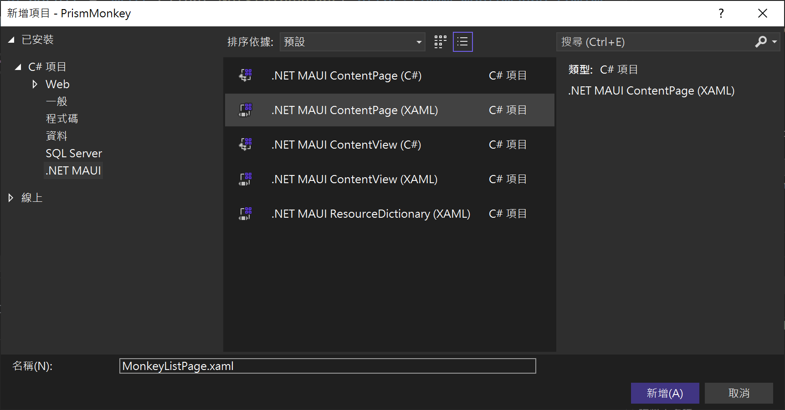
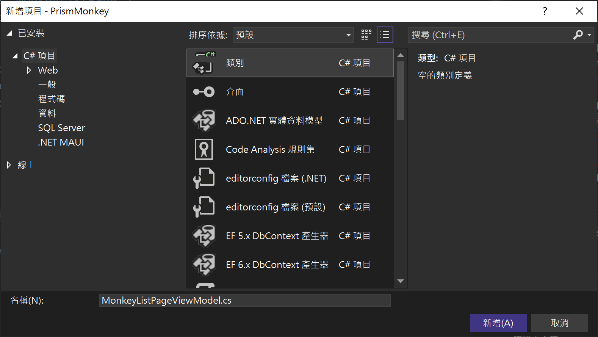
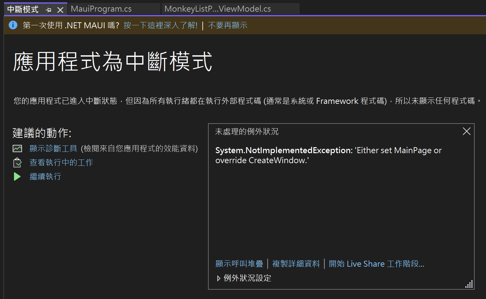
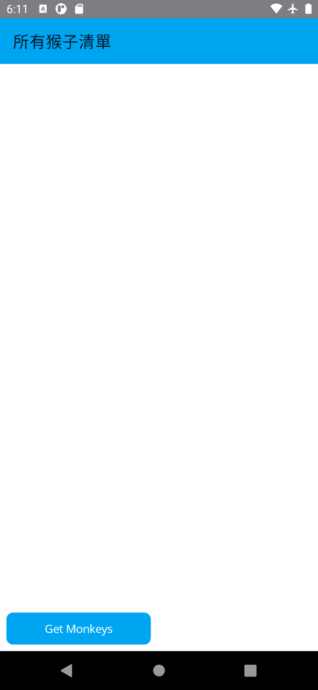
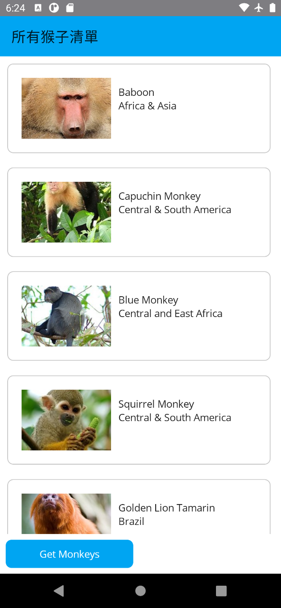

# 顯示單頁面的集合清單資料

## 建立新的猴子清單頁面 View

* 滑鼠右擊 [Views] 資料夾節點
* 從彈出功能表中，點選 [加入] > [新增項目]
* 當 [新增項目 - PrismMonkey] 對話窗出現後
* 點選對話窗左邊的項目清單 [已安裝] > [C# 項目] > [.NET MAUI]
* 在該對話窗中間區域，選擇 [.NET MAUI ContentPage (XAML)] 這個項目

  > 請不要選擇 [.NET MAUI ContentPage (C#)] ，因為這個項目是採用 C# 語言來開發頁面，而不是採用 XAML 標記宣告語言來設計頁面

* 在此對話窗下方的 [名稱] 欄位內，出入 `MonkeyListPage.xaml`

  
* 點選此對話窗右下方的 [新增] 按鈕

## 建立新的猴子清單頁面檢視類別 ViewModel

* 滑鼠右擊 [ViewModels] 資料夾節點
* 從彈出功能表中，點選 [加入] > [類別]
* 當 [新增項目 - PrismMonkey] 對話窗出現後
* 在此對話窗下方的 [名稱] 欄位內，出入 `MonkeyListPageViewModel.cs`

  
* 點選此對話窗右下方的 [新增] 按鈕

## 註冊該頁面到相依性注入容器內

在以往使用 Prism Template Pack 開發 Xamarin.Forms 專案的時候，這裡要做的事情，其實 Prism Template Pack 這個擴充套件已經幫忙做完了，不過，現在進行 MAUI 專案開發的時候，在這裡需要養成習慣，也就是，每次建立一個新的頁面 View 的時候，需要同時建立一個相對應的 ViewModel 類別，最後，要來把這個剛剛設計好的頁面 View，註冊到 DI / IoC Container 相依性注入容器內

* 在此專案的根目錄下
* 找到並且打開 [PrismStartup.cs] 檔案
* 找到 [RegisterTypes] 這個方法
* 在該方法內加入 `containerRegistry.RegisterForNavigation<MonkeyListPage>();` 敘述

  > 在此是透過 containerRegistry 這個物件，告知相依性注入容器要註冊一個 [MonkeyListPage] 這個頁面，當要進行頁面導航的時候，可以透過這裡個宣告，產生並且注入到需要的類別物件內。

* 底下是完成後的 [PrismStartup.cs] 程式碼內容

```csharp
using PrismMonkey.Services;
using PrismMonkey.Views;

namespace PrismMonkey;

internal static class PrismStartup
{
    public static void Configure(PrismAppBuilder builder)
    {
        builder.RegisterTypes(RegisterTypes)
                .OnAppStart("NavigationPage/MainPage");
    }

    private static void RegisterTypes(IContainerRegistry containerRegistry)
    {
        containerRegistry.RegisterForNavigation<MainPage>()
                     .RegisterInstance(SemanticScreenReader.Default);

        // 註冊 猴子集合紀錄 頁面
        containerRegistry.RegisterForNavigation<MonkeyListPage>();

        // 註冊 猴子服務
        containerRegistry.RegisterSingleton<MonkeyService>();
    }
}
```

## 修正這個 MAUI 專案的第一個頁面為此猴子清單頁面

* 在此專案的根目錄下
* 找到並且打開 [PrismStartup.cs] 檔案
* 找到 [Configure] 這個方法
* 在此方法到找到 `"NavigationPage/MainPage"` ，並將其替換成為 `$"NavigationPage/{ConstantHelper.MonkeyListPage}"`

  > 如此，這個 MAUI 專案啟動之後，第一個險是的頁面將會是 MonkeyListPage

* 底下是完成後的 [PrismStartup.cs] 程式碼內容

```csharp
using PrismMonkey.Services;
using PrismMonkey.Views;

namespace PrismMonkey;

internal static class PrismStartup
{
    public static void Configure(PrismAppBuilder builder)
    {
        builder.RegisterTypes(RegisterTypes)
                .OnAppStart($"NavigationPage/{ConstantHelper.MonkeyListPage}");
    }

    private static void RegisterTypes(IContainerRegistry containerRegistry)
    {
        containerRegistry.RegisterForNavigation<MainPage>()
                     .RegisterInstance(SemanticScreenReader.Default);

        // 註冊 猴子集合紀錄 頁面
        containerRegistry.RegisterForNavigation<MonkeyListPage, MonkeyListPageViewModel>();

        // 註冊 猴子服務
        containerRegistry.RegisterSingleton<MonkeyService>();
    }
}
```

## 進行猴子清單頁面的 ViewModel 設計

因為這個專案採用了 Prism.Maui 開發框架來進行設計，並且搭配使用 PropertyChanged.Fody 套件來幫忙產生與注入資料綁定時候需要用到的屬性變更通知的程式碼，因此，首先須要完成這個 ViewModel 類別的基本程式碼架構

* 在 [ViewModels] 資料夾下
* 找到並且打開 [MonkeyListPageViewModel.cs] 檔案
* 使用底下的 C# 程式碼，替換掉原有這個檔案內的內容

首先，進行這個 ViewModel 類別的設計，對於 MonkeyListPageViewModel 這個類別，將會實作 INotifyPropertyChanged 與 INavigationAware 這兩個介面。

前面的 INotifyPropertyChanged 介面是要做到在 MVVM 設計模式下，需要使用資料綁定機制取得屬性變更的通知，也就是說，當 MonkeyListPageViewModel 這個 ViewModel 內的屬性有異動產生的時候，將會觸發 PropertyChanged 事件，通知 View (在這裡將會是頁面 MonkeyListPage 上面所綁定的該屬性的控制項知道這樣的情況已經發生了)

而後者 INavigationAware 這個介面，是屬於 Prism.Maui 這個開發框架下所提供的，這是用於當在進行頁面導航的時候，對於要離開頁這個頁面的時候，將會觸發這個 OnNavigatedFrom 方法，而當要導航進入此頁面的時候，則會觸發與執行這個 OnNavigatedTo 方法。

一般來說，當在 MAUI 內建立一個頁面，通常會需要導航到其他的頁面內，因此，作者在進行 Xamarin.Forms 或者 MAUI 專案開發的時候，通常會把導航服務這個物件先準備好；想要產生這個導航服務 NavigationServer 物件，不用自己來建立，此時，將會透過 DI Container 相依性注入容器來幫助產生即可。

因此，在這裡將會透過建構式注入方式，將 Prism.Maui 提供的 INavigationService 介面要用到的實作執行個體，注入到建構式的參數內，在這個類別內，已經宣告了一個唯讀欄位 `private readonly INavigationService navigationService`，因此，在建構式內，便可以將注入進來參數物件，設定給這個類別的欄位，這樣，對於該類別的其他方法想要進行頁面導航工作的時候，便可以直接使用這個欄位來進行操作。

另外，在這個 MonkeyListPageViewModel 類別內，將會看到有許多的 `#region ... #endregion` 敘述，這裡是提示在未來要進行其他程式碼設計的時候，可以把相關類型的程式碼寫到適當 Region 區域內，方便管理與維護。

```csharp
namespace PrismMonkey.ViewModels
{
    using System.ComponentModel;
    using Prism.Navigation;
    public class MonkeyListPageViewModel : INotifyPropertyChanged, INavigationAware
    {
        // 這裡是實作 INotifyPropertyChanged 介面需要用到的事件成員
        // 這是要用於屬性變更的時候，將會觸發這個事件通知
        public event PropertyChangedEventHandler PropertyChanged;

        #region 透過建構式注入的服務
        // 這是透過建構式注入的頁面導航的實作執行個體
        private readonly INavigationService navigationService;
        #endregion

        #region 在此設計要進行資料綁定的屬性

        #endregion

        #region 在此設計要進行命令物件綁定的屬性

        #endregion

        public MonkeyListPageViewModel(INavigationService navigationService)
        {
            #region 將透過建構式注入進來的物件，指派給這個類別內的欄位或者屬性
            this.navigationService = navigationService;
            #endregion

            #region 在此將命令屬性進行初始化，建立命令物件與指派委派方法

            #endregion
        }

        #region 在此設計該 ViewModel 的其他商業邏輯程式碼

        #endregion

        #region 頁面導航將會觸發的方法
        // 因為實作 INavigationAware 介面，需要建立這個方法
        // 該方法將會用於當要離開此頁面的時候，會被觸發執行
        public void OnNavigatedFrom(INavigationParameters parameters)
        {
        }

        // 因為實作 INavigationAware 介面，需要建立這個方法
        // 該方法將會用於當要導航到此頁面的時候，會被觸發執行
        public void OnNavigatedTo(INavigationParameters parameters)
        {
        }
        #endregion

    }
}
```

現在要來針對這個頁面會用到的資料綁定屬性來進行設計

* 找到 `#region 在此設計要進行資料綁定的屬性`
* 在其 `#region ... #endregion` 區段內加入底下程式碼

```csharp
/// <summary>
/// 要瀏覽的所有猴子集合紀錄
/// </summary>
public ObservableCollection<Monkey> Monkeys { get; set; } = new();
/// <summary>
/// 是否有觸發 下拉更新 手勢條件
/// </summary>
public bool IsRefreshing { get; set; }
/// <summary>
/// 是否正在忙碌要從網路上下載猴子清單的 JSON 內容
/// </summary>
public bool IsBusy { get; set; }
/// <summary>
/// 是否沒有正在忙碌要從網路上下載猴子清單的 JSON 內容
/// </summary>
public bool IsNotBusy => !IsBusy;
```

* 找到 `#region 在此設計要進行命令物件綁定的屬性`
* 在其 `#region ... #endregion` 區段內加入底下程式碼

```csharp
public DelegateCommand GetMonkeysCommand { get; set; }
```

* 找到 `#region 在此設計該 ViewModel 的其他商業邏輯程式碼`
* 在其 `#region ... #endregion` 區段內加入底下程式碼

```csharp
private async Task ReloadMonkey()
{
    // 若已經觸發這個命令委派方法，則無需繼續往下執行
    if (IsBusy)
        return;

    // 保持良好習慣，對於使用 await 呼叫非同步方法，要捕捉例外異常，避免程式崩潰
    try
    {
        // 透過 .NET MAUI Essentials 的 Connectivity 類別可讓您監視裝置網路狀況的變更、
        // 檢查目前的網路存取，以及目前連線方式。
        // 若現在無法連上 Internet ，則顯示與通知使用者，操作錯誤訊息
        if (connectivity.NetworkAccess != NetworkAccess.Internet)
        {
            // 使用 Prism.Maui 提供的對話窗警訊物件，顯示此錯誤訊息
            await dialogService.DisplayAlertAsync("No connectivity!",
                    $"Please check internet and try again.", "OK");
            return;
        }

        IsBusy = true;

        // 透過之前設計的猴子讀取遠端服務端點服務類別
        // 取得網路上的所有猴子 JSON 內容
        var monkeys = await monkeyService.GetMonkeysAsync();

        if (Monkeys.Count != 0)
            Monkeys.Clear();

        foreach (var monkey in monkeys)
            Monkeys.Add(monkey);

    }
    catch (Exception ex)
    {
        Debug.WriteLine($"Unable to get monkeys: {ex.Message}");
        await dialogService.DisplayAlertAsync("Error!", ex.Message, "OK");
    }
    finally
    {
        IsBusy = false;
        IsRefreshing = false;
    }
}
```

* 找到建構式 `public MonkeyListPageViewModel`
* 將此建構式修改為底下程式碼

```csharp
public MonkeyListPageViewModel(INavigationService navigationService,
    IPageDialogService dialogService,
    MonkeyService monkeyService, IConnectivity connectivity)
{
    #region 將透過建構式注入進來的物件，指派給這個類別內的欄位或者屬性
    this.navigationService = navigationService;
    this.dialogService = dialogService;
    this.monkeyService = monkeyService;
    this.connectivity = connectivity;
    #endregion

    #region 在此將命令屬性進行初始化，建立命令物件與指派委派方法

    #region 取得網路上最新猴子清單資訊的命令
    GetMonkeysCommand = new DelegateCommand(async () =>
    {
        await ReloadMonkey();
    });
    #endregion

    #endregion
}
```

## 進行猴子清單頁面的 View 設計

* 在 [Views] 資料夾下
* 找到並且打開 [MonkeyListPage.xaml] 檔案
* 使用底下的 XAML 標記宣告語言碼，替換掉原有這個檔案內的內容

```xml
<?xml version="1.0" encoding="utf-8" ?>
<ContentPage xmlns="http://schemas.microsoft.com/dotnet/2021/maui"
             xmlns:x="http://schemas.microsoft.com/winfx/2009/xaml"
             xmlns:viewmodel="clr-namespace:PrismMonkey.ViewModels"
             xmlns:model="clr-namespace:PrismMonkey.Models"
             x:DataType="viewmodel:MonkeyListPageViewModel"
             x:Class="PrismMonkey.Views.MonkeyListPage"
             Title="所有猴子清單">

  <Grid
    ColumnDefinitions="*,*"
    ColumnSpacing="5"
    RowDefinitions="*,Auto"
    RowSpacing="0"
    >
    <RefreshView
      Grid.ColumnSpan="2"
      Command="{Binding GetMonkeysCommand}"
      IsRefreshing="{Binding IsRefreshing}">
      <CollectionView
        ItemsSource="{Binding Monkeys}"
        BackgroundColor="Transparent"
        SelectionMode="None">

        <CollectionView.ItemTemplate>
          <DataTemplate x:DataType="model:Monkey">
            <Grid Padding="10">
              <Frame HeightRequest="125" >

                <Grid Padding="0" ColumnDefinitions="125,*">
                  <Image
                    Aspect="AspectFill"
                    HeightRequest="125" WidthRequest="125"
                    Source="{Binding Image}"
                    />
                  <VerticalStackLayout
                    Grid.Column="1"
                    Padding="10">
                    <Label Text="{Binding Name}" />
                    <Label Text="{Binding Location}" />
                  </VerticalStackLayout>
                </Grid>
              </Frame>
            </Grid>
          </DataTemplate>
        </CollectionView.ItemTemplate>
      </CollectionView>
    </RefreshView>

    <Button
      Grid.Row="1" Grid.Column="0"
      Margin="8"
      Command="{Binding GetMonkeysCommand}"
      IsEnabled="{Binding IsNotBusy}"
      Text="Get Monkeys" />

    <ActivityIndicator
      Grid.RowSpan="2" Grid.ColumnSpan="2"
      HorizontalOptions="FillAndExpand"
      VerticalOptions="CenterAndExpand"
      IsRunning="{Binding IsBusy}" IsVisible="{Binding IsBusy}"
      />
  </Grid>

</ContentPage>
```

## 在 Android 平台執行專案

* 點選中間上方工具列的 [Windows Machine] 這個工具列按鈕旁的下拉選單三角形
* 從彈出功能表中，找到 [Android Emulators] 內的任何一個模擬器
* 接者，開始執行這個專案，讓他可以在 Android 模擬器出現
* 此時，將會發現到有底下的錯誤產生



## 修正無法執行的錯誤

現在的專案無法執行，會造成這樣的問題，先要來檢查錯誤訊息

System.NotImplementedException: 'Either set MainPage or override CreateWindow.'

從這個訊息似乎無法看出任何端倪，不過，造成這樣的錯誤，這是因為在這個 ViewModel 的建構式內，有要注入 IConnectivity 這個介面，而在這個 MAUI 的 DI Container 相依性注入容器內，無法找到關於這個介面要注入的註冊資訊，因此，將會導致這個 ViewModel 類別無法被建立起來，而這個 ViewModel 物件將會被 Prism.Maui 所要建立 頁面 MonkeyListPage 用到，因為會將透過相依性注入容器取得的 MonkeyListPageViewModel 物件，設定到這個 View 內的 BindingContext 可綁定屬性內。

了解了錯誤發生的原因，接下來就是要來修正這個錯誤

* 在此專案的根目錄下
* 找到並且打開 [MauiProgram.cs] 檔案
* 找到 `return builder.Build();` 敘述
* 在這個敘述之前，加入底下的程式碼

```csharp
#region 使用 Microsoft.Extensions.DependencyInjection 套件，註冊相關要用到的服務
builder.Services.AddSingleton<IConnectivity>(Connectivity.Current);
#endregion
```

* 底下是完成後的 [MauiProgram.cs] 程式碼內容

```csharp
namespace PrismMonkey;

public static class MauiProgram
{
    public static MauiApp CreateMauiApp()
    {
        var builder = MauiApp.CreateBuilder();
        builder
            .UsePrismApp<App>(PrismStartup.Configure)
            .ConfigureFonts(fonts =>
            {
                fonts.AddFont("OpenSans-Regular.ttf", "OpenSansRegular");
                fonts.AddFont("OpenSans-Semibold.ttf", "OpenSansSemibold");
            });

        #region 使用 Microsoft.Extensions.DependencyInjection 套件，註冊相關要用到的服務
        builder.Services.AddSingleton<IConnectivity>(Connectivity.Current);
        #endregion

        return builder.Build();
    }
}
```

## 再次進行在 Android 平台執行專案

* 點選中間上方工具列的 [Windows Machine] 這個工具列按鈕旁的下拉選單三角形
* 從彈出功能表中，找到 [Android Emulators] 內的任何一個模擬器
* 接者，開始執行這個專案，讓他可以在 Android 模擬器出現
* 此時，終於可以看到 [所有猴子清單] 這個頁面了



* 在螢幕最下方將會看到 [Get Monkeys] 按鈕
* 點選這個按鈕
* 因為該按鈕有透過 Command 屬性，進行 Data Binding 到 ViewModel 內的 [GetMonkeysCommand] 這個 RelayCommand 屬性
* 因此，將會開始執行該命令內的委派方法
* 此委派方法將會執行 `await ReloadMonkey();`
* 將會開始透過 HttpClient 物件，取得遠端 JSON 內容
* 並且將其反序列化成為 .NET 物件
* 接著，透過 MVVM 的資料綁定機制，將這些存在於 ViewModel 內的物件，顯示到螢幕上




