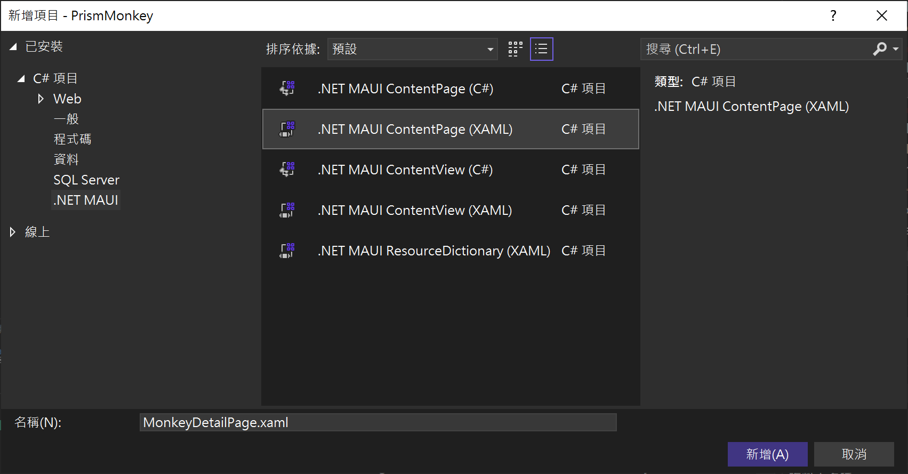
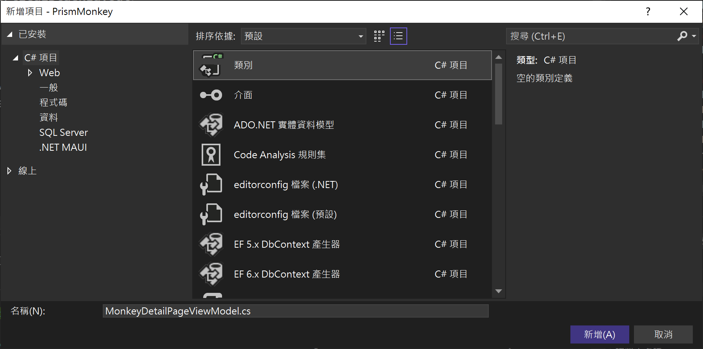
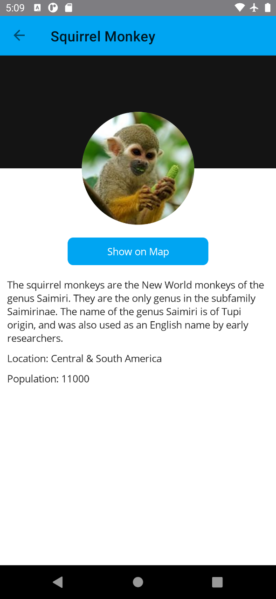

# 頁面導航 Navigation 與參數傳遞

在這裡將會學習到底下的作法

* 建立新的猴子明細 頁面 View
* 建立新的猴子明細 檢視類別 ViewModel
* 註冊該頁面 View 與 ViewModel 到相依性注入容器內
* 進行猴子清單頁面的 ViewModel 設計
* 進行猴子清單頁面的 View 設計

## 建立新的猴子明細 頁面 View

首先先來建立這個頁面

* 滑鼠右擊 [Views] 資料夾節點
* 從彈出功能表中，點選 [加入] > [新增項目]
* 當 [新增項目 - PrismMonkey] 對話窗出現後
* 點選對話窗左邊的項目清單 [已安裝] > [C# 項目] > [.NET MAUI]
* 在該對話窗中間區域，選擇 [.NET MAUI ContentPage (XAML)] 這個項目

  > 請不要選擇 [.NET MAUI ContentPage (C#)] ，因為這個項目是採用 C# 語言來開發頁面，而不是採用 XAML 標記宣告語言來設計頁面

* 在此對話窗下方的 [名稱] 欄位內，輸入 `MonkeyDetailPage.xaml`

  
* 點選此對話窗右下方的 [新增] 按鈕
* 這個頁面 MonkeyListPage.xaml 檔案便會產生出來

## 建立新的猴子明細 檢視類別 ViewModel

接下來要建立這個頁面需要用到 ViewModel 類別

* 滑鼠右擊 [ViewModels] 資料夾節點
* 從彈出功能表中，點選 [加入] > [類別]
* 當 [新增項目 - PrismMonkey] 對話窗出現後
* 在此對話窗下方的 [名稱] 欄位內，輸入 `MonkeyDetailPageViewModel.cs`

  
* 點選此對話窗右下方的 [新增] 按鈕

## 註冊該頁面 View 與 ViewModel 到相依性注入容器內

* 在此專案的根目錄下
* 找到並且打開 [PrismStartup.cs] 檔案
* 找到 [RegisterTypes] 這個方法
* 在該方法內加入 `containerRegistry.RegisterForNavigation<MonkeyDetailPage, MonkeyDetailPageViewModel>();` 敘述

  > 在此是透過 containerRegistry 這個物件，告知相依性注入容器要註冊一個 [MonkeyDetailPage] 這個頁面，當要進行頁面導航的時候，可以透過這裡個宣告，產生並且注入到需要的類別物件內。

* 底下是完成後的 [PrismStartup.cs] 程式碼內容

```csharp
using PrismMonkey.Helpers;
using PrismMonkey.Services;
using PrismMonkey.ViewModels;
using PrismMonkey.Views;

namespace PrismMonkey;

internal static class PrismStartup
{
    public static void Configure(PrismAppBuilder builder)
    {
        builder.RegisterTypes(RegisterTypes)
                .OnAppStart($"NavigationPage/{ConstantHelper.MonkeyListPage}");
    }

    private static void RegisterTypes(IContainerRegistry containerRegistry)
    {
        containerRegistry.RegisterForNavigation<MainPage>()
                     .RegisterInstance(SemanticScreenReader.Default);

        // 註冊 猴子集合紀錄 頁面
        containerRegistry.RegisterForNavigation<MonkeyListPage, MonkeyListPageViewModel>();
        // 註冊 猴子明細 頁面
        containerRegistry.RegisterForNavigation<MonkeyDetailPage, MonkeyDetailPageViewModel>();
        // 註冊 猴子服務
        containerRegistry.RegisterSingleton<MonkeyService>();
    }
}
```

## 進行猴子清單頁面的 ViewModel 設計

* 在 [ViewModels] 資料夾下
* 找到並且打開 [MonkeyDetailPageViewModel.cs] 檔案
* 使用底下的 C# 程式碼，替換掉原有這個檔案內的內容

```csharp
using System;
using System.Collections.Generic;
using System.Linq;
using System.Text;
using System.Threading.Tasks;

namespace PrismMonkey.ViewModels
{
    using System.Collections.ObjectModel;
    using System.ComponentModel;
    using Prism.Events;
    using Prism.Navigation;
    using Prism.Services;
    using Prism.Services.Dialogs;
    using PrismMonkey.Helpers;
    using PrismMonkey.Models;
    using PrismMonkey.Services;

    public class MonkeyDetailPageViewModel : INotifyPropertyChanged, INavigationAware
    {
        // 這裡是實作 INotifyPropertyChanged 介面需要用到的事件成員
        // 這是要用於屬性變更的時候，將會觸發這個事件通知
        public event PropertyChangedEventHandler PropertyChanged;

        #region 透過建構式注入的服務
        // 這是透過建構式注入的頁面導航的實作執行個體
        private readonly INavigationService navigationService;
        #endregion

        #region 在此設計要進行資料綁定的屬性
        #endregion

        #region 在此設計要進行命令物件綁定的屬性
        #endregion

        public MonkeyDetailPageViewModel(INavigationService navigationService)
        {
            #region 將透過建構式注入進來的物件，指派給這個類別內的欄位或者屬性
            this.navigationService = navigationService;
            #endregion

            #region 在此將命令屬性進行初始化，建立命令物件與指派委派方法

            #endregion
        }

        #region 在此設計該 ViewModel 的其他商業邏輯程式碼
        #endregion

        #region 頁面導航將會觸發的方法
        public void OnNavigatedFrom(INavigationParameters parameters)
        {
        }

        public void OnNavigatedTo(INavigationParameters parameters)
        {
        }
        #endregion

    }
}
```

首先，先來加入要透過建構式注入的物件，此時需要使用一個欄位成員將這個注入物件儲存到這個執行個體內。

* 找到 `#region 透過建構式注入的服務`
* 在其 `#region ... #endregion` 區段內加入底下程式碼

```csharp
// 這是透過建構式注入的頁面導航的實作執行個體
private readonly INavigationService navigationService;
private readonly IPageDialogService dialogService;
```

現在要來針對這個頁面會用到的資料綁定屬性來進行設計

* 找到 `#region 在此設計要進行資料綁定的屬性`
* 在其 `#region ... #endregion` 區段內加入底下程式碼

```csharp
/// <summary>
/// 要顯示的猴子明細物件
/// </summary>
public Monkey Monkey { get; set; } = new();
```

接下來要來宣告這個頁面會用到的可綁定命令屬性

* 找到 `#region 在此設計要進行命令物件綁定的屬性`
* 在其 `#region ... #endregion` 區段內加入底下程式碼

```csharp
public DelegateCommand OpenMapCommand { get; set; }
``` 

* 找到 `#region 在此設計該 ViewModel 的其他商業邏輯程式碼`
* 在其 `#region ... #endregion` 區段內加入底下程式碼

```csharp
private async Task OnOpenMapCommand()
{
}
```

這個 ViewModel ，也就是 MonkeyDetailPageViewModel 這個類別，需要使用到其他更多功能，例如，可以顯示訊息的對話窗、等需求，因此，需要透過建構式注入的方式，把這些服務物件注入到這個 ViewModel 內。

* 找到建構式 `public MonkeyDetailPageViewModel`
* 將此建構式修改為底下程式碼

```csharp
public MonkeyDetailPageViewModel(INavigationService navigationService,
    IPageDialogService dialogService)
{
    #region 將透過建構式注入進來的物件，指派給這個類別內的欄位或者屬性
    this.navigationService = navigationService;
    this.dialogService = dialogService;
    #endregion

    #region 在此將命令屬性進行初始化，建立命令物件與指派委派方法
    OpenMapCommand = new DelegateCommand(async () =>
    {
        await OnOpenMapCommand();
    });
    #endregion
}
```

在建構式內，除了將傳入進來的參數，指派給該類別中的相對應欄位成員，緊接著還會對於 RelayCommand 這個命令屬性作初始化，也就是要建立一個 RelayCommand 物件，並且在建立時期，傳入一個委派方法到這個物件內，如此，當這個命令被執行的時候，這裡所指定的委派方法內的程式碼也就會執行了。

## 進行猴子清單頁面的 View 設計

完成了 ViewModel 的設計，接下來將要來進行 View，也就是這個頁面的設計

在進行 View 設計的時候，所使用的語言為 XAML

* 在 [Views] 資料夾下
* 找到並且打開 [MonkeyDetailPage.xaml] 檔案
* 使用底下的 XAML 標記宣告語言碼，替換掉原有這個檔案內的內容

```xml
<?xml version="1.0" encoding="utf-8" ?>
<ContentPage xmlns="http://schemas.microsoft.com/dotnet/2021/maui"
             xmlns:x="http://schemas.microsoft.com/winfx/2009/xaml"
             xmlns:viewmodel="clr-namespace:PrismMonkey.ViewModels"
             x:DataType="viewmodel:MonkeyDetailPageViewModel"
             x:Class="PrismMonkey.Views.MonkeyDetailPage"
             Title="{Binding Monkey.Name}">

  <ScrollView>
    <VerticalStackLayout>
      <Grid
        ColumnDefinitions="*,Auto,*"
        RowDefinitions="160, Auto">
        <BoxView
          Grid.ColumnSpan="3"
          HeightRequest="160"
          HorizontalOptions="FillAndExpand" />
        <Frame
          Grid.RowSpan="2" Grid.Column="1"
          Margin="0,80,0,0"
          HeightRequest="160" WidthRequest="160"
          HorizontalOptions="Center" 
          Padding="0"
          IsClippedToBounds="True"
          CornerRadius="80">
          <Image
            Aspect="AspectFill"
            HeightRequest="160" WidthRequest="160"
            HorizontalOptions="Center" VerticalOptions="Center"
            Source="{Binding Monkey.Image}"
            />
        </Frame>
      </Grid>
      <VerticalStackLayout Padding="10" Spacing="10">
        <!-- Add this -->
        <Button Text="Show on Map" 
          Command="{Binding OpenMapCommand}"
          HorizontalOptions="Center" 
          WidthRequest="200" 
          Margin="8"
          />

        <Label Text="{Binding Monkey.Details}" />
        <Label Text="{Binding Monkey.Location, StringFormat='Location: {0}'}" />
        <Label Text="{Binding Monkey.Population, StringFormat='Population: {0}'}" />
      </VerticalStackLayout>
    </VerticalStackLayout>
  </ScrollView>

</ContentPage>
```

## 修正點選猴子清單 ViewModel，加入可以導航到猴子明細頁面的程式碼


* 在 [ViewModels] 資料夾下
* 找到並且打開 [MonkeyListPageViewModel.cs] 檔案
* 找到 `#region 在此設計要進行命令物件綁定的屬性`
* 在其下方加入這個要綁定命令屬性宣告

```csharp
public DelegateCommand<Monkey> GoToDetailsCommand { get; set; }
```

* 找到 `#region 在此將命令屬性進行初始化，建立命令物件與指派委派方法`
* 在其下方加入這個點選某個猴子項目之後，要進行頁面切換的命令物件需要用到的委派ㄤ物件需要用到的委派方法程式碼

```csharp
#region 點選某個猴子之後，要進行頁面切換的命令
GoToDetailsCommand = new DelegateCommand<Monkey>(async monkey =>
{
    // 若沒有取得猴子資訊，則不會有任何動作
    if (monkey == null)
        return;

    NavigationParameters parameters = new();
    parameters.Add(ConstantHelper.NavigationKeyMonkey, monkey);

    #region 舊的頁面導航用法
    //await navigationService.NavigateAsync(ConstantHelper.MonkeyDetailPage, parameters);
    #endregion

    #region 採用 Navigation Builder 的用法
    // 參考文章 : https://github.com/PrismLibrary/Prism/issues/2283
    await navigationService.CreateBuilder()
    .WithParameters(parameters)
    .AddNavigationSegment(ConstantHelper.MonkeyDetailPage)
    .NavigateAsync();
    #endregion
});
#endregion
```

## 修正點選猴子清單頁面，可以導航到猴子明細頁面

* 在 [Views] 資料夾下
* 找到並且打開 [MonkeyListPage.xaml] 檔案
* 找到這段 XAML 宣告 `<Frame HeightRequest="125" >`
* 在這段 XAML 標記下，加入底下新設計的手勢操作宣告

```xml
<Frame.GestureRecognizers>
<TapGestureRecognizer
    Command="{Binding Source={RelativeSource AncestorType={x:Type viewmodel:MonkeyListPageViewModel}},
    Path=GoToDetailsCommand}" CommandParameter="{Binding .}"/>
</Frame.GestureRecognizers>
```

## 在 Android 平台執行專案

* 點選中間上方工具列的 [Windows Machine] 這個工具列按鈕旁的下拉選單三角形
* 從彈出功能表中，找到 [Android Emulators] 內的任何一個模擬器
* 接者，開始執行這個專案，讓他可以在 Android 模擬器出現
* 當出現 [所有猴子清單] 這個頁面後
* 點選下方的 [Get Monkeys] 按鈕
* 稍微等候一段時間，將會看到所有猴子清單物件出現在畫面上
* 請隨意點選任何一個猴子，將會看到這個猴子的詳細說明畫面，類似下圖

  


