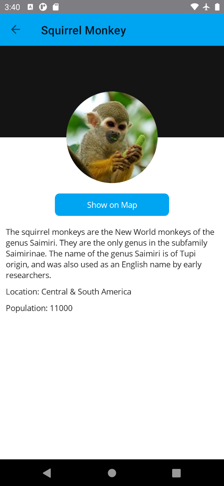

# 平台特性 Platform Feature 設計

## 對相依性注入容器宣告要註冊 地理位置 服務

在 .NET MAUI 中，想要取得裝置內的 GPS 座標，可以透過 .NET MAUI 所提供的 [地理位置](https://docs.microsoft.com/zh-tw/dotnet/maui/platform-integration/device/geolocation?tabs=android&WT.mc_id=DT-MVP-5002220) 物件來實現。要使用這個物件，可以透過相依性注入的方式來取得。

* 在專案根目錄下
* 找到並且打開 [MauiProgram.cs] 檔案
* 找到 `#region 使用 Microsoft.Extensions.DependencyInjection 套件，註冊相關要用到的服務`
* 在其下方加入底下程式碼

```csharp
builder.Services.AddSingleton<IGeolocation>(Geolocation.Default);
```

底下為完成後的 [MauiProgram.cs] 檔案內容

```csharp
namespace PrismMonkey;

public static class MauiProgram
{
    public static MauiApp CreateMauiApp()
    {
        var builder = MauiApp.CreateBuilder();
        builder
            .UsePrismApp<App>(PrismStartup.Configure)
            .ConfigureFonts(fonts =>
            {
                fonts.AddFont("OpenSans-Regular.ttf", "OpenSansRegular");
                fonts.AddFont("OpenSans-Semibold.ttf", "OpenSansSemibold");
            });

        #region 使用 Microsoft.Extensions.DependencyInjection 套件，註冊相關要用到的服務
        builder.Services.AddSingleton<IConnectivity>(Connectivity.Current);
        builder.Services.AddSingleton<IGeolocation>(Geolocation.Default);
        #endregion

        return builder.Build();
    }
}
```

## 找出離你最近的猴子 : 修正 ViewModel

### 宣告要注入的 地理位置 欄位

* 在 [ViewModels] 資料夾下
* 找到並且打開 [MonkeyListPageViewModel.cs] 檔案
* 找到 `#region 透過建構式注入的服務`
* 在其下方加入底下程式碼

```csharp
private readonly IGeolocation geolocation;
```

### 在建構式來注入 地理位置 服務物件

* 找到 MonkeyListPageViewModel 建構式方法
* 在其方法上加入 IGeolocation 參數，使用這樣程式碼 `IGeolocation geolocation`
* 完成後的該建構式簽章為 

```csharp
public MonkeyListPageViewModel(INavigationService navigationService,
            IPageDialogService dialogService,
            MonkeyService monkeyService, IConnectivity connectivity,
            IGeolocation geolocation) { ... }
```

* 找到 `this.connectivity = connectivity;` 敘述
* 在其下方加入底下程式碼

```csharp
this.geolocation = geolocation;
```

### 建立一個命令物件，用於執行找出最近猴子的程式碼

* 找到 `#region 在此設計要進行命令物件綁定的屬性`
* 在其下方加入底下程式碼

```csharp
public DelegateCommand GetClosestMonkeyCommand { get; set; }
```

### 設計找出最近猴子的商業邏輯方法

* 找到 `#region 在此設計該 ViewModel 的其他商業邏輯程式碼`
* 在其下方加入底下程式碼

```csharp
// 發現離你最近的猴子
private async Task FindClosestMokey()
{
    if (IsBusy || Monkeys.Count == 0)
        return;

    try
    {
        // 裝置可能已快取裝置的最新位置，取得最後一個已知位置
        var location = await geolocation.GetLastKnownLocationAsync();
        if (location == null)
        {
            // 查詢裝置的目前位置
            location = await geolocation.GetLocationAsync(new GeolocationRequest
            {
                DesiredAccuracy = GeolocationAccuracy.Medium,
                Timeout = TimeSpan.FromSeconds(30)
            });
        }

        // 發現離你最近的猴子
        // 方法 Location.CalculateDistance 會計算兩個地理位置之間的距離
        var first = Monkeys.OrderBy(m => location.CalculateDistance(
            new Location(m.Latitude, m.Longitude), DistanceUnits.Miles))
            .FirstOrDefault();

        await dialogService.DisplayAlertAsync("", first.Name + " " +
            first.Location, "OK");

    }
    catch (Exception ex)
    {
        Debug.WriteLine($"Unable to query location: {ex.Message}");
        await dialogService.DisplayAlertAsync("Error!", ex.Message, "OK");
    }
}
```

### 在建構式內，為 GetClosestMonkeyCommand 物件進行初始化

* 找到 `#region 在此將命令屬性進行初始化，建立命令物件與指派委派方法`
* 在其下方加入底下程式碼

```csharp
#region 取得當前 GPS 位置，並且找出最接近猴子的命令
GetClosestMonkeyCommand = new DelegateCommand(async () =>
{
    await FindClosestMokey();
});
#endregion
```

這裡將會宣告一個可以進行資料綁定的命令物件，該物件準備設計用來在 View 中的某個按鈕來進行綁定，一旦，使用者點選這個按鈕之後，將會開始執行這個按鈕所指定的委派方法。

底下為完成後的 [MonkeyListPageViewModel.cs] 檔案內容

```csharp
namespace PrismMonkey.ViewModels
{
    using System.Collections.ObjectModel;
    using System.ComponentModel;
    using System.Diagnostics;
    using Prism.Navigation;
    using Prism.Services.Dialogs;
    using PrismMonkey.Helpers;
    using PrismMonkey.Models;
    using PrismMonkey.Services;

    public class MonkeyListPageViewModel : INotifyPropertyChanged, INavigationAware
    {
        // 這裡是實作 INotifyPropertyChanged 介面需要用到的事件成員
        // 這是要用於屬性變更的時候，將會觸發這個事件通知
        public event PropertyChangedEventHandler PropertyChanged;

        #region 透過建構式注入的服務
        // 這是透過建構式注入的頁面導航的實作執行個體
        private readonly INavigationService navigationService;
        private readonly IPageDialogService dialogService;
        private readonly MonkeyService monkeyService;
        private readonly IConnectivity connectivity;
        private readonly IGeolocation geolocation;
        #endregion

        #region 在此設計要進行資料綁定的屬性
        /// <summary>
        /// 要瀏覽的所有猴子集合紀錄
        /// </summary>
        public ObservableCollection<Monkey> Monkeys { get; set; } = new();
        /// <summary>
        /// 是否有觸發 下拉更新 手勢條件
        /// </summary>
        public bool IsRefreshing { get; set; }
        /// <summary>
        /// 是否正在忙碌要從網路上下載猴子清單的 JSON 內容
        /// </summary>
        public bool IsBusy { get; set; }
        /// <summary>
        /// 是否沒有正在忙碌要從網路上下載猴子清單的 JSON 內容
        /// </summary>
        public bool IsNotBusy => !IsBusy;
        #endregion

        #region 在此設計要進行命令物件綁定的屬性
        public DelegateCommand GetClosestMonkeyCommand { get; set; }
        public DelegateCommand<Monkey> GoToDetailsCommand { get; set; }
        public DelegateCommand GetMonkeysCommand { get; set; }
        #endregion

        public MonkeyListPageViewModel(INavigationService navigationService,
            IPageDialogService dialogService,
            MonkeyService monkeyService, IConnectivity connectivity,
            IGeolocation geolocation)
        {
            #region 將透過建構式注入進來的物件，指派給這個類別內的欄位或者屬性
            this.navigationService = navigationService;
            this.dialogService = dialogService;
            this.monkeyService = monkeyService;
            this.connectivity = connectivity;
            this.geolocation = geolocation;
            #endregion

            #region 在此將命令屬性進行初始化，建立命令物件與指派委派方法

            #region 取得當前 GPS 位置，並且找出最接近猴子的命令
            GetClosestMonkeyCommand = new DelegateCommand(async () =>
            {
                await FindClosestMokey();
            });
            #endregion

            #region 點選某個猴子之後，要進行頁面切換的命令
            GoToDetailsCommand = new DelegateCommand<Monkey>(async monkey =>
            {
                // 若沒有取得猴子資訊，則不會有任何動作
                if (monkey == null)
                    return;

                NavigationParameters parameters = new();
                parameters.Add(ConstantHelper.NavigationKeyMonkey, monkey);

                #region 舊的頁面導航用法
                //await navigationService.NavigateAsync(ConstantHelper.MonkeyDetailPage, parameters);
                #endregion

                #region 採用 Navigation Builder 的用法
                // 參考文章 : https://github.com/PrismLibrary/Prism/issues/2283
                await navigationService.CreateBuilder()
                .WithParameters(parameters)
                .AddNavigationSegment(ConstantHelper.MonkeyDetailPage)
                .NavigateAsync();
                #endregion
            });
            #endregion

            #region 取得網路上最新猴子清單資訊的命令
            GetMonkeysCommand = new DelegateCommand(async () =>
            {
                await ReloadMonkey();
            });
            #endregion

            #endregion
        }

        #region 在此設計該 ViewModel 的其他商業邏輯程式碼

        // 發現離你最近的猴子
        private async Task FindClosestMokey()
        {
            if (IsBusy || Monkeys.Count == 0)
                return;

            try
            {
                // 裝置可能已快取裝置的最新位置，取得最後一個已知位置
                var location = await geolocation.GetLastKnownLocationAsync();
                if (location == null)
                {
                    // 查詢裝置的目前位置
                    location = await geolocation.GetLocationAsync(new GeolocationRequest
                    {
                        DesiredAccuracy = GeolocationAccuracy.Medium,
                        Timeout = TimeSpan.FromSeconds(30)
                    });
                }

                // 發現離你最近的猴子
                // 方法 Location.CalculateDistance 會計算兩個地理位置之間的距離
                var first = Monkeys.OrderBy(m => location.CalculateDistance(
                    new Location(m.Latitude, m.Longitude), DistanceUnits.Miles))
                    .FirstOrDefault();

                await dialogService.DisplayAlertAsync("", first.Name + " " +
                    first.Location, "OK");

            }
            catch (Exception ex)
            {
                Debug.WriteLine($"Unable to query location: {ex.Message}");
                await dialogService.DisplayAlertAsync("Error!", ex.Message, "OK");
            }
        }

        // 使用注入的 MonkeyService 物件，來取得遠端所有猴子 JSON 紀錄
        private async Task ReloadMonkey()
        {
            // 若已經觸發這個命令委派方法，則無需繼續往下執行
            if (IsBusy)
                return;

            // 保持良好習慣，對於使用 await 呼叫非同步方法，要捕捉例外異常，避免程式崩潰
            try
            {
                // 透過 .NET MAUI Essentials 的 Connectivity 類別可讓您監視裝置網路狀況的變更、
                // 檢查目前的網路存取，以及目前連線方式。
                // 若現在無法連上 Internet ，則顯示與通知使用者，操作錯誤訊息
                if (connectivity.NetworkAccess != NetworkAccess.Internet)
                {
                    // 使用 Prism.Maui 提供的對話窗警訊物件，顯示此錯誤訊息
                    await dialogService.DisplayAlertAsync("No connectivity!",
                         $"Please check internet and try again.", "OK");
                    return;
                }

                IsBusy = true;

                // 透過之前設計的猴子讀取遠端服務端點服務類別
                // 取得網路上的所有猴子 JSON 內容
                var monkeys = await monkeyService.GetMonkeysAsync();

                if (Monkeys.Count != 0)
                    Monkeys.Clear();

                foreach (var monkey in monkeys)
                    Monkeys.Add(monkey);

            }
            catch (Exception ex)
            {
                Debug.WriteLine($"Unable to get monkeys: {ex.Message}");
                await dialogService.DisplayAlertAsync("Error!", ex.Message, "OK");
            }
            finally
            {
                IsBusy = false;
                IsRefreshing = false;
            }
        }
        #endregion

        #region 頁面導航將會觸發的方法
        // 因為實作 INavigationAware 介面，需要建立這個方法
        // 該方法將會用於當要離開此頁面的時候，會被觸發執行
        public void OnNavigatedFrom(INavigationParameters parameters)
        {
        }

        // 因為實作 INavigationAware 介面，需要建立這個方法
        // 該方法將會用於當要導航到此頁面的時候，會被觸發執行
        public void OnNavigatedTo(INavigationParameters parameters)
        {
        }
        #endregion

    }
}
```


## 找出離你最近的猴子 : 修正 View

* 在 [Views] 資料夾下
* 找到並且打開 [MonkeyListPage.xaml] 檔案
* 找到 `Text="Get Monkeys" />`
* 在其下方加入底下 XAML 標記

```xml
<Button
    Grid.Row="1" Grid.Column="1"
    Margin="8"
    Command="{Binding GetClosestMonkeyCommand}"
    IsEnabled="{Binding IsNotBusy}"
    Text="Find Closest" />
```

底下為完成後的 [MonkeyListPage.xaml] 檔案內容

```xml
<?xml version="1.0" encoding="utf-8" ?>
<ContentPage xmlns="http://schemas.microsoft.com/dotnet/2021/maui"
             xmlns:x="http://schemas.microsoft.com/winfx/2009/xaml"
             xmlns:viewmodel="clr-namespace:PrismMonkey.ViewModels"
             xmlns:model="clr-namespace:PrismMonkey.Models"
             x:DataType="viewmodel:MonkeyListPageViewModel"
             x:Class="PrismMonkey.Views.MonkeyListPage"
             Title="所有猴子清單">

  <Grid
    ColumnDefinitions="*,*"
    ColumnSpacing="5"
    RowDefinitions="*,Auto"
    RowSpacing="0"
    >
    <CollectionView
      Grid.ColumnSpan="2"
      ItemsSource="{Binding Monkeys}"
      BackgroundColor="Transparent"
      SelectionMode="None">

      <CollectionView.ItemTemplate>
        <DataTemplate x:DataType="model:Monkey">
          <Grid Padding="10">
            <Frame HeightRequest="125" >
              <Frame.GestureRecognizers>
                <TapGestureRecognizer
                    Command="{Binding Source={RelativeSource AncestorType={x:Type viewmodel:MonkeyListPageViewModel}},
                    Path=GoToDetailsCommand}" CommandParameter="{Binding .}"/>
              </Frame.GestureRecognizers>
              <Grid Padding="0" ColumnDefinitions="125,*">
                <Image
                    Aspect="AspectFill"
                    HeightRequest="125" WidthRequest="125"
                    Source="{Binding Image}"
                    />
                <VerticalStackLayout
                    Grid.Column="1"
                    Padding="10">
                  <Label Text="{Binding Name}" />
                  <Label Text="{Binding Location}" />
                </VerticalStackLayout>
              </Grid>
            </Frame>
          </Grid>
        </DataTemplate>
      </CollectionView.ItemTemplate>
    </CollectionView>

    <Button
      Grid.Row="1" Grid.Column="0"
      Margin="8"
      Command="{Binding GetMonkeysCommand}"
      IsEnabled="{Binding IsNotBusy}"
      Text="Get Monkeys" />

    <Button
      Grid.Row="1" Grid.Column="1"
      Margin="8"
      Command="{Binding GetClosestMonkeyCommand}"
      IsEnabled="{Binding IsNotBusy}"
      Text="Find Closest" />

    <ActivityIndicator
      Grid.RowSpan="2" Grid.ColumnSpan="2"
      HorizontalOptions="FillAndExpand"
      VerticalOptions="CenterAndExpand"
      IsRunning="{Binding IsBusy}" IsVisible="{Binding IsBusy}"
      />
  </Grid>

</ContentPage>
```

## 修正 Android 需要使用定位權限

* 滑鼠右擊資料夾 [Platforms] > [Android]
* 從彈出功能表內點選 [加入] > [類別]
* 建立名稱為 [AssemblyInfo.cs] 檔案
* 使用底下 C# 程式碼，替換掉這個檔案內容

```csharp
using Android.App;

#region 在這裡宣告 Android 系統中需要用到的權限 Permission
[assembly: UsesPermission(Android.Manifest.Permission.AccessCoarseLocation)]
[assembly: UsesPermission(Android.Manifest.Permission.AccessFineLocation)]
[assembly: UsesFeature("android.hardware.location", Required = false)]
[assembly: UsesFeature("android.hardware.location.gps", Required = false)]
[assembly: UsesFeature("android.hardware.location.network", Required = false)]
[assembly: UsesPermission(Android.Manifest.Permission.Internet)]
#endregion
```

## 在 Android 平台執行專案

* 點選中間上方工具列的 [Windows Machine] 這個工具列按鈕旁的下拉選單三角形
* 從彈出功能表中，找到 [Android Emulators] 內的任何一個模擬器
* 接者，開始執行這個專案，讓他可以在 Android 模擬器出現
* 當出現 [所有猴子清單] 這個頁面後
* 點選下方的 [Get Monkeys] 按鈕
* 稍微等候一段時間，將會看到所有猴子清單物件出現在畫面上
* 點選下方的 [Get Monkeys] 按鈕
* 此時，畫面上將會出現 [Allow PrismMonkey to access this device's location?] 的對話窗
* 在此，點選 [While using the app]

  

* 接下來就會看到離你最近的猴子了

  

## 對相依性注入容器宣告要註冊 地圖 服務

在 .NET MAUI 中，想要將某個 GPS 座標使用手機上的地圖軟體，將其顯示出來，可以透過 .NET MAUI 所提供的 [地圖](https://docs.microsoft.com/zh-tw/dotnet/maui/platform-integration/appmodel/maps?tabs=android&WT.mc_id=DT-MVP-5002220) 物件來實現。要使用這個物件，可以透過相依性注入的方式來取得。

* 在專案根目錄下
* 找到並且打開 [MauiProgram.cs] 檔案
* 找到 `#region 使用 Microsoft.Extensions.DependencyInjection 套件，註冊相關要用到的服務`
* 在其下方加入底下程式碼

```csharp
builder.Services.AddSingleton<IMap>(Map.Default);
```

底下為完成後的 [MauiProgram.cs] 檔案內容

```csharp
namespace PrismMonkey;

public static class MauiProgram
{
    public static MauiApp CreateMauiApp()
    {
        var builder = MauiApp.CreateBuilder();
        builder
            .UsePrismApp<App>(PrismStartup.Configure)
            .ConfigureFonts(fonts =>
            {
                fonts.AddFont("OpenSans-Regular.ttf", "OpenSansRegular");
                fonts.AddFont("OpenSans-Semibold.ttf", "OpenSansSemibold");
            });

        #region 使用 Microsoft.Extensions.DependencyInjection 套件，註冊相關要用到的服務
        builder.Services.AddSingleton<IConnectivity>(Connectivity.Current);
        builder.Services.AddSingleton<IGeolocation>(Geolocation.Default);
        builder.Services.AddSingleton<IMap>(Map.Default);
        #endregion

        return builder.Build();
    }
}
```

## 顯示猴子所在地地圖 : 修正 ViewModel

### 宣告要注入的 地理位置 欄位

* 在 [ViewModels] 資料夾下
* 找到並且打開 [MonkeyDetailPageViewModel.cs] 檔案
* 找到 `#region 透過建構式注入的服務`
* 在其下方加入底下程式碼

```csharp
private readonly IMap map;
```

### 在建構式來注入 地理位置 服務物件

* 找到 MonkeyDetailPageViewModel 建構式方法
* 在其方法上加入 IMap 參數，使用這樣程式碼 `IMap map`
* 完成後的該建構式簽章為 

```csharp
public MonkeyDetailPageViewModel(INavigationService navigationService,
    IPageDialogService dialogService, IMap map) { ... }
```

* 找到 `this.dialogService = dialogService;` 敘述
* 在其下方加入底下程式碼

```csharp
this.map = map;
```

### 建立一個命令物件，用於執行顯示猴子所在地地圖的程式碼

* 找到 `#region 在此設計要進行命令物件綁定的屬性`
* 在其下方加入底下程式碼

```csharp
public DelegateCommand OpenMapCommand { get; set; }
```

### 在建構式內，為 GetClosestMonkeyCommand 物件進行初始化

* 找到 `#region 在此將命令屬性進行初始化，建立命令物件與指派委派方法`
* 在其下方加入底下程式碼

```csharp
#region 根據猴子 GPS 位置，顯示此位置地圖在螢幕上
OpenMapCommand = new DelegateCommand(async () =>
{
    try
    {
        // 開啟並且顯示地圖
        await map.OpenAsync(Monkey.Latitude, Monkey.Longitude, new MapLaunchOptions
        {
            Name = Monkey.Name,
            NavigationMode = Microsoft.Maui.ApplicationModel.NavigationMode.None
        });
    }
    catch (Exception ex)
    {
        Debug.WriteLine($"Unable to launch maps: {ex.Message}");
        await dialogService.DisplayAlertAsync("Error, no Maps app!", ex.Message, "OK");
    }
});
#endregion
```

## 顯示猴子所在地地圖 : 修正 View

* 在 [Views] 資料夾下
* 找到並且打開 [MonkeyDetailPage.xaml] 檔案
* 找到 `<VerticalStackLayout Padding="10" Spacing="10">`
* 在其下方加入底下 XAML 標記

```xml
<Button
    Grid.Row="1" Grid.Column="1"
    Margin="8"
    Command="{Binding GetClosestMonkeyCommand}"
    IsEnabled="{Binding IsNotBusy}"
    Text="Find Closest" />
```

## 在 Android 平台執行專案

* 點選中間上方工具列的 [Windows Machine] 這個工具列按鈕旁的下拉選單三角形
* 從彈出功能表中，找到 [Android Emulators] 內的任何一個模擬器
* 接者，開始執行這個專案，讓他可以在 Android 模擬器出現
* 當出現 [所有猴子清單] 這個頁面後
* 點選下方的 [Get Monkeys] 按鈕
* 稍微等候一段時間，將會看到所有猴子清單物件出現在畫面上
* 點選下方的 [Get Monkeys] 按鈕
* 當所有猴子出現在螢幕上後
* 隨選點選任何一個猴子
* 在畫面上將會看到一個 [Show on Map] 按鈕
* 請點選此按鈕

  

* 接下來就會看到猴子會出現在哪個地方的地圖了

  


