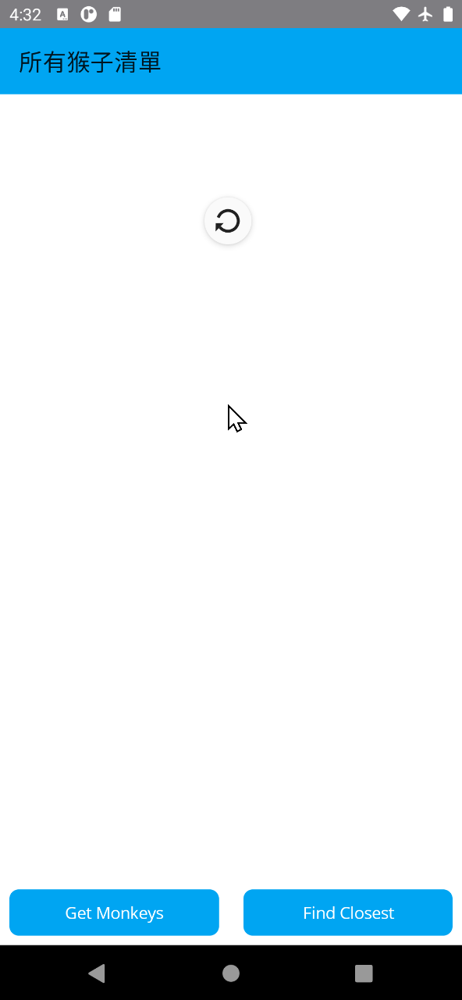
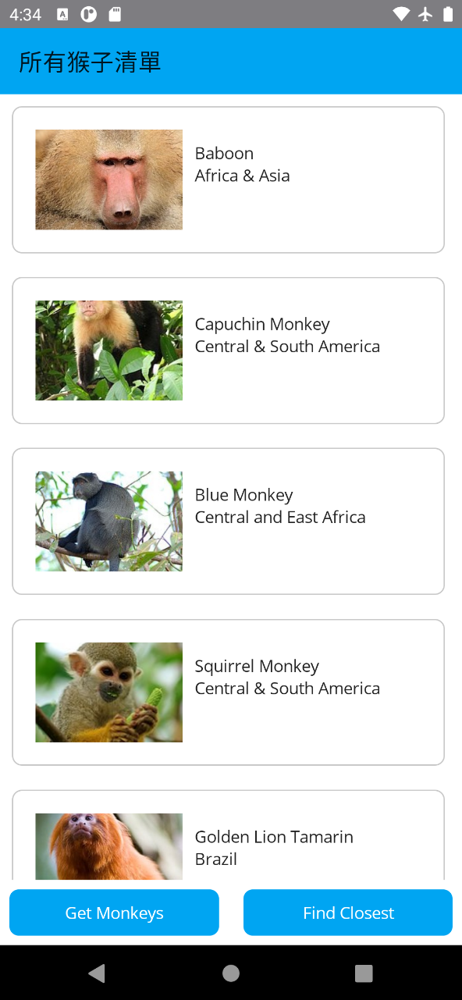

# 其他集合檢視 CollectionView 下拉更新設計

### 在 ViewModel 建立用於資料綁定的屬性

* 在 [ViewModels] 資料夾下
* 找到並且打開 [MonkeyListPageViewModel.cs] 檔案
* 找到 `#region 在此設計要進行資料綁定的屬性`
* 在其下方加入底下程式碼

```csharp
/// <summary>
/// 是否有觸發 下拉更新 手勢條件
/// </summary>
public bool IsRefreshing { get; set; }
```

* 找到 `ReloadMonkey()` 方法內的 `IsBusy = false;`
* 在其下方加入底下程式碼

```csharp
IsRefreshing = false;
```

### 在 View 加入可以偵測手勢下拉更新的控制項

* 在 [Views] 資料夾下
* 找到並且打開 [MonkeyListPage.xaml] 檔案
* 找到 `<CollectionView ...>...</CollectionView>` 這個完整的 CollectionView 檢視控制項定義
* 使用底下的 XAML 程式碼，替換掉現有的 CollectionView 這個檢視控制項定義。

```xml
<RefreshView
    Grid.ColumnSpan="2"
    Command="{Binding GetMonkeysCommand}"
    IsRefreshing="{Binding IsRefreshing}">
    <CollectionView
    ItemsSource="{Binding Monkeys}"
    BackgroundColor="Transparent"
    SelectionMode="None">

    <CollectionView.ItemTemplate>
        <DataTemplate x:DataType="model:Monkey">
        <Grid Padding="10">
            <Frame HeightRequest="125" >
            <Frame.GestureRecognizers>
                <TapGestureRecognizer
                Command="{Binding Source={RelativeSource AncestorType={x:Type viewmodel:MonkeyListPageViewModel}},
                Path=GoToDetailsCommand}" CommandParameter="{Binding .}"/>
            </Frame.GestureRecognizers>
            <Grid Padding="0" ColumnDefinitions="125,*">
                <Image
                Aspect="AspectFill"
                HeightRequest="125" WidthRequest="125"
                Source="{Binding Image}"
                />
                <VerticalStackLayout
                Grid.Column="1"
                Padding="10">
                <Label Text="{Binding Name}" />
                <Label Text="{Binding Location}" />
                </VerticalStackLayout>
            </Grid>
            </Frame>
        </Grid>
        </DataTemplate>
    </CollectionView.ItemTemplate>
    </CollectionView>
</RefreshView>
```

## 在 Android 平台執行專案

* 點選中間上方工具列的 [Windows Machine] 這個工具列按鈕旁的下拉選單三角形
* 從彈出功能表中，找到 [Android Emulators] 內的任何一個模擬器
* 接者，開始執行這個專案，讓他可以在 Android 模擬器出現
* 當出現 [所有猴子清單] 這個頁面後
* 使用手指在該頁面上方
* 由上往下滑動
* 在畫面上將會看到下圖

  

* 一旦出現下拉更新的圖示
* 手指放開螢幕，便會看使進行更新螢幕

  


