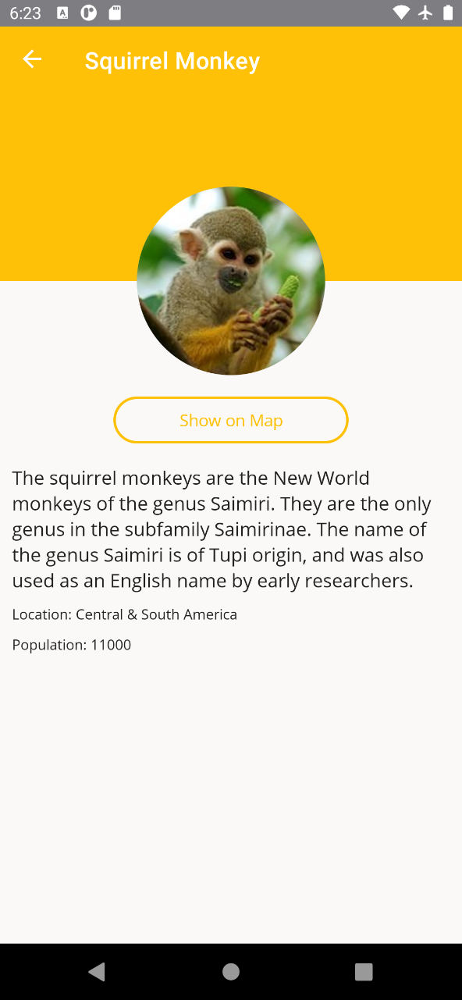

# UI 美化之集中管理設計與主題佈景 Theme

## 建立新的樣式資源檔案

* 滑鼠右擊 資料夾 [Resources] > [Styles]
* 從彈出功能表點選 [加入] > [新增項目]
* 當 [新增項目 - PrismMonkey] 對話窗出現後
* 點選對話窗左邊的項目清單 [已安裝] > [C# 項目] > [.NET MAUI]
* 在該對話窗中間區域，選擇 [.NET MAUI ResourceDictionary (XAML)] 這個項目
* 在此對話窗下方的 [名稱] 欄位內，輸入 `MonkeyStyle.xaml`

  
* 點選此對話窗右下方的 [新增] 按鈕
* 將底下的 XAML 檔案內容，替換掉這個檔案的內容

```xml
<?xml version="1.0" encoding="utf-8" ?>
<ResourceDictionary xmlns="http://schemas.microsoft.com/dotnet/2021/maui"
             xmlns:x="http://schemas.microsoft.com/winfx/2009/xaml"
             x:Class="PrismMonkey.Resources.Styles.MonkeyStyle">

  <Color x:Key="Primary">#FFC107</Color>
  <Color x:Key="PrimaryDark">#FFA000</Color>
  <Color x:Key="Accent">#00BCD4</Color>

  <Color x:Key="LightBackground">#FAF9F8</Color>
  <Color x:Key="DarkBackground">Black</Color>

  <Color x:Key="CardBackground">White</Color>
  <Color x:Key="CardBackgroundDark">#1C1C1E</Color>

  <Color x:Key="LabelText">#1F1F1F</Color>
  <Color x:Key="LabelTextDark">White</Color>

  <Style ApplyToDerivedTypes="True" TargetType="Page">
    <Setter Property="BackgroundColor" Value="{AppThemeBinding Light={StaticResource LightBackground}, Dark={StaticResource DarkBackground}}" />
  </Style>

  <Style ApplyToDerivedTypes="True" TargetType="NavigationPage">
    <Setter Property="BackgroundColor" Value="{AppThemeBinding Light={StaticResource LightBackground}, Dark={StaticResource DarkBackground}}" />
    <Setter Property="BarBackgroundColor" Value="{StaticResource Primary}" />
    <Setter Property="BarTextColor" Value="White" />
  </Style>

  <Style TargetType="Label" x:Key="BaseLabel">
    <Setter Property="FontFamily" Value="OpenSansRegular" />
    <Setter Property="TextColor" Value="{AppThemeBinding Light={StaticResource LabelText}, Dark={StaticResource LabelTextDark}}" />
  </Style>

  <Style x:Key="MicroLabel" BasedOn="{StaticResource BaseLabel}" TargetType="Label">
    <Setter Property="FontSize" Value="10"/>
  </Style>

  <Style x:Key="SmallLabel" BasedOn="{StaticResource BaseLabel}" TargetType="Label">
    <Setter Property="FontSize" Value="12"/>
  </Style>

  <Style x:Key="MediumLabel" BasedOn="{StaticResource BaseLabel}" TargetType="Label">
    <Setter Property="FontSize" Value="16"/>
  </Style>

  <Style x:Key="LargeLabel" BasedOn="{StaticResource BaseLabel}" TargetType="Label">
    <Setter Property="FontSize" Value="20"/>
  </Style>

  <Style ApplyToDerivedTypes="True" TargetType="RefreshView">
    <Setter Property="RefreshColor" Value="{StaticResource Primary}" />
    <Setter Property="Background" Value="{AppThemeBinding Light={StaticResource LightBackground}, Dark={StaticResource DarkBackground}}" />
  </Style>

  <Style x:Key="ButtonOutline" TargetType="Button">
    <Setter Property="Background" Value="{AppThemeBinding Light={StaticResource LightBackground}, Dark={StaticResource DarkBackground}}" />
    <Setter Property="TextColor" Value="{StaticResource Primary}" />
    <Setter Property="BorderColor" Value="{StaticResource Primary}" />
    <Setter Property="BorderWidth" Value="2" />
    <Setter Property="HeightRequest" Value="40" />
    <Setter Property="CornerRadius" Value="20" />
  </Style>
  <Style x:Key="CardView" TargetType="Frame">
    <Setter Property="BorderColor" Value="#DDDDDD" />
    <Setter Property="HasShadow" Value="True" />
    <Setter Property="Padding" Value="0" />
    <Setter Property="Background" Value="{AppThemeBinding Light={StaticResource CardBackground}, Dark={StaticResource CardBackgroundDark}}" />
    <Setter Property="CornerRadius" Value="10" />
    <Setter Property="IsClippedToBounds" Value="True"/>
  </Style>

</ResourceDictionary>
```

## 宣告要使用這個新的 XAML 資源檔案

* 在專案根目錄下
* 找到並且打開 [App.xaml] 檔案
* 找到 `<ResourceDictionary Source="Resources/Styles/Styles.xaml" />`
* 在其下方加入底下的 XAML 宣告

```xml
<ResourceDictionary Source="Resources/Styles/MonkeyStyle.xaml" />
```

* 完成後的檔案內容如下

```xml
<?xml version = "1.0" encoding = "UTF-8" ?>
<Application xmlns="http://schemas.microsoft.com/dotnet/2021/maui"
             xmlns:x="http://schemas.microsoft.com/winfx/2009/xaml"
             xmlns:local="clr-namespace:PrismApp1"
             x:Class="PrismMonkey.App">
  <Application.Resources>
    <ResourceDictionary>
      <ResourceDictionary.MergedDictionaries>
        <ResourceDictionary Source="Resources/Styles/Colors.xaml" />
        <ResourceDictionary Source="Resources/Styles/Styles.xaml" />
        <ResourceDictionary Source="Resources/Styles/MonkeyStyle.xaml" />
      </ResourceDictionary.MergedDictionaries>
    </ResourceDictionary>
  </Application.Resources>
</Application>
```

## 修正猴子清單頁面套用樣式

* 在 [Views] 資料夾下
* 找到並且打開 [MonkeyListPage.xaml] 檔案
* 找到 `<Grid` 這個版面配置定義
* 在其 `RowSpacing="0"` 宣告的下方
* 加入底下的背景顏色 XAML 宣告

```xml
BackgroundColor="{AppThemeBinding Light={StaticResource LightBackground}, Dark={StaticResource DarkBackground}}"
```

* 完成後的 Grid 檢視控制項的定義如下

```xml
<Grid
    ColumnDefinitions="*,*"
    ColumnSpacing="5"
    RowDefinitions="*,Auto"
    RowSpacing="0"
    BackgroundColor="{AppThemeBinding Light={StaticResource LightBackground}, Dark={StaticResource DarkBackground}}"
>
```

* 找到 `<Frame HeightRequest="125"` 版片配置
* 加入底下的 Style 屬性宣告

```xml
Style="{StaticResource CardView}"
```

* 完成後的 Frame 檢視控制項的定義如下

```xml
<Frame HeightRequest="125" Style="{StaticResource CardView}">
```

* 找到 `<Label Text="{Binding Name}" />` 檢視控制項
* 修正成為底下使用 Style 屬性宣告

```xml
<Label Text="{Binding Name}" Style="{StaticResource LargeLabel}"/>
```

* 找到 `<Label Text="{Binding Location}" />` 檢視控制項
* 修正成為底下使用 Style 屬性宣告

```xml
<Label Text="{Binding Location}" Style="{StaticResource MediumLabel}"/>
```

* 找到 `<Button Grid.Row="1" Grid.Column="0"` 這個檢視控制項定義
* 在其 `IsEnabled="{Binding IsNotBusy}"` 宣告的下方
* 加入底下的 Style 屬性宣告

```xml
Style="{StaticResource ButtonOutline}"
```

* 完成後的 Grid 檢視控制項的定義如下

```xml
<Button
    Grid.Row="1" Grid.Column="0"
    Margin="8"
    Command="{Binding GetMonkeysCommand}"
    IsEnabled="{Binding IsNotBusy}"
    Style="{StaticResource ButtonOutline}"
    Text="Get Monkeys" />
```

* 找到 `<Button Grid.Row="1" Grid.Column="1"` 這個檢視控制項定義
* 在其 `IsEnabled="{Binding IsNotBusy}"` 宣告的下方
* 加入底下的 Style 屬性宣告

```xml
Style="{StaticResource ButtonOutline}"
```

* 完成後的 Grid 檢視控制項的定義如下

```xml
<Button
    Grid.Row="1" Grid.Column="1"
    Margin="8"
    Command="{Binding GetClosestMonkeyCommand}"
    IsEnabled="{Binding IsNotBusy}"
    Style="{StaticResource ButtonOutline}"
    Text="Find Closest" />
```

## 在 Android 平台執行專案

* 點選中間上方工具列的 [Windows Machine] 這個工具列按鈕旁的下拉選單三角形
* 從彈出功能表中，找到 [Android Emulators] 內的任何一個模擬器
* 接者，開始執行這個專案，讓他可以在 Android 模擬器出現
* 當出現 [所有猴子清單] 這個頁面後
* 使用手指在該頁面上方
* 由上往下滑動，並且放開後
* 將會看到下面截圖

  

## 修正猴子清單頁面套用樣式

* 在 [Views] 資料夾下
* 找到並且打開 [MonkeyDetailPage.xaml] 檔案
* 找到 `<ScrollView` 這個版面配置定義
* 加入底下的背景顏色 XAML 宣告

```xml
BackgroundColor="{AppThemeBinding Light={StaticResource LightBackground}, Dark={StaticResource DarkBackground}}"
```

* 完成後的 ScrollView 的定義如下

```xml
<ScrollView BackgroundColor="{AppThemeBinding Light={StaticResource LightBackground}, Dark={StaticResource DarkBackground}}">
```

* 找到 `<BoxView` 這個檢視控制項定義
* 在其 `Grid.ColumnSpan="3"` 宣告的下方
* 加入底下的背景顏色 XAML 宣告

```xml
Color="{StaticResource Primary}"
```

* 完成後的 BoxView 的定義如下

```xml
<BoxView
    Grid.ColumnSpan="3"
    Color="{StaticResource Primary}"
    HeightRequest="160"
    HorizontalOptions="FillAndExpand" />
```

* 找到 `<Button Text="Show on Map"` 這個檢視控制項定義
* 在其 `WidthRequest="200"` 宣告的下方
* 加入底下的 Style 樣式屬性 XAML 宣告

```xml
Style="{StaticResource ButtonOutline}"
```

* 完成後的 Button 的定義如下

```xml
<Button Text="Show on Map" 
    Command="{Binding OpenMapCommand}"
    HorizontalOptions="Center" 
    WidthRequest="200"
    Style="{StaticResource ButtonOutline}"
    Margin="8"/>
```

* 找到 `<Label Text="{Binding Monkey.Details}" />` 這個檢視控制項定義
* 在此控制項內加入底下的 Style 樣式屬性 XAML 宣告

```xml
Style="{StaticResource MediumLabel}"
```

* 完成後的 Label 的定義如下

```xml
<Label Text="{Binding Monkey.Details}" Style="{StaticResource MediumLabel}"/>
```

* 找到 `<Label Text="{Binding Monkey.Location, StringFormat='Location: {0}'}" />` 這個檢視控制項定義
* 在此控制項內加入底下的 Style 樣式屬性 XAML 宣告

```xml
Style="{StaticResource SmallLabel}"
```

* 完成後的 Label 的定義如下

```xml
<Label Text="{Binding Monkey.Location, StringFormat='Location: {0}'}" Style="{StaticResource SmallLabel}"/>
```

* 找到 `<Label Text="{Binding Monkey.Population, StringFormat='Population: {0}'}" />` 這個檢視控制項定義
* 在此控制項內加入底下的 Style 樣式屬性 XAML 宣告

```xml
Style="{StaticResource SmallLabel}"
```

* 完成後的 Label 的定義如下

```xml
<Label Text="{Binding Monkey.Population, StringFormat='Population: {0}'}" Style="{StaticResource SmallLabel}"/>
```

## 在 Android 平台執行專案

* 點選中間上方工具列的 [Windows Machine] 這個工具列按鈕旁的下拉選單三角形
* 從彈出功能表中，找到 [Android Emulators] 內的任何一個模擬器
* 接者，開始執行這個專案，讓他可以在 Android 模擬器出現
* 當出現 [所有猴子清單] 這個頁面後
* 使用手指在該頁面上方
* 由上往下滑動，並且放開後
* 從顯示的猴子清單內，點選任一隻猴子項目
* 將會看到下面截圖

  

## 測試 前色與深色主題佈景

* 上面所看到的畫面，將會是採用淺色主題佈景所顯示出來的
* 設定這台模擬器使用 深色 主題佈景

  

* 現在回到猴子清單與明細頁面
* 看到的是底下畫面結果

   

  