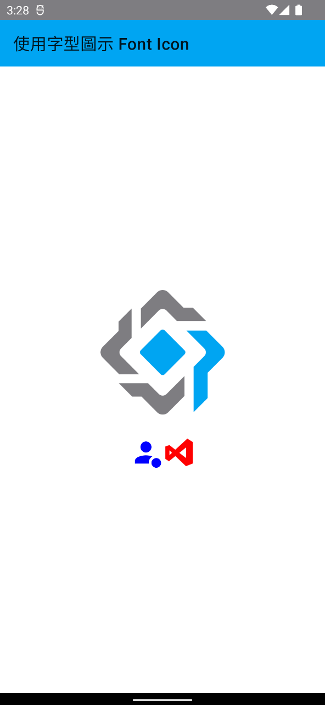

# 在 .NET MAUI 專案你使用字型圖示來美化 App

若想要讓你的 App 更加光彩奪目，吸引他人的目光，那就多加些色彩與圖形在 App 內，然而，想要加入圖片與豐富的色彩，這個部分絕對是大部分程式設計師的罩門，也就是他們最不擅長的地方，不過，卻是可以在 .NET MAUI 專案內來使用字體圖示這項功能，就可以快速、方便的把各種小圖示加入到 App 內。這些小圖示可以用於飛出頁面內的功能選項清單，又或者是用於按鈕上。


## 建立 Prism.Maui 專案

* 開啟 Visual Studio 2022 Preview 版本
* 點選螢幕右下角的 [建立新的專案] 按鈕
* 切換右上角的 [所有專案類型] 下拉選單控制項
* 找到並且點選 [MAUI] 這個選項
* 從清單中找到並選擇 [Prism .NET MAUI App (Dan Siegel)] 這個專案範本

  > A project for creating a Prism .NET MAUI application for iOS, Android, Mac Catalyst, WinUI and Tizen
* 點選右下角的 [下一步] 按鈕
* 當出現了 [設定新的專案] 對話窗
* 在 [專案名稱] 欄位內，輸入 `MA40`
* 點選右下角的 [建立] 按鈕

## 下載 Material Design Icon 字體檔案

* 使用瀏覽器打開此網址 [https://materialdesignicons.com/](https://materialdesignicons.com/)
* 在右上方點選 download 按鈕，下載這個 [MaterialDesign-Webfont-master.zip] 壓縮檔案
* 解開這個壓縮檔案內容
* 找到 [materialdesignicons-webfont.ttf] 檔案
* 在檔案總管中，點選這個檔案，拖拉到剛剛建立的 .NET MAUI 專案內的 [Resources] > [Fonts] 資料夾內

## 宣告與使用 Font Icon

* 在專案根目錄下找到並且打開 [MauiProgram.cs] 檔案
* 找到 `fonts.AddFont("OpenSans-Semibold.ttf", "OpenSansSemibold");` 該行敘述，在其下方加入 `fonts.AddFont("materialdesignicons-webfont.ttf", "material");` 這行敘述。
* 打開 [Views] 資料夾內的 [MainPage.xaml] 檔案
* 使用底下 XAML 標記替換掉這個檔案內容

```xml
<?xml version="1.0" encoding="utf-8" ?>
<ContentPage xmlns="http://schemas.microsoft.com/dotnet/2021/maui"
             xmlns:x="http://schemas.microsoft.com/winfx/2009/xaml"
             Title="使用字型圖示 Font Icon"
             x:Class="MA40.Views.MainPage">

  <ScrollView>
    <VerticalStackLayout
            Spacing="25"
            Padding="30,0"
            VerticalOptions="Center">

      <Image Source="prism.png"
             SemanticProperties.Description="Cute dot net bot waving hi to you!"
             HeightRequest="150"
             HorizontalOptions="Center" />

      <HorizontalStackLayout HorizontalOptions="Center">
        <!-- Use font name -->
        <Label Text="&#xF1B0A;" FontSize="40" TextColor="Blue"
               FontFamily="material" />

        <!--Use Image-->
        <Image>
          <Image.Source>
            <FontImageSource Glyph="&#xF0610;" Color="Red"
                         FontFamily="{OnPlatform iOS=material, Android=material, WinUI=material}"
                         Size="40" />
          </Image.Source>
        </Image>
      </HorizontalStackLayout>
      

    </VerticalStackLayout>
  </ScrollView>

</ContentPage>
```

在這裡呈現了使用 Label 與 Image 這兩個檢視控制項，來顯示特定的字體圖示

底下是執行後的畫面


