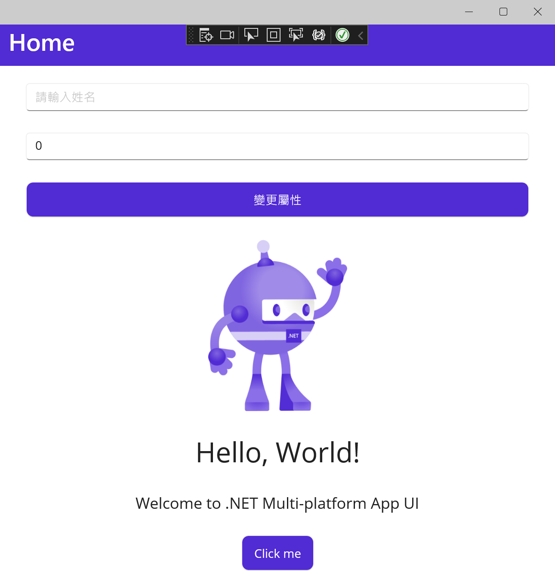

# 資料綁定 Data Binding - 5 在 Maui 專案內，如何得知 ViewModel 內的屬性產生異動，而 View 可以收到通知呢？

在最後對於資料綁定 Data Binding 的 INotifyPropertyChanged 的用法，將會回到 MAUI 專案內來實際觀察，在這篇文章中，將會使用 CommunityToolkit.Mvvm 這個套件來進行檢測

## 建立新專案

* 開啟 Visual Studio 2022 Preview 開發工具

  > 在這個時間點，若想要使用 MAUI 專案來進行開發，需要安裝 Visual Studio 2022 17.3 Preview 版本，才能夠順利建立 MAUI 專案
* 當 [Visual Studio 2022 Preview] 對話窗出現的時候
* 點選右下角的 [建立新的專案] 按鈕選項
* 現在將看到 [建立新專案] 對話窗
* 切換右上角的 [所有專案類型] 下拉選單控制項
* 從清單中找到並選擇 [.NET MAUI 應用程式] 這個專案範本

  > 此專案可用於建立適用於 iOS、Android、Mac Catalyst、Tizen 和 WinUI 的 NET MAUI 應用程式

* 點選右下角的 [下一步] 按鈕
* 此時將會看到 [設定新的專案] 對話窗
* 在 [專案名稱] 欄位，輸入 `mauiMonitorPropertyChanged`
* 點選右下角的 [下一步] 按鈕
* 最後會看到 [其他資訊] 對話窗
* 使用預設設定值，也就是 [架構] 為 [.NET 6.0 (長期支援)]
* 點選右下角的 [建立] 按鈕

## 加入 CommunityToolkit.Mvvm 的 NuGet 套件

* 滑鼠右擊該專案的 [相依性] 節點
* 從彈出功能表中選擇 [管理 NuGet 套件] 功能選項
* 此時，[NuGet: csCommunityToolkitMVVM] 視窗將會出現
* 點選 [瀏覽] 標籤頁次
* 在左上方的搜尋文字輸入盒內輸入 `CommunityToolkit.Mvvm` 關鍵字
* 若你沒有看到 8.0 以上的版本，請勾選 [包括搶鮮版] 檢查盒控制項
* 現在，將會看到 CommunityToolkit.Mvvm 套件出現在清單內
* 點選這個 CommunityToolkit.Mvvm 套件，並且點選右上方的 [安裝] 按鈕，安裝這個套件到這個專案內。

## 進行 ViewModel 的設計

* 滑鼠右擊專案節點
* 從彈出功能表中，點選 [加入] > [類別]
* 當出現 [新增項目 - mauiMonitorPropertyChanged] 對話窗後
* 在下方的 [名稱] 欄位內，輸入 `MainPageViewModel`
* 點選對話窗右下角的 [新增] 按鈕
* 使用底下 C# 程式碼將這個檔案內容替換掉

```csharp
using CommunityToolkit.Mvvm.ComponentModel;
using CommunityToolkit.Mvvm.Input;
using System;
using System.Collections.Generic;
using System.Linq;
using System.Text;
using System.Threading.Tasks;

namespace mauiMonitorPropertyChanged
{
    using CommunityToolkit.Mvvm.ComponentModel;
    using CommunityToolkit.Mvvm.Input;

    public partial class MainPageViewModel : ObservableObject
    {
        public MainPageViewModel()
        {
            person = new Person();
        }
        [ObservableProperty]
        private Person person;

        [RelayCommand]
        void ChangeData()
        {
            Person.Name = "Vulcan Lee";
            Person.Age = 25;
        }
    }
    public partial class Person : ObservableObject
    {
        [ObservableProperty]
        private string name;

        [ObservableProperty]
        private int age;

        private string customDesign;
        public string CustomDesign
        {
            get => name;
            set => SetProperty(ref customDesign, value);
        }
    }
}
```

在這裡設計一個 Person 類別，並且透過 CommunityToolkit.Mvvm 套件的原始碼自動產生機制，幫助產生出相關的 PropertyChanged 屬性變更事件需要用到的相關程式碼。

在最上面則是建立一個新的類別，將會是 MainPage 這個 XAML 頁面需要用到的 ViewModel，因此，在這裡將會把這個 ViewModel 類別命名為 MainPageViewModel。

在 MainPageViewModel 建構式內，首先將 Person 這個屬性建立初始物件值，避免之後產生 null reference 空值存取的問題。

這裡設計一個 `void ChangeData()` 方法，一旦執行這個方法之後，將會變更 Person 物件內的 Name 與 Age 屬性值，其實，這是一個用於命令要綁定的委派方法，在這裡，透過在此方法上方加入了 `[RelayCommand]` 屬性宣告，讓這個方法可以用於 XAML 頁面上來進行命令的綁定，因此，在 MainPage.xaml 檔案中，將會看到有個 ChangeDataCommand 這樣的物件可以選擇。

## 進行 View 與 ViewModel 的服務註冊

接下來要來進行使用 DI Container 相依性服務容器的註冊工作，要使用這樣的功能，將會在取得頁面物件的時候，可以自動注入相對應的 ViewModel 物件來使用。

* 在專案根目錄找到並且打開 [MauiProgram.cs] 檔案
* 在最後面找到 `return builder.Build();` 敘述
* 在此敘述前，加入底下程式碼

```csharp
#region 在這裡進行 ViewModel 的註冊
builder.Services.AddSingleton<MainPage>();
builder.Services.AddSingleton<MainPageViewModel>();
#endregion
```

## 修正 View XAML 內容，加入 Entry 控制項與宣告與 ViewModel 的資料綁定設定

* 在專案根目錄下，找到並且打開 [MainPage.xaml] 檔案
* 使用底下 XAML 標記，替換這個檔案內的內容

```xml
<?xml version="1.0" encoding="utf-8" ?>
<ContentPage xmlns="http://schemas.microsoft.com/dotnet/2021/maui"
             xmlns:x="http://schemas.microsoft.com/winfx/2009/xaml"
             xmlns:local="clr-namespace:mauiMonitorPropertyChanged"
             x:DataType="local:MainPageViewModel"
             x:Class="mauiMonitorPropertyChanged.MainPage">

    <ScrollView>
        <VerticalStackLayout
            Spacing="25"
            Padding="30,0"
            VerticalOptions="Center">

            <Entry Placeholder="請輸入姓名"
                   x:Name="entryName"
                   Text="{Binding Person.Name}"/>
            <Entry Placeholder="請輸入年紀"
                   x:Name="entryAge"
                   Text="{Binding Person.Age}"/>
            <Button Text="變更屬性"
                    Command="{Binding ChangeDataCommand}"/>
            
            <Image
                Source="dotnet_bot.png"
                SemanticProperties.Description="Cute dot net bot waving hi to you!"
                HeightRequest="200"
                HorizontalOptions="Center" />

            <Label
                Text="Hello, World!"
                SemanticProperties.HeadingLevel="Level1"
                FontSize="32"
                HorizontalOptions="Center" />

            <Label
                Text="Welcome to .NET Multi-platform App UI"
                SemanticProperties.HeadingLevel="Level2"
                SemanticProperties.Description="Welcome to dot net Multi platform App U I"
                FontSize="18"
                HorizontalOptions="Center" />

            <Button
                x:Name="CounterBtn"
                Text="Click me"
                SemanticProperties.Hint="Counts the number of times you click"
                Clicked="OnCounterClicked"
                HorizontalOptions="Center" />

        </VerticalStackLayout>
    </ScrollView>

</ContentPage>
```

在根目錄節點， ContentPage 內，宣告一個 local 命名空間，這次要用來指定該頁面 ViewModel 所在的命名空間位置，接下來的 x:DataType ， 這是用於 [編譯的系結](https://docs.microsoft.com/zh-tw/dotnet/maui/fundamentals/data-binding/compiled-bindings?WT.mc_id=DT-MVP-5002220) ，在微軟官方文件上，是這樣描述的 : 編譯的系結藉由在編譯時期解析系結運算式，而不是執行時間，以改善 .NET MAUI 應用程式中的資料系結效能。 此外，在編譯時間驗證繫結運算式可改善開發人員的疑難排解體驗，因為無效的繫結會回報為建置錯誤。

我非常熱愛這項功能，因為，可以讓我在設計 XAML 的時候，即時得知綁定的物件名稱是甚麼與是否正確，避免要等到執行時期才知道發生了問題。

接著，宣告了兩個 Entry 控制項與一個按鈕，前面兩個控制項用於顯示與讓使用者輸入 姓名 與 年紀 的內容，而後者的按鈕控制項，透過 Command 這個屬性值，來綁定到 ViewModel 內的這個具有實作 ICommand 的物件 (ChangeDataCommand 這個物件，是由 CommunityToolkit.Mvvm 透過原始碼產生器自動產生的，在 ViewModel 內的綁定方法為 ChangeData)

## 修正 Code Behind 程式碼，注入 ViewModel 與 綁定屬性變更通知

* 在專案根目錄找到並且打開 [MainPage.xaml.cs] 檔案
* 使用底下 C# 程式碼替換掉這個檔案內容

```csharp
using System.Diagnostics;

namespace mauiMonitorPropertyChanged;

public partial class MainPage : ContentPage
{
    public MainPageViewModel MainPageViewModel { get; }
    int count = 0;

    public MainPage(MainPageViewModel mainPageViewModel)
    {
        InitializeComponent();
        MainPageViewModel = mainPageViewModel;
        this.BindingContext = MainPageViewModel;

        MainPageViewModel.Person.PropertyChanging += (s, e) =>
        {
            Debug.WriteLine($"   ViewModel.Person : {e.PropertyName} 正在進行變更完成");
        };
        MainPageViewModel.Person.PropertyChanged += (s, e) =>
        {
            Debug.WriteLine($"   ViewModel.Person :  {e.PropertyName} 已經變更完成");
        };
        entryName.PropertyChanged += (s, e) =>
        {
            Debug.WriteLine($"   姓名控制項 {e.PropertyName} 已經變更完成");
        };
        entryName.PropertyChanging += (s, e) =>
        {
            Debug.WriteLine($"   姓名控制項 {e.PropertyName} 正在進行變更完成");
        };
    }

    private void OnCounterClicked(object sender, EventArgs e)
    {
        count++;

        if (count == 1)
            CounterBtn.Text = $"Clicked {count} time";
        else
            CounterBtn.Text = $"Clicked {count} times";

        SemanticScreenReader.Announce(CounterBtn.Text);
    }
}
```

在這裡的 Code Behind 程式碼中，透過了建構式注入方式，取得該頁面要使用的 ViewModel 物件，也就是 MainPageViewModel。接著，將這個 ViewModel 物件設定到 XAML ContentPage 內的 BindingContext 屬性內。

在建構式內，還針對的姓名文字輸入盒 Entry 這個控制項，訂閱綁定了該控制項的 PropertyChanging 與 PropertyChanged 這兩個事件，所以，當在使用這個 Entry 控制項的時候，有宣告某些屬性有進行資料綁定的行為，並且這個屬性值有變更的時候，就會觸發這了 Lambda 事件。

另外，還針對 ViewModel 內的 Person 物件，同樣的也訂閱了 PropertyChanging 與 PropertyChanged 這兩個事件，一旦這些事件被觸發之後，將會顯示訊息文字在 Visual Studio 輸出視窗內。

## 進行測試與觀察

由於 .NET MAUI 專案具有單一專案，但是可以在不同平台下執行的特性，因此，在這裡將會選擇最簡單的執行方式，那就是選擇使用 Windows 平台下來執行

* 點選最上方中間工具列區域的 [Windows Machine] 按鈕
* 這個專案將會產生出一個 WinUI 3 的應用程式
* 執行結果畫面如下
  
  

* 點選 [變更屬性] 按鈕

  此時將會觸發 ViewModel 內的 ChangeData() 方法，在這個方法內，會變更 Person 物件內的 Name 與 Age 這兩個屬性值
* 從 Visual Studio 2022 [輸出] 視窗內，將會看到底下輸出內容

```
ViewModel.Person : Name 正在進行變更完成
姓名控制項 Text 正在進行變更完成
姓名控制項 Text 已經變更完成
ViewModel.Person :  Name 已經變更完成
ViewModel.Person : Age 正在進行變更完成
姓名控制項 Height 正在進行變更完成
姓名控制項 Height 已經變更完成
ViewModel.Person :  Age 已經變更完成
姓名控制項 CursorPosition 正在進行變更完成
姓名控制項 CursorPosition 已經變更完成
```

從輸出內容可以看出，一旦按鈕被點擊後，就會變更 ViewModel 內的 Person.Name 的屬性值，在變更之前，將會顯示 [ViewModel.Person : Name 正在進行變更完成] ，緊接著因為 Name 這個屬性有綁定到 Entry.Text 這個可綁定屬性上，因此，將會觸發其事件，所以，將會顯示出 [姓名控制項 Text 正在進行變更完成]，當都變更完成後，就會顯示出 [姓名控制項 Text 已經變更完成] 與 [ViewModel.Person :  Name 已經變更完成] 這些內容

從上述的執行結果，可以看到透過 PropertyChanged 這樣的屬性變更通知機制，使得 XAML 的資料綁定作業可以無縫的運作起來。

