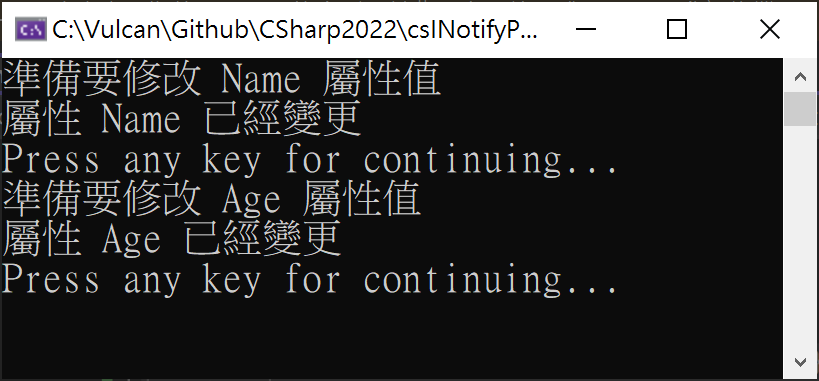

# 資料綁定 Data Binding - 2 設計基底類別，透過繼承可以使用屬性變更通知

在上一篇 [資料綁定 Data Binding - 1 自行建置 INotifyPropertyChanged 介面](https://csharpkh.blogspot.com/2022/07/maui-mvvm-data-binding-implementation-INotifyPropertyChanged-PropertyChanged.html) 文章中，設計了一個類別，為了要能夠知道這個類別所建立的執行個體內的哪個屬性有變更異動發生了，因此，可以觸發一個已經事先訂閱的事件，而這個事件處理常式將會被執行，並且得到究竟是哪個屬性發生了變更行為。

若是採用這樣的設計方式，將會產生一個不好的結果發生，那就是每次要設計一個新的類別，並且該類別想要具有 PropertyChanged 屬性變更通知效果的時候，那就只好在這些新設計的類別上，都要實作出 [INotifyPropertyChanged] 介面，而且，對於該類別內的屬性，都需要使用 完整屬性用法 [含有支援欄位的屬性](https://docs.microsoft.com/zh-tw/dotnet/csharp/programming-guide/classes-and-structs/properties?WT.mc_id=DT-MVP-5002220) 來進行設計屬性程式碼，而不能夠使用 [自動實作的屬性](https://docs.microsoft.com/zh-tw/dotnet/csharp/programming-guide/classes-and-structs/auto-implemented-properties?WT.mc_id=DT-MVP-5002220) 方式來進行設計屬性程式碼。

從上述的描述可以看出，這樣將會大量使用到 剪貼 技能來進行程式碼的設計，這樣的設計將會是得未來程式碼變得不好維護，因為，在這裡可以選擇使用物件導向程式設計技能，將這些共通的程式碼，設計到一個基底類別 Base Class 內，下次要設計一個新的類別，並且想要提供屬性變更通知這樣機制的時候，便可以繼承這個基底類別即可。

## 建立新專案

* 開啟 Visual Studio 2022 開發工具
* 當 [Visual Studio 2022] 對話窗出現的時候
* 點選右下角的 [建立新的專案] 按鈕選項
* 現在將看到 [建立新專案] 對話窗
* 請選擇 [主控台應用程式] 這個專案範本
* 點選右下角的 [下一步] 按鈕
* 此時將會看到 [設定新的專案] 對話窗
* 在 [專案名稱] 欄位，輸入 `csBindableBase`
* 點選右下角的 [下一步] 按鈕
* 最後會看到 [其他資訊] 對話窗
* 請勾選 [不要使用最上層語句] 這個文字檢查盒控制項
* 點選右下角的 [建立] 按鈕

## 設計 BindableBase 基底類別 - 提供屬性綁定需要的相關功能

首先， 先來設計這個基底類別，為了簡化整體解說與操作過程，底下的程式碼將都會設計到 [Program.cs] 檔案內

* 找到 [namespace csBindableBase] 宣告
* 請將底下程式碼設計到 [namespace csBindableBase] 宣告之後

```csharp
public abstract class BindableBase : INotifyPropertyChanged
{
    #region 實作出 INotifyPropertyChanged 的程式碼
    public event PropertyChangedEventHandler PropertyChanged;

    protected virtual void OnPropertyChanged(PropertyChangedEventArgs args)
    {
        PropertyChanged?.Invoke(this, args);
    }
    #endregion

    protected virtual bool SetProperty<T>(ref T storage, T value, [CallerMemberName] string propertyName = null)
    {
        // 先比對新舊的物件值是否相同，若不同，才會觸發 屬性變更 的通知事件
        if (EqualityComparer<T>.Default.Equals(storage, value)) return false;

        // 將此次設定的物件值，指派給該欄位
        storage = value;
        // 觸發 屬性變更 的通知事件
        RaisePropertyChanged(propertyName);

        return true;
    }

    protected void RaisePropertyChanged([CallerMemberName] string propertyName = null)
    {
        OnPropertyChanged(new PropertyChangedEventArgs(propertyName));
    }
}
```

現在，已經在這個命名空間內建立一個抽象類別，其名稱為 BindableBase ，該類別需要實作 INotifyPropertyChanged

因為有要實作出 INotifyPropertyChanged ，所以需要設計 `public event PropertyChangedEventHandler PropertyChanged;` 事件成員的宣告，接著，也設計出一個 [OnPropertyChanged] 方法，可以傳入一個 [PropertyChangedEventArgs](https://docs.microsoft.com/zh-tw/dotnet/api/system.componentmodel.propertychangedeventargs?WT.mc_id=DT-MVP-5002220) 參數，這將會提供 PropertyChanged 事件的所需要用到的資料。

接下來要簡化與強化 [含有支援欄位的屬性](https://docs.microsoft.com/zh-tw/dotnet/csharp/programming-guide/classes-and-structs/properties?WT.mc_id=DT-MVP-5002220) 設計上的需求，例如，在前一篇 [資料綁定 Data Binding - 1 自行建置 INotifyPropertyChanged 介面](https://csharpkh.blogspot.com/2022/07/maui-mvvm-data-binding-implementation-INotifyPropertyChanged-PropertyChanged.html) 文章中，若設定該屬性的物件值與現行該物件中的欄位值相同的時候，同樣的會觸發屬性變動的事件通知，這樣的設計其實不是很好。

因此，在這個  BindableBase 類別中，將會設計一個 `SetProperty<T>` [泛型方法](https://docs.microsoft.com/zh-tw/dotnet/csharp/programming-guide/generics/generic-methods?WT.mc_id=DT-MVP-5002220) 來處理這樣的需求。在這個方法內，將會使用 參考 ref 方式來傳入一個該物件的欄位，接著，傳入這次要變更的新設定值，透過了 `EqualityComparer<T>.Default.Equals(storage, value)` 表示式 ( 這裡有 [EqualityComparer<T> 類別](https://docs.microsoft.com/zh-tw/dotnet/api/system.collections.generic.equalitycomparer-1?WT.mc_id=DT-MVP-5002220) 更多說明 ) ，來確認與比較這兩個值是否相同，若是相同則不會接下來的觸發屬性變更通知的行為。

若新舊值不相同，則會透過 `RaisePropertyChanged(propertyName);` 方法來觸發屬性變動的事件通知，而這裡的 propertyName 將會是該方法傳入的一個參數，代表此次要變動的屬性名稱，而在這個 propertyName 參數前面，使用了 [CallerMemberName](https://docs.microsoft.com/zh-tw/dotnet/api/system.runtime.compilerservices.callermembernameattribute?WT.mc_id=DT-MVP-5002220) ， 這是一個 C# 屬性 [Attribute] ，其目的是可讓您取得方法呼叫端的方法或屬性名稱，這個屬性是在 C# 6.0 推出的新功能，相當的好用，可以簡化過多不必要的程式碼，減少寫錯的機會，提升整體專案可維護性；因此，透過了 CallerMemberName 功能，無縫取得當時的屬性名稱字串，便可以將這個屬性字串名稱送到屬性變更的觸發事件引數內。

在 RaisePropertyChanged 方法內，將會建立 PropertyChange 事件會用到的 [PropertyChangedEventArgs](https://docs.microsoft.com/zh-tw/dotnet/api/system.componentmodel.propertychangedeventargs?WT.mc_id=DT-MVP-5002220) 參數，該型別的參數需要一個字串，這裡的字串將會表示現在正在變動的屬性名稱，如此，便可以透過 [OnPropertyChanged] 方法來執行 `PropertyChanged?.Invoke(this, args);` 敘述，拋出該屬性異動的事件通知訊息了。

## 重新設計 Person 類別

接下來將會要把前一篇 [資料綁定 Data Binding - 1 自行建置 INotifyPropertyChanged 介面](https://csharpkh.blogspot.com/2022/07/maui-mvvm-data-binding-implementation-INotifyPropertyChanged-PropertyChanged.html) 文章，所設計的 Person 類別重新設計一遍，底下將會是設計完成後的程式碼。

```csharp
public class Person : BindableBase
{
    #region 針對每個具有 PropertyChanged 的屬性，都需要有底下的程式碼設計方式

    #region 姓名
    private string name;

    public string Name
    {
        get { return name; }
        set { SetProperty(ref name, value); }
    }
    #endregion

    #region 年紀
    private int age;

    public int Age
    {
        get { return age; }
        set { SetProperty(ref age, value); }
    }

    #endregion
    #endregion
}
```

首先，在 Person 類別將不再直接實作 [INotifyPropertyChanged] 這個介面，而是修該成為繼承剛剛設計好的 [BindableBase] 抽象類別，在這個抽象類別內，將會已經有實作出 [INotifyPropertyChanged] 這個介面。

在這個類別內的兩個屬性，姓名與年紀，同樣的還是需要使用 [含有支援欄位的屬性](https://docs.microsoft.com/zh-tw/dotnet/csharp/programming-guide/classes-and-structs/properties?WT.mc_id=DT-MVP-5002220) 方式來進行屬性成員的設計，也就是說，要先設計一個 [欄位 field](https://docs.microsoft.com/zh-tw/dotnet/csharp/programming-guide/classes-and-structs/fields?WT.mc_id=DT-MVP-5002220) 成員，接著，使用 [get 存取子](https://docs.microsoft.com/zh-tw/dotnet/csharp/language-reference/keywords/get?WT.mc_id=DT-MVP-5002220) 與 [set 存取子](https://docs.microsoft.com/zh-tw/dotnet/csharp/language-reference/keywords/set?WT.mc_id=DT-MVP-5002220) 來設計這個屬性的讀寫動作。

在讀取這個屬性的時候，對於 [get 存取子] 程式碼沒有變動，還是直接回傳指定欄位的值，不過，對於 [set 存取子] 而言，將會修該成為呼叫該方法 `SetProperty(ref name, value);` ；從這個敘述可以看出，在這裡呼叫了 SetProperty 這個泛型型別方法，並且傳入的姓名欄欄位的參考，如此，在這個 SetProperty 方法內，便可以直接地變更、修正這裡傳入的 name 變數值，第二個引數將會是現在這個屬性所持有的值，第三個引數在這裡沒有寫出來，可是，在 SetProperty 的函式簽章中，可以看出第三個參數的型別定義為 `[CallerMemberName] string propertyName = null` ，因此，第三個參數將會得到這個 姓名 屬性的名稱，在這個例子中，將會是 Name 這個字串

這樣設計出來的 Person 類別程式碼，是否已經清爽許多，而且不再存在弱型別的問題，因為，若是有弱型別而產生的問題，將會導致於在執行階段產生詭異現象或者得到不正確的執行結果，甚至有可能得到例外異常而導致該應用程式崩潰。

## 確認採用 BindableBase 抽象類別的設計是否可正常運作

在這裡將會採用同樣的測試程式碼，如下所示

```csharp
internal class Program
{
    static void Main(string[] args)
    {
        Person person = new Person();
        person.PropertyChanged += (s, e) =>
        {
            WriteLine($"屬性 {e.PropertyName} 已經變更");
        };

        WriteLine("準備要修改 Name 屬性值");
        person.Name = "Vulcan Lee";

        WriteLine("Press any key for continuing...");
        ReadKey();

        WriteLine("準備要修改 Age 屬性值");
        person.Age = 25;

        WriteLine("Press any key for continuing...");
        ReadKey();
    }
}
```

在這裡先建立一個型別為 [Person] 的物件，指派給 person 變數內

接著，因為每個 [Person] 物件，都有個公開的 [PropertyChanged] 事件，因此，在此將需要訂閱這個事件，在此使用 [Lambda 運算式](https://docs.microsoft.com/zh-tw/dotnet/csharp/language-reference/operators/lambda-expressions?WT.mc_id=DT-MVP-5002220) 設計一個匿名委派方法來綁定這個事件，如此，當有屬性變更的事件產生的時候，將會觸發這裡綁定的 Lambda 委派方法，也就是會在螢幕上顯示出哪個屬性值已經變更了。

完成的變更屬性的事件訂閱與綁定設計，接下來就是要開始針對這個 person 物件的兩個屬性值進行變動，看看是否會有屬性變動通知事件產生，底下是執行後的結果內容。



這裡將會是整個完整的測試程式碼

```csharp
public abstract class BindableBase : INotifyPropertyChanged
{
    #region 實作出 INotifyPropertyChanged 的程式碼
    public event PropertyChangedEventHandler PropertyChanged;

    protected virtual void OnPropertyChanged(PropertyChangedEventArgs args)
    {
        PropertyChanged?.Invoke(this, args);
    }
    #endregion

    protected virtual bool SetProperty<T>(ref T storage, T value, [CallerMemberName] string propertyName = null)
    {
        // 先比對新舊的物件值是否相同，若不同，才會觸發 屬性變更 的通知事件
        if (EqualityComparer<T>.Default.Equals(storage, value)) return false;

        // 將此次設定的物件值，指派給該欄位
        storage = value;
        // 觸發 屬性變更 的通知事件
        RaisePropertyChanged(propertyName);

        return true;
    }

    protected void RaisePropertyChanged([CallerMemberName] string propertyName = null)
    {
        OnPropertyChanged(new PropertyChangedEventArgs(propertyName));
    }
}

public class Person : BindableBase
{
    #region 針對每個具有 PropertyChanged 的屬性，都需要有底下的程式碼設計方式

    #region 姓名
    private string name;

    public string Name
    {
        get { return name; }
        set { SetProperty(ref name, value); }
    }
    #endregion

    #region 年紀
    private int age;

    public int Age
    {
        get { return age; }
        set { SetProperty(ref age, value); }
    }

    #endregion
    #endregion
}

internal class Program
{
    static void Main(string[] args)
    {
        Person person = new Person();
        person.PropertyChanged += (s, e) =>
        {
            WriteLine($"屬性 {e.PropertyName} 已經變更");
        };

        WriteLine("準備要修改 Name 屬性值");
        person.Name = "Vulcan Lee";

        WriteLine("Press any key for continuing...");
        ReadKey();

        WriteLine("準備要修改 Age 屬性值");
        person.Age = 25;

        WriteLine("Press any key for continuing...");
        ReadKey();
    }
}
```


