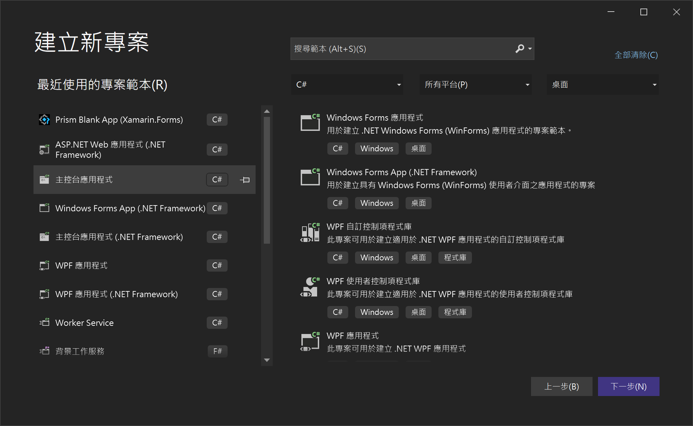
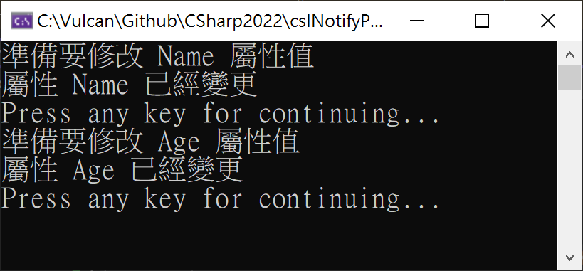

# 資料綁定 Data Binding 的自行建置 INotifyPropertyChanged 介面

當在學習 毛伊 MAUI 跨平台開發工具來進行 Android , iOS , WinUI 等平台應用程式開發的時候，對於 MVVM Model View ViewModel 這樣的設計模式一定十分孰悉與精通 ，而在 MVVM 設計模式下的 資料綁定 Data Binding 觀念與實作技術，也務必要徹底了解，這樣的技術是怎麼運行起來的，可以提供甚麼樣的好處。

資料綁定 Data Binding 的技術背後將會需要實作出 [INotifyPropertyChanged](https://docs.microsoft.com/zh-tw/dotnet/api/system.componentmodel.inotifypropertychanged?WT.mc_id=DT-MVP-5002220) 介面，這個型別早就已經存在於 .NET Framework 2.0 內了，所以，這並不是甚麼十分嶄新的技術與觀念，為了要能夠體會與理解 INotifyPropertyChanged 介面，現在就實際來動手實作看看。

## 實作 INotifyPropertyChanged 介面

* 開啟 Visual Studio 2022 開發工具
* 當 [Visual Studio 2022] 對話窗出現的時候
* 點選右下角的 [建立新的專案] 按鈕選項
* 現在將看到 [建立新專案] 對話窗
* 請選擇 [主控台應用程式] 這個專案範本
* 點選右下角的 [下一步] 按鈕

  

* 此時將會看到 [設定新的專案] 對話窗
* 在 [專案名稱] 欄位，輸入 `csINotifyPropertyChanged`
* 點選右下角的 [下一步] 按鈕
* 最後會看到 [其他資訊] 對話窗
* 請勾選 [不要使用最上層語句] 這個文字檢查盒控制項
* 點選右下角的 [建立] 按鈕

為了要簡化過程，因此，將會把相關程式碼都寫入到 Program.cs 這個檔案內，當然，也可以把等下要建立的新類別 [Person] 建立到新的 [Person.cs] 檔案內。

* 請在 [Program.cs] 檔案內 `namespace csINotifyPropertyChanged` 這個命名空間宣告的最前面，加入一個 [Person] 類別宣告，程式碼如下：

```csharp
public class Person : INotifyPropertyChanged
{
    public event PropertyChangedEventHandler? PropertyChanged;
    protected virtual void OnPropertyChanged(string propertyName)
    {
        PropertyChanged?.Invoke(this, new PropertyChangedEventArgs(propertyName));
    }
}
```

在這個 [Person] 類別內，將需要實作 INotifyPropertyChanged 這個介面，在這個 INotifyPropertyChanged 介面內，只有宣告一個 `event PropertyChangedEventHandler? PropertyChanged;` 成員，因此，這裡將會加入這樣的 `public event PropertyChangedEventHandler? PropertyChanged;` 程式碼宣告

在剛剛加入的 [PropertyChanged] 事件成員，將會用來讓外部參考與使用這個類別執行個體的其他物件，可以訂閱 [PropertyChanged] 這個事件，而當這個 [Person] 類別的內部狀態 (相關 欄位 Field) 有變動的時候，將會觸發這個 [PropertyChanged] 事件，如此，便可以讓有訂閱這個事件的其他物件，可以收到此執行個體的狀態有變更的通知，這就是 INotifyPropertyChanged 這個介面最主要的價值與目的。

為了要方便隨時可以觸發 [PropertyChanged] 事件，因此，在這裡設計了一個 [OnPropertyChanged] 方法，該方法可以接收一個字串參數，這個字串參數表示了是哪個屬性名稱發生了異動，而在這個 [OnPropertyChanged] 方法內，僅有一行敘述，這樣的寫法是為了要避免在多執行緒程式碼執行下，具有執行緒安全的特性。

好了，有了基本的 INotifyPropertyChanged 實作程式碼，現在可以來進行這個 [Person] 類別的成員設計，在這個類別內，其實僅設計兩個成員，一個是具有字串型別的 [Name] 屬性，表示這個 Person 物件的姓名，另外一個是具有整數型別的 [Age] 屬性，表示這個 Person 物件的年紀。

不過，為了能夠做出，當這兩個屬性值發生異動的時候，可以觸發 [PropertyChanged] 事件，在這裡是不能夠使用 [自動實作的屬性](https://docs.microsoft.com/zh-tw/dotnet/csharp/programming-guide/classes-and-structs/auto-implemented-properties?WT.mc_id=DT-MVP-5002220) ，而是要使用 [屬性](https://docs.microsoft.com/zh-tw/dotnet/csharp/programming-guide/classes-and-structs/properties?WT.mc_id=DT-MVP-5002220) 的方式來設計，也就是要使用 set 與 get 存取子和一個欄位成員來定義出這個屬性。

底下將會是 [Person] 這個類別內，準備要新加入的兩個屬性定義程式碼

```csharp
public class Person : INotifyPropertyChanged
{

   ...

    private string name;
    public string Name
    {
        get { return name; }
        set
        {
            name = value;
            OnPropertyChanged("Name");
        }
    }

    private int age;
    public int Age
    {
        get { return age; }
        set
        {
            age = value;
            OnPropertyChanged("Age");
        }
    }
}
```

在此，將先採用姓名這個屬性來說明設計過程，首先，宣告一個 [欄位](https://docs.microsoft.com/zh-tw/dotnet/csharp/programming-guide/classes-and-structs/fields?WT.mc_id=DT-MVP-5002220) 成員，使用 `private string name;` 這樣程式碼，很清楚的，因為這是個欄位，因此，需要加入 private 修飾詞，避免外部其他物件來存取，僅供這個類別所建立的執行個體內的程式碼可以存取。

緊接著使用 [含有支援欄位的屬性](https://docs.microsoft.com/zh-tw/dotnet/csharp/programming-guide/classes-and-structs/properties#properties-with-backing-fields?WT.mc_id=DT-MVP-5002220) 來設計一個 Name 新屬性。對於這個新的 Name 屬性，其 get 存取子 將會直接回傳 name 這個欄位值，而對於 set 這個存取子，除了一定要將傳入進來的值，設定給 name 這個欄位之外，還需要使用 `OnPropertyChanged("Name");` 敘述來觸發該屬性值已經發生變更的行為通知。

同樣的，也需要設計一個 Age 屬性與 age 欄位，參考上述 姓名 的做法，設計出年紀的屬性程式碼。

現在可以開始來體驗 INotifyPropertyChanged 這個介面所帶來的好處與方便性

現在，請在 Main 方法內，加入底下程式碼

```csharp
Person person = new Person();
person.PropertyChanged += (s, e) =>
{
    WriteLine($"屬性 {e.PropertyName} 已經變更");
};
WriteLine("準備要修改 Name 屬性值");
person.Name = "Vulcan Lee";
WriteLine("Press any key for continuing...");
ReadKey();
WriteLine("準備要修改 Age 屬性值");
person.Age = 25;
WriteLine("Press any key for continuing...");
ReadKey();
```

在這裡先建立一個型別為 [Person] 的物件，指派給 person 變數內

接著，因為每個 [Person] 物件，都有個公開的 [PropertyChanged] 事件，因此，在此將需要訂閱這個事件，在此使用 [Lambda 運算式](https://docs.microsoft.com/zh-tw/dotnet/csharp/language-reference/operators/lambda-expressions?WT.mc_id=DT-MVP-5002220) 設計一個匿名委派方法來綁定這個事件，如此，當有屬性變更的事件產生的時候，將會觸發這裡綁定的 Lambda 委派方法，也就是會在螢幕上顯示出哪個屬性值已經變更了。

完成的變更屬性的事件訂閱與綁定設計，接下來就是要開始針對這個 person 物件的兩個屬性值進行變動，看看是否會有屬性變動通知事件產生，底下是執行後的結果內容。



這裡將會是整個完整的測試程式碼

```csharp
global using static System.Console;
using System.ComponentModel;

namespace csINotifyPropertyChanged
{
    public class Person : INotifyPropertyChanged
    {
        #region 實作出 INotifyPropertyChanged 的程式碼
        // 在這個 INotifyPropertyChanged 介面內，只有宣告一個 event PropertyChangedEventHandler? PropertyChanged; 成員
        public event PropertyChangedEventHandler? PropertyChanged;
        // 設計底下的方法，是要方便可以觸發 PropertyChanged 這個事件
        protected virtual void OnPropertyChanged(string propertyName)
        {
            PropertyChanged?.Invoke(this, new PropertyChangedEventArgs(propertyName));
        }
        #endregion

        private int myVar;

        public int MyProperty
        {
            get { return myVar; }
            set { myVar = value; }
        }

        #region 針對每個具有 PropertyChanged 的屬性，都需要有底下的程式碼設計方式

        #region 姓名
        private string name;

        public string Name
        {
            get { return name; }
            set
            {
                name = value;
                OnPropertyChanged("Name");
            }
        }
        #endregion

        #region 年紀
        private int age;

        public int Age
        {
            get { return age; }
            set
            {
                age = value;
                OnPropertyChanged("Age");
            }
        }

        #endregion
        #endregion
    }


    internal class Program
    {
        static void Main(string[] args)
        {
            Person person = new Person();
            person.PropertyChanged += (s, e) =>
            {
                WriteLine($"屬性 {e.PropertyName} 已經變更");
            };

            WriteLine("準備要修改 Name 屬性值");
            person.Name = "Vulcan Lee";

            WriteLine("Press any key for continuing...");
            ReadKey();

            WriteLine("準備要修改 Age 屬性值");
            person.Age = 25;

            WriteLine("Press any key for continuing...");
            ReadKey();
        }
    }
}
```

