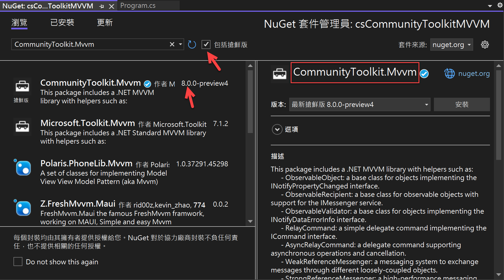
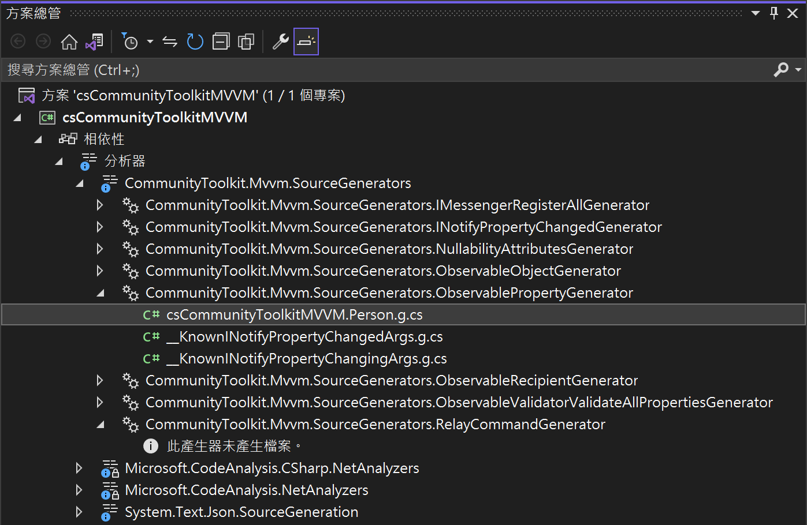

# Data Binding - 4 CommunityToolkit.Mvvm 套件，透過原始碼產生來簡化屬性變更通知程式設計碼

延續上一篇 [資料綁定 Data Binding - 3 PropertyChanged.Fody 套件，大幅簡化屬性變更通知程式設計碼](https://csharpkh.blogspot.com/2022/07/maui-mvvm-data-binding-nuget-propertychanged-fody-il-reduce-auto-property-impletation.html) 文章中，透過 PropertyChanged.Fody 套件的協助，使得在進行 ViewModel 程式碼設計的時候，針對需要進行資料綁定的屬性設計方式，僅需要使用 [自動實作的屬性](https://docs.microsoft.com/zh-tw/dotnet/csharp/programming-guide/classes-and-structs/auto-implemented-properties?WT.mc_id=DT-MVP-5002220) 方式來進行設計屬性程式碼，而不再需要使用 [含有支援欄位的屬性](https://docs.microsoft.com/zh-tw/dotnet/csharp/programming-guide/classes-and-structs/properties?WT.mc_id=DT-MVP-5002220) ，大幅簡化所要重複輸入相同程式碼的工作，許多實作細節，例如，當新設定的屬性值與原有的屬性值相同的時候，是不會觸發 PropertyChanged 事件，等等這些細部考量，也間接地提升整體的程式碼品質與效能。

這一切的成果都來自於 PropertyChanged.Fody 這個套件在編譯時期，自動的注入相關 IL 程式碼到這個專案內，自動完成相關程式碼設計工作，然而，最近有一套在 毛伊 MAUI 開發平台上非常紅火的套件，那就是 [CommunityToolkit.Mvvm](https://docs.microsoft.com/zh-tw/dotnet/communitytoolkit/mvvm?WT.mc_id=DT-MVP-5002220)，根據官方文件上的解釋為 ： 套件 CommunityToolkit.Mvvm (稱為 MVVM Toolkit，先前名為 Microsoft.Toolkit.Mvvm) 是現代化、快速且模組化的 MVVM 程式庫。 它是 Windows 社群工具組的一部分，更詳細的理解，CommunityToolkit.Mvvm 這個套件源自於 MVVMLight 上的風格，具有輕量級特色，在這篇文章中，將來體驗如何使用這個套件，設計出具有屬性異動事件通知 PropertyChanged 的功能。

## 建立新專案

* 開啟 Visual Studio 2022 開發工具
* 當 [Visual Studio 2022] 對話窗出現的時候
* 點選右下角的 [建立新的專案] 按鈕選項
* 現在將看到 [建立新專案] 對話窗
* 請選擇 [主控台應用程式] 這個專案範本
* 點選右下角的 [下一步] 按鈕
* 此時將會看到 [設定新的專案] 對話窗
* 在 [專案名稱] 欄位，輸入 `csCommunityToolkitMVVM`
* 點選右下角的 [下一步] 按鈕
* 最後會看到 [其他資訊] 對話窗
* 請勾選 [不要使用最上層語句] 這個文字檢查盒控制項
* 點選右下角的 [建立] 按鈕

## 加入 CommunityToolkit.Mvvm 的 NuGet 套件

* 滑鼠右擊該專案的 [相依性] 節點
* 從彈出功能表中選擇 [管理 NuGet 套件] 功能選項
* 此時，[NuGet: csCommunityToolkitMVVM] 視窗將會出現
* 點選 [瀏覽] 標籤頁次
* 在左上方的搜尋文字輸入盒內輸入 `CommunityToolkit.Mvvm` 關鍵字
* 若你沒有看到 8.0 以上的版本，請勾選 [包括搶鮮版] 檢查盒控制項
* 現在，將會看到 CommunityToolkit.Mvvm 套件出現在清單內
* 點選這個 CommunityToolkit.Mvvm 套件，並且點選右上方的 [安裝] 按鈕，安裝這個套件到這個專案內。



## 使用 CommunityToolkit.Mvvm 提供功能來設計具有屬性變更通知的 Person 類別

底下的範例程式碼，都將會建立在 [Program.cs] 這個檔案內

首先要建立一個 Person 類別，其中將會有兩個屬性，分別為 姓名 Name 與 年紀 Age

完成後的程式碼如下：

```csharp
public partial class Person : ObservableObject
{
    [ObservableProperty]
    private string name;

    [ObservableProperty]
    private int age;

    private string customDesign;
    public string CustomDesign
    {
        get => name;
        set => SetProperty(ref customDesign, value);
    }
}
```

現在要來看看，當使用了 CommunityToolkit.Mvvm 這個套件時候，要進行甚麼樣的設計工作，才能夠讓這個類別具有屬性異動情況發生的時候，可以發送出 PropertyChanged 事件通知功能。

首先，對於要啟用這個屬性異動事件通知的類別，需要在類別名稱前面加入 [Partial](https://docs.microsoft.com/zh-tw/dotnet/csharp/language-reference/keywords/partial-type?WT.mc_id=DT-MVP-5002220) 這個關鍵字，因為稍後的介紹內容，將會看到 CommunityToolkit.Mvvm 最強大功能，那就是原始碼產生器 Source Generator ，這個套件會自動產生相關程式碼出來，為了要能夠讓這個類別可以提供更多的服務與功能，因此，需要將這個類別使用 Partial 關鍵字來設計成為一個部分類別。

接著，這個類別需要繼承 [ObservableObject](https://docs.microsoft.com/zh-tw/dotnet/communitytoolkit/mvvm/observableobject?WT.mc_id=DT-MVP-5002220) 在微軟的文件上解釋為：是實作 INotifyPropertyChanged 和 INotifyPropertyChanging 介面可觀察之物件的基類。 它可以做為支援屬性變更通知之各種物件的起點。也就是說，只要類別繼承了 ObservableObject 這個類別，就已經完成 INotifyPropertyChanged 相關實作與準備工作， 想要了解更多 ObservableObject 這個類別有哪些 方法 與 事件 可以使用，可以參考 [ObservableObject 類別](https://docs.microsoft.com/zh-TW/dotnet/api/microsoft.toolkit.mvvm.componentmodel.ObservableObject?WT.mc_id=DT-MVP-5002220)

完成了最基本的準備工作，現在，可以來開始進行這個類別具有屬性變更通知機制的屬性設計囉。

當使用 CommunityToolkit.Mvvm 進行屬性變更通知設計的時候，採用另外一種作法，對於具備屬性異動通知的屬性成員，可以使用欄位的方式來設計，例如，對於姓名這個屬性，便可以僅設計 `private string name;` 這樣的欄位即可。可以，這個欄位的存取限制為私有，也就是說，對於外部的物件是無法存取這個欄位值，所以，需要在這個欄位前面加上 `[ObservableProperty]` 屬性宣告，宣告這個欄位具有屬性異動通知的能力。

一旦完成這樣的設計，CommunityToolkit.Mvvm 套件便會自動產生出另外一個同名的 Partial 部分類別，幫助程式設計師把相關程式碼都產生出來；現在，來看看究竟產生了甚麼程式碼吧。

* 請在這個專案上找到 [相依性] 節點
* 展開這個節點，將會看到 [分析器] 節點
* 緊接著將會看到 [CommunityToolkit.Mvvm.SourceGenerators] 這個節點
* 繼續探索這個節點，就會看到 [CommunityToolkit.Mvvm.SourceGenerators.ObservablePropertyGenerator] 節點
* 這裡將會看到自動產生的類別檔案
* 請滑鼠雙擊 [csCommunityToolkitMVVM.Person.g.cs] 這個節點

  

* 將會看到底下由 CommunityToolkit.Mvvm 套件所產生的程式碼

```csharp
// <auto-generated/>
#pragma warning disable
#nullable enable
namespace csCommunityToolkitMVVM
{
    partial class Person
    {
        /// <inheritdoc cref="name"/>
        [global::System.CodeDom.Compiler.GeneratedCode("CommunityToolkit.Mvvm.SourceGenerators.ObservablePropertyGenerator", "8.0.0.0")]
        [global::System.Diagnostics.CodeAnalysis.ExcludeFromCodeCoverage]
        public string Name
        {
            get => name;
            set
            {
                if (!global::System.Collections.Generic.EqualityComparer<string>.Default.Equals(name, value))
                {
                    OnNameChanging(value);
                    OnPropertyChanging(global::CommunityToolkit.Mvvm.ComponentModel.__Internals.__KnownINotifyPropertyChangingArgs.Name);
                    name = value;
                    OnNameChanged(value);
                    OnPropertyChanged(global::CommunityToolkit.Mvvm.ComponentModel.__Internals.__KnownINotifyPropertyChangedArgs.Name);
                }
            }
        }

        /// <inheritdoc cref="age"/>
        [global::System.CodeDom.Compiler.GeneratedCode("CommunityToolkit.Mvvm.SourceGenerators.ObservablePropertyGenerator", "8.0.0.0")]
        [global::System.Diagnostics.CodeAnalysis.ExcludeFromCodeCoverage]
        public int Age
        {
            get => age;
            set
            {
                if (!global::System.Collections.Generic.EqualityComparer<int>.Default.Equals(age, value))
                {
                    OnAgeChanging(value);
                    OnPropertyChanging(global::CommunityToolkit.Mvvm.ComponentModel.__Internals.__KnownINotifyPropertyChangingArgs.Age);
                    age = value;
                    OnAgeChanged(value);
                    OnPropertyChanged(global::CommunityToolkit.Mvvm.ComponentModel.__Internals.__KnownINotifyPropertyChangedArgs.Age);
                }
            }
        }

        /// <summary>Executes the logic for when <see cref="Name"/> is changing.</summary>
        [global::System.CodeDom.Compiler.GeneratedCode("CommunityToolkit.Mvvm.SourceGenerators.ObservablePropertyGenerator", "8.0.0.0")]
        partial void OnNameChanging(string value);
        /// <summary>Executes the logic for when <see cref="Name"/> just changed.</summary>
        [global::System.CodeDom.Compiler.GeneratedCode("CommunityToolkit.Mvvm.SourceGenerators.ObservablePropertyGenerator", "8.0.0.0")]
        partial void OnNameChanged(string value);
        /// <summary>Executes the logic for when <see cref="Age"/> is changing.</summary>
        [global::System.CodeDom.Compiler.GeneratedCode("CommunityToolkit.Mvvm.SourceGenerators.ObservablePropertyGenerator", "8.0.0.0")]
        partial void OnAgeChanging(int value);
        /// <summary>Executes the logic for when <see cref="Age"/> just changed.</summary>
        [global::System.CodeDom.Compiler.GeneratedCode("CommunityToolkit.Mvvm.SourceGenerators.ObservablePropertyGenerator", "8.0.0.0")]
        partial void OnAgeChanged(int value);
    }
}
```

首先，同樣的會看到有 `partial class Person` 這樣的宣告，代表這裡產生出的 Person 類別是個部分類別，將會與其他 Partial Class 整合成為一個完整的類別。

在這個類別往下看，將會看到 CommunityToolkit.Mvvm 套件已經產生了一個 Name 屬性，並且對於 get 存取子與 set 存取子的程式碼，也都產生好；對於 get 存取子，那就是單純的回傳 name 這個欄位值，不過，對於 set 存取子，則會使用 [EqualityComparer<T> 類別](https://docs.microsoft.com/zh-tw/dotnet/api/system.collections.generic.equalitycomparer-1?WT.mc_id=DT-MVP-5002220) 來進行比對新舊屬性值是否相同。

若不相同，則會觸發一個額外方法 `OnNameChanging(value);` ，將會通知這個方法此時這個 Name 屬性值準備要進行變更了，而對於屬性值已經完成變更了，將會觸發 `OnNameChanged(value);` 方法，通知這個 Name 屬性值已經變更完成了；對於這兩個方法，可以額外自行設計在這個類別內，函式名稱要遵從 [On_PropertyName_Changing] 與 [On_PropertyName_Changed] 這兩個名稱規範即可。

雖然在這裡看到有產生這兩個呼叫方法，可是，最終的組件內，透過 ILSpy ，並沒有看到這裡有這兩個方法的呼叫，這是因為在這個 Person 類別內，沒有設計這兩個方法在裡面所導致的。底下將會是透過 ILSpy 反組譯工具所查看到關於 姓名 Name 這個欄位最終程式碼。

```csharp
[GeneratedCode("CommunityToolkit.Mvvm.SourceGenerators.ObservablePropertyGenerator", "8.0.0.0")]
[ExcludeFromCodeCoverage]
public string Name
{
    get
    {
        return name;
    }
    set
    {
        if (!EqualityComparer<string>.Default.Equals(name, value))
        {
            OnPropertyChanging(__KnownINotifyPropertyChangingArgs.Name);
            name = value;
            OnPropertyChanged(__KnownINotifyPropertyChangedArgs.Name);
        }
    }
}
```

當實際要使用 `name = value;` 敘述來進行屬性值變更前，將會執行 `OnPropertyChanging(global::CommunityToolkit.Mvvm.ComponentModel.__Internals.__KnownINotifyPropertyChangingArgs.Name);` 方法呼叫，將會觸發正在進行屬性變更的通知事件，而在屬性變更完成之後，則會執行 `OnPropertyChanged(global::CommunityToolkit.Mvvm.ComponentModel.__Internals.__KnownINotifyPropertyChangedArgs.Name);` 這個方法，觸發屬性已經變更完成的事件通知，其實，這部分就是我們之前自行實作 INotifyPropertyChanged 介面該做的手工程式碼。


## 確認採用 CommunityToolkit.Mvvm 套件的設計是否可正常運作

在這裡將會採用同樣的測試程式碼，如下所示

```csharp
public class Program
{
    static void Main(string[] args)
    {
        Person person = new Person();
        person.PropertyChanged += (s, e) =>
        {
            WriteLine($"屬性 {e.PropertyName} 已經變更");
        };

        WriteLine("準備要修改 Name 屬性值");
        person.Name = "Vulcan Lee";

        WriteLine("Press any key for continuing...");
        ReadKey();

        WriteLine("準備要修改 Age 屬性值");
        person.Age = 25;

        WriteLine("Press any key for continuing...");
        ReadKey();
    }
}
```

在這裡先建立一個型別為 [Person] 的物件，指派給 person 變數內

接著，因為每個 [Person] 物件，都有個公開的 [PropertyChanged] 事件，因此，在此將需要訂閱這個事件，在此使用 [Lambda 運算式](https://docs.microsoft.com/zh-tw/dotnet/csharp/language-reference/operators/lambda-expressions?WT.mc_id=DT-MVP-5002220) 設計一個匿名委派方法來綁定這個事件，如此，當有屬性變更的事件產生的時候，將會觸發這裡綁定的 Lambda 委派方法，也就是會在螢幕上顯示出哪個屬性值已經變更了。

完成的變更屬性的事件訂閱與綁定設計，接下來就是要開始針對這個 person 物件的兩個屬性值進行變動，看看是否會有屬性變動通知事件產生，底下是執行後的結果內容。


這裡將會是整個完整的測試程式碼

```csharp
global using static System.Console;
using CommunityToolkit.Mvvm.ComponentModel;

namespace csCommunityToolkitMVVM
{
    public partial class Person : ObservableObject
    {
        #region 需要做資料綁定的屬性，使用欄位的方式來宣告即可，都都採用自動屬性方式來宣告即可
        #region 姓名
        [ObservableProperty]
        private string name;
        #endregion

        #region 年紀
        [ObservableProperty]
        private int age;
        #endregion

        #region 自行手動設計
        private string customDesign;

        public string CustomDesign
        {
            get => name;
            set => SetProperty(ref customDesign, value);
        }
        #endregion
        #endregion
    }

    public class Program
    {
        static void Main(string[] args)
        {
            Person person = new Person();
            person.PropertyChanged += (s, e) =>
            {
                WriteLine($"屬性 {e.PropertyName} 已經變更");
            };

            WriteLine("準備要修改 Name 屬性值");
            person.Name = "Vulcan Lee";

            WriteLine("Press any key for continuing...");
            ReadKey();

            WriteLine("準備要修改 Age 屬性值");
            person.Age = 25;

            WriteLine("Press any key for continuing...");
            ReadKey();
        }
    }
}
```
