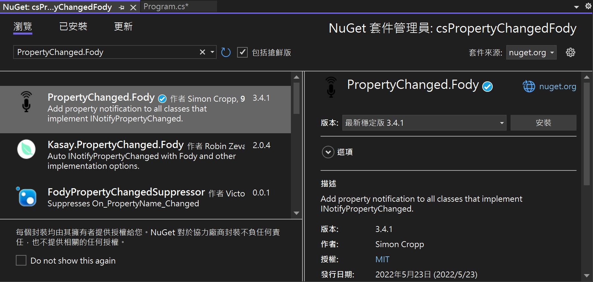

# 資料綁定 Data Binding - 3 PropertyChanged.Fody 套件，大幅簡化屬性變更通知程式設計碼

在上一篇 [資料綁定 Data Binding - 2 設計基底類別，透過繼承可以使用屬性變更通知](https://csharpkh.blogspot.com/2022/07/maui-mvvm-data-binding-base-class-BindableBase-PropertyChanged.html) 文章中，設計了一個抽象類別 BindableBase，並且把相關 INotifyPropertyChanged 介面要實作的方法都設計在這個新類別上，而對於要能夠具有屬性變更通知的類別，僅僅需要繼承這個類別即可使用這裡設計的相關程式碼，如此，大幅降低了相同程式碼重複設計的結果，也提升了整體專案的可維護特性。

在這篇文章中將會使用另外一個做法，可以把整個專案程式碼變得更加精簡，且具有相同的效果，那就是使用 [Fody/PropertyChanged](https://github.com/Fody/PropertyChanged) 套件，因為這個套件將會提供自動注入相關 PropertyChanged 事件會用到的程式碼，並且適時觸發這個屬性異動的通知事件到屬性內的 set 存取子內，唯一要做的就是這個類別要實作 INotifyPropertyChanged 介面即可，其他的程式碼將會由 PropertyChanged.Fody 幫你來完成。

## 系列文章清單

[1 自行建置 INotifyPropertyChanged 介面](https://csharpkh.blogspot.com/2022/07/maui-mvvm-data-binding-implementation-INotifyPropertyChanged-PropertyChanged.html)

[2 設計基底類別，透過繼承可以使用屬性變更通知](https://csharpkh.blogspot.com/2022/07/maui-mvvm-data-binding-base-class-BindableBase-PropertyChanged.html)

[3 PropertyChanged.Fody 套件，大幅簡化屬性變更通知程式設計碼](https://csharpkh.blogspot.com/2022/07/maui-mvvm-data-binding-nuget-propertychanged-fody-il-reduce-auto-property-impletation.html)

[4 CommunityToolkit.Mvvm 套件，透過原始碼產生來簡化屬性變更通知程式設計碼](https://csharpkh.blogspot.com/2022/08/maui-mvvm-data-binding-nuget-CommunityToolkit-Mvvm-source-generator-ObservableObject-RelayCommand.html)

[5 在 Maui 專案內，如何得知 ViewModel 內的屬性產生異動，而 View 可以收到通知呢？](https://csharpkh.blogspot.com/2022/07/maui-mvvm-data-binding-CommunityToolkit-detect-ViewModel-View-Event-PropertyChanged-Event.html)

## 建立新專案

* 開啟 Visual Studio 2022 開發工具
* 當 [Visual Studio 2022] 對話窗出現的時候
* 點選右下角的 [建立新的專案] 按鈕選項
* 現在將看到 [建立新專案] 對話窗
* 請選擇 [主控台應用程式] 這個專案範本
* 點選右下角的 [下一步] 按鈕
* 此時將會看到 [設定新的專案] 對話窗
* 在 [專案名稱] 欄位，輸入 `csPropertyChangedFody`
* 點選右下角的 [下一步] 按鈕
* 最後會看到 [其他資訊] 對話窗
* 請勾選 [不要使用最上層語句] 這個文字檢查盒控制項
* 點選右下角的 [建立] 按鈕

## 加入 PropertyChanged.Fody 的 NuGet 套件

* 滑鼠右擊該專案的 [相依性] 節點
* 從彈出功能表中選擇 [管理 NuGet 套件] 功能選項
* 此時，[NuGet: csPropertyChangedFody] 視窗將會出現
* 點選 [瀏覽] 標籤頁次
* 在左上方的搜尋文字輸入盒內輸入 `PropertyChanged.Fody` 關鍵字
* 現在，將會看到 PropertyChanged.Fody 套件出現在清單內
* 點選這個 PropertyChanged.Fody 套件，並且點選右上方的 [安裝] 按鈕，安裝這個套件到這個專案內。



## 使用 PropertyChanged.Fody 提供功能來設計具有屬性變更通知的 Person 類別

底下的範例程式碼，都將會建立在 [Program.cs] 這個檔案內

首先要建立一個 Person 類別，其中將會有兩個屬性，分別為 姓名 Name 與 年紀 Age

完成後的程式碼如下：

```csharp
public class Person : INotifyPropertyChanged
{
    public event PropertyChangedEventHandler? PropertyChanged;

    public string Name { get; set; }
    public int Age { get; set; }
}
```

當完成 Person 類別設計之後，所有的程式設計師將會眼睛一亮，發現到的第一個特色就是，程式碼變得那麼的簡潔與清爽，在這裡僅在類別宣告的後面，加入了宣告要實作 `INotifyPropertyChanged` 介面，因為加入了要實作 INotifyPropertyChanged 這個介面，因此要在該類別內加入 `public event PropertyChangedEventHandler? PropertyChanged;` 這行敘述，這樣個過程一切都沒有問題。

現在要來看看這個類別中的兩個屬性：姓名與年紀，在這裡將會使用 [自動實作的屬性](https://docs.microsoft.com/zh-tw/dotnet/csharp/programming-guide/classes-and-structs/auto-implemented-properties?WT.mc_id=DT-MVP-5002220) 方式來進行設計屬性程式碼，而不再需要使用 [含有支援欄位的屬性](https://docs.microsoft.com/zh-tw/dotnet/csharp/programming-guide/classes-and-structs/properties?WT.mc_id=DT-MVP-5002220) 來進行設計屬性程式碼，這樣的設計方式頓時讓整個程式碼明亮了許多，可是，這裡產生了一個問題，那就是當屬性值有異動的時候，該如何觸發屬性異動的通知事件呢？

這一切的疑問都在於 [PropertyChanged.Fody] 這個套件來幫忙處理了，因為，會用到屬性異動通知的程式碼， PropertyChanged.Fody 套件會在建置期間，自動注入到你的專案內。

要明瞭 PropertyChanged.Fody 在背後做了甚麼事情，可以透過市面上任何一套 .NET 反組譯工具，來觀察這個專案建置工具，來觀察這個專案建置後的組件 Assembly 檔案，底下將會是使用 ILSpy 這套工具所觀察到最終的 Person 類別在組件內的程式碼。

```csharp
// csPropertyChangedFody.Person
using System;
using System.CodeDom.Compiler;
using System.ComponentModel;
using System.Diagnostics;
using System.Runtime.CompilerServices;
using csPropertyChangedFody;

public class Person : INotifyPropertyChanged
{
	public string Name
	{
		[CompilerGenerated]
		get
		{
			return <Name>k__BackingField;
		}
		[CompilerGenerated]
		set
		{
			if (!string.Equals(<Name>k__BackingField, value, StringComparison.Ordinal))
			{
				<Name>k__BackingField = value;
				<>OnPropertyChanged(<>PropertyChangedEventArgs.Name);
			}
		}
	}

	public int Age
	{
		[CompilerGenerated]
		get
		{
			return <Age>k__BackingField;
		}
		[CompilerGenerated]
		set
		{
			if (<Age>k__BackingField != value)
			{
				<Age>k__BackingField = value;
				<>OnPropertyChanged(<>PropertyChangedEventArgs.Age);
			}
		}
	}

	public event PropertyChangedEventHandler? PropertyChanged;

	[GeneratedCode("PropertyChanged.Fody", "3.4.1.0")]
	[DebuggerNonUserCode]
	protected void <>OnPropertyChanged(PropertyChangedEventArgs eventArgs)
	{
		this.PropertyChanged?.Invoke(this, eventArgs);
	}
}
```

首先，將會看到 [PropertyChanged.Fody] 這個套件自動在這個類別內產生了 `<>OnPropertyChanged` 方法，這個方法將會接收到 `PropertyChangedEventArgs` 參數，並且透過這個參數來執行 `this.PropertyChanged?.Invoke(this, eventArgs);` 程式碼，觸發屬性變動的通知事件。看到這裡不會有看不懂得地方，因為這些程式碼在此之前，都是我們自己要寫出來的。

現在來觀察這個類別內的屬性，在此僅觀察 姓名 Name 這個屬性的最終程式碼

雖然在原始碼階段使用了 [自動實作的屬性](https://docs.microsoft.com/zh-tw/dotnet/csharp/programming-guide/classes-and-structs/auto-implemented-properties?WT.mc_id=DT-MVP-5002220) 方式來進行設計屬性程式碼，可是，編譯器還是會將這個自動實作屬性展開為 [含有支援欄位的屬性](https://docs.microsoft.com/zh-tw/dotnet/csharp/programming-guide/classes-and-structs/properties?WT.mc_id=DT-MVP-5002220) 實作，畢竟，在一個類別內，真正的狀態，還是要透過類別內的欄位來儲存呀，屬性終究是兩個方法的組成，其他法有地方可以來儲存狀態值。

在此特別的查看姓名屬性的 set 存取子，首先，將會使用 [String.Equals 方法](https://docs.microsoft.com/zh-tw/dotnet/api/system.string.equals?WT.mc_id=DT-MVP-5002220) 來檢查現在欄位值與要變動的屬性值是否相同，若是不相同，則會把新的屬性值設定給該姓名的欄位內，接著呼叫 `<>OnPropertyChanged(<>PropertyChangedEventArgs.Name);` 方法，觸發屬性變動的通知事件，這裡是不是很神奇呀，這一切的程式碼都會自動產生，並且注入內這個類別內。

## 確認採用 PropertyChanged.Fody 套件的設計是否可正常運作

在這裡將會採用同樣的測試程式碼，如下所示

```csharp
internal class Program
{
    static void Main(string[] args)
    {
        Person person = new Person();
        person.PropertyChanged += (s, e) =>
        {
            WriteLine($"屬性 {e.PropertyName} 已經變更");
        };

        WriteLine("準備要修改 Name 屬性值");
        person.Name = "Vulcan Lee";

        WriteLine("Press any key for continuing...");
        ReadKey();

        WriteLine("準備要修改 Age 屬性值");
        person.Age = 25;

        WriteLine("Press any key for continuing...");
        ReadKey();
    }
}
```

在這裡先建立一個型別為 [Person] 的物件，指派給 person 變數內

接著，因為每個 [Person] 物件，都有個公開的 [PropertyChanged] 事件，因此，在此將需要訂閱這個事件，在此使用 [Lambda 運算式](https://docs.microsoft.com/zh-tw/dotnet/csharp/language-reference/operators/lambda-expressions?WT.mc_id=DT-MVP-5002220) 設計一個匿名委派方法來綁定這個事件，如此，當有屬性變更的事件產生的時候，將會觸發這裡綁定的 Lambda 委派方法，也就是會在螢幕上顯示出哪個屬性值已經變更了。

完成的變更屬性的事件訂閱與綁定設計，接下來就是要開始針對這個 person 物件的兩個屬性值進行變動，看看是否會有屬性變動通知事件產生，底下是執行後的結果內容。


這裡將會是整個完整的測試程式碼

```csharp
internal class Program
{
    static void Main(string[] args)
    {
        Person person = new Person();
        person.PropertyChanged += (s, e) =>
        {
            WriteLine($"屬性 {e.PropertyName} 已經變更");
        };

        WriteLine("準備要修改 Name 屬性值");
        person.Name = "Vulcan Lee";

        WriteLine("Press any key for continuing...");
        ReadKey();

        WriteLine("準備要修改 Age 屬性值");
        person.Age = 25;

        WriteLine("Press any key for continuing...");
        ReadKey();
    }
}
```

```csharp
public class Person : INotifyPropertyChanged
{
    public event PropertyChangedEventHandler? PropertyChanged;

    #region 針對屬性的成員，都都採用自動屬性方式來宣告即可
    #region 姓名
    public string Name { get; set; }
    #endregion

    #region 年紀
    public int Age { get; set; }
    #endregion
    #endregion
}

internal class Program
{
    static void Main(string[] args)
    {
        Person person = new Person();
        person.PropertyChanged += (s, e) =>
        {
            WriteLine($"屬性 {e.PropertyName} 已經變更");
        };

        WriteLine("準備要修改 Name 屬性值");
        person.Name = "Vulcan Lee";

        WriteLine("Press any key for continuing...");
        ReadKey();

        WriteLine("準備要修改 Age 屬性值");
        person.Age = 25;

        WriteLine("Press any key for continuing...");
        ReadKey();
    }
}
```


