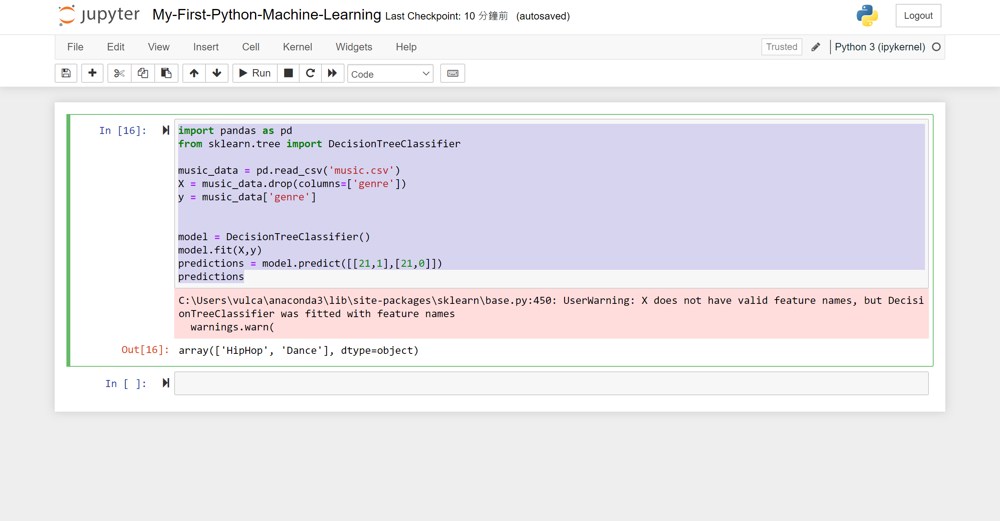

# 第一次使用 Python 來體驗 Machine Learning 開發，體驗網路各種傳聞

## 準備 Python 開發專案

* 建立一個要練習 Machine Learning 的目錄
* 點選做下角的 Windows 視窗圖示
* 找到 Anaconda Prompt (anaconda3) 這個應用程式
* 開啟這個應用程式

  

* 使用 cd 命令，切換到剛剛建立好的練習目錄下
* 請繼續輸入 `jupyter notebook` 開啟 Jupyter 的 IDE
* 一旦看到底下畫面內容，此時，瀏覽器會自動開啟
* 點選右上角的 [New] 下拉選單按鈕
* 從彈出清單中，選擇 Notebook: Python 3 (ipykernel) 這個選項

  

* 現在，另外一個網頁頁次將會開啟
* 將游標移動到左上方得 Untitled 文字處
* 點選這個文字
* 在 [Rename Notebook] 對話窗內，輸入這個新筆記本名稱
* 請輸入 `My-First-Python-Machine-Learning`
* 完成後，點選該對話窗右下方的 Rename 按鈕

  

  

## 建立 Machine Learning 需要用到的範例資料

現在可以自己建立，或者從網路上下載這次要做練習會用到的資料檔案

底下是這次要分析的資料

```
age	gender	genre
20	1	HipHop
23	1	HipHop
25	1	HipHop
26	1	Jazz
29	1	Jazz
30	1	Jazz
31	1	Classical
33	1	Classical
37	1	Classical
20	0	Dance
21	0	Dance
25	0	Dance
26	0	Acoustic
27	0	Acoustic
30	0	Acoustic
31	0	Classical
34	0	Classical
35	0	Classical
```

從上面的資料可以看出，這是一個不同年齡(欄位1 age)層與不同性別(欄位2 gender)的人，喜歡聽的音樂類型(欄位3 genre)紀錄

* 請在剛剛建立的目錄下，建立一個 .csv 檔案，該檔案名稱為 `music.csv`

## 開始進行 Python 機器學習程式碼開發

* 在 Jupyter 筆記本中，輸入底下 Python 程式碼

```python
import pandas as pd
music_data = pd.read_csv('music.csv')
music_data
```

第一行表示匯入 [Pandas](https://pandas.pydata.org/) 這個用於資料分析的工具，這個工具目的可以從網頁說明上看出 pandas is a fast, powerful, flexible and easy to use open source data analysis and manipulation tool,
built on top of the Python programming language.

第二行則是讀取剛剛建立的 Sample Data ，也就是 music.csv 這個檔案內容，雖然這個檔案是屬於 .csv 類型的檔案，對於 pandas 工具而言，這是輕而易舉的事情，因為，他可以認識與讀入這個檔案內的相關內容。

想要知道 pandas 看到甚麼樣的資料，可以使用第三行程式碼，顯示內容

* 按下 [Ctrl] + [Enter] 來執行這三行程式碼
* 底下將會是執行結果

  

## 建立訓練模型來進行預測分析

這個第一個 Python 練習，將會要進行機器學習的預測，因此，需要建立一個輸入與輸出的模型，透過輸入模型的資料，預測可能會產生甚麼樣的輸出資料。

* 首先，建立輸入模型

```python
import pandas as pd
music_data = pd.read_csv('music.csv')
X = music_data.drop(columns=['genre'])
X
```

這裡建立一個 X 物件，代表輸入模型，該模型是這個 CSV 檔案內的前兩個欄位，分別代表年紀與性別，所以，在此使用 drop 函數，將原有資料集 data set 的最後一個欄位移除，保留前面兩個欄位，並且將這個物件設定給新的變數 X。

當此用 drop 函數的時候，並不會將原有的資料集刪除，而是產生一個新的資料集出來

最後，使用 X 這個敘述，查看這個新物件的內容

從下圖可以看出，X 物件內有著年紀與性別這兩個欄位，這樣的物件就代表了輸入模型


* 使用底下程式碼建立輸出模型

```python
import pandas as pd
music_data = pd.read_csv('music.csv')
X = music_data.drop(columns=['genre'])
y = music_data['genre']
y
```

這裡是執行結果


## 開始進行學習與預測

在這裡將會練習使用決策樹方法來進行資料行為預測，為了要使用這樣的分析方法，需要藉助於 [scikit-learn: machine learning in Python](https://scikit-learn.org/stable/) 這個工具

從網站介紹內容，可以看出這個工具提供出相當多的好用功能


使用底下的 Python 敘述，引用 決策樹 這個工具

```python
from sklearn.tree import DecisionTreeClassifier
```

底下是完成後的程式碼，大約使用到 8 行的 Python 程式碼

```python
import pandas as pd
from sklearn.tree import DecisionTreeClassifier

music_data = pd.read_csv('music.csv')
X = music_data.drop(columns=['genre'])
y = music_data['genre']


model = DecisionTreeClassifier()
model.fit(X,y)
predictions = model.predict([[21,1],[21,0]])
predictions
```

這裡首先建立一個 model 物件

接著使用了 `model.fit(X,y)` 敘述，進行模型的訓練 training sample data

接著，使用了 `model.predict([[21,1],[21,0]])` 進行預設，希望能夠從現有的數據資料中，了解到年紀在 21 歲的男性，喜歡甚麼類型音樂，而對於 21 歲的女性，喜歡甚麼樣類型的音樂

底下為這次練習的執行結果



## 區分訓練與測試用的資料

通常來說，所取得的資料，將會使用80%左右的紀錄來進行訓練，並且使用 20% 的紀錄來進行測試，藉此了解到這樣的預測可以達到多少準確程度。

在這裡將會使用 sklearn.metrics 模組來進行量測準確度，底下將會是這樣的練習程式碼

```python
import pandas as pd
from sklearn.tree import DecisionTreeClassifier
from sklearn.model_selection import train_test_split
from sklearn.metrics import accuracy_score

music_data = pd.read_csv('music.csv')
X = music_data.drop(columns=['genre'])
y = music_data['genre']

X_train, X_test, y_train, y_test = train_test_split(X, y, test_size=0.2)

model = DecisionTreeClassifier()
model.fit(X_train,y_train)
predictions = model.predict(X_test)

score = accuracy_score(y_test, predictions)
score
```

透過 `X_train, X_test, y_train, y_test = train_test_split(X, y, test_size=0.2)` 敘述，將原有的資料集使用 80% / 20% 的比例分別切割成為不同資料集，接著，使用 `model.fit(X_train,y_train)` 敘述，將切割出來的紀錄進行訓練，最後，使用 `score = accuracy_score(y_test, predictions)` 敘述來量測預測準確度

底下是執行結果


## 補充說明

若想要找到可以練習用的分析資料，可以到 Kaggle 網站內來搜尋

* 使用瀏覽器打開 [Kaggle](https://www.kaggle.com/) 網站，從這個網站的說明文字：Kaggle: Your Machine Learning and Data Science Community，可以看到從這裡可以找到相當多機器學習與資料科學上的相關資料或者資訊
* 在右上方的搜尋文字輸入盒內，輸入 `video game sale` 文字
* 此時，網頁畫面將出現如下圖

  

* 點選第一個搜尋出來的項目 `Video Game Sales` 這個連結
* 將會看到這個 Data Set 的介紹

  


