# 我的第一次接觸 Python : 安裝開發環境與工具

最近因為工作關係，開始進行評估要進入到哪個新的開發領域，而對於 C# 這門開發程式語言，也摸了快要十年以上了，現在最新的技術 ASP.NET Core Blazor 與 Xamarin.Forms 或者下一代的 .NET MAUI，已也經摸到頂端了，畢竟從事程式設計領域這麼久的時間，接觸與使用的語言超過十種以上，而許多之前使用的程式語言也在現今並沒有太多人在使用，競爭能力明顯降低很多，想當然的就從網路上來著手，看看有沒有甚麼可以比較與下手的領域，保持未來十年有一些競爭實力。

從各種統計 [Programming, Scripting, and Markup Languages](https://survey.stackoverflow.co/2022/#section-most-loved-dreaded-and-wanted-programming-scripting-and-markup-languages) 與部落格文章，我先從現今這兩三年最熱門的程式語言著手分析，發現到 Python 與 JavaScript 一直居於大家最喜歡與熱門的程式語言首選，所以，先使用排除法，我本身對於 JavaScript 這個程式語言沒有絕對的好感，所以，在此優先排除了，所以，剩下了 Python；從相關文章中，了解到這個程式語言的特色與可以表現的工作領域，我個人覺得有些誇大，不過，畢竟在這裡所發揮的空間與各公司對於這樣職缺的期待數量，比起其他程式語言比起來有著明顯的差距。

因此，我上週花了三天的時間看了幾部 Python 的教學影片，我得到一個事實，那就是大家對於 Python 這個程式語言說，這是一個容易學習與使用的程式語言這個部分，我終於認同了，對於另外一個說明，Python 可以使用較少的程式碼，完成一件事情，關於這一點，我從某部 Python 教學影片中的一個講解範例中，充分的得到證明，也就是說，若我想要把同樣的一件事情，使用 C# 程式碼來重新做一次，實在沒辦法就可以在短短的數十行程式碼，就完成一個產品預測分析的功能，這大大的奠定了我對於 Python 的信心，當然，我還是有著其他的疑慮或者考量，然而，看了這麼多，還不如實際動手體驗看看，畢竟未來還是要自己來寫出這些程式碼的。

所以，我的第一份 Python 的系列部落格文章，就從這裡開始，這將會用來記錄我學習 Python 的各種歷程，首先，需要先來安裝一個可以用於開發 Python 的環境軟體，根據一些介紹文章或者影片，我也選擇了 [Anaconda](https://www.anaconda.com/products/distribution) 這個工具，根據網站上的說明 ： ANACONDA DISTRIBUTION => The world’s most popular open-source Python distribution platform

* 使用瀏覽器打開 [Anaconda](https://www.anaconda.com/products/distribution) 網站
* 從網頁的右上方，將會看到一個 [Download] 按鈕
* 點選這個下載按鈕

  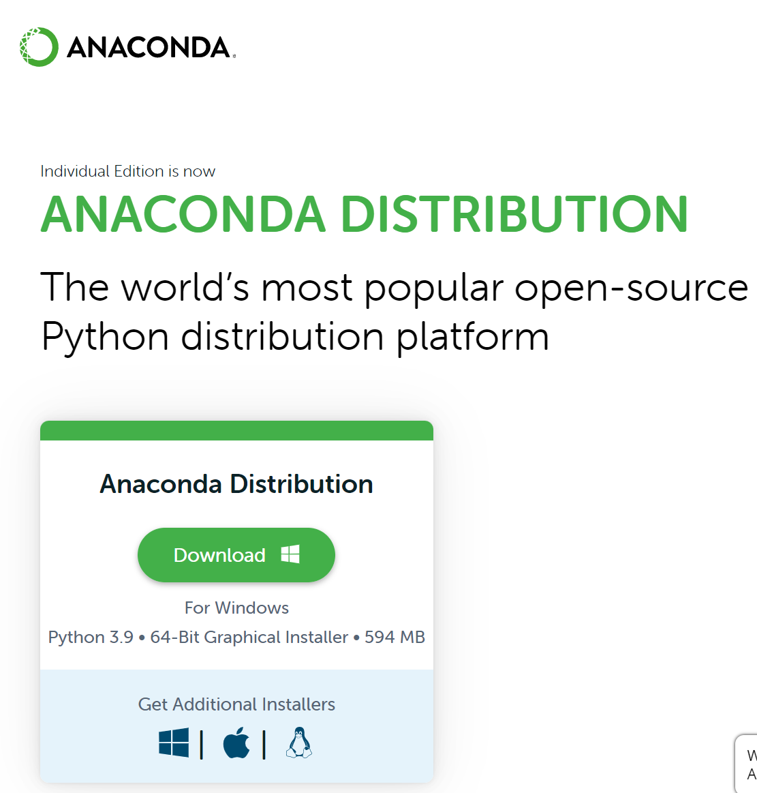

  * 因為檔案超過 500 MB 以上，因此，稍微等候這個安裝檔案下載完成
  * 一旦 [Anaconda3-2022.05-Windows-x86_64.exe] 程式下載完成後，參考下圖，點選 [開啟] 連結

    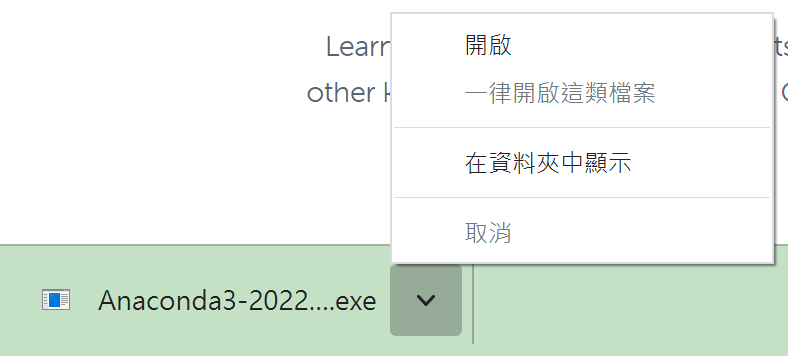

* 現在要依序完成底下操作，已完成安裝動作
* 當出現歡迎畫面，點選 [Next] 按鈕

  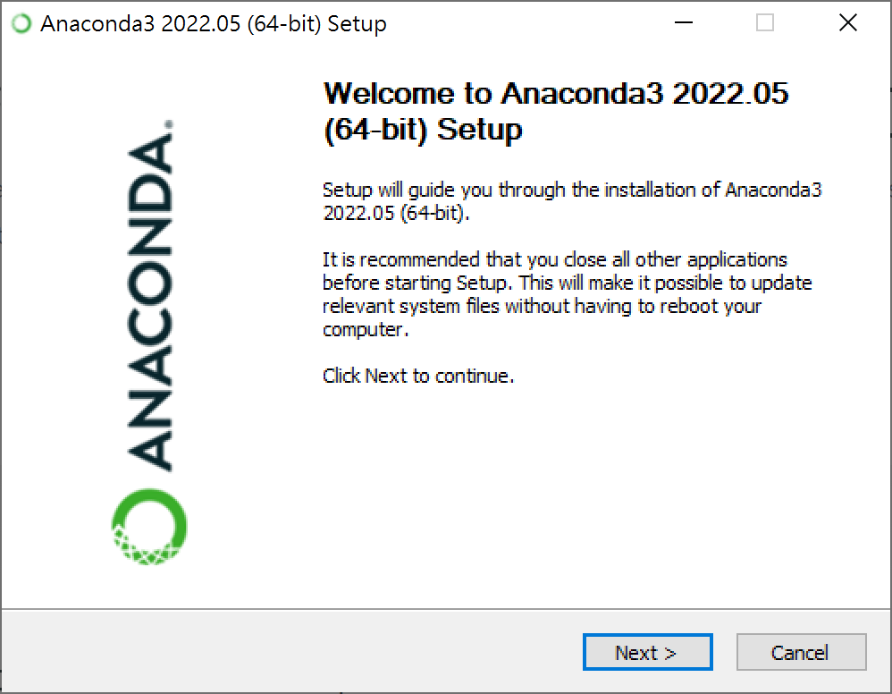

* 在接受使用授權合約頁面中，點選 [I Agree] 按鈕

  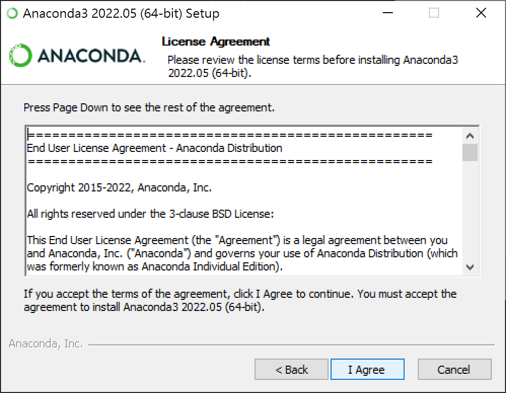

* 現在看到選擇安裝類型畫面，使用預設值(因為這台電腦只有我自己會使用)，接著點選 [Next] 按鈕

  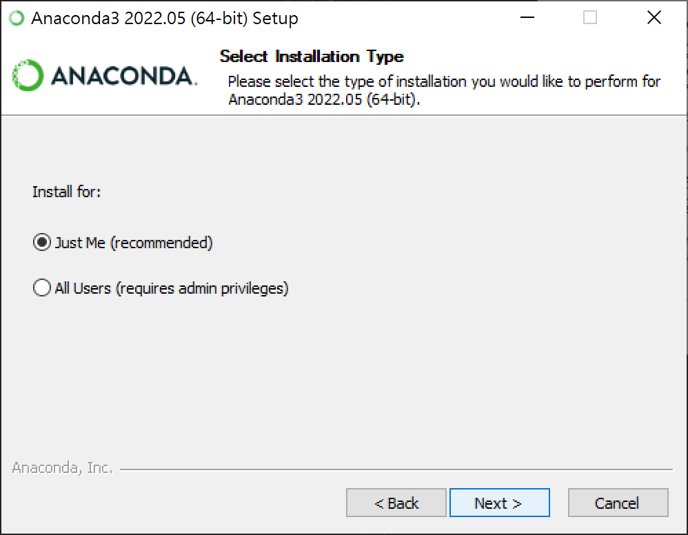

* 在安裝位置對話窗內，使用預設路徑，接著點選 [Next] 按鈕

  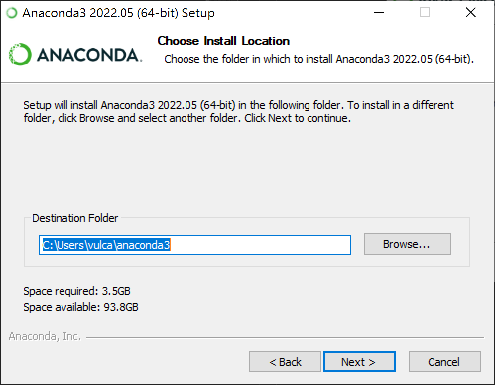

* 在進階安裝選項對話窗內，請確認 Register Anaconda3 as my default Python 3.9 這個檢查盒，然後，點選 [Install] 按鈕

  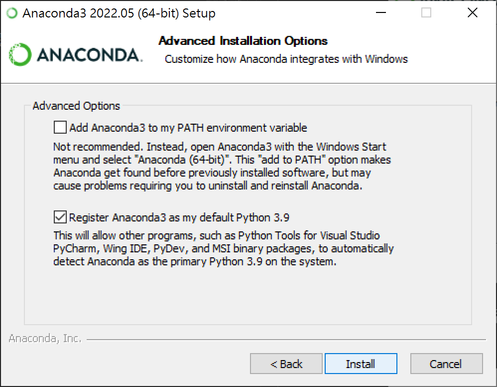

* 實際安裝檔案的時間需要一點時間，稍微等候一下

  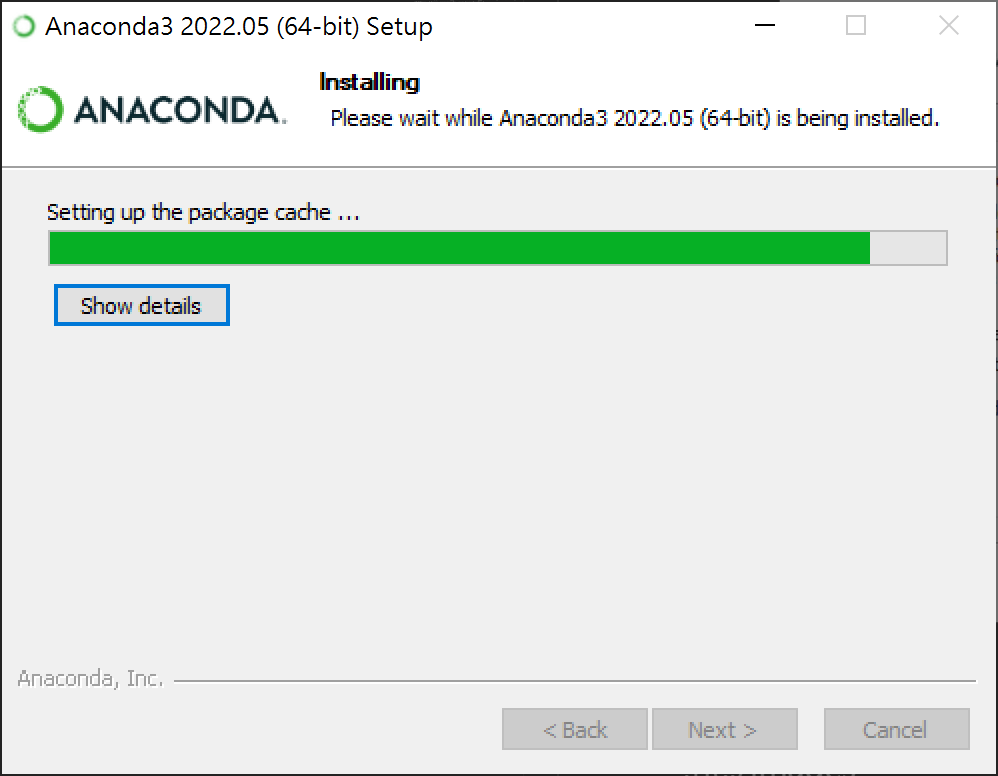

* 當看到底下畫面，那就表示相關軟體已經安裝好了，請點選 [Next] 按鈕

  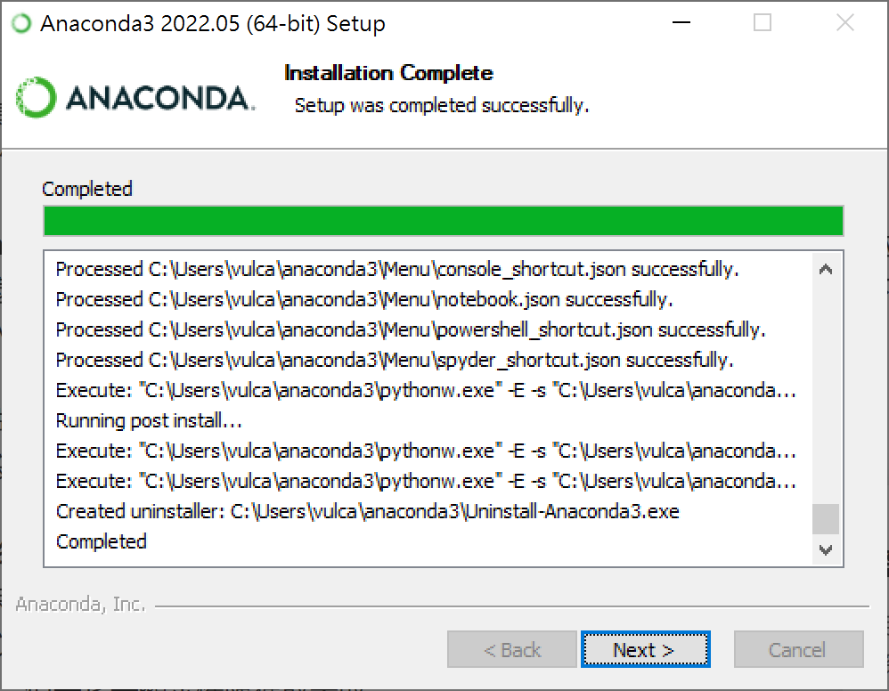

* 看到底下畫面，點選 [Next] 按鈕

  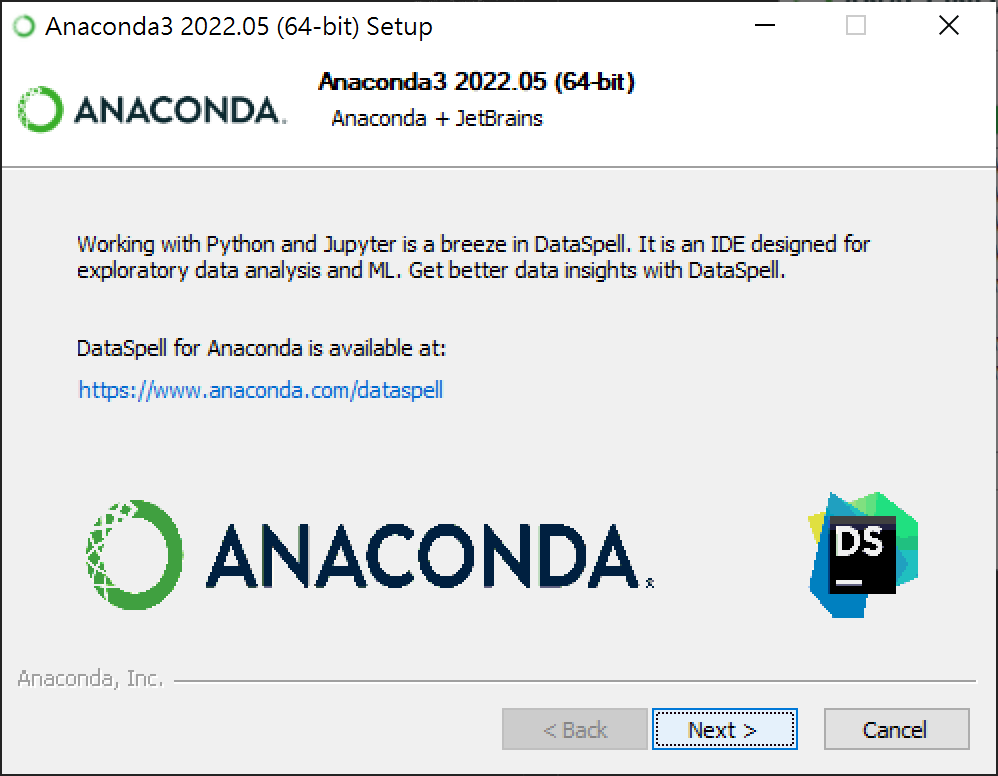

* 最後，終於完成了安裝過程，點選 [Finish] 按鈕，結束安裝程序

  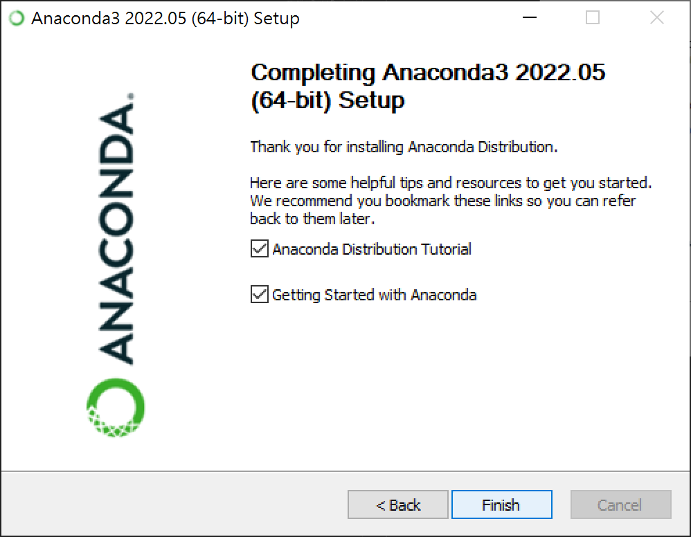

現在要來確定相關 Python 工作環境是否都正常運作

* 點選做下角的 Windows 視窗圖示
* 從最近新增畫面中，找到 Anaconda Prompt (anaconda3) 這個應用程式
* 開啟這個應用程式

  

* 當命令提示字元視窗出現之後，請輸入 python
* 此時，將會看到 Python 3.9.12 (main, Apr  4 2022, 05:22:27) [MSC v.1916 64 bit (AMD64)] :: Anaconda, Inc. on win32
Type "help", "copyright", "credits" or "license" for more information. 這段訊息，那就表示這台電腦可以跑 Python 程式了
* 緊接著輸入 `print('Hello World')` ，並且按下 [Enter] 按鈕
* 這是我寫的第一個 Python 程式，向大家問好
* 從底下螢幕畫面截圖可以看到，這個簡單的 Python 程式已經成功的運行起來了

  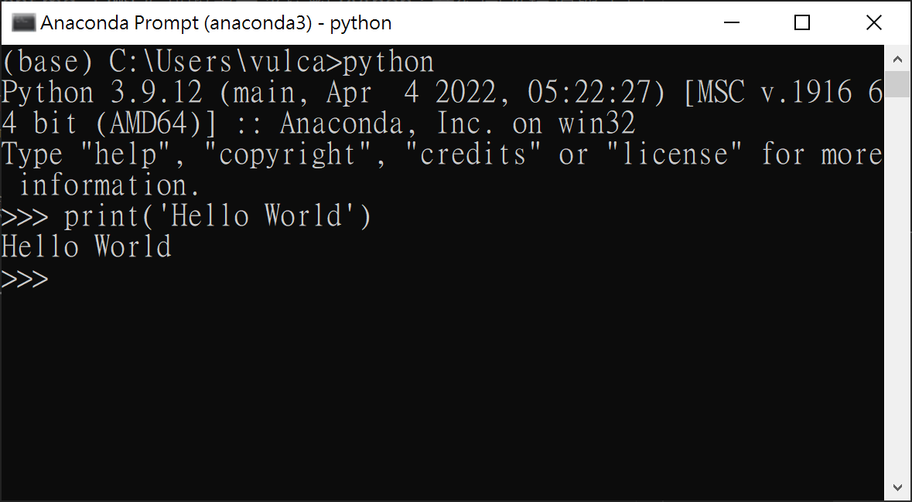

現在要來確認開發 Python 的一個好用 IDE 是否可以正常運作

* 請繼續輸入 `jupyter notebook` 開啟 Jupyter 的 IDE
* 一旦看到底下畫面內容，此時，瀏覽器會自動開啟

  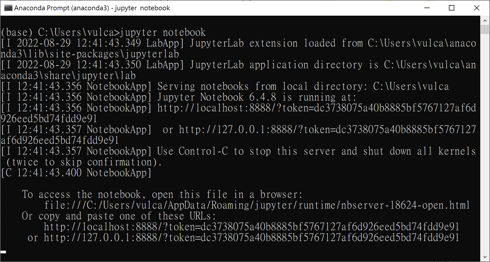

* 太好了，此時已經確認 Python 開發環境已經都安裝好了，從底下畫面截圖，可以看到 Jupyter 也成功啟動了

  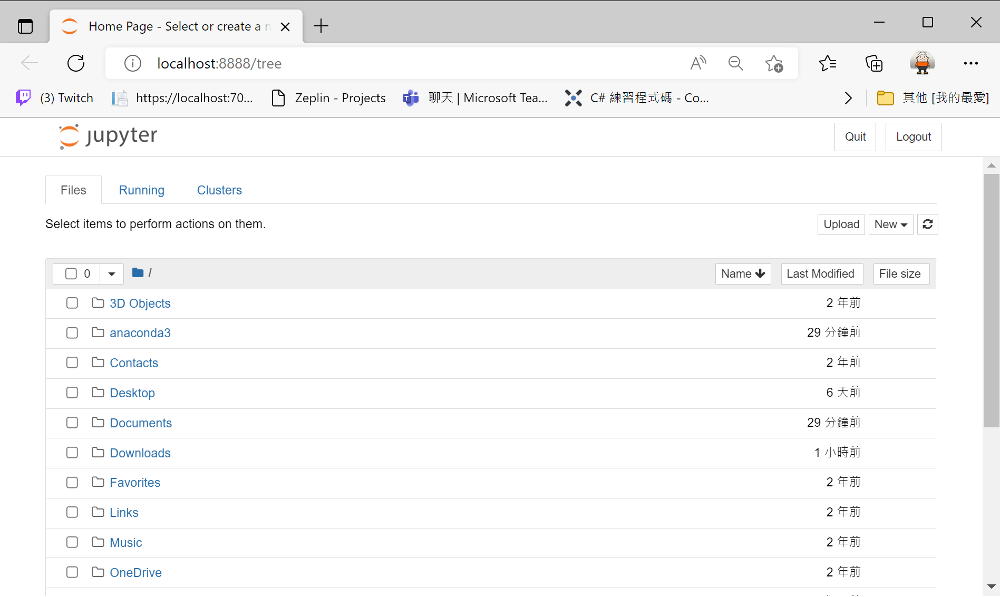

