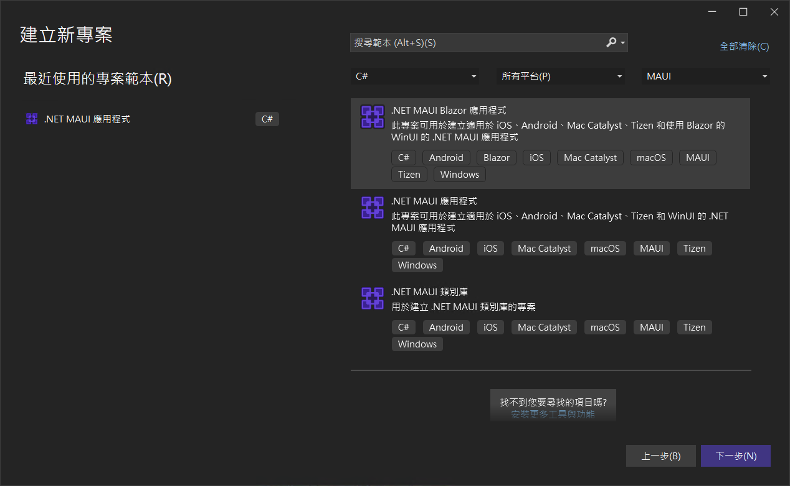
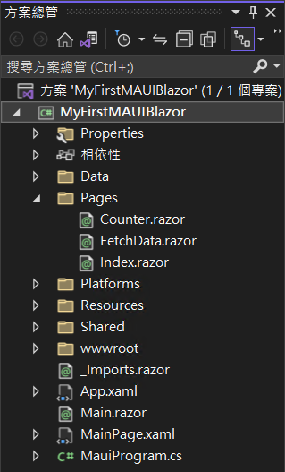
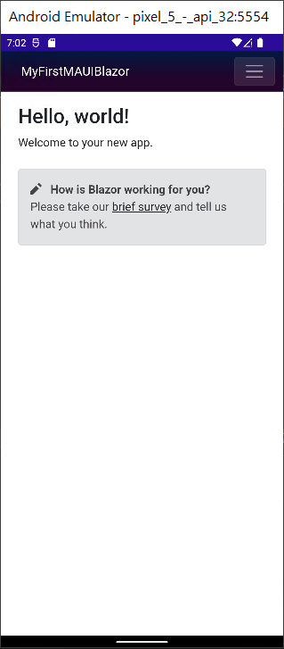
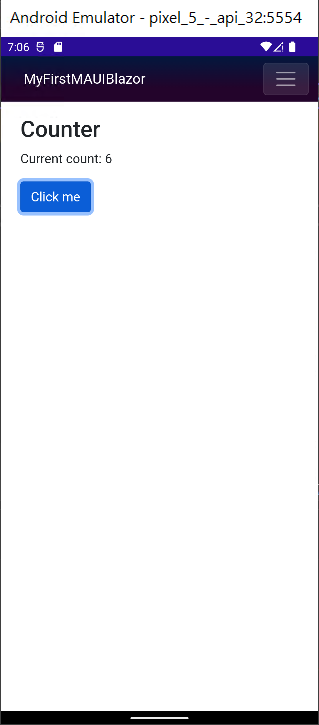

# 如何建置和執行 .NET MAUI Blazor 應用程式教學

在上一篇文章中 [第一次體驗與建立 毛伊 MAUI 應用程式 並與 Xamarin.Forms 進行比較教學](https://csharpkh.blogspot.com/2022/07/First-NET-MAUI-Develop-Compare-Xamarin-Forms.html
) ，說明到如何建立一個 MAUI 專案，可以建立出跨平台的 App，而這個應用程式，可以在這些平台上順利地執行，而且僅需要設計一套 UI 與 C# 商業邏輯程式碼，可謂非常的方便與好用，對於 UI 的設計部分，則是採用了 XAML 這個標記宣告語言來設計。

在這篇文章中，將會建立一個 MAUI 專案，該專案採用的 [Blazor](https://docs.microsoft.com/zh-tw/aspnet/core/blazor?WT.mc_id=DT-MVP-5002220) 方式來開發出一個跨平台執行的應用程式，當然，商業邏輯部分一定是使用 C# 程式語言，而對於 UI 的部分，毫無意外的，將會採用 HTML / CSS 與 Razor 語法來進行設計。

## 建立 .NET MAUI Blazor 專案

* 啟動 Visual Studio 2022 
* 看到 Visual Studio 2022 對話窗
* 請點選右下方的 [建立新的專案] 表示透過程式碼 Scaffolding 選擇專案範本以開始使用
* 當出現 [建立新專案] 對話窗
* 在中間最上方有三個下拉選單控制項
* 切換 [所有語言] 下拉選單控制項為 [C#]
* 切換 [所有專案類型] 下拉選單控制項為 [MAUI]
* 此時，在中間區域將會看到有三種專案範本可以選擇
* 請點選中間那個 [.NET MAUI Blazor 應用程式] 此專案可用於建立適用於 iOS、Android、Mac Catalyst、Tizen 和使用 Blazor 的 WinUI 的 .NET MAUI 應用程式
* 最後，點選右下方的 [下一步] 按鈕



* 在 [設定新的專案] 對話窗出現後
* 在 [專案名稱] 欄位內輸入 `MyFirstMAUIBlazor`
* 點選右下方的 [下一步] 按鈕
* 看到 [其他資訊] 對話窗，點選右下方的 [建立] 按鈕
* 稍微等候 Visual Studio 建立這個專案
* 底下是建立好的 MAUI 整體方案的結構



## 理解 MAUI Blazor 專案結構

從上方的方案總管視窗可以看到，這裡產生的專案結構與單純採用 XAML 方式開發的 MAUI 專案有著很大的不同，其中，對於有開發過 Blazor 專案的開發者而言，將會看到這裡有著許多 Blazor 專案才有的結構的檔案，例如 : _Imports.razor , wwwroot , Counter.razor , Index.razor 等等。

對於個別平台的程式進入點部分的檔案，與單純採用 XAML 建立的 Blazor 專案相同，所以，從這裡將會開始打開 [MauiProgram.cs] 這個檔案開始進行分析，底下是這個檔案的內容。

```csharp
using Microsoft.AspNetCore.Components.WebView.Maui;
using MyFirstMAUIBlazor.Data;

namespace MyFirstMAUIBlazor;

public static class MauiProgram
{
	public static MauiApp CreateMauiApp()
	{
		var builder = MauiApp.CreateBuilder();
		builder
			.UseMauiApp<App>()
			.ConfigureFonts(fonts =>
			{
				fonts.AddFont("OpenSans-Regular.ttf", "OpenSansRegular");
			});

		builder.Services.AddMauiBlazorWebView();
		#if DEBUG
		builder.Services.AddBlazorWebViewDeveloperTools();
#endif
		
		builder.Services.AddSingleton<WeatherForecastService>();

		return builder.Build();
	}
}
```

在 [CreateMauiApp] 這個靜態方法內，透過 [MauiApp.CreateBuilder()] 方法，取得了一個型別為 [MauiAppBuilder] 的 builder 物件，之後有呼叫 builder.Services.AddMauiBlazorWebView(); 方法，宣告相依性注入容器 DI / IoC Container 要註冊 Blazor 會用到的相關服務，之後也使用了 builder.Services.AddSingleton<WeatherForecastService>(); 這個敘述，註冊了這個 Blazor 頁面會用到的服務。

打開 [App.xaml.cs] 檔案，將會看到在建構式內，有 `MainPage = new MainPage();` 這行敘述，這表示這個 MAUI Blazor 第一個要顯示的頁面將會是 [MainPage.xaml] 這個檔案，底下將會是這個檔案的內容

```xml
<?xml version="1.0" encoding="utf-8" ?>
<ContentPage xmlns="http://schemas.microsoft.com/dotnet/2021/maui"
             xmlns:x="http://schemas.microsoft.com/winfx/2009/xaml"
             xmlns:local="clr-namespace:MyFirstMAUIBlazor"
             x:Class="MyFirstMAUIBlazor.MainPage"
             BackgroundColor="{DynamicResource PageBackgroundColor}">

    <BlazorWebView HostPage="wwwroot/index.html">
        <BlazorWebView.RootComponents>
            <RootComponent Selector="#app" ComponentType="{x:Type local:Main}" />
        </BlazorWebView.RootComponents>
    </BlazorWebView>

</ContentPage>
```

在這個 [MainPage.xaml] 檔案中，將會看到 ContentPage 這個頁面內根項目為 BlazorWebView ，關於這個元件的介紹，可以參考 [使用 BlazorWebView 在 .NET MAUI 應用程式中裝載 Blazor Web 應用程式](https://docs.microsoft.com/zh-tw/dotnet/maui/user-interface/controls/blazorwebview?WT.mc_id=DT-MVP-5002220) ，在這個元件內指定了要顯示的頁面為 [wwwroot/index.html] ，因此，底下將會是 wwwroot 資料夾內的 index.html 檔案內容

```html
<!DOCTYPE html>
<html lang="en">
<head>
    <meta charset="utf-8" />
    <meta name="viewport" content="width=device-width, initial-scale=1.0, maximum-scale=1.0, user-scalable=no, viewport-fit=cover" />
	<title>MyFirstMAUIBlazor</title>
	<base href="/" />
	<link rel="stylesheet" href="css/bootstrap/bootstrap.min.css" />
	<link href="css/app.css" rel="stylesheet" />
	<link href="MyFirstMAUIBlazor.styles.css" rel="stylesheet" />
</head>

<body>

	<div class="status-bar-safe-area"></div>

	<div id="app">Loading...</div>

	<div id="blazor-error-ui">
		An unhandled error has occurred.
		<a href="" class="reload">Reload</a>
		<a class="dismiss">🗙</a>
	</div>

	<script src="_framework/blazor.webview.js" autostart="false"></script>

</body>

</html>
```

在這個 [index.html] 檔案內的標頭部分，僅宣告一些要參考用到的 CSS，這裡 `<div id="app">Loading...</div>` 將會是 Blazor 要顯示頁面的地方，而在最後面的 `<script src="_framework/blazor.webview.js" autostart="false"></script>` 敘述，則是引入一段 JavaScript ，用來做到 Blazor 頁面可以正常進行資料綁定與 Render 渲染的動作，實作出動態的 SPA 頁面效果。

在這個專案裡面，似乎沒有找到 [App.razor] 這個 Blazor 系統進入點的原件，而室友發現到一個 [Main.razor] 這個 Blazor 元件檔案，底下將會是這個檔案的內容

```html
<Router AppAssembly="@typeof(Main).Assembly">
	<Found Context="routeData">
		<RouteView RouteData="@routeData" DefaultLayout="@typeof(MainLayout)" />
        <FocusOnNavigate RouteData="@routeData" Selector="h1" />
	</Found>
	<NotFound>
		<LayoutView Layout="@typeof(MainLayout)">
			<p role="alert">Sorry, there's nothing at this address.</p>
		</LayoutView>
	</NotFound>
</Router>
```

這個 Main.razor 檔案內容，與 Blazor 專案內的 App.razor 檔案十分相似，也是用於當 Blazor 頁面要進行導航的時候，會先到這裡來進行路由處理，若指定的路由路徑不存在，則會顯示 Sorry, there's nothing at this address. 這樣的文字，若指定的路由存在於系統內，將會導航並且顯示這個頁面內容到畫面上。

在 [Shared] 資料夾內，有看到 [MainLayout.razor] 與 [NaviMenu.razor] 這兩個元件，分別表示了這個 Blazor 頁面的版面配置設定與宣告，和導航面板的設計，底下將會是這兩個檔案的內容

[MainLayout.razor]

```html
@inherits LayoutComponentBase

<div class="page">
	<div class="sidebar">
		<NavMenu />
	</div>

	<main>
		<div class="top-row px-4">
			<a href="https://docs.microsoft.com/aspnet/" target="_blank">About</a>
		</div>

		<article class="content px-4">
			@Body
		</article>
	</main>
</div>
```

[NaviMenu.razor]

```html
<div class="top-row ps-3 navbar navbar-dark">
	<div class="container-fluid">
		<a class="navbar-brand" href="">MyFirstMAUIBlazor</a>
		<button title="Navigation menu" class="navbar-toggler" @onclick="ToggleNavMenu">
			<span class="navbar-toggler-icon"></span>
		</button>
	</div>
</div>

<div class="@NavMenuCssClass" @onclick="ToggleNavMenu">
	<nav class="flex-column">
		<div class="nav-item px-3">
			<NavLink class="nav-link" href="" Match="NavLinkMatch.All">
				<span class="oi oi-home" aria-hidden="true"></span> Home
			</NavLink>
		</div>
		<div class="nav-item px-3">
			<NavLink class="nav-link" href="counter">
				<span class="oi oi-plus" aria-hidden="true"></span> Counter
			</NavLink>
		</div>
		<div class="nav-item px-3">
			<NavLink class="nav-link" href="fetchdata">
				<span class="oi oi-list-rich" aria-hidden="true"></span> Fetch data
			</NavLink>
		</div>
	</nav>
</div>

@code {
	private bool collapseNavMenu = true;

	private string NavMenuCssClass => collapseNavMenu ? "collapse" : null;

	private void ToggleNavMenu()
	{
		collapseNavMenu = !collapseNavMenu;
	}
}
```

現在可以開始執行這個專案，看看會顯示甚麼結果。

在最上方工具列中間區域，會看到一個綠色實體三角形，請下拉這個下拉選單控制項，從這裡個清單中，選擇 [Android Emulators] > [Pixel 5 - API 32 (Android 12.1 - API 32)] 這個選項

這裡將會是執行結果



此時，點選螢幕右上方的漢堡按鈕，將會彈出一個功能表內容，請點選 [+ Counter] 這個項目

現在，畫面如下，若點選畫面上的 [Click me] 按鈕，將會看到上方的文字會有所變化




