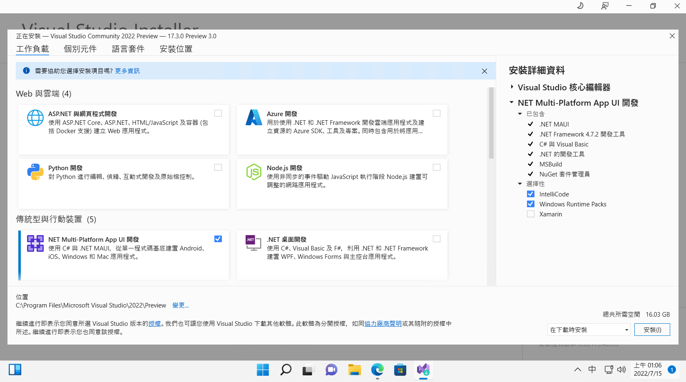
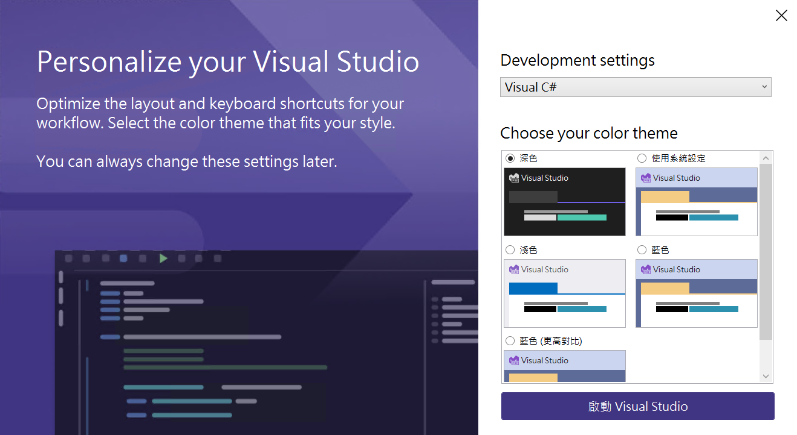
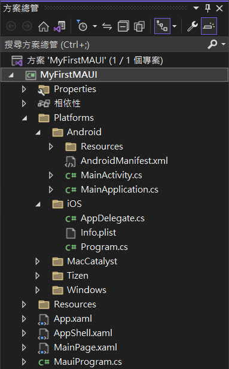
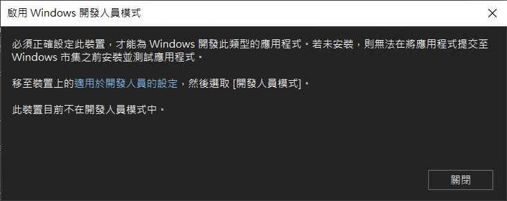

# 第一次體驗與建立 毛伊 MAUI 應用程式 並與 Xamarin.Forms 進行比較教學

微軟在今年 2022 年推出了 .NET 多平臺應用程式 UI ([.NET MAUI](https://docs.microsoft.com/zh-tw/dotnet/maui/what-is-maui?WT.mc_id=DT-MVP-5002220))，這是一種跨平臺架構，可透過 C# 和 [XAML](https://docs.microsoft.com/zh-tw/dotnet/desktop/wpf/xaml?WT.mc_id=DT-MVP-5002220) 建立原生行動和桌面應用程式，而其中 MAUI 是 Multi-Platform App UI 的縮寫。

其實，有使用過 [Xamarin.Forms](https://docs.microsoft.com/zh-tw/xamarin/xamarin-forms?WT.mc_id=DT-MVP-5002220) 開發過跨平台應用程式的開發者對於 MAUI 應該不會很陌生，因為，他就是 Xamarin.Forms 的下一代進化版本工具，所以，當然是可以透過 MAUI 來開發出 Windows / iOS / Android 的應用程式，除了這三種平台，還可以開發出 macOS 的應用程式。

在這篇文章中將要來體驗看看 MAUI 這個 UI Toolkit 的實際產生過程與專案架構，然而，在這個時間點，想要開發 MAUI 應用程式，必須安裝 Visual Studio 2022 17.3 (Preview) 版本 (現階段 Visual Studio 2022 的正式版本僅推出到 17.2 版本， 17.3 尚在預覽階段)，因此，先透過瀏覽器開啟 [Visual Studio 2022 預覽版](https://visualstudio.microsoft.com/zh-hant/vs/preview?WT.mc_id=DT-MVP-5002220) 下載網址


* 點選網頁上的 [下載預覽] 按鈕
* 當網頁跳到 [試用預覽] 區段的時候，請下載 [Visual Studio Community] 這個版本即可，當然，下載其他的版本也是沒有問題的，其中 [Visual Studio Community] 版本是免費且功能完整的 IDE，適用於學生、開放原始碼參與者以及個別開發人員。
* 請點選 [Visual Studio Community] 右邊的 [下載預覽] 按鈕
* 一旦 VisualStudioSetup.exe 安裝檔案下載完成後，請直接開啟這個檔案
* 在出現 [使用者帳戶控制] 對話窗時候，點選 [是] 按鈕，接受允許此 App 變更您的裝置。
* 看到 [Visual Studio Installer] 對話窗後，點選該對話窗右下方的 [繼續] 按鈕


* 稍微等候一下，將會看到 Visual Studio Community 2022 Preview 安裝程式畫面
* 請勾選 [NET Multi-Platform App UI 開發] 這個選項，其中這個選項的說明內容為：使用 C# 與 .NET MAUI，從單一程式碼基底建置 Android, iOS, Windows 和 Mac 應用程式。



* 完成後，點選右下方的 [安裝] 按鈕
* 現在要稍微等候一段時間，因為安裝程式正在下載與安裝所需要用到的相關檔案


* 當看到底下的畫面，那就表示 Visual Studio 2022 已經安裝完成了


* 在此，點選右邊的 [暫時略過此步驟] 文字
* 建議對於 [Development settings] 的下拉選單控制項，選擇 [Visual C#]
* 對於 [Choose your color theme] 區段，可以依據自己喜好，選擇合適顏色配置主題佈景，在此，我選擇預設值
* 請點選右下方的 [啟動 Visual Studio] 按鈕



* 一旦 Visual Studio 2022 啟動成功後，就會看到 Visual Studio 2022 對話窗
* 請點選右下方的 [建立新的專案] 表示透過程式碼 Scaffolding 選擇專案範本以開始使用


* 當出現 [建立新專案] 對話窗
* 在中間最上方有三個下拉選單控制項
* 切換 [所有語言] 下拉選單控制項為 [C#]
* 切換 [所有專案類型] 下拉選單控制項為 [MAUI]
* 此時，在中間區域將會看到有三種專案範本可以選擇
* 請點選中間那個 [.NET MAUI 應用程式] 此專案可用於建立適用於 iOS、Android、Mac Catalyst、Tizen 和 WinUI 的 .NET MAUI 應用程式
* 最後，點選右下方的 [下一步] 按鈕


* 在 [設定新的專案] 對話窗出現後
* 在 [專案名稱] 欄位內輸入 `MyFirstMAUI`
* 點選右下方的 [下一步] 按鈕


* 看到 [其他資訊] 對話窗，點選右下方的 [建立] 按鈕
* 稍微等候 Visual Studio 建立這個專案
* 現在會看到 [Windows 安全性警告] 對話窗出現，提示 Windows Defender 防火牆已封鎖此應用程式的部分功能
* 點選右下方的 [允許存取] 按鈕
* 底下是建立好的 MAUI 整體方案的結構



> 請另外開啟一個新的 Visual Studio，並且建立一個 Xamarin.Forms 的專案，不過，由於在剛剛安裝好的 Visual Studio 2022 17.3 Preview 版本中，將會找不到 Xamarin.Forms 的專案開發樣板，因此，需要額外安裝一個新的 Visual Studio 2022 17.2 正式版本，底下將會是採用這個正式版本所操作出來的結果
>
> [建立新的專案] > [行動應用程式(Xamarin.Forms)] > [下一步] > [專案名稱] > `MyFirstXamarinForms` > [建立] > [空白] > [建立]
>
> 底下是建立好的 Xamarin.Forms 方案結構
>
> 

從這兩個方案總管的畫面可以看出

* MAUI 方案內，僅有一個專案存在，也就是說，採用 MAUI 方式來開發多個跨平台需求，僅需要一個專案就可以了，而在 Xamarin.Forms 專案內，則會看到一個 Xamarin.Forms 的共用專案，和多個原生專案，在這個例子中，將會看到有 Android 與 iOS 兩個專案，因此，可以同時開發出這兩個平台的跨平台專案
* 資源可以共用，對於像是圖片的資源，可以放在該專案根目錄下的 [Resources] 資料夾內，這樣每個各別平台專案，是可以共用這個圖片資源的

## 建立 Android 模擬器與實際體驗執行過程

* 從功能表中，點選 [工具] > [Android] > [Android 裝置管理員] 選項
* 在出現 [使用者帳戶控制] 對話窗時候，點選 [是] 按鈕，接受允許此 App 變更您的裝置。
* 當 [Android 裝置管理員] 對話窗出現後
* 點選右上角的 [+ 新增] 按鈕
* 在 [新增裝置] 對話窗內，點選右下角的 [建立] 按鈕，接受預設建議的模擬器
* 現在，將會看到 [接受授權] 這個對話窗畫面
* 點選右下角的 [接受] 按鈕，以便繼續安裝 Android SDK 檔案
* 此時，[Android 裝置管理員] 便會開始下載剛剛指定的模擬器檔案，接著會進行解壓縮過程，與安裝到這台電腦上，因此，需要等候一段時間

  
* 依但該模擬器建立完成後
* 請點選該模擬器項目最右方的 [啟動] 按鈕

## 了解 MAUI 專案的結構

總結來說， MAUI 就是 Xamarin.Forms 的進化版本，只不過最大的特色，就是把原先分別存在於不同專案中的原生專案，全部都整合到一個專案內，所以，接下來看看，對於每個元生平的進入點程式碼長的怎麼樣。

在這個 MAUI 專案內，將會看到 [Platforms] 資料夾，該資料夾的下方有其他資料夾，這些資料夾的名稱分別是每個平台的名稱，現在要分別進入到這些資料夾內來查看

### Android 平台的進入點程式碼

首先看到的是 Android 平台的進入點程式碼


這個 [MainApplication.cs] 檔案，是當 Android 平台應用程式一啟動之後，就會優先要執行的程式碼，其中，在最下方有個 `MauiProgram.CreateMauiApp()` 表示式，將會回傳一個 MauiApp 型別物件，這個靜態方法將會在最後面來了解，而每個專屬平台的啟動程式，都會需要呼叫這個方法，準備開始執行共用程式碼的部分，也就是之前所謂的 Xamarin.Forms 中的程式碼。

```csharp
using Android.App;
using Android.Runtime;

namespace MyFirstMAUI;

[Application]
public class MainApplication : MauiApplication
{
	public MainApplication(IntPtr handle, JniHandleOwnership ownership)
		: base(handle, ownership)
	{
	}

	protected override MauiApp CreateMauiApp() => MauiProgram.CreateMauiApp();
}
```

這個 [MainActivity.cs] 會是 Android App 啟動之後，第一個畫面要執行的 Activity ，這裡的內容與做法，將會與 Xamarin.Androi 中相同。

```csharp
using Android.App;
using Android.Content.PM;
using Android.OS;

namespace MyFirstMAUI;

[Activity(Theme = "@style/Maui.SplashTheme", MainLauncher = true, ConfigurationChanges = ConfigChanges.ScreenSize | ConfigChanges.Orientation | ConfigChanges.UiMode | ConfigChanges.ScreenLayout | ConfigChanges.SmallestScreenSize | ConfigChanges.Density)]
public class MainActivity : MauiAppCompatActivity
{
}
```

### iOS 平台的進入點程式碼

接下來要來看到的是 iOS 平台的進入點程式碼


這個 [Program.cs] 檔案內，僅有一個 Main 方法，這是 iOS 應用程式第一個要執行的方法

```csharp
using ObjCRuntime;
using UIKit;

namespace MyFirstMAUI;

public class Program
{
	// This is the main entry point of the application.
	static void Main(string[] args)
	{
		// if you want to use a different Application Delegate class from "AppDelegate"
		// you can specify it here.
		UIApplication.Main(args, null, typeof(AppDelegate));
	}
}
```

而對於 [AppDelegate.cs] 檔案而言，這裡的用法也是與 Xamarin.Forms 中的 Xamarin.iOS 用法相同，更詳盡的使用方式，也可以參考 iOS SDK 文件。在這個檔案中，同樣的將會透過 `MauiProgram.CreateMauiApp()` 取得要執行共用程式碼的物件

```csharp
using Foundation;

namespace MyFirstMAUI;

[Register("AppDelegate")]
public class AppDelegate : MauiUIApplicationDelegate
{
	protected override MauiApp CreateMauiApp() => MauiProgram.CreateMauiApp();
}
```

### MacCatalyst 平台的進入點程式碼


與 iOS 專屬程式碼相同，這個 [Program.cs] 檔案內，僅有一個 Main 方法，這是 MacCatalyst 應用程式第一個要執行的方法

```csharp
using ObjCRuntime;
using UIKit;

namespace MyFirstMAUI;

public class Program
{
	// This is the main entry point of the application.
	static void Main(string[] args)
	{
		// if you want to use a different Application Delegate class from "AppDelegate"
		// you can specify it here.
		UIApplication.Main(args, null, typeof(AppDelegate));
	}
}
```

而對於 [AppDelegate.cs] 檔案而言，這裡的用法也是與 iOS 用法相同，在這個檔案中，同樣的將會透過 `MauiProgram.CreateMauiApp()` 取得要執行共用程式碼的物件

```csharp
using Foundation;

namespace MyFirstMAUI;

[Register("AppDelegate")]
public class AppDelegate : MauiUIApplicationDelegate
{
	protected override MauiApp CreateMauiApp() => MauiProgram.CreateMauiApp();
}
```

### Tizen 平台的進入點程式碼


在 Tizen 平台下，將會是從 [Main.cs] 這個檔案開始進行執行，同樣的這裡也會透過 `MauiProgram.CreateMauiApp()` 取得要執行共用程式碼的物件

```csharp
using System;
using Microsoft.Maui;
using Microsoft.Maui.Hosting;

namespace MyFirstMAUI;

class Program : MauiApplication
{
	protected override MauiApp CreateMauiApp() => MauiProgram.CreateMauiApp();

	static void Main(string[] args)
	{
		var app = new Program();
		app.Run(args);
	}
}
```

### Windows 平台的進入點程式碼


最後則是 Windows 平台，這裡將會使用 WinUI 來執行一個 Windows 應用程式，底下將會是 [App.xaml] 內容

```xml
<maui:MauiWinUIApplication
    x:Class="MyFirstMAUI.WinUI.App"
    xmlns="http://schemas.microsoft.com/winfx/2006/xaml/presentation"
    xmlns:x="http://schemas.microsoft.com/winfx/2006/xaml"
    xmlns:maui="using:Microsoft.Maui"
    xmlns:local="using:MyFirstMAUI.WinUI">

</maui:MauiWinUIApplication>
```

而在這個 [App.xaml] 檔案內 code behind 程式碼，將要打開這個 [App.xaml.cs] 節點，就會看到

```csharp
using Microsoft.UI.Xaml;

// To learn more about WinUI, the WinUI project structure,
// and more about our project templates, see: http://aka.ms/winui-project-info.

namespace MyFirstMAUI.WinUI;

/// <summary>
/// Provides application-specific behavior to supplement the default Application class.
/// </summary>
public partial class App : MauiWinUIApplication
{
	/// <summary>
	/// Initializes the singleton application object.  This is the first line of authored code
	/// executed, and as such is the logical equivalent of main() or WinMain().
	/// </summary>
	public App()
	{
		this.InitializeComponent();
	}

	protected override MauiApp CreateMauiApp() => MauiProgram.CreateMauiApp();
}
```

# MauiProgram.cs

在上面的五個專屬平台，都將會透過 [MauiProgram] 這個靜態類別內的 [CreateMauiApp()] 方法，來取得 [MauiApp] 這個物件

```csharp
namespace MyFirstMAUI;

public static class MauiProgram
{
	public static MauiApp CreateMauiApp()
	{
		var builder = MauiApp.CreateBuilder();
		builder
			.UseMauiApp<App>()
			.ConfigureFonts(fonts =>
			{
				fonts.AddFont("OpenSans-Regular.ttf", "OpenSansRegular");
				fonts.AddFont("OpenSans-Semibold.ttf", "OpenSansSemibold");
			});

		return builder.Build();
	}
}
```

## 開始執行 Maui 應用程式

首先，測試一下在 Windows 平台下的執行結果

* 在最上方工具列中間區域，會看到一個綠色實體三角形，請下拉這個下拉選單控制項，從這裡個清單中，選擇 [Windows Machine] 這個選項

  

* 不過，將會看到底下的警告對話視窗 [啟用 Windows 開發人員模式]，這裡提到

  必須正確設定此裝置，才能為 Windows 開發此類型的應用程式。若未安裝，則無法在將應用程式提交至 Windows 市集之前安裝並測試應用程式。

  

* 點選該對話窗上藍色的文字 [是用於開發人員的設定]
* 一旦設定可以在開發人員模式下運行
* 將會看到這個 Windows App 出現在畫面上

  

* 停止執行這個應用程式
* 在最上方工具列中間區域，會看到一個綠色實體三角形，請下拉這個下拉選單控制項，從這裡個清單中，選擇 [Android Emulators] > [Pixel 5 - API 32 (Android 12.1 - API 32)] 這個選項
* 此時將會出現一個 [Android SDK - 授權合約] 對話窗
* 請點選該對話窗右下方的 [接受] 按鈕
* 在出現 [使用者帳戶控制] 對話窗時候，點選 [是] 按鈕，接受允許此 App 變更您的裝置。
* 等候下載與安裝 Android SDK
* 完成後
* 請再次重新執行這個 Android 應用程式
* 此時，將會在模擬器中，看到這個 MAUI 應用程式了

  


